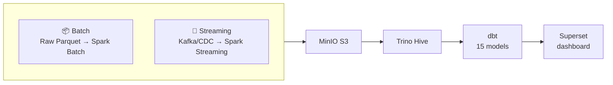
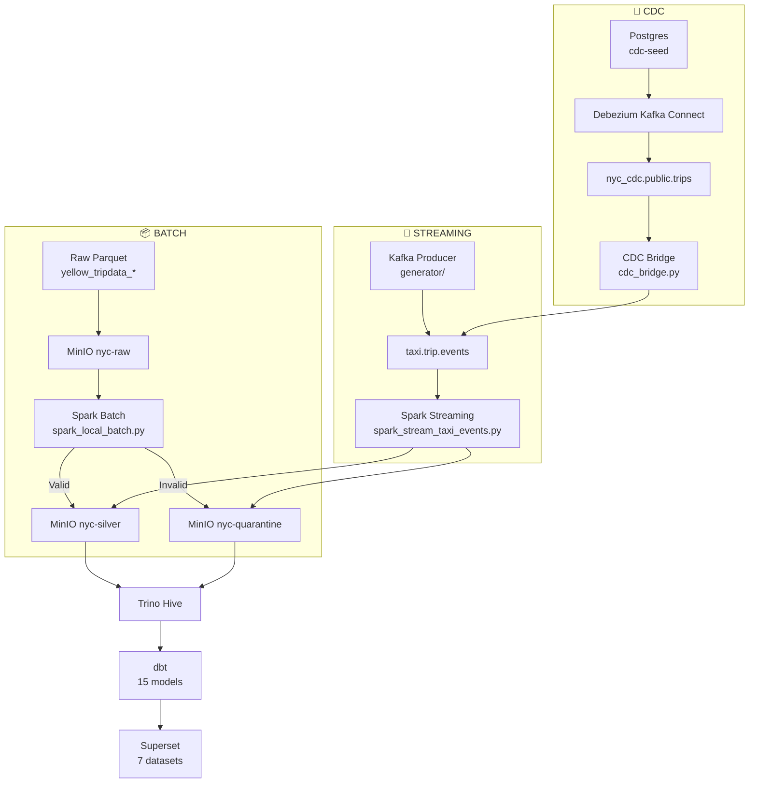
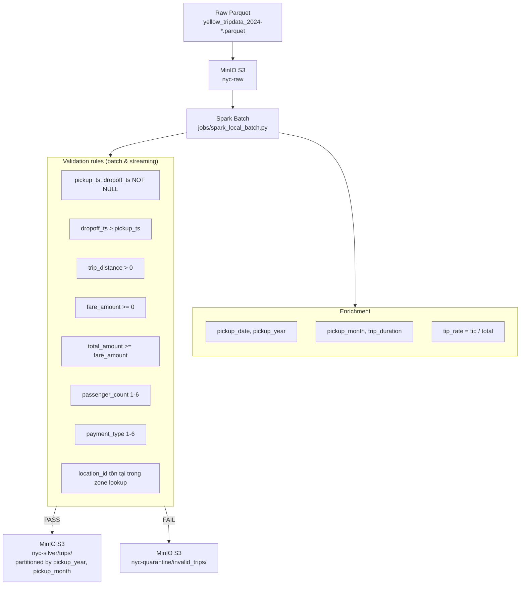
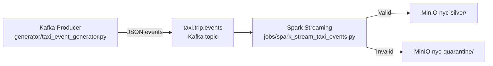

# Hướng dẫn vận hành — NYC Taxi Pipeline

## Tổng quan

Pipeline xử lý dữ liệu taxi NYC TLC: batch + streaming trên **Kubernetes (kind)** hoặc **Docker Compose** cho dev.
Data layer dùng **MinIO S3** (s3a:// cho Spark, s3:// cho Trino).



Hai deployment mode:
| Mode | Mục đích | Lệnh start |
|------|----------|-----------|
| **Kubernetes (kind)** | Production-like, 3 nodes | `make k8s-start` |
| **Docker Compose** | Local dev, single host | `make infra-up-all` |

---

## Yêu cầu

- **Docker** + **Docker Compose** (cho cả 2 mode)
- **kind** (cho K8s mode)
- **kubectl** (cho K8s mode)
- RAM ≥ 8 GB, disk ≥ 20 GB

Kiểm tra:

```bash
docker --version && docker compose version
kind version        # K8s mode
kubectl version     # K8s mode
```

---

## Quick Start — Kubernetes (kind)

### 1. Start cluster + services + UIs

```bash
make k8s-start
```

Lệnh này tự động:
1. Tạo kind cluster (3 nodes) nếu chưa có
2. Build custom images (`nyc-pipeline-tools`, `nyc-dbt`, `nyc-airflow`) + load vào kind
3. Deploy tất cả manifests (ZK, Kafka, MinIO, Spark, Trino, Superset, Airflow, ...)
4. Scale up services + chờ ready
5. Start port-forwards cho tất cả UIs

Thời gian: ~3-5 phút (lần đầu tải images).

### 2. Chạy pipeline (batch + CDC)

```bash
make k8s-pipeline
```

10 bước:
1. **MinIO setup** — tạo buckets + upload raw parquet + lookup CSV
2. **Postgres init** — tạo DB schema cho CDC
3. **Topic init** — tạo Kafka topics (`taxi.trip.events`, `.invalid`, `.dlq`)
4. **CDC seed** — seed Postgres 5000 rows từ parquet
5. **CDC register** — register Debezium connector (Postgres WAL → Kafka)
6. **Spark batch** — 3 tháng (01, 02, 03/2024): enrichment + validation → silver/quarantine
7. **Trino bootstrap** — register Hive tables từ S3
8. **dbt build** — 15 models + 9 tests (expect 24/24 PASS)
9. **CDC bridge** — CDC topic → `taxi.trip.events` format (async, 2,543 ev/s)
10. Verify tự động

Thời gian: ~15-25 phút (Spark batch là bước nặng nhất).

> **Spark streaming** chưa có trong `k8s-pipeline` (cần K8s job).
> Chạy thủ công (Docker Compose): `make spark-streaming`
> Xem [Data Flow Chi Tiết](#data-flow-chi-tiết) để hiểu rõ 3 đường ingestion.

### 3. Kiểm tra kết quả

```bash
make k8s-verify
```

Kỳ vọng: `dim_zone=261`, `fact_trips=~8.48M`, `mart_revenue_by_day=90`.

### 4. Xem UI

```bash
make k8s-ui      # Start port-forwards (nếu chưa chạy)
```

| Service | URL | Credentials |
|---------|-----|-------------|
| Superset | http://localhost:39080 | `admin` / `admin` |
| Kafka UI | http://localhost:39082 | — |
| Spark Master | http://localhost:39083 | — |
| Trino | http://localhost:39084 | — |
| Airflow | http://localhost:39085 | `admin` / `admin` |
| MinIO API | http://localhost:39081 | `minio` / `minio123` |
| MinIO Console | http://localhost:39086 | `minio` / `minio123` |

### 5. Dừng / Xóa

```bash
make k8s-stop       # Scale xuống 0 (giữ data + volumes)
make k8s-destroy    # Xóa hẳn cluster (mất hết data + images)
```

---

## Docker Compose — Local Dev

Dùng khi không cần K8s, chỉ chạy trên máy local.

### Start

```bash
make infra-up          # Core services: ZK, Kafka, MinIO, Spark
make infra-up-all      # Tất cả (thêm Trino, dbt, Superset, Airflow)
```

### Pipeline

#### Batch
```bash
make minio-setup       # Upload data lên MinIO
make spark-batch       # Batch backfill (mặc định MONTH=01)
MONTH=03 make spark-batch   # Chạy tháng cụ thể
make trino-bootstrap   # Register Hive tables
make dbt-build         # dbt models + tests
```

#### Streaming (Kafka)
```bash
make kafka-publish     # Gửi 5000 events lên taxi.trip.events
make spark-streaming   # Spark consumer: validate → MinIO S3
```

#### CDC (Debezium)
```bash
make cdc-seed          # Seed Postgres 5000 rows
make cdc-register      # Register Debezium connector
make cdc-bridge        # Bridge CDC topic → taxi.trip.events
make verify-cdc        # Kiểm tra Postgres, Debezium, topic offsets
```

### UI ports (Docker Compose)

| Service | URL | Login |
|---------|-----|-------|
| Superset | http://localhost:8088 | `admin` / `admin` |
| MinIO Console | http://localhost:9001 | `minio` / `minio123` |
| Airflow | http://localhost:8085 | `admin` / `admin` |
| Kafka UI | http://localhost:8080 | — |
| Spark Master | http://localhost:8081 | — |
| Trino (JDBC) | `localhost:8083` | — |

---

## Makefile Targets

### K8s (primary workflow)

| Target | Mô tả |
|--------|-------|
| `k8s-cluster` | Tạo kind cluster (3 nodes) |
| `k8s-images` | Build + load custom images |
| `k8s-deploy` | Deploy tất cả manifests |
| `k8s-start` | **All-in-one**: cluster → images → services → UIs |
| `k8s-stop` | Scale xuống 0 (giữ data) |
| `k8s-destroy` | Xóa cluster (mất hết) |
| `k8s-ui` | Start port-forwards |
| `k8s-ui-stop` | Stop port-forwards |
| `k8s-pipeline` | Run full pipeline (10 bước) |
| `k8s-status` | `kubectl get pods` |
| `k8s-logs JOB=name` | Tail logs của job |
| `k8s-verify` | Row counts qua Trino |

### Docker Compose (dev)

| Target | Mô tả |
|--------|-------|
| `infra-up` | Core services (ZK, Kafka, MinIO, Spark) |
| `infra-up-all` | Tất cả services |
| `infra-down` | Stop services (giữ volumes) |
| `infra-status` | `docker compose ps` |
| `infra-logs SVC=name` | Tail logs |
| `kafka-topics` | Tạo topics |
| `kafka-publish` | Publish events (5000) |
| `cdc-seed` | Seed Postgres (5000 rows) |
| `cdc-register` | Register Debezium connector |
| `cdc-bridge` | Bridge CDC → events |
| `spark-batch MONTH=01` | Batch backfill (local[*]) |
| `spark-streaming` | Streaming job (Kafka consumer) |
| `trino-bootstrap` | Register Hive tables |
| `trino-shell` | Trino CLI |
| `dbt-build` | Models + tests (24/24) |
| `superset-bootstrap` | Datasets, charts, dashboard |
| `airflow-up` | Start Airflow |
| `verify-mart` | Row counts |
| `verify-analytics` | 10 SQL questions |
| `verify-all` | Full verification |

---

## Storage (MinIO S3)

| Bucket | Usage |
|--------|-------|
| `nyc-raw` | Raw parquet đầu vào (153 MB, 3 tháng) |
| `nyc-silver` | Trips đã enrich + validate (265 MB, ~8.48M rows) |
| `nyc-quarantine` | Invalid trips (36 MB, ~1.07M rows) |
| `nyc-lookup` | Taxi zone lookup CSV (12 KB) |

Spark: `s3a://` protocol. Trino: `s3://` protocol.

Credentials: `minio` / `minio123` (hardcoded ở Spark config, Trino catalog, và mc).

---

## Data Flow Chi Tiết

Pipeline có 3 đường ingestion: **batch**, **Kafka streaming**, và **CDC streaming**.
Tất cả output đều về MinIO S3, shared qua Trino → dbt → Superset.

### Tổng quan



### Batch path



Chạy batch:
```bash
# K8s (trong pipeline)
make k8s-pipeline    # Bao gồm spark-batch cho 3 tháng

# Docker Compose
MONTH=03 make spark-batch
```

### Kafka streaming path



Chạy streaming:
```bash
# Docker Compose (chưa có K8s job cho streaming)
make spark-streaming
# Hoặc gửi events trước:
make kafka-publish
```

### CDC / Debezium path

```mermaid
flowchart TB
    PG[Postgres<br/>nyc_postgres] -->|CDC seed<br/>5000 rows từ parquet| Seed[make cdc-seed]
    PG -->|WAL logical replication| DBZ[Debezium<br/>Kafka Connect 2.5]
    DBZ --> CT[Kafka topic<br/>nyc_cdc.public.trips]
    CT --> Bridge[CDC Bridge<br/>scripts/cdc_bridge.py]
    Bridge -->|Async 2,543 ev/s| Topic[taxi.trip.events]
    Bridge -->|Sync --sync 9 ev/s| Topic
    Topic --> Stream[Spark Streaming<br/>(optional)]

    style Seed fill:#f5f5f5,stroke-dasharray: 5 5
    style Stream fill:#f5f5f5,stroke-dasharray: 5 5
```

Chạy CDC:
```bash
make cdc-seed          # Seed Postgres (5000 rows)
make cdc-register      # Register Debezium connector
make cdc-bridge        # Bridge CDC → taxi.trip.events

# Verify
make verify-cdc        # Check Postgres rows, Debezium status, topic offsets
```

### Hợp lưu

Cả 3 đường (batch, Kafka streaming, CDC) đều ghi vào cùng MinIO S3 buckets (`nyc-silver/`, `nyc-quarantine/`).
Trino đọc từ S3 → dbt transform → Superset dashboard.

---

## Troubleshooting

### Pods bị `Pending`

```bash
kubectl describe pod -n nyc-taxi <pod-name>   # Xem lý do
```

Thường do:
- Node không đủ tài nguyên → `kubectl describe nodes`
- PVC không bound → `kubectl get pvc -n nyc-taxi`
- Image không có → `make k8s-images` (build + load lại)

### ImagePullBackOff

```bash
# Pull image + load vào tất cả nodes
docker pull confluentinc/cp-kafka:7.6.1
kind load docker-image confluentinc/cp-kafka:7.6.1 --name kind
```

Core images: `confluentinc/cp-kafka:7.6.1`, `confluentinc/cp-zookeeper:7.6.1`,
`minio/minio:latest`, `apache/spark:3.5.1`, `trinodb/trino:435`,
`apache/superset:4.0.0`, `postgres:16-alpine`, `debezium/connect:2.5`,
`busybox:1.36`.

### Job không chạy được (immutable spec)

```bash
make k8s-deploy    # Tự động xóa jobs cũ trước khi apply
```

### Trino không query được

```bash
kubectl logs -n nyc-taxi -l app=trino --tail=20   # Kiểm tra lỗi
kubectl exec -n nyc-taxi deploy/trino -- cat /etc/trino/catalog/hive.properties
```

Cần có S3 config: `hive.s3.endpoint`, `hive.s3.aws-access-key`, `hive.s3.path-style-access=true`.

### Spark batch fail (S3 connection)

Kiểm tra env vars trong job YAML:
- `MINIO_ENDPOINT=http://svc-minio:9000`
- `MINIO_ACCESS_KEY=minio`, `MINIO_SECRET_KEY=minio123`

### Port-forward không kết nối được

```bash
make k8s-ui-stop && make k8s-ui   # Restart port-forwards
```

Port-forwards dùng `setsid -f` để survive sau khi `make` kết thúc.
Nếu vẫn lỗi, chạy thủ công:

```bash
kubectl port-forward --address 0.0.0.0 -n nyc-taxi svc/svc-superset 39080:8088 &
```

### Dọn dẹp hoàn toàn (mọi thứ)

```bash
make k8s-destroy          # Xóa cluster
docker compose down -v    # Xóa Docker Compose volumes
rm -rf data/              # Xóa data local
```

---

## Tham khảo

- `AGENTS.md` — technical architecture, code conventions, key files
- `PLAN.md` — trạng thái project, kết quả verify, roadmap
- `check.md` — quick reference: UIs, row counts, storage
- `Makefile` — tất cả targets
