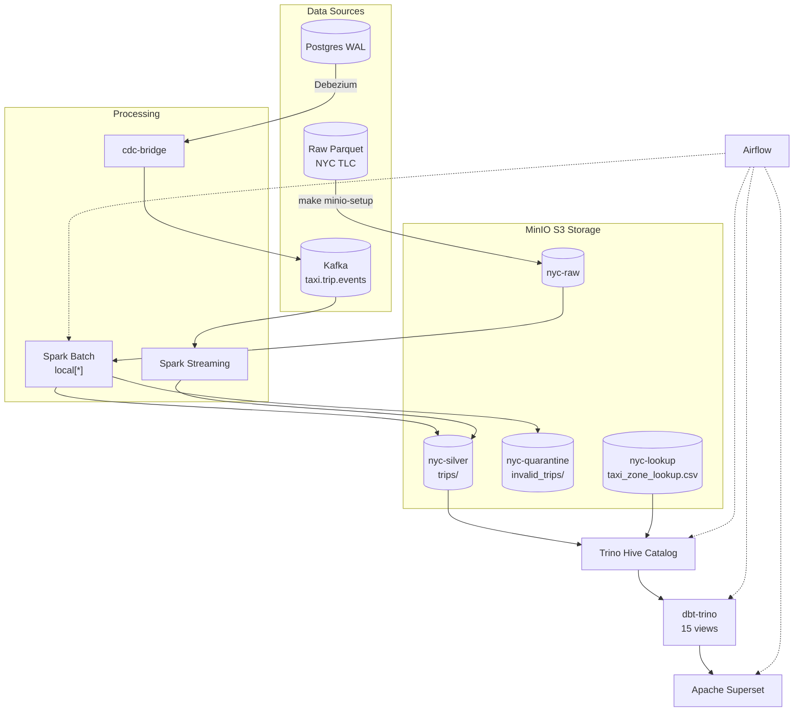

# NYC Taxi Data Pipeline

End-to-end data pipeline for NYC TLC trip records — batch and streaming. Two deployment modes:

- **Kubernetes (kind)** — primary, production-like (3-node cluster, all services in pods). Deployed via **Skaffold** (`skaffold dev`).
- **Docker Compose** — local development (single host, lighter). Deployed via **Make** (`make infra-up`).

MinIO S3 as storage layer, Spark for processing, Trino/Hive for catalog, dbt-trino for transformations, Apache Superset for dashboards. On Kubernetes, **Airflow** is the primary orchestrator running the pipeline automatically on schedule.

## Architecture

All data starts from **raw Parquet** files downloaded from NYC TLC:

1. **Skaffold deploy hook** syncs project files to PVC, **minio-setup job** uploads raw Parquet + zone lookup CSV into MinIO S3 (`nyc-raw`, `nyc-lookup`)
2. **Spark Batch** reads from `s3a://nyc-raw`, enriches + validates, splits into **valid** (`nyc-silver/trips/`) and **invalid** (`nyc-quarantine/`)
3. **Trino Hive catalog** registers external tables pointing at MinIO S3 paths
4. **dbt-trino** transforms silver data into staging → marts → gold views
5. **Superset** queries Trino for pre-built charts and dashboard
6. **Airflow** orchestrates the whole sequence (3 DAGs)

Streaming path: **Kafka** events → **Spark Streaming** (same enrichment logic) → append to `nyc-silver/trips/`.
CDC path: **Postgres WAL** → **Debezium** → Kafka → **cdc-bridge** → `taxi.trip.events` → Spark Streaming.

Streaming path: **Kafka** events → **Spark Streaming** (same enrichment logic) → append to `nyc-silver/trips/`.
CDC path: **Postgres WAL** → **Debezium** → Kafka → **cdc-bridge** → `taxi.trip.events` → Spark Streaming.



### Deployment Modes

| Mode | Deploy tool | Cluster | Services | Best for |
|------|------------|---------|----------|----------|
| **Kubernetes (kind)** | `skaffold dev` / `skaffold run` | 3 nodes (kind) | Pods via Helm chart | Production-like, all features |
| **Docker Compose** | `make infra-up` | Docker host | Containers via compose | Local dev, light debugging |

## Quick Start — Kubernetes (primary)

```bash
# Prerequisites: kind cluster must exist
# Create if needed: kind create cluster --config kind.yaml

# 1. Deploy everything (build images + sync files + Helm install + port-forwards + watch)
skaffold dev --namespace nyc-taxi

# One-shot deploy (no watch):
skaffold run --namespace nyc-taxi

# 2. Start port-forwards (if not using skaffold dev)
make k8s-ui

# 3. Wait for setup jobs to complete (topic-init, postgres-init, minio-setup)
kubectl wait --for=condition=complete job -n nyc-taxi topic-init --timeout=120s

# 4. Trigger the pipeline via Airflow UI or CLI
#    Airflow UI: http://localhost:39085 (admin/admin) — DAG: nyc_e2e_pipeline
#    CLI: kubectl exec -n nyc-taxi deploy/airflow-scheduler -- airflow dags trigger nyc_e2e_pipeline

# 5. Trigger CDC pipeline
exec -n nyc-taxi deploy/airflow-scheduler -- airflow dags trigger nyc_cdc_pipeline

# 6. Verify analytics (10 SQL queries against Trino)
make k8s-verify-analytics

# 7. Stop (scale down, keep data) — if using skaffold dev, Ctrl+C
make k8s-stop

# 8. Destroy (delete cluster, all data gone)
make k8s-destroy
```

After `skaffold dev` starts, Airflow runs the pipeline automatically on schedule (@monthly for e2e, @weekly for analytics). File changes to `airflow/dags/`, `jobs/`, `scripts/`, `dbt/` are auto-synced to PVC via `file-sync` pod.

## Quick Start — Docker Compose

```bash
# 1. Start infrastructure (ZK, Kafka, MinIO, Spark)
make infra-up

# 2. Create Kafka topics
make kafka-topics

# 3. Upload raw data to MinIO
make minio-setup

# 4. Run Spark batch backfill (3 months, ~10.2M rows)
make spark-batch   # reads from s3a://nyc-raw, writes to s3a://nyc-silver

# 5. Register tables in Trino Hive catalog
make trino-bootstrap

# 6. Build dbt models + run tests
make dbt-build     # 15 models + 9 tests, expect 24/24 PASS

# 7. Verify data
make verify-mart       # Row counts in Trino
make verify-analytics  # 10 SQL questions, expect PASS 10/10

# 8. Start visualization
make superset-bootstrap  # http://localhost:8088 (admin/admin)

# Full pipeline in one command
make verify-all
```

## All Makefile Targets

### Kubernetes (kind) via Skaffold
| Target / Command | Description |
|-----------------|-------------|
| `skaffold dev --namespace nyc-taxi` | **Primary** — build, deploy, port-forward, watch, auto-sync |
| `skaffold run --namespace nyc-taxi` | One-shot deploy (no watch) |
| `skaffold build --namespace nyc-taxi` | Build images only |
| `make k8s-cluster` | Create kind cluster (3 nodes) |
| `make k8s-images` | Build & load custom images into kind (legacy) |
| `make k8s-ui` | Start port-forwards for all UIs (39080-39086) |
| `make k8s-ui-stop` | Stop all port-forwards |
| `make k8s-destroy` | Delete cluster (services + volumes + images) |
| `make k8s-status` | Show pod status |
| `make k8s-logs JOB=<name>` | Tail logs for a job |
| `make k8s-verify` | Verify row counts via Trino |
| `make k8s-verify-analytics` | Run 10 analytics SQL queries |
| `make k8s-verify-cdc` | Verify CDC pipeline (Postgres, Debezium, Kafka) |
| `make k8s-clean` | Clean MinIO data + delete jobs (fresh start) |

### Docker Compose
| Target | Description |
|--------|-------------|
| `infra-up` | Start core services (ZK, Kafka, MinIO, Spark) |
| `infra-up-all` | Start everything (incl. Trino, dbt, Superset, Airflow) |
| `infra-down` | Stop services (keep volumes) |
| `infra-status` | Show container status |
| `infra-logs SVC=<name>` | Tail logs |
| `kafka-topics` | Create Kafka topics |
| `cdc-up` | Start Postgres + Debezium |
| `cdc-seed` | Seed Postgres from parquet (5000 rows) |
| `cdc-register` | Register Debezium connector |
| `cdc-bridge` | Bridge CDC events → taxi.trip.events |
| `cdc-verify` | Full CDC E2E verification |
| `spark-batch` | Batch backfill via MinIO S3 |
| `spark-streaming` | Submit streaming job |
| `trino-bootstrap` | Register tables in Hive catalog |
| `trino-shell` | Interactive Trino shell |
| `dbt-build` | Full dbt build: models + tests |
| `dbt-run` | Run models only |
| `dbt-test` | Run tests only |
| `superset-bootstrap` | Register DB, charts, dashboard |
| `superset-check` | List Superset resources |
| `airflow-up` | Start Airflow |
| `airflow-trigger DAG=<name>` | Trigger a DAG |
| `verify-mart` | Row counts in Trino |
| `verify-analytics` | 10 SQL questions (PASS 10/10) |
| `verify-cdc` | Verify CDC pipeline |
| `verify-all` | Full pipeline verification |
| `clean-silver` | Delete silver parquet data |
| `clean-quarantine` | Delete quarantine parquet |
| `clean-all` | Delete all generated data |

## UIs & Port-forwards

Kubernetes mode uses `skaffold portForward` or `kubectl port-forward` — ports **39080-39087** (avoids kind NodePort 38080 range).

| Service | URL | Port | Credentials |
|---------|-----|------|-------------|
| Apache Superset | http://localhost:39080 | 39080 | `admin` / `admin` |
| MinIO API | http://localhost:39081 | 39081 | `minio` / `minio123` |
| Kafka UI | http://localhost:39082 | 39082 | — |
| Spark Master | http://localhost:39083 | 39083 | — |
| Trino | http://localhost:39084 | 39084 | — |
| Airflow | http://localhost:39085 | 39085 | `admin` / `admin` |
| MinIO Console | http://localhost:39086 | 39086 | `minio` / `minio123` |
| Postgres CDC | localhost:39087 | 39087 | `postgres` / `postgres` |

Docker Compose mode uses published ports directly (8088, 9000/9001, 8083, etc.).

Port-forwards are managed automatically by `skaffold dev`. If not using skaffold, start via `make k8s-ui`.

## Batch Results

| Metric | Compose | K8s |
|--------|---------|-----|
| Valid trips | 8,480,408 | **10,188,983** |
| Invalid trips | 1,074,370 | **1,074,370** |
| Zone lookup | 265 | 265 |
| dbt tests | 24/24 PASS | 24/24 PASS |
| Analytics | 10/10 PASS | 10/10 PASS |
| CDC bridge | ~2,543 ev/s | ~445 ev/s |
| Spark runtime (3 months) | ~10 min | ~9 min |

K8s numbers higher because the latest clean run includes 2002-2024 data
(more years than the initial 2024-only Docker Compose run).

## Data Layout

```
MinIO S3 buckets:
├── nyc-raw/          → yellow_taxi/year=2024/month=01..03/*.parquet
├── nyc-silver/trips/ → pickup_year=*/pickup_month=*/  (10.2M rows)
├── nyc-quarantine/   → invalid_trips/                  (1.07M rows)
├── nyc-lookup/       → taxi_zone_lookup.csv            (265 zones)
```

## Pipeline Components

| Layer | Technology | Role |
|-------|-----------|------|
| Storage | MinIO S3 | Buckets: `nyc-raw`, `nyc-silver`, `nyc-quarantine`, `nyc-lookup` |
| Processing | Spark 3.5.1 | Batch backfill (`spark_local_batch.py`) + Kafka streaming (`spark_stream_taxi_events.py`) |
| Messaging | Kafka + ZK | `taxi.trip.events` (main), Debezium CDC topics |
| Catalog | Trino 435 | Hive connector + S3 connector, reads parquet from MinIO |
| Transformation | dbt-trino | 15 views (staging → marts → gold), 9 tests |
| Visualization | Apache Superset 4.0.0 | Trino-backed dashboard with charts |
| Orchestration | Airflow 2.10.5 | **3 DAGs**: `nyc_e2e_pipeline` (@monthly), `nyc_cdc_pipeline` (@monthly), `nyc_analytics_refresh` (@weekly) |
| CDC | Debezium 2.5 + Postgres 16 | WAL-based CDC, bridge to standard event format |
| Deployment | **Skaffold v2.21.0** + Helm | `skaffold dev` — build, deploy, sync, port-forward, watch |

## CDC Pipeline

```bash
make cdc-seed       # Seed Postgres from Parquet (5000 rows)
make cdc-register   # Register Debezium connector
make cdc-bridge     # Bridge CDC events → taxi.trip.events format
make cdc-verify     # Full CDC E2E verification
```

CDC bridge runs as a poll-based loop with idle timeout (5s) — exits automatically when no more events arrive.

## Development Notes

- **No host Python required** — all code runs in Docker/K8s containers.
- **Kubernetes (Skaffold)**: `skaffold dev --namespace nyc-taxi` — tự động build, deploy, sync files, port-forward.
  Khi code thay đổi, `skaffold sync` push thẳng vào `file-sync` pod → PVC → Airflow nhận thay đổi ngay.
- **PVC Sync manual** (khi không dùng skaffold):
  ```bash
  cd /home/dwcks/vsf_gsm/nyc_new
  tar cf - --exclude='dbt/logs' --exclude='dbt/target' --exclude='.git' \
    --exclude='__pycache__' --exclude='*.pyc' \
    airflow/dags/ jobs/ scripts/ dbt/ charts/ \
    | docker exec -i kind-worker tar xf - -C /mnt/nyc-project
  ```
- **Spark S3A connector** uses `--packages hadoop-aws:3.3.4,aws-java-sdk-bundle:1.12.262`
  via `spark-submit` CLI (not `spark.jars.packages`). Ivy cache shared on PVC (`/opt/project/.ivy2/`) for speed.
- **S3 commit fix**: `spark.hadoop.mapreduce.fileoutputcommitter.algorithm.version=2`
  required because MinIO does not support atomic S3 rename.
- **MinIO credentials**: `minio` / `minio123`. Spark uses `s3a://`, Trino uses `s3://`.
- **All dbt models** are `materialized='view'` — Hive file-based HMS does not support `RENAME TABLE`.
- **Port-forward survival**: `scripts/k8s_ui.sh` uses `setsid -f` so processes survive `make` exit.
  Skaffold automatically manages port-forwards in `dev` mode.
- **Kafka bootstrap**: Docker Compose `localhost:29092`, container `nyc_kafka:9092`, **K8s `svc-kafka:9092`**
  (⚠️ không dùng `kafka:9092` — service name trong K8s namespace `nyc-taxi` có prefix `svc-`).
- **Airflow DAG management**: 3 DAGs tự động chạy trên lịch:
  - `nyc_e2e_pipeline` (@monthly): Spark batch + streaming → Trino → dbt → Superset
  - `nyc_cdc_pipeline` (@monthly): Seed Postgres → Debezium → bridge CDC → Kafka
  - `nyc_analytics_refresh` (@weekly): dbt → Superset refresh → analytics check
  
  Trigger manual: Airflow UI (http://localhost:39085) hoặc:
  ```bash
  kubectl exec -n nyc-taxi deploy/airflow-scheduler -- airflow dags trigger nyc_e2e_pipeline
  ```
- **Skaffold file-sync hot-reload**: `file-sync` pod (runs root, PVC mounted) nhận file từ `skaffold sync`.
  Sync rules trong `skaffold.yaml` map `airflow/dags/`, `jobs/`, `scripts/`, `dbt/`, `charts/` → `/opt/project/...`.
- **Postgres init**: Dùng Python `psycopg2` (không cần `psql` / postgresql-client).
- **topic-init**: Dùng `wait-kafka` (TCP wait script, có sẵn trong tools image) + `svc-kafka:9092`.
- **Helm chart**: Tất cả manifests đều trong `charts/nyc-taxi/templates/`. Deploy via `deploy.helm` trong skaffold.yaml.
