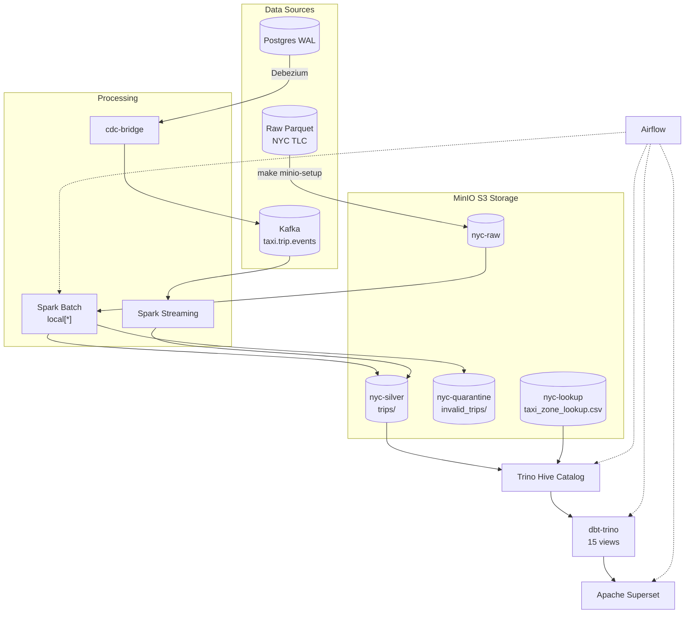

# NYC Taxi Data Pipeline

End-to-end data pipeline for NYC TLC trip records — batch and streaming, running fully in Docker. MinIO S3 as storage layer, Spark for processing, Trino/Hive for catalog, dbt-trino for transformations, Apache Superset for dashboards, Airflow for orchestration.

## Architecture

Yes — everything starts from **raw Parquet** files downloaded from NYC TLC:

1. **`make minio-setup`** uploads raw Parquet + zone lookup CSV into MinIO S3 (`nyc-raw`, `nyc-lookup`)
2. **Spark Batch** reads from `s3a://nyc-raw`, enriches + validates, splits into **valid** (`nyc-silver/trips/`) and **invalid** (`nyc-quarantine/`)
3. **Trino Hive catalog** registers external tables pointing at MinIO S3 paths
4. **dbt-trino** transforms silver data into staging → marts → gold views
5. **Superset** queries Trino for pre-built charts and dashboard
6. **Airflow** orchestrates the whole sequence

Streaming path: **Kafka** events → **Spark Streaming** (same enrichment logic) → append to `nyc-silver/trips/`.
CDC path: **Postgres WAL** → **Debezium** → Kafka → **cdc-bridge** → `taxi.trip.events` → Spark Streaming.



```
                                ┌──────────────────────────────────────────────────────┐
                                │                    MinIO S3                          │
                                │  ┌──────────┐  ┌──────────┐  ┌──────────┐            │
  Raw Parquet ──► minio-setup ──┼─►│nyc-raw   │  │nyc-silver│  │nyc-quar. │            │
                                │  └─────┬────┘  └─────┬────┘  └─────┬────┘            │
                                │        │             │             │                 │
                                │  ┌─────┴────┐        │             │                 │
                                │  │nyc-lookup│        │             │                 │
                                │  └──────────┘        │             │                 │
                                └──────────────────────┼─────────────┼─────────────────┘
          Batch: Spark (local[*]) ◄── s3a://nyc-raw ───┘             │
          enrich + validate ──► valid ──► s3a://nyc-silver/trips/    │
                                └── invalid ──► s3a://nyc-quarantine/│
                                                                     │
  Streaming: Spark Structured Streaming ◄── Kafka (taxi.trip.events) │
          same enrich + validate ──► append ──► s3a://nyc-silver/ ───┘
                                                                    │
  CDC: Postgres WAL ──► Debezium ──► Kafka ──► cdc-bridge ──► ──────┘
                                                                    │
                                                                    ▼
  Trino (Hive catalog + S3 connector) ◄─────────────────────────────┘
        │
        ▼
  dbt-trino (15 views: staging → marts → gold, 9 tests)
        │
        ▼
  Apache Superset (4 charts + dashboard)
        ▲
        │
  Airflow (orchestrates batch → Trino → dbt → Superset → analytics)
```

## Quick Start

All operations via `make <target>` — no manual Docker commands.

```bash
# 1. Start infrastructure (ZK, Kafka, MinIO, Spark)
make infra-up

# 2. Create Kafka topics
make kafka-topics

# 3. Upload raw data to MinIO
make minio-setup

# 4. Run Spark batch backfill (3 months, ~9.5M rows)
make spark-batch   # reads from s3a://nyc-raw, writes to s3a://nyc-silver

# 5. Register tables in Trino Hive catalog
make trino-bootstrap

# 6. Build dbt models + run tests
make dbt-build     # 15 models + 9 tests, expect 24/24 PASS

# 7. Verify data
make verify-mart       # Row counts in Trino
make verify-analytics  # 10 SQL questions, expect PASS 10/10

# 8. Start visualization
make superset-bootstrap  # http://localhost:8088 (admin/admin)

# Full pipeline in one command
make verify-all
```

## Pipeline Components

| Layer | Technology | Role |
|-------|-----------|------|
| Storage | MinIO S3 | Default storage: `nyc-raw`, `nyc-silver`, `nyc-quarantine`, `nyc-lookup` buckets |
| Processing | Spark 3.5.1 | Batch backfill (`spark_local_batch.py`) + Kafka streaming (`spark_stream_taxi_events.py`) |
| Messaging | Kafka + ZK | `taxi.trip.events` (main), Debezium CDC topics |
| Catalog | Trino 435 | Hive connector + S3 connector, reads parquet from MinIO |
| Transformation | dbt-trino | 15 views (staging → marts → gold), 9 tests |
| Visualization | Apache Superset 4.0.0 | Trino-backed dashboard with 4 charts |
| Orchestration | Airflow 2.10.5 | DAGs: `nyc_e2e_pipeline`, `nyc_analytics_refresh` |
| CDC | Debezium 2.5 + Postgres 16 | WAL-based CDC, bridge to standard event format |

## Key Commands

```bash
make infra-up         # Start core services
make infra-up-all     # Start everything (incl. Trino, dbt, Superset, Airflow)
make spark-batch      # Batch backfill (MONTH=01/02/03)
make spark-streaming  # Kafka streaming consumer
make minio-setup      # Upload raw data to MinIO (one-time setup)
make trino-bootstrap  # Register tables in Hive catalog
make dbt-build        # dbt models + tests
make superset-bootstrap  # Register DB/dataset/charts/dashboard
make verify-all       # Full pipeline verification
make clean-all        # Delete generated data
make infra-logs SVC=trino  # Tail logs for a service
```

## Batch Results (3 months, 2024-01 to 2024-03)

| Month | Valid Rows | Invalid Rows | Runtime |
|-------|-----------|-------------|---------|
| 01 | 2,724,037 | 240,331 | ~200s |
| 02 | 2,719,926 | 287,976 | ~200s |
| 03 | 3,036,445 | 546,063 | ~200s |
| **Total** | **8,480,408** | **1,074,370** | |

- dbt: **24/24 PASS** (15 models + 9 tests)
- Analytics: **10/10 PASS** (10 SQL queries against Trino)

## Data Layout

```
MinIO S3 buckets:
├── nyc-raw/          → yellow_taxi/year=2024/month=01..03/*.parquet
├── nyc-silver/trips/ → pickup_year=2024/pickup_month={1,2,3}/  (~268MB, 8.48M rows)
├── nyc-quarantine/   → invalid_trips/                           (~8MB, 1.07M rows)
├── nyc-lookup/       → taxi_zone_lookup.csv                     (265 zones)
```

## CDC Pipeline

```bash
make cdc-up         # Start Postgres + Debezium
make cdc-seed       # Seed Postgres from Parquet (5000 rows)
make cdc-register   # Register Debezium connector
make cdc-bridge     # Bridge CDC events → taxi.trip.events format
make cdc-verify     # Full CDC E2E verification
```

## Development Notes

- **No host Python required** — all code runs in Docker containers.
- Spark runs as UID 185 (inside Docker), host is UID 1000. Run `make setup-volumes` if data permissions are wrong.
- MinIO credentials: `minio` / `minio123`. Internal endpoint: `http://minio:9000`, console: `http://localhost:9001`.
- All dbt models are `materialized='view'` — Hive file-based HMS does not support `RENAME TABLE`.
- Airflow DAGs use Docker-in-Docker via `subprocess.run(["docker", ...])` with absolute host paths `/home/dwcks/vsf_gsm/nyc_new`.
- Kafka bootstrap for host consumers: `localhost:29092`, for containers: `nyc_kafka:9092`.
