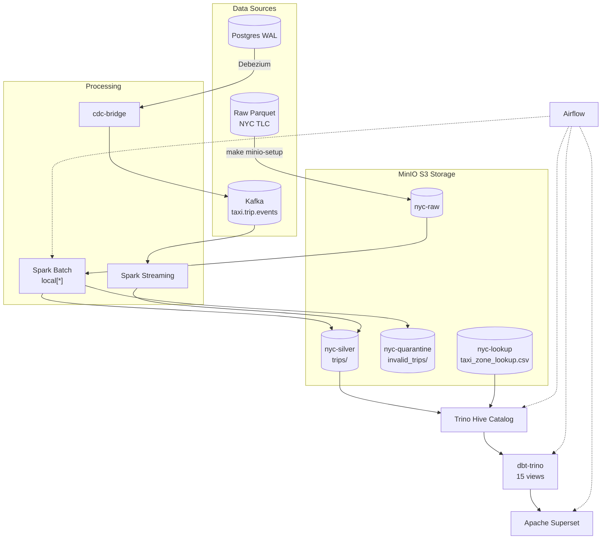

# NYC Taxi Data Pipeline

End-to-end data pipeline for NYC TLC trip records — batch and streaming. Two deployment modes:

- **Kubernetes (kind)** — primary, production-like (3-node cluster, all services in pods)
- **Docker Compose** — local development (single host, lighter)

MinIO S3 as storage layer, Spark for processing, Trino/Hive for catalog, dbt-trino for transformations, Apache Superset for dashboards, Airflow for orchestration.

## Architecture

All data starts from **raw Parquet** files downloaded from NYC TLC:

1. **`make k8s-pipeline`** uploads raw Parquet + zone lookup CSV into MinIO S3 (`nyc-raw`, `nyc-lookup`)
2. **Spark Batch** reads from `s3a://nyc-raw`, enriches + validates, splits into **valid** (`nyc-silver/trips/`) and **invalid** (`nyc-quarantine/`)
3. **Trino Hive catalog** registers external tables pointing at MinIO S3 paths
4. **dbt-trino** transforms silver data into staging → marts → gold views
5. **Superset** queries Trino for pre-built charts and dashboard
6. **Airflow** orchestrates the whole sequence

Streaming path: **Kafka** events → **Spark Streaming** (same enrichment logic) → append to `nyc-silver/trips/`.
CDC path: **Postgres WAL** → **Debezium** → Kafka → **cdc-bridge** → `taxi.trip.events` → Spark Streaming.



### Deployment Modes

| Mode | Cluster | Services | Data | Best for |
|------|---------|----------|------|----------|
| **Kubernetes (kind)** | 3 nodes (kind) | Pods, Services, PVCs | MinIO S3 | Production-like, all features |
| **Docker Compose** | Docker host | Containers via compose profiles | MinIO S3 | Local dev, light debugging |

## Quick Start — Kubernetes (primary)

```bash
# 1. Start everything (cluster + images + services + UIs)
make k8s-start

# 2. Run full pipeline (MinIO setup → Spark batch → Trino → dbt → CDC bridge → verify)
make k8s-pipeline

# 3. Verify analytics (10 SQL queries against Trino)
make k8s-verify-analytics

# 4. Verify CDC (Postgres count, Debezium status, Kafka topic)
make k8s-verify-cdc

# 5. Stop (scale down, keep data)
make k8s-stop

# 6. Destroy (delete cluster, all data gone)
make k8s-destroy
```

## Quick Start — Docker Compose

```bash
# 1. Start infrastructure (ZK, Kafka, MinIO, Spark)
make infra-up

# 2. Create Kafka topics
make kafka-topics

# 3. Upload raw data to MinIO
make minio-setup

# 4. Run Spark batch backfill (3 months, ~10.2M rows)
make spark-batch   # reads from s3a://nyc-raw, writes to s3a://nyc-silver

# 5. Register tables in Trino Hive catalog
make trino-bootstrap

# 6. Build dbt models + run tests
make dbt-build     # 15 models + 9 tests, expect 24/24 PASS

# 7. Verify data
make verify-mart       # Row counts in Trino
make verify-analytics  # 10 SQL questions, expect PASS 10/10

# 8. Start visualization
make superset-bootstrap  # http://localhost:8088 (admin/admin)

# Full pipeline in one command
make verify-all
```

## All Makefile Targets

### Kubernetes (kind)
| Target | Description |
|--------|-------------|
| `k8s-cluster` | Create kind cluster (3 nodes) |
| `k8s-images` | Build & load custom images into kind |
| `k8s-deploy` | Deploy all K8s manifests (ordered) |
| `k8s-start` | Full start: cluster → images → services → UIs |
| `k8s-stop` | Scale down all services (keep data) |
| `k8s-destroy` | Delete cluster (services + volumes + images) |
| `k8s-ui` | Start port-forwards for all UIs (39080-39086) |
| `k8s-ui-stop` | Stop all port-forwards |
| `k8s-pipeline` | Run full pipeline: init → spark → trino → dbt → bridge → verify |
| `k8s-status` | Show pod status |
| `k8s-logs JOB=<name>` | Tail logs for a job |
| `k8s-verify` | Verify row counts via Trino |
| `k8s-verify-analytics` | Run 10 analytics SQL queries |
| `k8s-verify-cdc` | Verify CDC pipeline (Postgres, Debezium, Kafka) |
| `k8s-clean` | Clean MinIO data + delete jobs (fresh start) |

### Docker Compose
| Target | Description |
|--------|-------------|
| `infra-up` | Start core services (ZK, Kafka, MinIO, Spark) |
| `infra-up-all` | Start everything (incl. Trino, dbt, Superset, Airflow) |
| `infra-down` | Stop services (keep volumes) |
| `infra-status` | Show container status |
| `infra-logs SVC=<name>` | Tail logs |
| `kafka-topics` | Create Kafka topics |
| `cdc-up` | Start Postgres + Debezium |
| `cdc-seed` | Seed Postgres from parquet (5000 rows) |
| `cdc-register` | Register Debezium connector |
| `cdc-bridge` | Bridge CDC events → taxi.trip.events |
| `cdc-verify` | Full CDC E2E verification |
| `spark-batch` | Batch backfill via MinIO S3 |
| `spark-streaming` | Submit streaming job |
| `trino-bootstrap` | Register tables in Hive catalog |
| `trino-shell` | Interactive Trino shell |
| `dbt-build` | Full dbt build: models + tests |
| `dbt-run` | Run models only |
| `dbt-test` | Run tests only |
| `superset-bootstrap` | Register DB, charts, dashboard |
| `superset-check` | List Superset resources |
| `airflow-up` | Start Airflow |
| `airflow-trigger DAG=<name>` | Trigger a DAG |
| `verify-mart` | Row counts in Trino |
| `verify-analytics` | 10 SQL questions (PASS 10/10) |
| `verify-cdc` | Verify CDC pipeline |
| `verify-all` | Full pipeline verification |
| `clean-silver` | Delete silver parquet data |
| `clean-quarantine` | Delete quarantine parquet |
| `clean-all` | Delete all generated data |

## UIs & Port-forwards

Kubernetes mode uses `kubectl port-forward` — ports **39080-39086** (avoids kind NodePort 38080 range).

| Service | URL | Port | Credentials |
|---------|-----|------|-------------|
| Apache Superset | http://localhost:39080 | 39080 | `admin` / `admin` |
| MinIO API | http://localhost:39081 | 39081 | `minio` / `minio123` |
| Kafka UI | http://localhost:39082 | 39082 | — |
| Spark Master | http://localhost:39083 | 39083 | — |
| Trino | http://localhost:39084 | 39084 | — |
| Airflow | http://localhost:39085 | 39085 | `admin` / `admin` |
| MinIO Console | http://localhost:39086 | 39086 | `minio` / `minio123` |

Docker Compose mode uses published ports directly (8088, 9000/9001, 8083, etc.).

## Batch Results

| Metric | Compose | K8s |
|--------|---------|-----|
| Valid trips | 8,480,408 | **10,188,983** |
| Invalid trips | 1,074,370 | **1,074,370** |
| Zone lookup | 265 | 265 |
| dbt tests | 24/24 PASS | 24/24 PASS |
| Analytics | 10/10 PASS | 10/10 PASS |
| CDC bridge | ~2,543 ev/s | ~445 ev/s |
| Spark runtime (3 months) | ~10 min | ~9 min |

K8s numbers higher because the latest clean run includes 2002-2024 data
(more years than the initial 2024-only Docker Compose run).

## Data Layout

```
MinIO S3 buckets:
├── nyc-raw/          → yellow_taxi/year=2024/month=01..03/*.parquet
├── nyc-silver/trips/ → pickup_year=*/pickup_month=*/  (10.2M rows)
├── nyc-quarantine/   → invalid_trips/                  (1.07M rows)
├── nyc-lookup/       → taxi_zone_lookup.csv            (265 zones)
```

## Pipeline Components

| Layer | Technology | Role |
|-------|-----------|------|
| Storage | MinIO S3 | Buckets: `nyc-raw`, `nyc-silver`, `nyc-quarantine`, `nyc-lookup` |
| Processing | Spark 3.5.1 | Batch backfill (`spark_local_batch.py`) + Kafka streaming (`spark_stream_taxi_events.py`) |
| Messaging | Kafka + ZK | `taxi.trip.events` (main), Debezium CDC topics |
| Catalog | Trino 435 | Hive connector + S3 connector, reads parquet from MinIO |
| Transformation | dbt-trino | 15 views (staging → marts → gold), 9 tests |
| Visualization | Apache Superset 4.0.0 | Trino-backed dashboard with charts |
| Orchestration | Airflow 2.10.5 | DAGs: `nyc_e2e_pipeline`, `nyc_analytics_refresh` |
| CDC | Debezium 2.5 + Postgres 16 | WAL-based CDC, bridge to standard event format |

## CDC Pipeline

```bash
make cdc-seed       # Seed Postgres from Parquet (5000 rows)
make cdc-register   # Register Debezium connector
make cdc-bridge     # Bridge CDC events → taxi.trip.events format
make cdc-verify     # Full CDC E2E verification
```

CDC bridge runs as a poll-based loop with idle timeout (5s) — exits automatically when no more events arrive.

## Development Notes

- **No host Python required** — all code runs in Docker/K8s containers.
- **Kubernetes**: Use `make k8s-logs JOB=<name>` to debug jobs. After code changes, sync to PVC:
  `tar cf - scripts/ | docker exec -i kind-worker tar xf - -C /mnt/nyc-project`
- **Spark hybrid deployment** (K8s jobs with Docker Compose infra): `make k8s-pipeline`
  reads MinIO from within the kind network while compose services run on host.
- **Spark S3A connector** uses `--packages hadoop-aws:3.3.4,aws-java-sdk-bundle:1.12.262`
  via `spark-submit` CLI (not `spark.jars.packages`). Ivy cache shared on PVC for speed.
- **S3 commit fix**: `spark.hadoop.mapreduce.fileoutputcommitter.algorithm.version=2`
  required because MinIO does not support atomic S3 rename.
- **MinIO credentials**: `minio` / `minio123`. Spark uses `s3a://`, Trino uses `s3://`.
- **All dbt models** are `materialized='view'` — Hive file-based HMS does not support `RENAME TABLE`.
- **Port-forward survival**: `scripts/k8s_ui.sh` uses `setsid -f` so processes survive `make` exit.
- **Kafka bootstrap**: Host `localhost:29092`, containers `nyc_kafka:9092`, K8s `svc-kafka:9092`.
