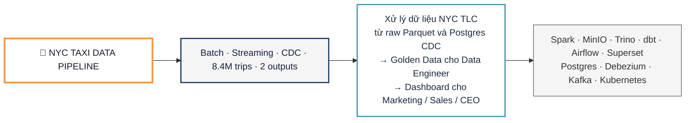
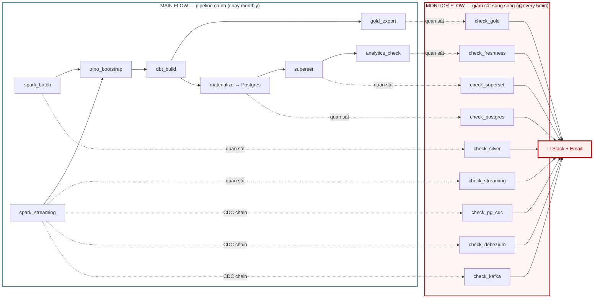
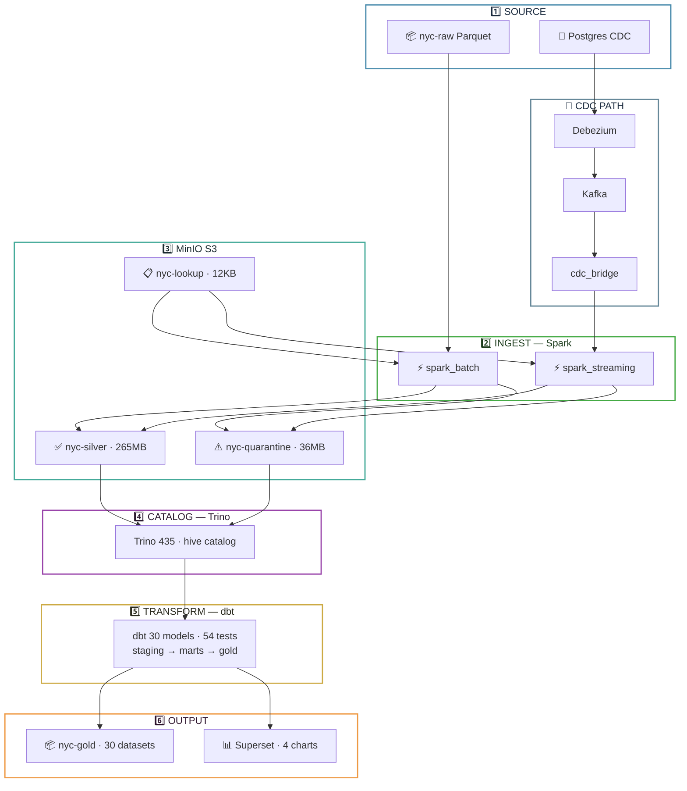
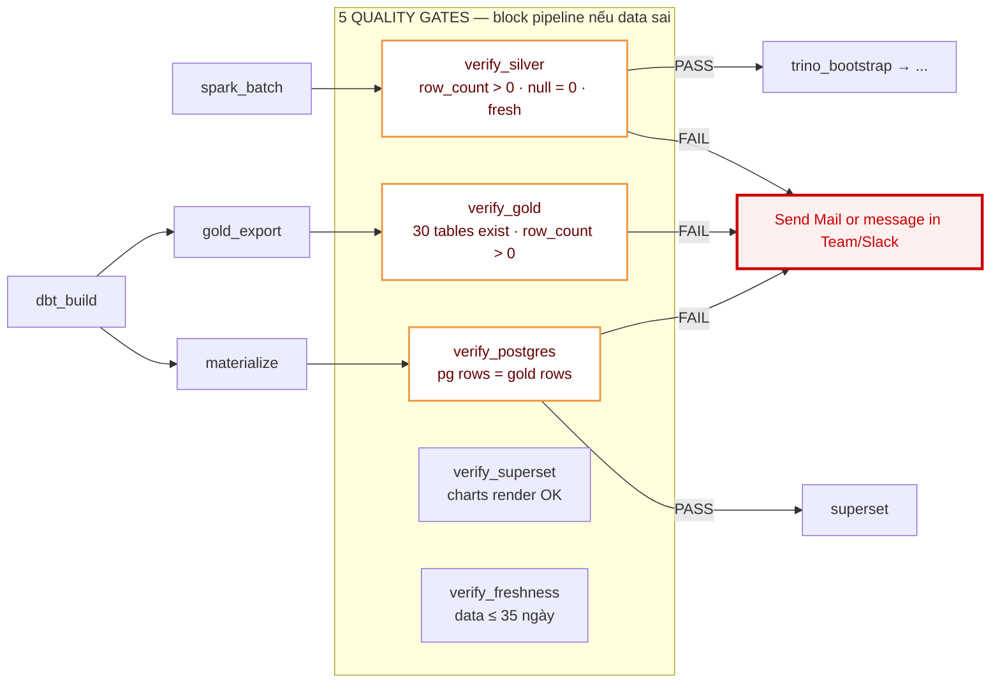
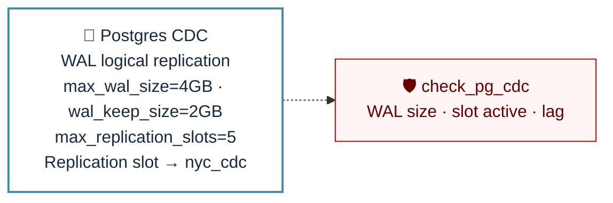
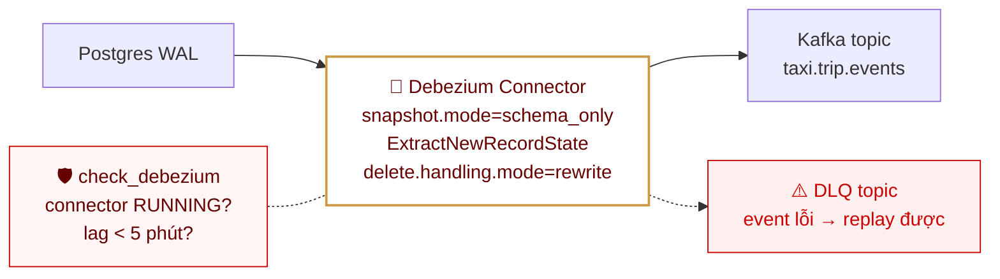
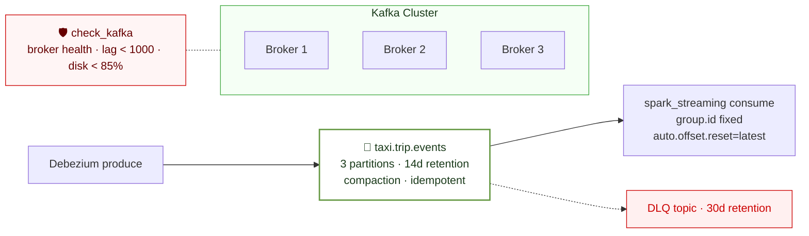
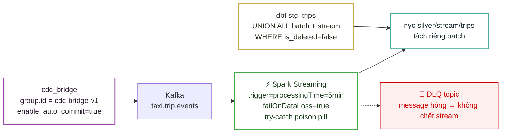
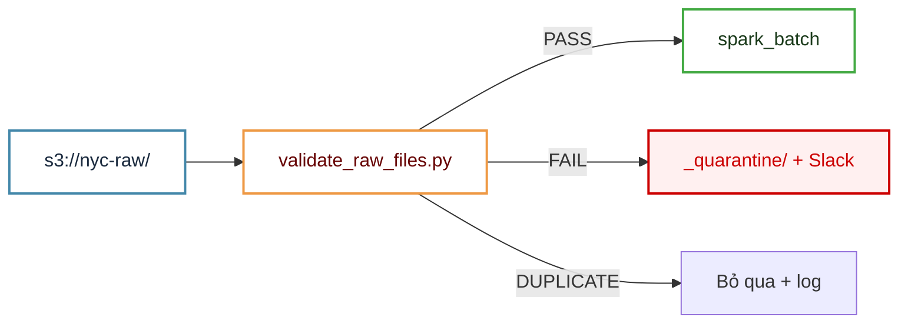
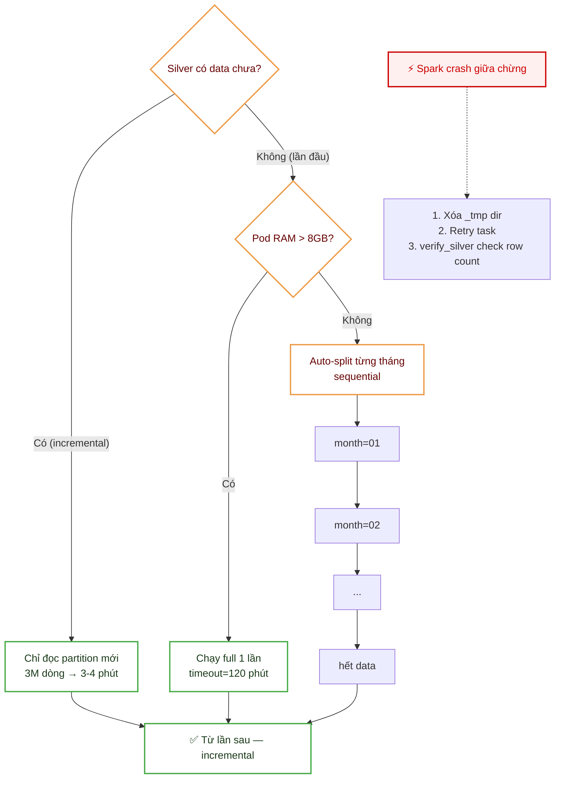

# NYC Taxi Data Pipeline

> Slide deck — trình bày cho management

---

## Slide 1: Title

**NYC Taxi Data Pipeline**  
*Batch & Streaming Data Engineering Platform*


```mermaid
%%{init: {'theme': 'default', 'themeVariables': {'background': '#ffffff'}}}%%
flowchart LR
    TITLE["🚕 NYC TAXI DATA PIPELINE"]
    SUB["Batch · Streaming · CDC · 8.4M trips · 2 outputs"]

    DESC["Xử lý dữ liệu NYC TLC<br/>từ raw Parquet và Postgres CDC<br/>→ Golden Data cho Data Engineer<br/>→ Dashboard cho Marketing / Sales / CEO"]

    STACK["Spark · MinIO · Trino · dbt · Airflow · Superset<br/>Postgres · Debezium · Kafka · Kubernetes"]

    TITLE --> SUB --> DESC --> STACK

    style TITLE fill:#fff,stroke:#e94,stroke-width:3px,color:#1a1a2e
    style SUB fill:#f5f5f5,stroke:#0f3460,stroke-width:2px,color:#16213e
    style DESC fill:#fff,stroke:#48a,stroke-width:2px,color:#1a2a3e
    style STACK fill:#f5f5f5,stroke:#555,stroke-width:1px,color:#333
```

---
<div style="page-break-after: always;"></div>

## Slide 2: Bài toán

### Input

| Nguồn | Format | Volume |
|---|---|---|
| 📦 NYC TLC Yellow Taxi (S3 Parquet) | Hive-partitioned | 8.4M trips / 3 tháng |
| 📨 Postgres CDC (Debezium → Kafka) | Logical replication | Real-time |

### Output — 2 sản phẩm, 2 đối tượng

| Sản phẩm | Format | Cho ai | Họ làm gì |
|---|---|---|---|
| **📦 Golden Data** | 30 Parquet datasets trên S3 | Data Engineers | Build pipeline mới, train model, audit, export |
| **📊 Superset Dashboard** | PostgreSQL → 4 charts | Marketing, Sales, CEO | Quyết định kinh doanh |

---
<div style="page-break-after: always;"></div>

## Slide 3: Kiến trúc — 2 luồng song song


```mermaid
%%{init: {'theme': 'default', 'themeVariables': {'background': '#ffffff'}}}%%
flowchart LR
    subgraph MAIN["MAIN FLOW — pipeline chính (chạy monthly)"]
        direction LR
        M1["spark_batch"] --> M2["trino_bootstrap"]
        M0["spark_streaming"] --> M2
        M2 --> M3["dbt_build"]
        M3 --> M4["gold_export"]
        M3 --> M5["materialize → Postgres"]
        M5 --> M6["superset"]
        M6 --> M7["analytics_check"]
    end

    subgraph MONITOR["MONITOR FLOW — giám sát song song (@every 5min)"]
        direction LR
        N1["check_silver"]
        N0["check_streaming"]
        N2["check_gold"]
        N3["check_postgres"]
        N4["check_superset"]
        N5["check_freshness"]
        N_cdc1["check_pg_cdc"]
        N_cdc2["check_debezium"]
        N_cdc3["check_kafka"]
    end

    M1 -.->|"quan sát"| N1
    M0 -.->|"quan sát"| N0
    M0 -.->|"CDC chain"| N_cdc1 & N_cdc2 & N_cdc3
    M4 -.->|"quan sát"| N2
    M5 -.->|"quan sát"| N3
    M6 -.->|"quan sát"| N4
    M7 -.->|"quan sát"| N5

    N0 & N1 & N2 & N3 & N4 & N5 & N_cdc1 & N_cdc2 & N_cdc3 --> ALERT["🚨 Slack + Email"]

    style MAIN fill:#fff,stroke:#48a,stroke-width:2px,color:#1a2a3e
    style MONITOR fill:#fff5f5,stroke:#c00,stroke-width:2px,color:#600
    style ALERT fill:#fff0f0,stroke:#c00,stroke-width:3px,color:#c00
```

**2 luồng độc lập:** MAIN chạy pipeline chính (monthly). MONITOR chạy song song (5 phút/lần), chỉ SELECT không ghi, phát hiện lỗi → Slack + Email. Monitor fail không ảnh hưởng MAIN.

---
<div style="page-break-after: always;"></div>

## Slide 4: Pipeline — 13 nodes


```mermaid
%%{init: {'theme': 'default', 'themeVariables': {'background': '#ffffff'}}}%%
flowchart TD
    subgraph SOURCE["1️⃣ SOURCE"]
        RAW["📦 nyc-raw Parquet"]
        PG["🐘 Postgres CDC"]
    end

    subgraph INGEST["2️⃣ INGEST — Spark"]
        SB["⚡ spark_batch"]
        SS["⚡ spark_streaming"]
    end

    subgraph STORAGE["3️⃣ MinIO S3"]
        SILVER["✅ nyc-silver · 265MB"]
        QUAR["⚠️ nyc-quarantine · 36MB"]
        LOOKUP["📋 nyc-lookup · 12KB"]
    end

    subgraph CATALOG["4️⃣ CATALOG — Trino"]
        TRINO["Trino 435 · hive catalog"]
    end

    subgraph TRANSFORM["5️⃣ TRANSFORM — dbt"]
        DBT["dbt 30 models · 54 tests<br/>staging → marts → gold"]
    end

    subgraph OUTPUT["6️⃣ OUTPUT"]
        GOLD["📦 nyc-gold · 30 datasets"]
        SUP["📊 Superset · 4 charts"]
    end

    subgraph CDC["🔄 CDC PATH"]
        DZ["Debezium"]
        KFK["Kafka"]
        BRIDGE["cdc_bridge"]
    end

    RAW --> SB
    PG --> DZ --> KFK --> BRIDGE --> SS
    SB --> SILVER & QUAR
    SS --> SILVER & QUAR
    LOOKUP --> SB & SS
    SILVER & QUAR --> TRINO
    TRINO --> DBT
    DBT --> GOLD & SUP

    style SOURCE fill:#fff,stroke:#48a,stroke-width:2px,color:#1a2a3e
    style INGEST fill:#fff,stroke:#4a4,stroke-width:2px,color:#1a3a1a
    style STORAGE fill:#fff,stroke:#4a9,stroke-width:2px,color:#1a2a2e
    style CATALOG fill:#fff,stroke:#94a,stroke-width:2px,color:#2a1a2e
    style TRANSFORM fill:#fff,stroke:#ca4,stroke-width:2px,color:#2a2a1e
    style OUTPUT fill:#fff,stroke:#e94,stroke-width:2px,color:#2d132c
    style CDC fill:#fff,stroke:#689,stroke-width:2px,color:#1a2a3e
```

### Spark Validation — 10 business rules

| Rule | Mục đích |
|---|---|
| pickup_ts / dropoff_ts không null | Loại trip thiếu thời gian |
| dropoff_ts > pickup_ts | Loại trip thời gian âm |
| trip_distance > 0 | Loại trip 0 km |
| fare_amount >= 0, total >= fare | Loại trip sai giá |
| passenger_count 1-6 | Loại trip sai số ghế |
| payment_type 1-6 | Loại sai phương thức |
| pickup/dropoff zone tồn tại | Loại location ID ảo |

---
<div style="page-break-after: always;"></div>

## Slide 5: Quality Gates — tự động kiểm tra sau mỗi node


```mermaid
%%{init: {'theme': 'default', 'themeVariables': {'background': '#ffffff'}}}%%
flowchart LR
    subgraph GATES["5 QUALITY GATES — block pipeline nếu data sai"]
        V1["verify_silver<br/>row_count > 0 · null = 0 · fresh"]
        V2["verify_gold<br/>30 tables exist · row_count > 0"]
        V3["verify_postgres<br/>pg rows = gold rows"]
        V4["verify_superset<br/>charts render OK"]
        V5["verify_freshness<br/>data ≤ 35 ngày"]
    end

    BATCH["spark_batch"] --> V1 -->|PASS| TB["trino_bootstrap → ..."]
    V1 -->|FAIL| BLOCK["Send Mail or message in Team/Slack"]

    DBT["dbt_build"] --> GE["gold_export"] --> V2 -->|FAIL| BLOCK
    DBT --> MP["materialize"] --> V3 -->|PASS| SUP["superset"]
    V3 -->|FAIL| BLOCK

    style V1 fill:#fff,stroke:#e94,stroke-width:2px,color:#600
    style V2 fill:#fff,stroke:#e94,stroke-width:2px,color:#600
    style V3 fill:#fff,stroke:#e94,stroke-width:2px,color:#600
    style BLOCK fill:#fff0f0,stroke:#c00,stroke-width:3px,color:#c00
```

### Cross-Node Reconciliation — đối chiếu dữ liệu xuyên suốt pipeline

```
spark_input == silver + quarantine  →  silver == mart.fact_trips  →  mart == gold  →  gold == postgres
```

4 cặp đối chiếu. Sai bất kỳ cặp nào → block pipeline ngay. Đảm bảo không mất data giữa các tầng.

---
<div style="page-break-after: always;"></div>

## Slide 6: Monitor DAG — 10 checks, phát hiện trong 5 phút

| Check | Kiểm tra gì | Alert nếu |
|---|---|---|
| **check_silver** | Row count, null ratio, distance | Row = 0 hoặc null > 0 |
| **check_streaming** | Consumer lag, checkpoint | Lag > 1000 |
| **check_gold** | 30 tables tồn tại | Thiếu bảng |
| **check_postgres** | pg rows = gold rows | Mismatch |
| **check_superset** | Charts render OK | Chart không data |
| **check_freshness** | MAX(pickup_date) ≤ 35 ngày | Data stale |
| **check_pg_cdc** | WAL size, replication slot active | WAL > 3.5GB hoặc slot inactive |
| **check_debezium** | Connector RUNNING?, lag < 5 phút | Connector FAILED |
| **check_kafka** | Broker health, consumer lag | Lag > 10000 |
| **check_minio** | Health endpoint, bucket size | Disk > 85% |

Tất cả check → Slack + Email. Không cần đợi pipeline chạy mới biết hệ thống có vấn đề.

---
<div style="page-break-after: always;"></div>

## Slide 7: CDC Chain — Postgres → Debezium → Kafka → Spark Streaming

### Postgres CDC


```mermaid
%%{init: {'theme': 'default', 'themeVariables': {'background': '#ffffff'}}}%%
flowchart LR
    PG["🐘 Postgres CDC<br/>WAL logical replication<br/>max_wal_size=4GB · wal_keep_size=2GB<br/>max_replication_slots=5<br/>Replication slot → nyc_cdc"]
    PG_MON["🛡️ check_pg_cdc<br/>WAL size · slot active · lag"]

    PG -.-> PG_MON

    style PG fill:#fff,stroke:#48a,stroke-width:2px,color:#1a2a3e
    style PG_MON fill:#fff5f5,stroke:#c00,stroke-width:1px,color:#600
```

| Config | Giá trị | Mục đích |
|---|---|---|
| `max_wal_size` | 4GB | Chặn disk full |
| `wal_keep_size` | 2GB | Debezium không mất offset khi lag |
| `max_replication_slots` | 5 | 1 active + 1 spare |
| HA | RDS Multi-AZ (production) | Auto failover |

---


### Debezium


```mermaid
%%{init: {'theme': 'default', 'themeVariables': {'background': '#ffffff'}}}%%
flowchart LR
    PG2["Postgres WAL"] --> DZ["🔗 Debezium Connector<br/>snapshot.mode=schema_only<br/>ExtractNewRecordState<br/>delete.handling.mode=rewrite"]
    DZ --> KFK_OUT["Kafka topic<br/>taxi.trip.events"]
    DZ -.-> DLQ["⚠️ DLQ topic<br/>event lỗi → replay được"]
    DZ_MON["🛡️ check_debezium<br/>connector RUNNING?<br/>lag < 5 phút?"] -.- DZ

    style DZ fill:#fff,stroke:#c94,stroke-width:2px,color:#600
    style DLQ fill:#fff0f0,stroke:#c00,stroke-width:1px,color:#c00
    style DZ_MON fill:#fff5f5,stroke:#c00,stroke-width:1px,color:#600
```

| Config | Giá trị | Mục đích |
|---|---|---|
| `snapshot.mode` | schema_only | Không lock DB, data đã có từ batch |
| `ExtractNewRecordState` | Chỉ lấy `after` | Giảm 70% event size |
| `delete.handling.mode` | rewrite | Delete → tombstone, không mất |
| `offset.storage.topic` | nyc_cdc_offset | Offset không expire được |

---

### Kafka


```mermaid
%%{init: {'theme': 'default', 'themeVariables': {'background': '#ffffff'}}}%%
flowchart LR
    subgraph BROKER["Kafka Cluster"]
        B1["Broker 1"]
        B2["Broker 2"]
        B3["Broker 3"]
    end

    TOPIC["📨 taxi.trip.events<br/>3 partitions · 14d retention<br/>compaction · idempotent"]

    PRODUCER["Debezium produce"] --> TOPIC
    TOPIC --> CONSUMER["spark_streaming consume<br/>group.id fixed<br/>auto.offset.reset=latest"]
    TOPIC -.-> DLQ2["DLQ topic · 30d retention"]

    KFK_MON["🛡️ check_kafka<br/>broker health · lag < 1000 · disk < 85%"] -.- BROKER

    style BROKER fill:#f5fff5,stroke:#4a4,stroke-width:1px,color:#1a3a1a
    style TOPIC fill:#fff,stroke:#694,stroke-width:2px,color:#1a3a1a
    style DLQ2 fill:#fff0f0,stroke:#c00,stroke-width:1px,color:#c00
    style KFK_MON fill:#fff5f5,stroke:#c00,stroke-width:1px,color:#600
```

| Config | Giá trị | Mục đích |
|---|---|---|
| partitions | 3 | Spark parallel 3x |
| retention | 14 ngày | Recover được sau 1 tuần |
| `enable.idempotence` | true | Retry không duplicate |
| `auto.create.topics` | false | Không tạo topic rác |

---

### Spark Streaming


```mermaid
%%{init: {'theme': 'default', 'themeVariables': {'background': '#ffffff'}}}%%
flowchart LR
    KAFKA_IN["Kafka<br/>taxi.trip.events"] --> SS["⚡ Spark Streaming<br/>trigger=processingTime=5min<br/>failOnDataLoss=true<br/>try-catch poison pill"]
    SS --> SILVER_S["nyc-silver/stream/trips<br/>tách riêng batch"]
    SS -.-> DLQ3["🚮 DLQ topic<br/>message hỏng → không chết stream"]
    BRIDGE["cdc_bridge<br/>group.id = cdc-bridge-v1<br/>enable_auto_commit=true"] --> KAFKA_IN
    STG["dbt stg_trips<br/>UNION ALL batch + stream<br/>WHERE is_deleted=false"] --> SILVER_S

    style SS fill:#fff,stroke:#4a4,stroke-width:2px,color:#1a3a1a
    style SILVER_S fill:#fff,stroke:#4a9,stroke-width:2px,color:#1a2a2e
    style BRIDGE fill:#fff,stroke:#94a,stroke-width:2px,color:#2a1a2e
    style DLQ3 fill:#fff0f0,stroke:#c00,stroke-width:1px,color:#c00
    style STG fill:#fff,stroke:#ca4,stroke-width:2px,color:#2a2a1e
```

| Config | Giá trị | Mục đích |
|---|---|---|
| `failOnDataLoss` | true | Crash nếu mất offset — không nuốt lỗi |
| Trigger | `processingTime=5min` | Continuous, catch-up backlog |
| Silver path | `stream/trips` riêng | Batch + stream độc lập |
| cdc_bridge group | cố định `cdc-bridge-v1` | Không duplicate khi restart |
| Poison pill | Try-catch → DLQ | 1 message hỏng không chết cả stream |

---
<div style="page-break-after: always;"></div>

## Slide 8: Pre-ingest Validation — chặn file hỏng trước Spark


```mermaid
%%{init: {'theme': 'default', 'themeVariables': {'background': '#ffffff'}}}%%
flowchart LR
    RAW["s3://nyc-raw/"] --> VAL["validate_raw_files.py"]
    VAL -->|PASS| SPARK["spark_batch"]
    VAL -->|FAIL| QUAR["_quarantine/ + Slack"]
    VAL -->|DUPLICATE| SKIP["Bỏ qua + log"]

    style RAW fill:#fff,stroke:#48a,stroke-width:2px,color:#1a2a3e
    style VAL fill:#fff,stroke:#e94,stroke-width:2px,color:#600
    style QUAR fill:#fff0f0,stroke:#c00,stroke-width:2px,color:#c00
    style SPARK fill:#fff,stroke:#4a4,stroke-width:2px,color:#1a3a1a
```

| Level | Kiểm tra | Hành động |
|---|---|---|
| 1 | Path + format: `year=*/month=*/*.parquet` | Quarantine nếu sai |
| 2 | Schema: 19 cột Parquet bắt buộc | Quarantine nếu thiếu |
| 3 | Duplicate check bằng etag | Skip nếu đã xử lý |

Chỉ 1 format được chấp nhận:

```
s3://nyc-raw/yellow_taxi/year=2024/month=01/yellow_tripdata_2024-01.parquet
```

---
<div style="page-break-after: always;"></div>

## Slide 9: Trino — Resource Groups + Batch CTAS

| Tính năng | Config | Lợi ích |
|---|---|---|
| **Resource Groups** | gold_export: 2 concurrent × 3GB. adhoc: 3 concurrent × 2GB | Không OOM, dbt + Superset không phải chờ |
| **Batch CTAS** | 30 tables → 3 batch × 10, nghỉ 30s giữa batch | Memory được GC kịp |
| **Metastore** | Dev: file-based + backup → S3. Production: Glue Catalog | Chống mất catalog |
| **Auto partition sync** | Sync sau spark_batch trước dbt_build | Trino thấy partition mới ngay |
| **HA** | 1 coordinator + 2 workers (production) | Chết 1 worker vẫn chạy |
| **Query monitoring** | `system.runtime.queries` → alert FAILED/BLOCKED | Biết query nào gây OOM |

---
<div style="page-break-after: always;"></div>

## Slide 10: dbt + Superset + Anomaly

### dbt

| Tính năng | Mô tả |
|---|---|
| **CI/CD** | GitHub Actions: `dbt build --target staging` trên mỗi PR |
| **Incremental model** | `fact_trips` chỉ đọc partition mới, không scan 180M rows |
| **Business tests** | Custom tests: SUM(revenue) cross-check giữa các model |
| **dbt docs** | Auto generate + host S3 sau mỗi build |

### Superset

| Tính năng | Mô tả |
|---|---|
| **Idempotent bootstrap** | Check tồn tại trước khi tạo, không duplicate |
| **Cache bust** | API refresh dataset + chart sau mỗi pipeline |
| **Chart version control** | SQL lưu trong `superset/charts/`, PR required |
| **Security** | Admin bằng env var, public user read-only |

### Anomaly Check

| Tính năng | Mô tả |
|---|---|
| **Block optional** | `--block` flag — block pipeline nếu anomaly > threshold |
| **Multi-metric** | Row count + fare + distance + revenue |
| **Slack alert** | Webhook kèm bảng anomaly |
| **Baseline tự học** | 30-day rolling ± 3σ |

---
<div style="page-break-after: always;"></div>

## Slide 11: Spark Scalability + Crash Recovery

Spark tự động chọn chiến lược xử lý dựa trên tài nguyên:


```mermaid
%%{init: {'theme': 'default', 'themeVariables': {'background': '#ffffff'}}}%%
flowchart TD
    Q{"Silver có data chưa?"}
    Q -->|"Có (incremental)"| INC["Chỉ đọc partition mới<br/>3M dòng → 3-4 phút"]
    Q -->|"Không (lần đầu)"| CHECK_RAM{"Pod RAM > 8GB?"}
    CHECK_RAM -->|"Có"| ONESHOT["Chạy full 1 lần<br/>timeout=120 phút"]
    CHECK_RAM -->|"Không"| SPLIT["Auto-split từng tháng<br/>sequential"]
    SPLIT --> M1["month=01"] --> M2["month=02"] --> M3["..."] --> MN["hết data"]
    MN --> DONE["✅ Từ lần sau — incremental"]
    INC --> DONE
    ONESHOT --> DONE

    CRASH["⚡ Spark crash giữa chừng"] -.-> FIX["1. Xóa _tmp dir<br/>2. Retry task<br/>3. verify_silver check row count"]

    style Q fill:#fff,stroke:#e94,stroke-width:2px,color:#600
    style CHECK_RAM fill:#fff,stroke:#e94,stroke-width:2px,color:#600
    style INC fill:#fff,stroke:#4a4,stroke-width:2px,color:#1a3a1a
    style ONESHOT fill:#fff,stroke:#4a4,stroke-width:2px,color:#1a3a1a
    style SPLIT fill:#fff,stroke:#e94,stroke-width:2px,color:#600
    style DONE fill:#fff,stroke:#4a4,stroke-width:2px,color:#1a3a1a
    style CRASH fill:#fff0f0,stroke:#c00,stroke-width:2px,color:#c00
```

**Crash recovery:** Spark ghi vào thư mục tạm `_tmp/` → ghi xong mới move vào thư mục chính. Crash không ảnh hưởng data cũ.

---
<div style="page-break-after: always;"></div>

## Slide 12: Hiện trạng

### Con số

| Hạng mục | Giá trị |
|---|---|
| Valid trips | **8.4M** |
| Invalid trips (quarantine) | **1.07M** (~11%) |
| dbt models | **30** (staging → marts → gold) |
| dbt tests | **54/54** PASS |
| BI datasets (gold layer) | **30** |
| Superset charts | **4** |
| Airflow DAGs | **3** (monthly, weekly, CDC) |
| Total install | **1 lệnh** `skaffold dev` |
| Pipeline duration | **< 45 phút** |

### 12 pods trên Kubernetes

| Component | Pods |
|---|---|
| Airflow (scheduler + webserver + Postgres) | 3 |
| Postgres (CDC + Analytics) | 2 |
| Debezium + Kafka | 2 |
| MinIO | 1 |
| Spark (master + 2 worker) | 3 |
| Trino | 1 |
| Superset | 1 |

---
