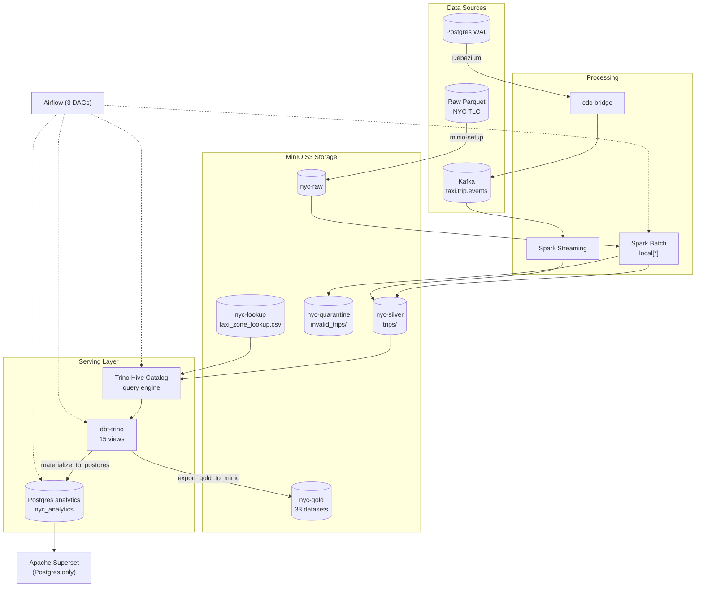

# NYC Taxi Data Pipeline

End-to-end data pipeline for NYC TLC trip records — batch and streaming. Two deployment modes:

- **Kubernetes (kind)** — primary, production-like (3-node cluster, all services in pods). Deployed via **Skaffold** (`skaffold dev`).
- **Docker Compose** — local development (single host, lighter). Deployed via **Make** (`make infra-up`).

Pipeline: MinIO S3 storage → Spark batch/streaming → Trino/Hive catalog → dbt-trino transforms → **Postgres analytics DB** (gold layer) → Apache Superset dashboards. On Kubernetes, **Airflow** orchestrates the pipeline automatically on schedule.

```
┌─────────────────────────────────────────────────────────┐
│  Data flow:                                               │
│  Raw Parquet → MinIO S3 → Spark → Silver Parquet         │
│                         → Trino Hive catalog              │
│                           → dbt-trino (15 views)           │
│                             → Postgres analytics (gold)   │
│                               → Apache Superset           │
└─────────────────────────────────────────────────────────┘
```

## Architecture

All data starts from **raw Parquet** files downloaded from NYC TLC:

1. **Skaffold deploy hook** syncs project files to PVC, **minio-setup job** uploads raw Parquet + zone lookup CSV into MinIO S3 (`nyc-raw`, `nyc-lookup`)
2. **Spark Batch** reads from `s3a://nyc-raw`, enriches + validates, splits into **valid** (`nyc-silver/trips/`) and **invalid** (`nyc-quarantine/`)
3. **Trino Hive catalog** registers external tables pointing at MinIO S3 paths
4. **dbt-trino** transforms silver data into staging → marts → gold views
5. **`export_gold_to_minio.py`** runs ~30 Trino CTAS queries, materializing gold datasets to `s3://nyc-gold/` (MinIO backup)
6. **`materialize_to_postgres.py`** runs the same gold queries, copying results to Postgres `nyc_analytics` (serving layer)
7. **Superset** reads from Postgres only (not Trino) — all 33 datasets and 26 charts point at `public.*` tables
8. **Airflow** orchestrates the whole sequence (3 DAGs)

**Parallel paths:**
- Streaming: **Kafka** events → **Spark Streaming** (same enrichment logic) → append to `nyc-silver/trips/`
- CDC: **Postgres WAL** → **Debezium** → Kafka → **cdc-bridge** → `taxi.trip.events` → Spark Streaming
- Gold export runs in parallel with Postgres materialize (independent destinations, same source)


```mermaid
flowchart TD
    subgraph SOURCE["Data Sources"]
        RP[("Raw Parquet<br/>NYC TLC")]
        K1[("Kafka<br/>taxi.trip.events")]
        PG[("Postgres WAL")]
    end

    subgraph MINIO["MinIO S3 Storage"]
        RAW[("nyc-raw")]
        SILVER[("nyc-silver<br/>trips/")]
        QUARANTINE[("nyc-quarantine<br/>invalid_trips/")]
        LOOKUP[("nyc-lookup<br/>taxi_zone_lookup.csv")]
        GOLD[("nyc-gold<br/>33 datasets")]
    end

    subgraph PROCESS["Processing"]
        SB["Spark Batch<br/>local[*]"]
        SS["Spark Streaming"]
        BRIDGE[cdc-bridge]
    end

    subgraph SERVE["Serving Layer"]
        TRINO["Trino Hive Catalog<br/>query engine"]
        DBT["dbt-trino<br/>15 views"]
        PGDB[("Postgres analytics<br/>nyc_analytics")]
    end

    RP -->|minio-setup| RAW
    RAW --> SB
    SB --> SILVER
    SB --> QUARANTINE
    K1 --> SS
    SS --> SILVER
    PG -->|Debezium| BRIDGE --> K1

    SILVER --> TRINO
    LOOKUP --> TRINO
    TRINO --> DBT
    DBT -->|export_gold_to_minio| GOLD
    DBT -->|materialize_to_postgres| PGDB
    AIRFLOW["Airflow (3 DAGs)"] -..-> SB & TRINO & DBT & PGDB
    PGDB --> SUPERSET["Apache Superset<br/>(Postgres only)"]
```

### Deployment Modes

| Mode | Deploy tool | Cluster | Services | Best for |
|------|------------|---------|----------|----------|
| **Kubernetes (kind)** | `skaffold dev` / `skaffold run` | 3 nodes (kind) | Pods via Helm chart | Production-like, all features |
| **Docker Compose** | `make infra-up` | Docker host | Containers via compose | Local dev, light debugging |

## Quick Start — Kubernetes (primary)

```bash
# Prerequisites: kind cluster must exist
# Create if needed: kind create cluster --config kind.yaml

# 1. One-time setup (after first clone or cluster recreation)
make kind-setup

# 2. Deploy everything (build images + sync files + Helm install + port-forwards + watch)
skaffold dev --namespace nyc-taxi

# One-shot deploy (no watch):
skaffold run --namespace nyc-taxi

# 3. Wait for setup jobs to complete (topic-init, postgres-init, minio-setup, dbt-init)
kubectl wait --for=condition=complete job -n nyc-taxi --all --timeout=180s

# 3. Open UIs
#    Airflow:   http://localhost:39085  (admin/admin)
#    Superset:  http://localhost:39080  (admin/admin)
#    Trino:     http://localhost:39084
#    MinIO:     http://localhost:39086  (minio/minio123)

# 4. Trigger pipelines (Airflow also runs them on schedule)
#    Pipeline automatically runs catchup on first deploy (2024-01, 2024-02, 2024-03)

# 5. Verify analytics (10 SQL questions against Trino)
make k8s-verify-analytics

# 6. Stop (scale down, keep data) — if using skaffold dev, Ctrl+C
make k8s-stop

# 7. Destroy (delete cluster, all data gone)
make k8s-destroy
```

After `skaffold dev` starts, Airflow runs the pipeline on schedule:
- `nyc_e2e_pipeline` (@monthly) — spark + trino + dbt + gold_export + materialize + superset + analytics
- `nyc_analytics_refresh` (@weekly) — dbt + gold_export + materialize + superset + analytics
- `nyc_cdc_pipeline` (manual) — Postgres seed + Debezium + bridge to Kafka

File changes to `airflow/dags/`, `jobs/`, `scripts/`, `dbt/` are auto-synced to PVC via `file-sync` pod.

## Quick Start — Docker Compose

```bash
# 1. Start infrastructure (ZK, Kafka, MinIO, Spark)
make infra-up

# 2. Create Kafka topics
make kafka-topics

# 3. Upload raw data to MinIO
make minio-setup

# 4. Run Spark batch backfill (3 months, ~10.2M rows)
make spark-batch   # reads from s3a://nyc-raw, writes to s3a://nyc-silver

# 5. Register tables in Trino Hive catalog
make trino-bootstrap

# 6. Build dbt models + run tests
make dbt-build     # 15 models + 9 tests, expect 24/24 PASS

# 7. Export gold layer to MinIO + materialize to Postgres
make gold-export              # CTAS to s3://nyc-gold/
make materialize-postgres     # copies gold tables to Postgres nyc_analytics

# 8. Bootstrap Superset from Postgres
make superset-bootstrap   # http://localhost:8088 (admin/admin)

# 9. Verify data
make verify-mart       # Row counts in Trino
make verify-analytics  # 10 SQL questions, expect PASS 10/10

# Full pipeline in one command
make verify-all
```

## Pipeline Architecture

```
dbt_build (Trino views)
   ├── gold_export ────► MinIO s3://nyc-gold/ (33 datasets, Parquet backup)
   └── materialize_postgres ──► Postgres nyc_analytics.public ──► Superset
        ↓
        └── superset_bootstrap ──► Airflow webserver / Superset UI
              └── analytics_check ──► 10 SQL questions

NYE: gold_export is independent (best-effort), materialize is critical path
```

**Why both gold_export and materialize_postgres:**
- `gold_export` writes Parquet to MinIO as a portable backup (DuckDB, Python, external tools)
- `materialize_postgres` writes to Postgres for fast indexed queries (Superset, team SQL)
- Both run the same SQL queries from the `GOLD_DATASETS` definition in `export_gold_to_minio.py`
- If gold_export fails, Postgres still has the data. If materialize fails, superset bootstrap is skipped (correct).

## All Makefile Targets

### Kubernetes (kind) via Skaffold
| Target / Command | Description |
|-----------------|-------------|
| `make kind-setup` | **One-time** — create cluster + load all 10 public images |
| `skaffold dev --namespace nyc-taxi` | **Primary** — build, deploy, port-forward, watch, auto-sync |
| `skaffold run --namespace nyc-taxi` | One-shot deploy (no watch) |
| `skaffold build --namespace nyc-taxi` | Build images only |
| `make k8s-cluster` | Create kind cluster (3 nodes) |
| `make k8s-ui` | Start port-forwards for all UIs (39080-39086) |
| `make k8s-ui-stop` | Stop all port-forwards |
| `~~make k8s-destroy~~` | ⛔ Disabled — use `kind delete cluster --name kind` directly |
| `make k8s-status` | Show pod status |
| `make k8s-logs JOB=<name>` | Tail logs for a job |
| `make k8s-verify` | Verify row counts via Trino |
| `make k8s-verify-analytics` | Run 10 analytics SQL queries |
| `make k8s-verify-cdc` | Verify CDC pipeline (Postgres, Debezium, Kafka) |
| `make k8s-clean` | Clean MinIO data + delete jobs (fresh start) |

### Docker Compose
| Target | Description |
|--------|-------------|
| `infra-up` | Start core services (ZK, Kafka, MinIO, Spark) |
| `infra-up-all` | Start everything (incl. Trino, dbt, Superset, Airflow) |
| `infra-down` | Stop services (keep volumes) |
| `infra-status` | Show container status |
| `infra-logs SVC=<name>` | Tail logs |
| `kafka-topics` | Create Kafka topics |
| `cdc-up` | Start Postgres + Debezium |
| `cdc-seed` | Seed Postgres from parquet (5000 rows) |
| `cdc-register` | Register Debezium connector |
| `cdc-bridge` | Bridge CDC events → taxi.trip.events |
| `cdc-verify` | Full CDC E2E verification |
| `spark-batch` | Batch backfill via MinIO S3 |
| `spark-streaming` | Submit streaming job |
| `trino-bootstrap` | Register tables in Hive catalog |
| `trino-shell` | Interactive Trino shell |
| `dbt-build` | Full dbt build: models + tests |
| `dbt-run` | Run models only |
| `dbt-test` | Run tests only |
| `gold-export` | Export gold layer to MinIO Parquet (via Trino CTAS) |
| `materialize-postgres` | Copy gold tables to Postgres analytics DB |
| `superset-bootstrap` | Register DB, charts, dashboard |
| `superset-check` | List Superset resources |
| `airflow-up` | Start Airflow |
| `airflow-trigger DAG=<name>` | Trigger a DAG |
| `verify-mart` | Row counts in Trino |
| `verify-analytics` | 10 SQL questions (PASS 10/10) |
| `verify-cdc` | Verify CDC pipeline |
| `verify-all` | Full pipeline verification |
| `clean-silver` | Delete silver parquet data |
| `clean-quarantine` | Delete quarantine parquet |
| `clean-all` | Delete all generated data |

## UIs & Port-forwards

Kubernetes mode uses `skaffold portForward` or `kubectl port-forward` — ports **39080-39087** (avoids kind NodePort 38080 range).

| Service | URL | Port | Credentials |
|---------|-----|------|-------------|
| Apache Superset | http://localhost:39080 | 39080 | `admin` / `admin` |
| MinIO API | http://localhost:39081 | 39081 | `minio` / `minio123` |
| Kafka UI | http://localhost:39082 | 39082 | — |
| Spark Master | http://localhost:39083 | 39083 | — |
| Trino | http://localhost:39084 | 39084 | — |
| Airflow | http://localhost:39085 | 39085 | `admin` / `admin` |
| MinIO Console | http://localhost:39086 | 39086 | `minio` / `minio123` |
| Postgres Analytics | (internal — `svc-postgres-analytics:5432`) | — | `analytics` / `analytics` |
| Postgres CDC | (internal — `svc-postgres-cdc:5432`) | — | `postgres` / `postgres` |

Docker Compose mode uses published ports directly (8088, 9000/9001, 8083, etc.).

Port-forwards are managed automatically by `skaffold dev`. If not using skaffold, start via `make k8s-ui`.

## Data Layout

```
MinIO S3 buckets:
├── nyc-raw/          → yellow_taxi/year=2024/month=01..03/*.parquet
├── nyc-silver/trips/ → pickup_year=*/pickup_month=*/  (~10.2M rows)
├── nyc-quarantine/   → invalid_trips/                  (~1.07M rows)
├── nyc-lookup/       → taxi_zone_lookup.csv            (265 zones)
└── nyc-gold/         → 33 datasets (CTAS from Trino, Parquet, ~500MB)

Postgres analytics DB (svc-postgres-analytics:5432 / nyc_analytics):
└── public.*          → 33 tables mirroring nyc-gold (serving layer for Superset)
```

## Pipeline Components

| Layer | Technology | Role |
|-------|-----------|------|
| Storage | MinIO S3 | Buckets: `nyc-raw`, `nyc-silver`, `nyc-quarantine`, `nyc-lookup`, `nyc-gold` |
| Processing | Spark 3.5.1 | Batch backfill (`spark_local_batch.py`) + Kafka streaming (`spark_stream_taxi_events.py`) |
| Messaging | Kafka + ZK | `taxi.trip.events` (main), Debezium CDC topics |
| Catalog / Query engine | Trino 435 | Hive connector + S3 connector, reads parquet from MinIO |
| Transformation | dbt-trino | 15 views (staging → marts → gold), 9 tests |
| Gold export | Trino CTAS → `s3a://nyc-gold/` | Parquet backup of gold layer (~33 datasets) |
| Serving layer | **Postgres 16** (`nyc_analytics`) | 33 tables for Superset + team SQL queries |
| Visualization | Apache Superset 4.0.0 | **Postgres-only** — 33 datasets, 26 charts, 1 dashboard |
| Orchestration | Airflow 2.10.5 | **3 DAGs**: `nyc_e2e_pipeline` (@monthly), `nyc_cdc_pipeline` (manual), `nyc_analytics_refresh` (@weekly) |
| CDC | Debezium 2.5 + Postgres 16 | WAL-based CDC, bridge to standard event format |
| Deployment | **Skaffold v4** + Helm | `skaffold dev` — build, deploy, sync, port-forward, watch |

## CDC Pipeline

CDC can run as a **standalone DAG** (`nyc_cdc_pipeline`, manual) or **inline** within the E2E DAG (`nyc_e2e_pipeline`).

The E2E DAG includes CDC steps directly: `cdc_seed → cdc_register → cdc_bridge → spark_streaming`.
This seeds 1000 rows from raw parquet through Postgres → Debezium → Kafka → Spark Streaming → Silver.
No separate trigger needed — just run `nyc_e2e_pipeline` from Airflow.

```bash
# Standalone CDC (Docker Compose):
make cdc-register   # Register Debezium connector
make cdc-bridge     # Bridge CDC events → taxi.trip.events format
make cdc-verify     # Full CDC E2E verification
```

CDC bridge runs as a poll-based loop with idle timeout (5s) — exits automatically when no more events arrive.

## Development Notes

- **No host Python required** — all code runs in Docker/K8s containers.
- **Kubernetes (Skaffold)**: `skaffold dev --namespace nyc-taxi` — tự động build, deploy, sync files, port-forward.
  Khi code thay đổi, `skaffold sync` push thẳng vào `file-sync` pod → PVC → Airflow nhận thay đổi ngay.
- **Skaffold pre-deploy hook** is idempotent — handles clean uninstall, namespace reset, PV claim release, image `:k8s` alias tagging, and tar-sync of project files + raw data to kind-worker hostPath PVCs.
- **PVC Sync manual** (khi không dùng skaffold):
  ```bash
  cd /home/dwcks/vsf_gsm/nyc_new
  tar cf - --exclude='dbt/logs' --exclude='dbt/target' --exclude='.git' \
    --exclude='__pycache__' --exclude='*.pyc' \
    airflow/dags/ jobs/ scripts/ dbt/ charts/ \
    | docker exec -i kind-worker tar xf - -C /mnt/nyc-project
  ```
- **Spark S3A connector** uses `--packages hadoop-aws:3.3.4,aws-java-sdk-bundle:1.12.262`
  via `spark-submit` CLI (not `spark.jars.packages`). Ivy cache shared on PVC (`/opt/project/.ivy2/`) for speed.
- **S3 commit fix**: `spark.hadoop.mapreduce.fileoutputcommitter.algorithm.version=2`
  required because MinIO does not support atomic S3 rename.
- **MinIO credentials**: `minio` / `minio123`. Spark uses `s3a://`, Trino uses `s3://`.
- **Postgres analytics credentials**: `analytics` / `analytics`, DB `nyc_analytics`, schema `public`. Trino is still the query engine for silver data; Postgres is only for the gold serving layer.
- **All dbt models** are `materialized='view'` (Trino target) or `materialized='table'` (postgres_analytics target for gold). Hive file-based HMS does not support `RENAME TABLE`.
- **Spark zone cleaning** at source: `F.when(F.col("Borough").isin("Unknown","N/A","NV"), F.lit(None))` handles NYC TLC zone IDs 264 (Unknown/N/A) and 265 (N/A/Outside of NYC). Belt-and-suspenders `nullif()` in dbt stg_trips.
- **Superset**: connects to Postgres only. All 33 datasets in `public.*` schema, 26 charts (echarts/pie/table), dashboard "NYC Taxi Gold Analytics". Position_json is rebuilt clean on every bootstrap to avoid stale form_data cache.
- **Port-forward survival**: `scripts/k8s_ui.sh` uses `setsid -f` so processes survive `make` exit.
  Skaffold automatically manages port-forwards in `dev` mode.
- **Kafka bootstrap**: Docker Compose `localhost:29092`, container `nyc_kafka:9092`, **K8s `svc-kafka:9092`**
  (⚠️ không dùng `kafka:9092` — service name trong K8s namespace `nyc-taxi` có prefix `svc-`).
- **Airflow DAG management**: 3 DAGs tự động chạy trên lịch:
  - `nyc_e2e_pipeline` (@monthly): Spark batch + streaming → trino_bootstrap → dbt_build → [gold_export ∥ materialize_postgres] → superset_bootstrap → analytics_check
  - `nyc_analytics_refresh` (@weekly): dbt_build → [gold_export ∥ materialize_postgres] → superset_bootstrap → analytics_check
  - `nyc_cdc_pipeline` (manual): cdc_seed → cdc_register → cdc_bridge
  
  Trigger manual: Airflow UI (http://localhost:39085) hoặc:
  ```bash
  kubectl exec -n nyc-taxi deploy/airflow-scheduler -- airflow dags trigger nyc_e2e_pipeline
  ```
- **Skaffold file-sync hot-reload**: `file-sync` pod (runs root, PVC mounted) nhận file từ `skaffold sync`.
  Sync rules trong `skaffold.yaml` map `airflow/dags/`, `jobs/`, `scripts/`, `dbt/`, `charts/` → `/opt/project/...`.
- **Postgres init**: Dùng Python `psycopg2` (không cần `psql` / postgresql-client).
- **topic-init**: Dùng `wait-kafka` (TCP wait script, có sẵn trong tools image) + `svc-kafka:9092`.
- **Helm chart**: Tất cả manifests đều trong `charts/nyc-taxi/templates/`. Deploy via `deploy.helm` trong skaffold.yaml.
- **Trino params**: must use `?` placeholder (paramstyle='qmark'), NOT `%s`. Catalog must be set via `trino_connect(catalog="hive")` or query prefix.
- **Trino memory**: JVM `-Xmx5G`, container limit `8Gi`, query max `5GB`. Heavy CTAS on 25M+ rows may still OOM —
  the DAG has `retries=3` with 30s backoff to survive transient Trino restarts.
- **DAG resilience**: `trino_bootstrap` uses `trigger_rule="one_success"` — only needs one of spark_batch
  or spark_streaming to succeed before proceeding. All tasks have `retries=3` for transient failures.
