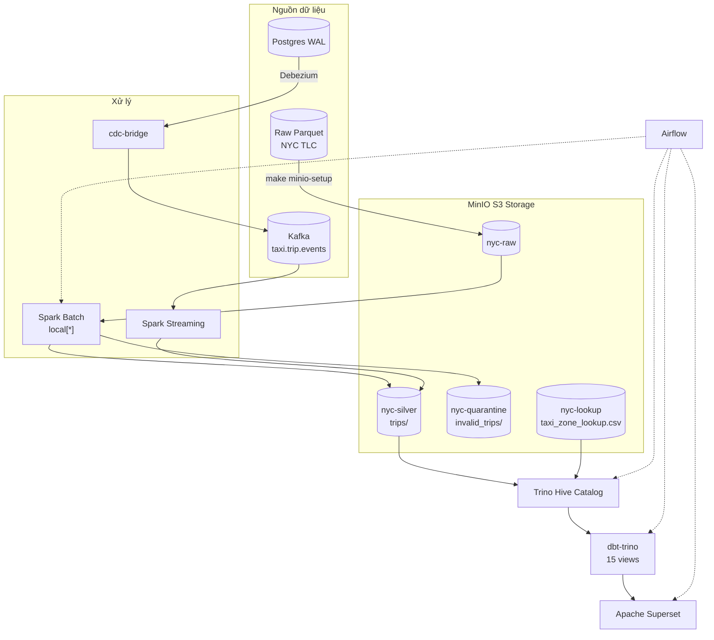

# Pipeline Dữ Liệu Taxi NYC

Pipeline xử lý dữ liệu chuyến đi taxi NYC từ đầu đến cuối — batch và streaming. Hai chế độ triển khai:

- **Kubernetes (kind)** — chính, giống production (3 nodes, tất cả dịch vụ trong pod). Triển khai qua **Skaffold** (`skaffold dev`).
- **Docker Compose** — phát triển local (một máy, nhẹ hơn). Triển khai qua **Make** (`make infra-up`).

MinIO S3 là tầng lưu trữ, Spark xử lý dữ liệu, Trino/Hive làm catalog, dbt-trino biến đổi dữ liệu, Apache Superset hiển thị dashboard. Trên Kubernetes, **Airflow** là công cụ điều phối chính — pipeline tự động chạy theo lịch.

## Kiến trúc

Mọi thứ đều bắt đầu từ **file Parquet thô** tải từ NYC TLC:

1. **Skaffold deploy hook** đồng bộ project files vào PVC, **minio-setup job** tải Parquet thô + CSV lookup zone lên MinIO S3 (`nyc-raw`, `nyc-lookup`)
2. **Spark Batch** đọc từ `s3a://nyc-raw`, enrich + validate, chia thành **hợp lệ** (`nyc-silver/trips/`) và **không hợp lệ** (`nyc-quarantine/`)
3. **Trino Hive catalog** register bảng external trỏ đến đường dẫn MinIO S3
4. **dbt-trino** biến đổi dữ liệu silver thành staging → marts → gold views
5. **Superset** truy vấn Trino để hiển thị biểu đồ và dashboard
6. **Airflow** điều phối toàn bộ luồng (3 DAGs)

Luồng streaming: **Kafka** events → **Spark Streaming** (cùng logic enrich) → append vào `nyc-silver/trips/`.
Luồng CDC: **Postgres WAL** → **Debezium** → Kafka → **cdc-bridge** → `taxi.trip.events` → Spark Streaming.



### Chế độ triển khai

| Chế độ | Công cụ deploy | Cluster | Dịch vụ | Dùng cho |
|--------|---------------|---------|---------|----------|
| **Kubernetes (kind)** | `skaffold dev` / `skaffold run` | 3 nodes (kind) | Pods qua Helm chart | Giống production, đầy đủ tính năng |
| **Docker Compose** | `make infra-up` | Docker host | Containers qua compose | Dev local, debug nhẹ |

## Bắt đầu nhanh — Kubernetes (chính)

```bash
# Prerequisites: kind cluster phải tồn tại
# Tạo nếu cần: kind create cluster --config kind.yaml

# 1. Deploy tất cả (build images + sync files + Helm install + port-forwards + watch)
skaffold dev --namespace nyc-taxi

# Hoặc deploy một lần (không watch):
skaffold run --namespace nyc-taxi

# 2. Bật port-forwards (nếu không dùng skaffold dev)
make k8s-ui

# 3. Đợi setup jobs hoàn thành (topic-init, postgres-init, minio-setup)
kubectl wait --for=condition=complete job -n nyc-taxi topic-init --timeout=120s

# 4. Kích hoạt DAG qua Airflow UI hoặc CLI:
#    UI: http://localhost:39085 -> admin/admin -> unpause + trigger nyc_e2e_pipeline
#    CLI: kubectl exec -n nyc-taxi deploy/airflow-scheduler -- airflow dags trigger nyc_e2e_pipeline

# 5. Kích hoạt CDC pipeline
kubectl exec -n nyc-taxi deploy/airflow-scheduler -- airflow dags trigger nyc_cdc_pipeline

# 6. Kiểm tra analytics (10 câu SQL truy vấn Trino)
make k8s-verify-analytics

# 7. Dừng (scale down, giữ dữ liệu) — nếu dùng skaffold dev thì Ctrl+C
make k8s-stop

# 8. Xoá (xoá cluster, mất hết dữ liệu)
make k8s-destroy
```

Sau khi `skaffold dev` chạy, Airflow tự động chạy pipeline theo lịch (@monthly cho e2e, @weekly cho analytics). File changes trong `airflow/dags/`, `jobs/`, `scripts/`, `dbt/` được tự động đồng bộ vào PVC qua `file-sync` pod.

## Bắt đầu nhanh — Docker Compose

```bash
# 1. Khởi động hạ tầng (ZK, Kafka, MinIO, Spark)
make infra-up

# 2. Tạo Kafka topics
make kafka-topics

# 3. Tải dữ liệu thô lên MinIO
make minio-setup

# 4. Chạy Spark batch backfill (3 tháng, ~10.2M dòng)
make spark-batch   # đọc từ s3a://nyc-raw, ghi vào s3a://nyc-silver

# 5. Register bảng trong Trino Hive catalog
make trino-bootstrap

# 6. Build dbt models + chạy test
make dbt-build     # 15 models + 9 tests, kỳ vọng 24/24 PASS

# 7. Kiểm tra dữ liệu
make verify-mart       # Đếm dòng trong Trino
make verify-analytics  # 10 câu SQL, kỳ vọng PASS 10/10

# 8. Khởi động dashboard
make superset-bootstrap  # http://localhost:8088 (admin/admin)

# Toàn bộ pipeline trong một lệnh
make verify-all
```

## Tất cả Makefile Targets

### Kubernetes (kind) qua Skaffold
| Target / Command | Mô tả |
|-----------------|-------|
| `skaffold dev --namespace nyc-taxi` | **Chính** — build, deploy, port-forward, watch, auto-sync |
| `skaffold run --namespace nyc-taxi` | Deploy một lần (không watch) |
| `skaffold build --namespace nyc-taxi` | Build images chỉ |
| `make k8s-cluster` | Tạo kind cluster (3 nodes) |
| `make k8s-ui` | Bật port-forwards cho tất cả UIs (39080-39086) |
| `make k8s-ui-stop` | Tắt tất cả port-forwards |
| `make k8s-destroy` | Xoá cluster (services + volumes + images) |
| `make k8s-status` | Xem trạng thái pod |
| `make k8s-logs JOB=<tên>` | Xem log của job |
| `make k8s-verify` | Kiểm tra row counts qua Trino |
| `make k8s-verify-analytics` | Chạy 10 câu SQL analytics |
| `make k8s-verify-cdc` | Kiểm tra CDC pipeline (Postgres, Debezium, Kafka) |
| `make k8s-clean` | Xoá dữ liệu MinIO + jobs (bắt đầu sạch) |

### Docker Compose
| Target | Mô tả |
|--------|-------|
| `infra-up` | Khởi động core services (ZK, Kafka, MinIO, Spark) |
| `infra-up-all` | Khởi động mọi thứ (gồm Trino, dbt, Superset, Airflow) |
| `infra-down` | Dừng services (giữ volumes) |
| `infra-status` | Xem trạng thái container |
| `infra-logs SVC=<tên>` | Xem log |
| `kafka-topics` | Tạo Kafka topics |
| `cdc-up` | Khởi động Postgres + Debezium |
| `cdc-seed` | Nạp dữ liệu từ Parquet vào Postgres (5000 dòng) |
| `cdc-register` | Đăng ký Debezium connector |
| `cdc-bridge` | Bridge CDC events → format taxi.trip.events |
| `cdc-verify` | Kiểm tra CDC E2E |
| `spark-batch` | Batch backfill qua MinIO S3 |
| `spark-streaming` | Gửi streaming job |
| `trino-bootstrap` | Register bảng trong Hive catalog |
| `trino-shell` | Trino shell tương tác |
| `dbt-build` | Full dbt build: models + tests |
| `dbt-run` | Chạy models chỉ |
| `dbt-test` | Chạy tests chỉ |
| `superset-bootstrap` | Register DB, charts, dashboard |
| `superset-check` | Liệt kê tài nguyên Superset |
| `airflow-up` | Khởi động Airflow |
| `airflow-trigger DAG=<tên>` | Kích hoạt DAG |
| `verify-mart` | Đếm dòng trong Trino |
| `verify-analytics` | 10 câu SQL (PASS 10/10) |
| `verify-cdc` | Kiểm tra CDC pipeline |
| `verify-all` | Kiểm tra toàn bộ pipeline |
| `clean-silver` | Xoá dữ liệu silver parquet |
| `clean-quarantine` | Xoá dữ liệu quarantine |
| `clean-all` | Xoá tất cả dữ liệu đã sinh |

## UIs & Port-forwards

Chế độ Kubernetes dùng `skaffold portForward` hoặc `kubectl port-forward` — cổng **39080-39087** (tránh xung đột NodePort 38080 của kind).

| Dịch vụ | URL | Cổng | Thông tin đăng nhập |
|---------|-----|------|-------------------|
| Apache Superset | http://localhost:39080 | 39080 | `admin` / `admin` |
| MinIO API | http://localhost:39081 | 39081 | `minio` / `minio123` |
| Kafka UI | http://localhost:39082 | 39082 | — |
| Spark Master | http://localhost:39083 | 39083 | — |
| Trino | http://localhost:39084 | 39084 | — |
| Airflow | http://localhost:39085 | 39085 | `admin` / `admin` |
| MinIO Console | http://localhost:39086 | 39086 | `minio` / `minio123` |
| Postgres CDC | localhost:39087 | 39087 | `postgres` / `postgres` |

Chế độ Docker Compose dùng cổng publish trực tiếp (8088, 9000/9001, 8083, v.v.).

Port-forwards được `skaffold dev` tự động quản lý. Nếu không dùng skaffold, chạy `make k8s-ui`.

## Kết quả Batch

| Chỉ số | Compose | K8s |
|--------|---------|-----|
| Chuyến hợp lệ | 8.480.408 | **10.188.983** |
| Chuyến lỗi | 1.074.370 | **1.074.370** |
| Zone lookup | 265 | 265 |
| dbt tests | 24/24 PASS | 24/24 PASS |
| Analytics | 10/10 PASS | 10/10 PASS |
| CDC bridge | ~2.543 ev/s | ~445 ev/s |
| Spark runtime (3 tháng) | ~10 phút | ~9 phút |

K8s có số liệu cao hơn vì lần chạy sạch gần nhất bao gồm dữ liệu 2002-2024
(nhiều năm hơn lần chạy Docker Compose ban đầu chỉ có 2024).

## Cấu trúc dữ liệu

```
MinIO S3 buckets:
├── nyc-raw/          → yellow_taxi/year=2024/month=01..03/*.parquet
├── nyc-silver/trips/ → pickup_year=*/pickup_month=*/  (10.2M dòng)
├── nyc-quarantine/   → invalid_trips/                  (1.07M dòng)
├── nyc-lookup/       → taxi_zone_lookup.csv            (265 zones)
```

## Thành phần Pipeline

| Tầng | Công nghệ | Vai trò |
|------|-----------|---------|
| Lưu trữ | MinIO S3 | Buckets: `nyc-raw`, `nyc-silver`, `nyc-quarantine`, `nyc-lookup` |
| Xử lý | Spark 3.5.1 | Batch backfill (`spark_local_batch.py`) + Kafka streaming (`spark_stream_taxi_events.py`) |
| Nhắn tin | Kafka + ZK | `taxi.trip.events` (chính), Debezium CDC topics |
| Catalog | Trino 435 | Hive connector + S3 connector, đọc parquet từ MinIO |
| Biến đổi | dbt-trino | 15 views (staging → marts → gold), 9 tests |
| Hiển thị | Apache Superset 4.0.0 | Dashboard kết nối Trino với biểu đồ |
| Điều phối | Airflow 2.10.5 (chính trên K8s) | **3 DAGs**: `nyc_e2e_pipeline` (@monthly), `nyc_cdc_pipeline` (@monthly), `nyc_analytics_refresh` (@weekly) |
| Triển khai | **Skaffold v2.21.0** + Helm | `skaffold dev` — build, deploy, sync, port-forward, watch |
| CDC | Debezium 2.5 + Postgres 16 | CDC qua WAL, bridge sang format chuẩn |

## CDC Pipeline

```bash
make cdc-seed       # Nạp dữ liệu từ Parquet vào Postgres (5000 dòng)
make cdc-register   # Đăng ký Debezium connector
make cdc-bridge     # Bridge CDC events → format taxi.trip.events
make cdc-verify     # Kiểm tra CDC E2E
```

CDC bridge chạy vòng lặp poll với idle timeout (5s) — tự động thoát khi không còn event mới.

## Ghi chú phát triển

- **Không cần Python trên host** — tất cả code chạy trong container Docker/K8s.
- **Kubernetes (Skaffold)**: `skaffold dev --namespace nyc-taxi` — tự động build, deploy, sync files, port-forward.
  Khi code thay đổi, `skaffold sync` push thẳng vào `file-sync` pod → PVC → Airflow nhận thay đổi ngay.
- **Airflow DAG management**: 3 DAGs tự động chạy trên lịch:
  - `nyc_e2e_pipeline` (@monthly): Spark batch + streaming → Trino → dbt → Superset
  - `nyc_cdc_pipeline` (@monthly): Seed Postgres → Debezium → bridge CDC → Kafka
  - `nyc_analytics_refresh` (@weekly): dbt → Superset refresh → analytics check
  
  Kích hoạt thủ công: Airflow UI (http://localhost:39085) hoặc:
  ```bash
  kubectl exec -n nyc-taxi deploy/airflow-scheduler -- airflow dags trigger nyc_e2e_pipeline
  ```
- **PVC Sync thủ công** (khi không dùng skaffold):
  ```bash
  cd /home/dwcks/vsf_gsm/nyc_new
  tar cf - --exclude='dbt/logs' --exclude='dbt/target' --exclude='.git' \
    --exclude='__pycache__' --exclude='*.pyc' \
    airflow/dags/ jobs/ scripts/ dbt/ charts/ \
    | docker exec -i kind-worker tar xf - -C /mnt/nyc-project
  ```
- **Spark S3A connector** dùng `--packages hadoop-aws:3.3.4,aws-java-sdk-bundle:1.12.262`
  qua `spark-submit` CLI (không phải `spark.jars.packages`). Ivy cache dùng chung trên PVC (`/opt/project/.ivy2/`).
- **S3 commit fix**: `spark.hadoop.mapreduce.fileoutputcommitter.algorithm.version=2`
  bắt buộc vì MinIO không hỗ trợ atomic S3 rename.
- **MinIO credentials**: `minio` / `minio123`. Spark dùng `s3a://`, Trino dùng `s3://`.
- **Tất cả dbt models** là `materialized='view'` — Hive file-based HMS không hỗ trợ `RENAME TABLE`.
- **Port-forward sống lâu**: `scripts/k8s_ui.sh` dùng `setsid -f` để tiến trình sống sau khi `make` thoát.
  Skaffold tự động quản lý port-forwards trong `dev` mode.
- **Kafka bootstrap**: Docker Compose `localhost:29092`, container `nyc_kafka:9092`, **K8s `svc-kafka:9092`**
  (⚠️ không dùng `kafka:9092` — service name trong K8s namespace `nyc-taxi` có prefix `svc-`).
- **Skaffold file-sync hot-reload**: `file-sync` pod (chạy root, mount PVC) nhận file từ `skaffold sync`.
  Sync rules trong `skaffold.yaml` map `airflow/dags/`, `jobs/`, `scripts/`, `dbt/`, `charts/` → `/opt/project/...`.
- **Postgres init**: Dùng Python `psycopg2` (không cần `psql` / postgresql-client).
- **topic-init**: Dùng `wait-kafka` (TCP wait script, có sẵn trong tools image) + `svc-kafka:9092`.
- **Helm chart**: Tất cả manifests đều trong `charts/nyc-taxi/templates/`. Deploy qua `deploy.helm` trong skaffold.yaml.
