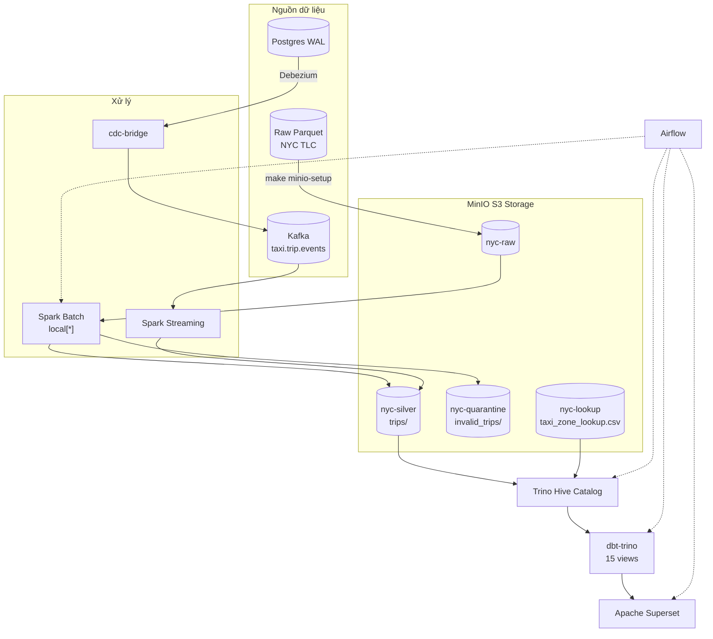

# Pipeline Dữ Liệu Taxi NYC

Pipeline xử lý dữ liệu chuyến đi taxi NYC từ đầu đến cuối — batch và streaming, chạy hoàn toàn trong Docker. MinIO S3 là tầng lưu trữ, Spark xử lý dữ liệu, Trino/Hive làm catalog, dbt-trino biến đổi dữ liệu, Apache Superset hiển thị dashboard, Airflow điều phối luồng.

## Kiến trúc

Có — mọi thứ đều bắt đầu từ **file Parquet thô** tải từ NYC TLC:

1. **`make minio-setup`** tải Parquet thô + CSV lookup zone lên MinIO S3 (`nyc-raw`, `nyc-lookup`)
2. **Spark Batch** đọc từ `s3a://nyc-raw`, enrich + validate, chia thành **hợp lệ** (`nyc-silver/trips/`) và **không hợp lệ** (`nyc-quarantine/`)
3. **Trino Hive catalog** register bảng external trỏ đến đường dẫn MinIO S3
4. **dbt-trino** biến đổi dữ liệu silver thành staging → marts → gold views
5. **Superset** truy vấn Trino để hiển thị biểu đồ và dashboard
6. **Airflow** điều phối toàn bộ luồng

Luồng streaming: **Kafka** events → **Spark Streaming** (cùng logic enrich) → append vào `nyc-silver/trips/`.
Luồng CDC: **Postgres WAL** → **Debezium** → Kafka → **cdc-bridge** → `taxi.trip.events` → Spark Streaming.



```
                                ┌──────────────────────────────────────────────────────┐
                                │                    MinIO S3                          │
                                │  ┌──────────┐  ┌──────────┐  ┌──────────┐            │
  Raw Parquet ──► minio-setup ──┼─►│nyc-raw   │  │nyc-silver│  │nyc-quar. │            │
                                │  └─────┬────┘  └────┬─────┘  └────┬─────┘            │
                                │        │            │             │                  │
                                │  ┌─────┴────┐       │             │                  │
                                │  │nyc-lookup│       │             │                  │
                                │  └──────────┘       │             │                  │
                                └─────────────────────┼─────────────┼──────────────────┘
          Batch: Spark (local[*]) ◄── s3a://nyc-raw ───┘             │
          enrich + validate ──► hợp lệ ──► s3a://nyc-silver/trips/    │
                                └── không hợp lệ ──► s3a://nyc-quarantine/
                                                                    │
  Streaming: Spark Structured Streaming ◄── Kafka (taxi.trip.events)│
          cùng logic enrich + validate ──► append ──► s3a://nyc-silver/
                                                                    │
  CDC: Postgres WAL ──► Debezium ──► Kafka ──► cdc-bridge ──► ──────┘
                                                                    │
                                                                    ▼
  Trino (Hive catalog + S3 connector) ◄─────────────────────────────┘
        │
        ▼
  dbt-trino (15 views: staging → marts → gold, 9 tests)
        │
        ▼
  Apache Superset (4 charts + dashboard)
        ▲
        │
  Airflow (điều phối batch → Trino → dbt → Superset → analytics)
```

## Bắt đầu nhanh

Tất cả thao tác qua `make <target>` — không cần nhớ lệnh Docker.

```bash
# 1. Khởi động hạ tầng (ZK, Kafka, MinIO, Spark)
make infra-up

# 2. Tạo Kafka topics
make kafka-topics

# 3. Tải dữ liệu thô lên MinIO
make minio-setup

# 4. Chạy Spark batch backfill (3 tháng, ~9.5M dòng)
make spark-batch   # đọc từ s3a://nyc-raw, ghi vào s3a://nyc-silver

# 5. Register bảng trong Trino Hive catalog
make trino-bootstrap

# 6. Build dbt models + chạy test
make dbt-build     # 15 models + 9 tests, kỳ vọng 24/24 PASS

# 7. Kiểm tra dữ liệu
make verify-mart       # Đếm dòng trong Trino
make verify-analytics  # 10 câu SQL, kỳ vọng PASS 10/10

# 8. Khởi động dashboard
make superset-bootstrap  # http://localhost:8088 (admin/admin)

# Toàn bộ pipeline trong một lệnh
make verify-all
```

## Thành phần Pipeline

| Tầng | Công nghệ | Vai trò |
|------|-----------|---------|
| Lưu trữ | MinIO S3 | Lưu trữ mặc định: buckets `nyc-raw`, `nyc-silver`, `nyc-quarantine`, `nyc-lookup` |
| Xử lý | Spark 3.5.1 | Batch backfill (`spark_local_batch.py`) + Kafka streaming (`spark_stream_taxi_events.py`) |
| Nhắn tin | Kafka + ZK | `taxi.trip.events` (chính), Debezium CDC topics |
| Catalog | Trino 435 | Hive connector + S3 connector, đọc parquet từ MinIO |
| Biến đổi | dbt-trino | 15 views (staging → marts → gold), 9 tests |
| Hiển thị | Apache Superset 4.0.0 | Dashboard kết nối Trino với 4 biểu đồ |
| Điều phối | Airflow 2.10.5 | DAGs: `nyc_e2e_pipeline`, `nyc_analytics_refresh` |
| CDC | Debezium 2.5 + Postgres 16 | CDC qua WAL, bridge sang format chuẩn |

## Lệnh chính

```bash
make infra-up         # Khởi động dịch vụ core
make infra-up-all     # Khởi động mọi thứ (gồm Trino, dbt, Superset, Airflow)
make spark-batch      # Batch backfill (MONTH=01/02/03)
make spark-streaming  # Kafka streaming consumer
make minio-setup      # Tải dữ liệu thô lên MinIO (chạy 1 lần)
make trino-bootstrap  # Register bảng trong Hive catalog
make dbt-build        # dbt models + tests
make superset-bootstrap  # Register DB/dataset/charts/dashboard
make verify-all       # Kiểm tra toàn bộ pipeline
make clean-all        # Xoá dữ liệu đã sinh
make infra-logs SVC=trino  # Xem log của một dịch vụ
```

## Kết quả Batch (3 tháng, 2024-01 đến 2024-03)

| Tháng | Dòng hợp lệ | Dòng lỗi | Thời gian |
|-------|------------|---------|-----------|
| 01 | 2.724.037 | 240.331 | ~200s |
| 02 | 2.719.926 | 287.976 | ~200s |
| 03 | 3.036.445 | 546.063 | ~200s |
| **Tổng** | **8.480.408** | **1.074.370** | |

- dbt: **24/24 PASS** (15 models + 9 tests)
- Analytics: **10/10 PASS** (10 câu SQL truy vấn Trino)

## Cấu trúc dữ liệu

```
MinIO S3 buckets:
├── nyc-raw/          → yellow_taxi/year=2024/month=01..03/*.parquet
├── nyc-silver/trips/ → pickup_year=2024/pickup_month={1,2,3}/  (~268MB, 8.48M dòng)
├── nyc-quarantine/   → invalid_trips/                           (~8MB, 1.07M dòng)
├── nyc-lookup/       → taxi_zone_lookup.csv                     (265 zones)
```

## CDC Pipeline

```bash
make cdc-up         # Khởi động Postgres + Debezium
make cdc-seed       # Nạp dữ liệu từ Parquet vào Postgres (5000 dòng)
make cdc-register   # Đăng ký Debezium connector
make cdc-bridge     # Bridge CDC events → format taxi.trip.events
make cdc-verify     # Kiểm tra CDC E2E
```

## Ghi chú phát triển

- **Không cần Python trên host** — tất cả code chạy trong Docker container.
- Spark chạy với UID 185 (trong container), host là UID 1000. Chạy `make setup-volumes` nếu quyền truy cập dữ liệu bị sai.
- MinIO credentials: `minio` / `minio123`. Internal endpoint: `http://minio:9000`, console: `http://localhost:9001`.
- Tất cả dbt models đều `materialized='view'` — Hive file-based HMS không hỗ trợ `RENAME TABLE`.
- Airflow DAGs dùng Docker-in-Docker qua `subprocess.run(["docker", ...])` với đường dẫn tuyệt đối trên host `/home/dwcks/vsf_gsm/nyc_new`.
- Kafka bootstrap cho host: `localhost:29092`, cho container: `nyc_kafka:9092`.
