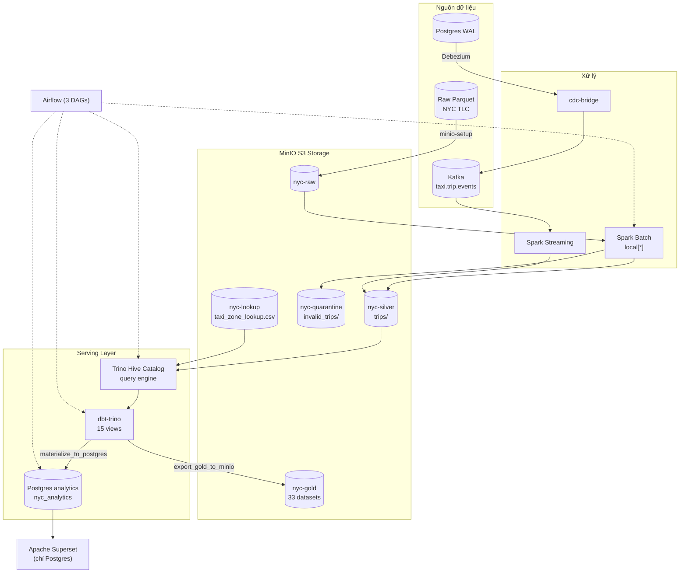

# Pipeline Dữ Liệu Taxi NYC

Pipeline xử lý dữ liệu chuyến đi taxi NYC từ đầu đến cuối — batch và streaming. Hai chế độ triển khai:

- **Kubernetes (kind)** — chính, giống production (3 nodes, tất cả dịch vụ trong pod). Triển khai qua **Skaffold** (`skaffold dev`).
- **Docker Compose** — phát triển local (một máy, nhẹ hơn). Triển khai qua **Make** (`make infra-up`).

Pipeline: MinIO S3 storage → Spark batch/streaming → Trino/Hive catalog → dbt-trino transforms → **Postgres analytics DB** (gold layer) → Apache Superset. Trên Kubernetes, **Airflow** điều phối pipeline tự động theo lịch.

```
┌─────────────────────────────────────────────────────────┐
│  Data flow:                                               │
│  Raw Parquet → MinIO S3 → Spark → Silver Parquet         │
│                         → Trino Hive catalog              │
│                           → dbt-trino (15 views)           │
│                             → Postgres analytics (gold)   │
│                               → Apache Superset           │
└─────────────────────────────────────────────────────────┘
```

## Kiến trúc

Mọi thứ đều bắt đầu từ **file Parquet thô** tải từ NYC TLC:

1. **Skaffold deploy hook** đồng bộ project files vào PVC, **minio-setup job** tải Parquet thô + CSV lookup zone lên MinIO S3 (`nyc-raw`, `nyc-lookup`)
2. **Spark Batch** đọc từ `s3a://nyc-raw`, enrich + validate, chia thành **hợp lệ** (`nyc-silver/trips/`) và **không hợp lệ** (`nyc-quarantine/`)
3. **Trino Hive catalog** register bảng external trỏ đến đường dẫn MinIO S3
4. **dbt-trino** biến đổi dữ liệu silver thành staging → marts → gold views
5. **`export_gold_to_minio.py`** chạy ~30 Trino CTAS queries, materialize gold datasets vào `s3://nyc-gold/` (backup Parquet)
6. **`materialize_to_postgres.py`** chạy cùng queries, copy kết quả vào Postgres `nyc_analytics` (serving layer)
7. **Superset** đọc từ Postgres (không phải Trino) — 33 datasets và 26 charts trỏ vào `public.*`
8. **Airflow** điều phối toàn bộ luồng (3 DAGs)

**Các luồng song song:**
- Streaming: **Kafka** events → **Spark Streaming** (cùng logic enrich) → append vào `nyc-silver/trips/`
- CDC: **Postgres WAL** → **Debezium** → Kafka → **cdc-bridge** → `taxi.trip.events` → Spark Streaming
- Gold export chạy song song với Postgres materialize (khác đích, cùng nguồn)


```mermaid
flowchart TD
    subgraph SOURCE["Nguồn dữ liệu"]
        RP[("Raw Parquet<br/>NYC TLC")]
        K1[("Kafka<br/>taxi.trip.events")]
        PG[("Postgres WAL")]
    end

    subgraph MINIO["MinIO S3 Storage"]
        RAW[("nyc-raw")]
        SILVER[("nyc-silver<br/>trips/")]
        QUARANTINE[("nyc-quarantine<br/>invalid_trips/")]
        LOOKUP[("nyc-lookup<br/>taxi_zone_lookup.csv")]
        GOLD[("nyc-gold<br/>33 datasets")]
    end

    subgraph PROCESS["Xử lý"]
        SB["Spark Batch<br/>local[*]"]
        SS["Spark Streaming"]
        BRIDGE[cdc-bridge]
    end

    subgraph SERVE["Serving Layer"]
        TRINO["Trino Hive Catalog<br/>query engine"]
        DBT["dbt-trino<br/>15 views"]
        PGDB[("Postgres analytics<br/>nyc_analytics")]
    end

    RP -->|minio-setup| RAW
    RAW --> SB
    SB --> SILVER
    SB --> QUARANTINE
    K1 --> SS
    SS --> SILVER
    PG -->|Debezium| BRIDGE --> K1

    SILVER --> TRINO
    LOOKUP --> TRINO
    TRINO --> DBT
    DBT -->|export_gold_to_minio| GOLD
    DBT -->|materialize_to_postgres| PGDB
    AIRFLOW["Airflow (3 DAGs)"] -..-> SB & TRINO & DBT & PGDB
    PGDB --> SUPERSET["Apache Superset<br/>(chỉ Postgres)"]
```

### Chế độ triển khai

| Chế độ | Công cụ deploy | Cluster | Dịch vụ | Dùng cho |
|--------|---------------|---------|---------|----------|
| **Kubernetes (kind)** | `skaffold dev` / `skaffold run` | 3 nodes (kind) | Pods qua Helm chart | Giống production, đầy đủ tính năng |
| **Docker Compose** | `make infra-up` | Docker host | Containers qua compose | Dev local, debug nhẹ |

## Bắt đầu nhanh — Kubernetes (chính)

```bash
# Prerequisites: kind cluster phải tồn tại
# Tạo nếu cần: kind create cluster --config kind.yaml

# 1. Deploy tất cả (build images + sync files + Helm install + port-forwards + watch)
skaffold dev --namespace nyc-taxi

# Hoặc deploy một lần (không watch):
skaffold run --namespace nyc-taxi

# 2. Đợi setup jobs hoàn thành (topic-init, postgres-init, minio-setup, dbt-init)
kubectl wait --for=condition=complete job -n nyc-taxi --all --timeout=180s

# 3. Mở UIs
#    Airflow:   http://localhost:39085  (admin/admin)
#    Superset:  http://localhost:39080  (admin/admin)
#    Trino:     http://localhost:39084
#    MinIO:     http://localhost:39086  (minio/minio123)

# 4. Pipeline tự động chạy theo lịch
#    nyc_e2e_pipeline (@monthly) — spark + trino + dbt + gold + materialize + superset
#    nyc_analytics_refresh (@weekly) — dbt + gold + materialize + superset
#    Catchup tự động chạy 2024-01, 2024-02, 2024-03 ở lần deploy đầu

# 5. Kiểm tra analytics (10 câu SQL truy vấn Trino)
make k8s-verify-analytics

# 6. Dừng (scale down, giữ dữ liệu) — nếu dùng skaffold dev thì Ctrl+C
make k8s-stop

# 7. Xoá (xoá cluster, mất hết dữ liệu)
make k8s-destroy
```

Sau khi `skaffold dev` chạy, Airflow tự động chạy pipeline theo lịch:
- `nyc_e2e_pipeline` (@monthly) — spark + trino + dbt + gold_export + materialize + superset + analytics
- `nyc_analytics_refresh` (@weekly) — dbt + gold_export + materialize + superset + analytics
- `nyc_cdc_pipeline` (manual) — Postgres seed + Debezium + bridge to Kafka

File changes trong `airflow/dags/`, `jobs/`, `scripts/`, `dbt/` được tự động đồng bộ vào PVC qua `file-sync` pod.

## Bắt đầu nhanh — Docker Compose

```bash
# 1. Khởi động hạ tầng (ZK, Kafka, MinIO, Spark)
make infra-up

# 2. Tạo Kafka topics
make kafka-topics

# 3. Tải dữ liệu thô lên MinIO
make minio-setup

# 4. Chạy Spark batch backfill (3 tháng, ~10.2M dòng)
make spark-batch   # đọc từ s3a://nyc-raw, ghi vào s3a://nyc-silver

# 5. Register bảng trong Trino Hive catalog
make trino-bootstrap

# 6. Build dbt models + chạy test
make dbt-build     # 15 models + 9 tests, kỳ vọng 24/24 PASS

# 7. Export gold layer + materialize to Postgres
make gold-export              # CTAS to s3://nyc-gold/
make materialize-postgres     # copy gold tables to Postgres nyc_analytics

# 8. Bootstrap Superset từ Postgres
make superset-bootstrap   # http://localhost:8088 (admin/admin)

# 9. Kiểm tra dữ liệu
make verify-mart       # Đếm dòng trong Trino
make verify-analytics  # 10 câu SQL, kỳ vọng PASS 10/10

# Toàn bộ pipeline trong một lệnh
make verify-all
```

## Kiến trúc Pipeline

```
dbt_build (Trino views)
   ├── gold_export ────► MinIO s3://nyc-gold/ (33 datasets, Parquet backup)
   └── materialize_postgres ──► Postgres nyc_analytics.public ──► Superset
        ↓
        └── superset_bootstrap ──► Airflow webserver / Superset UI
              └── analytics_check ──► 10 câu SQL

LƯU Ý: gold_export chạy độc lập (best-effort), materialize là critical path
```

**Tại sao cần cả gold_export và materialize_postgres:**
- `gold_export` ghi Parquet vào MinIO như backup portable (DuckDB, Python, công cụ ngoài)
- `materialize_postgres` ghi vào Postgres để query nhanh có index (Superset, team SQL)
- Cả hai chạy cùng SQL queries từ `GOLD_DATASETS` trong `export_gold_to_minio.py`
- Nếu gold_export fail, Postgres vẫn có data. Nếu materialize fail, superset bootstrap bị bỏ qua (đúng).

## Tất cả Makefile Targets

### Kubernetes (kind) qua Skaffold
| Target / Command | Mô tả |
|-----------------|-------|
| `skaffold dev --namespace nyc-taxi` | **Chính** — build, deploy, port-forward, watch, auto-sync |
| `skaffold run --namespace nyc-taxi` | Deploy một lần (không watch) |
| `skaffold build --namespace nyc-taxi` | Build images chỉ |
| `make k8s-cluster` | Tạo kind cluster (3 nodes) |
| `make k8s-ui` | Bật port-forwards cho tất cả UIs (39080-39086) |
| `make k8s-ui-stop` | Tắt tất cả port-forwards |
| `make k8s-destroy` | Xoá cluster (services + volumes + images) |
| `make k8s-status` | Xem trạng thái pod |
| `make k8s-logs JOB=<tên>` | Xem log của job |
| `make k8s-verify` | Kiểm tra row counts qua Trino |
| `make k8s-verify-analytics` | Chạy 10 câu SQL analytics |
| `make k8s-verify-cdc` | Kiểm tra CDC pipeline (Postgres, Debezium, Kafka) |
| `make k8s-clean` | Xoá dữ liệu MinIO + jobs (bắt đầu sạch) |

### Docker Compose
| Target | Mô tả |
|--------|-------|
| `infra-up` | Khởi động core services (ZK, Kafka, MinIO, Spark) |
| `infra-up-all` | Khởi động mọi thứ (gồm Trino, dbt, Superset, Airflow) |
| `infra-down` | Dừng services (giữ volumes) |
| `infra-status` | Xem trạng thái container |
| `infra-logs SVC=<tên>` | Xem log |
| `kafka-topics` | Tạo Kafka topics |
| `cdc-up` | Khởi động Postgres + Debezium |
| `cdc-seed` | Nạp dữ liệu từ Parquet vào Postgres (5000 dòng) |
| `cdc-register` | Đăng ký Debezium connector |
| `cdc-bridge` | Bridge CDC events → format taxi.trip.events |
| `cdc-verify` | Kiểm tra CDC E2E |
| `spark-batch` | Batch backfill qua MinIO S3 |
| `spark-streaming` | Gửi streaming job |
| `trino-bootstrap` | Register bảng trong Hive catalog |
| `trino-shell` | Trino shell tương tác |
| `dbt-build` | Full dbt build: models + tests |
| `dbt-run` | Chạy models chỉ |
| `dbt-test` | Chạy tests chỉ |
| `gold-export` | Export gold layer sang MinIO Parquet (qua Trino CTAS) |
| `materialize-postgres` | Copy gold tables sang Postgres analytics DB |
| `superset-bootstrap` | Register DB, charts, dashboard |
| `superset-check` | Liệt kê tài nguyên Superset |
| `airflow-up` | Khởi động Airflow |
| `airflow-trigger DAG=<tên>` | Kích hoạt DAG |
| `verify-mart` | Đếm dòng trong Trino |
| `verify-analytics` | 10 câu SQL (PASS 10/10) |
| `verify-cdc` | Kiểm tra CDC pipeline |
| `verify-all` | Kiểm tra toàn bộ pipeline |
| `clean-silver` | Xoá dữ liệu silver parquet |
| `clean-quarantine` | Xoá dữ liệu quarantine |
| `clean-all` | Xoá tất cả dữ liệu đã sinh |

## UIs & Port-forwards

Chế độ Kubernetes dùng `skaffold portForward` hoặc `kubectl port-forward` — cổng **39080-39087** (tránh xung đột NodePort 38080 của kind).

| Dịch vụ | URL | Cổng | Thông tin đăng nhập |
|---------|-----|------|-------------------|
| Apache Superset | http://localhost:39080 | 39080 | `admin` / `admin` |
| MinIO API | http://localhost:39081 | 39081 | `minio` / `minio123` |
| Kafka UI | http://localhost:39082 | 39082 | — |
| Spark Master | http://localhost:39083 | 39083 | — |
| Trino | http://localhost:39084 | 39084 | — |
| Airflow | http://localhost:39085 | 39085 | `admin` / `admin` |
| MinIO Console | http://localhost:39086 | 39086 | `minio` / `minio123` |
| Postgres Analytics | (internal — `svc-postgres-analytics:5432`) | — | `analytics` / `analytics` |
| Postgres CDC | (internal — `svc-postgres-cdc:5432`) | — | `postgres` / `postgres` |

Chế độ Docker Compose dùng cổng publish trực tiếp (8088, 9000/9001, 8083, v.v.).

Port-forwards được `skaffold dev` tự động quản lý. Nếu không dùng skaffold, chạy `make k8s-ui`.

## Cấu trúc dữ liệu

```
MinIO S3 buckets:
├── nyc-raw/          → yellow_taxi/year=2024/month=01..03/*.parquet
├── nyc-silver/trips/ → pickup_year=*/pickup_month=*/  (~10.2M dòng)
├── nyc-quarantine/   → invalid_trips/                  (~1.07M dòng)
├── nyc-lookup/       → taxi_zone_lookup.csv            (265 zones)
└── nyc-gold/         → 33 datasets (CTAS từ Trino, Parquet, ~500MB)

Postgres analytics DB (svc-postgres-analytics:5432 / nyc_analytics):
└── public.*          → 33 bảng mirror nyc-gold (serving layer cho Superset)
```

## Thành phần Pipeline

| Tầng | Công nghệ | Vai trò |
|------|-----------|---------|
| Lưu trữ | MinIO S3 | Buckets: `nyc-raw`, `nyc-silver`, `nyc-quarantine`, `nyc-lookup`, `nyc-gold` |
| Xử lý | Spark 3.5.1 | Batch backfill (`spark_local_batch.py`) + Kafka streaming (`spark_stream_taxi_events.py`) |
| Nhắn tin | Kafka + ZK | `taxi.trip.events` (chính), Debezium CDC topics |
| Catalog / Query engine | Trino 435 | Hive connector + S3 connector, đọc parquet từ MinIO |
| Biến đổi | dbt-trino | 15 views (staging → marts → gold), 9 tests |
| Gold export | Trino CTAS → `s3a://nyc-gold/` | Parquet backup của gold layer (~33 datasets) |
| Serving layer | **Postgres 16** (`nyc_analytics`) | 33 bảng cho Superset + team SQL |
| Hiển thị | Apache Superset 4.0.0 | **Chỉ Postgres** — 33 datasets, 26 charts, 1 dashboard |
| Điều phối | Airflow 2.10.5 (chính trên K8s) | **3 DAGs**: `nyc_e2e_pipeline` (@monthly), `nyc_cdc_pipeline` (manual), `nyc_analytics_refresh` (@weekly) |
| CDC | Debezium 2.5 + Postgres 16 | CDC qua WAL, bridge sang format chuẩn |
| Triển khai | **Skaffold v4** + Helm | `skaffold dev` — build, deploy, sync, port-forward, watch |

## CDC Pipeline

```bash
make cdc-seed       # Nạp dữ liệu từ Parquet vào Postgres (5000 dòng)
make cdc-register   # Đăng ký Debezium connector
make cdc-bridge     # Bridge CDC events → format taxi.trip.events
make cdc-verify     # Kiểm tra CDC E2E
```

CDC bridge chạy vòng lặp poll với idle timeout (5s) — tự động thoát khi không còn event mới.

## Ghi chú phát triển

- **Không cần Python trên host** — tất cả code chạy trong container Docker/K8s.
- **Kubernetes (Skaffold)**: `skaffold dev --namespace nyc-taxi` — tự động build, deploy, sync files, port-forward.
  Khi code thay đổi, `skaffold sync` push thẳng vào `file-sync` pod → PVC → Airflow nhận thay đổi ngay.
- **Skaffold pre-deploy hook** idempotent — xử lý clean uninstall, namespace reset, release PV claims, image `:k8s` alias tagging, và tar-sync project files + raw data vào kind-worker hostPath PVCs.
- **PVC Sync thủ công** (khi không dùng skaffold):
  ```bash
  cd /home/dwcks/vsf_gsm/nyc_new
  tar cf - --exclude='dbt/logs' --exclude='dbt/target' --exclude='.git' \
    --exclude='__pycache__' --exclude='*.pyc' \
    airflow/dags/ jobs/ scripts/ dbt/ charts/ \
    | docker exec -i kind-worker tar xf - -C /mnt/nyc-project
  ```
- **Spark S3A connector** dùng `--packages hadoop-aws:3.3.4,aws-java-sdk-bundle:1.12.262`
  qua `spark-submit` CLI (không phải `spark.jars.packages`). Ivy cache dùng chung trên PVC (`/opt/project/.ivy2/`).
- **S3 commit fix**: `spark.hadoop.mapreduce.fileoutputcommitter.algorithm.version=2`
  bắt buộc vì MinIO không hỗ trợ atomic S3 rename.
- **MinIO credentials**: `minio` / `minio123`. Spark dùng `s3a://`, Trino dùng `s3://`.
- **Postgres analytics credentials**: `analytics` / `analytics`, DB `nyc_analytics`, schema `public`. Trino vẫn là query engine cho dữ liệu silver; Postgres chỉ dùng cho gold serving layer.
- **Tất cả dbt models** là `materialized='view'` (target Trino) hoặc `materialized='table'` (target postgres_analytics cho gold). Hive file-based HMS không hỗ trợ `RENAME TABLE`.
- **Spark zone cleaning** tại source: `F.when(F.col("Borough").isin("Unknown","N/A","NV"), F.lit(None))` xử lý NYC TLC zone IDs 264 (Unknown/N/A) và 265 (N/A/Outside of NYC). Belt-and-suspenders `nullif()` trong dbt stg_trips.
- **Superset**: kết nối Postgres chỉ. Tất cả 33 datasets trong `public.*` schema, 26 charts (echarts/pie/table), dashboard "NYC Taxi Gold Analytics". `position_json` rebuild sạch mỗi lần bootstrap để tránh stale form_data cache.
- **Port-forward sống lâu**: `scripts/k8s_ui.sh` dùng `setsid -f` để tiến trình sống sau khi `make` thoát.
  Skaffold tự động quản lý port-forwards trong `dev` mode.
- **Kafka bootstrap**: Docker Compose `localhost:29092`, container `nyc_kafka:9092`, **K8s `svc-kafka:9092`**
  (⚠️ không dùng `kafka:9092` — service name trong K8s namespace `nyc-taxi` có prefix `svc-`).
- **Airflow DAG management**: 3 DAGs tự động chạy trên lịch:
  - `nyc_e2e_pipeline` (@monthly): Spark batch + streaming → trino_bootstrap → dbt_build → [gold_export ∥ materialize_postgres] → superset_bootstrap → analytics_check
  - `nyc_analytics_refresh` (@weekly): dbt_build → [gold_export ∥ materialize_postgres] → superset_bootstrap → analytics_check
  - `nyc_cdc_pipeline` (manual): cdc_seed → cdc_register → cdc_bridge
  
  Kích hoạt thủ công: Airflow UI (http://localhost:39085) hoặc:
  ```bash
  kubectl exec -n nyc-taxi deploy/airflow-scheduler -- airflow dags trigger nyc_e2e_pipeline
  ```
- **Skaffold file-sync hot-reload**: `file-sync` pod (chạy root, mount PVC) nhận file từ `skaffold sync`.
  Sync rules trong `skaffold.yaml` map `airflow/dags/`, `jobs/`, `scripts/`, `dbt/`, `charts/` → `/opt/project/...`.
- **Postgres init**: Dùng Python `psycopg2` (không cần `psql` / postgresql-client).
- **topic-init**: Dùng `wait-kafka` (TCP wait script, có sẵn trong tools image) + `svc-kafka:9092`.
- **Helm chart**: Tất cả manifests đều trong `charts/nyc-taxi/templates/`. Deploy qua `deploy.helm` trong skaffold.yaml.
- **Trino params**: phải dùng placeholder `?` (paramstyle='qmark'), KHÔNG phải `%s`. Catalog phải set qua `trino_connect(catalog="hive")` hoặc prefix trong query.
- **Trino metastore**: lưu ở `/opt/project/data/trino-metastore` trên `raw-data-pvc` để tables sống sót qua pod restart.
