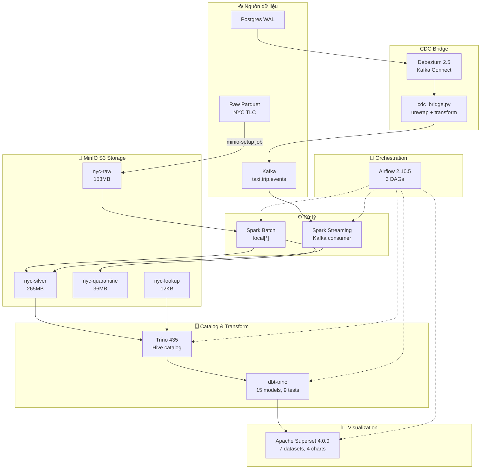
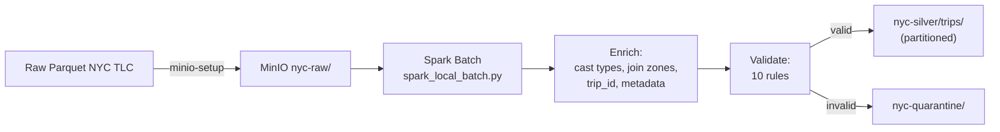
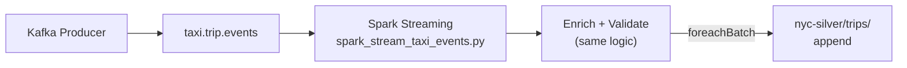
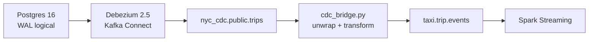

# 1. Tổng Quan Kiến Trúc NYC Taxi Data Pipeline

## 1.1 Giới thiệu dự án

Dự án **NYC Taxi Data Pipeline** là một hệ thống xử lý dữ liệu *batch* và *streaming* end-to-end, 
xây dựng trên dữ liệu chuyến đi taxi thực tế từ **NYC TLC (Taxi & Limousine Commission)**. 
Hệ thống xử lý khoảng **10.2 triệu chuyến đi hợp lệ** và **1.07 triệu bản ghi lỗi**, 
với kiến trúc hiện đại sử dụng **Spark**, **Kafka**, **MinIO S3**, **Trino**, **dbt**, **Apache Superset** 
và được điều phối bởi **Apache Airflow**.

### Mục tiêu

- **Xử lý tin cậy**: Dữ liệu thô (raw Parquet) được enrich, validate và chia thành luồng valid/quarantine
- **Batch + Streaming**: Hai chế độ xử lý bổ trợ lẫn nhau — backfill lịch sử + streaming real-time
- **Data Pipeline hiện đại**: Lakehouse architecture với S3 làm storage layer
- **Phân tích kinh doanh**: 15 dbt models, 4 charts, dashboard Superset, 10 câu hỏi analytics
- **CDC (Change Data Capture)**: Hỗ trợ ingest từ Postgres qua Debezium như một nguồn sự kiện thay thế

### Chế độ triển khai chính

> 🚀 **Skaffold** là công cụ triển khai **chính thức** và **ưu tiên**.
> `skaffold dev --namespace nyc-taxi` — một lệnh duy nhất cho toàn bộ pipeline.
> Docker Compose (Makefile) chỉ dùng cho debug/test local nhanh.

---

## 1.2 Kiến trúc tổng thể

### Sơ đồ luồng dữ liệu (Kubernetes — Skaffold)



### Luồng xử lý chi tiết

#### 1. Batch Path (Backfill lịch sử)



#### 2. Streaming Path (Real-time)



#### 3. CDC Path (Change Data Capture)



---

## 1.3 Công nghệ sử dụng

| Layer | Công nghệ | Phiên bản | Vai trò |
|-------|-----------|-----------|---------|
| **Storage** | MinIO S3 | latest | Lưu trữ object: raw, silver, quarantine, lookup |
| **Processing (batch)** | Apache Spark | 3.5.1 | Enrich + Validate + Write Parquet |
| **Processing (stream)** | Apache Spark + Kafka | 3.5.1 | Streaming consume + micro-batch |
| **Messaging** | Apache Kafka + ZK | 7.6.1 | Event bus cho streaming path |
| **SQL Catalog** | Trino (Hive connector) | 435 | SQL engine đọc Parquet từ S3 |
| **Transformations** | dbt-trino | ≥1.7, <2.0 | 15 models (staging → marts → gold) |
| **Visualization** | Apache Superset | 4.0.0 | Dashboard + charts |
| **Orchestration** | Apache Airflow | 2.10.5 | 3 DAGs, KubernetesPodOperator |
| **CDC** | Debezium + Postgres | 2.5 / 16 | WAL-based CDC |
| **Container** | Docker / kind | - | Container hóa toàn bộ |
| **Deploy** ⭐ | **Skaffold + Helm** | **v4beta3** | **Build + Deploy + Sync + Port-forward (primary)** |

### Kết nối giữa các dịch vụ (Kubernetes)

```
Spark → MinIO:    s3a:// (S3A Hadoop connector) với endpoint http://svc-minio:9000
Trino → MinIO:    s3://   (Hive S3 connector) với endpoint http://svc-minio:9000
Spark → Kafka:    svc-kafka:9092 (⚠️ prefix 'svc-' bắt buộc trong K8s)
Trino ← dbt:      svc-trino:8080 (Trino JDBC)
Superset → Trino: trino://analytics@svc-trino:8080/hive/mart (SQLAlchemy)
Airflow → Spark:  KubernetesPodOperator (pod tạm với image apache/spark:3.5.1)
```

---

## 1.4 Cấu trúc thư mục

```
nyc_new/
├── airflow/dags/           # 3 Airflow DAGs (orchestration)
│   ├── nyc_e2e_pipeline.py
│   ├── nyc_cdc_pipeline.py
│   └── nyc_analytics_refresh.py
├── charts/nyc-taxi/        # Helm chart cho K8s deployment
│   ├── Chart.yaml
│   ├── values.yaml
│   └── templates/          # 30+ K8s manifest templates
├── config/pipeline.yml     # Pipeline configuration
├── data/                   # Data lake (gitignored)
│   ├── raw/                # Raw Parquet files
│   ├── silver/             # Enriched valid trips
│   ├── quarantine/         # Invalid trips
│   ├── lookup/             # Zone lookup CSV
│   └── checkpoints/        # Streaming checkpoints
├── dbt/                    # dbt-trino transformations
│   ├── dbt_project.yml
│   ├── profiles.yml
│   ├── models/             # 15 SQL models
│   │   ├── staging/        # 3 models (stg_trips, stg_zones, stg_invalid_trips)
│   │   ├── marts/          # 8 models (fact_trips, dim_zone, ...)
│   │   └── gold/           # 4 models (gold_fact_trips, ...)
│   └── tests/              # 4 test files (9 tests)
├── docker/                 # Dockerfiles + entrypoint scripts
│   ├── tools.Dockerfile    # Base Python 3.11 image
│   ├── dbt.Dockerfile      # dbt-trino image
│   ├── airflow.Dockerfile  # Airflow 2.10.5 image
│   ├── *.sh                # Entrypoint scripts (trino-bootstrap, dbt, CDC...)
│   ├── superset/           # Superset config + bootstrap
│   └── trino/              # Trino config (catalog, properties)
├── docker-compose.yml      # 16+ services, 6 profiles
├── jobs/                   # Spark processing jobs
│   ├── spark_local_batch.py       # Batch processor (main)
│   ├── spark_stream_taxi_events.py # Kafka streaming processor
│   ├── spark_batch_backfill.py     # Legacy placeholder
│   ├── spark_quality_report.py     # Quality report (PyArrow)
│   └── kafka_stream_processor.py   # Python-only stream processor (alternative)
├── k8s/                    # Legacy K8s manifests (raw YAML)
├── scripts/                # Utility scripts
│   ├── trino_register.py   # Register Hive tables
│   ├── cdc_bridge.py       # CDC → standard format bridge
│   ├── cdc_seed.py         # Seed Postgres from Parquet
│   ├── cdc_register_connector.py  # Register Debezium connector
│   ├── superset_bootstrap.py      # Idempotent Superset setup
│   ├── run_analytics_questions.py # 10 analytics queries
│   ├── verify_mart.py      # Row count verification
│   ├── export_gold_to_minio.py    # Export gold datasets
│   └── k8s_ui.sh           # Port-forward manager
├── sql/                    # SQL queries
│   ├── analytics_questions.sql  # 10 business questions
│   └── smoke_tests.sql         # Simple smoke tests
├── terraform/              # Terraform for MinIO buckets
├── skaffold.yaml           # Skaffold config (K8s deploy)
├── Makefile                # 40+ targets (Docker Compose mode)
├── kind.yaml               # kind cluster config (3 nodes)
└── AGENTS.md               # Full project guidelines
```

---

## 1.5 Validation Rules (Spark Batch & Streaming)

Pipeline áp dụng 10 luật validation đồng nhất trên cả batch và streaming:

| # | Rule | Error Message | Điều kiện lỗi |
|---|------|---------------|----------------|
| 1 | Event ID null | `event_id_null` | `event_id` is null (streaming only) |
| 2 | Pickup datetime | `pickup_datetime_null_or_invalid` | `pickup_ts` is null |
| 3 | Dropoff datetime | `dropoff_datetime_null_or_invalid` | `dropoff_ts` is null |
| 4 | Trip duration | `invalid_trip_duration` | `dropoff_ts <= pickup_ts` |
| 5 | Trip distance | `trip_distance_must_be_gt_0` | `trip_distance <= 0` |
| 6 | Fare amount | `fare_amount_must_be_gte_0` | `fare_amount < 0` |
| 7 | Total vs Fare | `total_amount_must_be_gte_fare_amount` | `total_amount < fare_amount` |
| 8 | Passenger count | `passenger_count_out_of_range` | `passenger_count < 1 or > 6` |
| 9 | Payment type | `payment_type_out_of_range` | `payment_type < 1 or > 6` |
| 10 | Pickup/Dropoff zone | `pickup/dropoff_location_not_found` | Zone ID không có trong lookup |

Dữ liệu hợp lệ → `nyc-silver/trips/pickup_year=*/pickup_month=*/`
Dữ liệu không hợp lệ → `nyc-quarantine/invalid_trips/` (kèm danh sách lỗi)

---

## 1.6 Chế độ triển khai

> ⚠️ **Skaffold (Kubernetes/kind) là chế độ triển khai chính.**
> Docker Compose (Makefile) chỉ là phương án dự phòng cho debug local nhanh.

| Chế độ | Công cụ | Cluster | Mục đích |
|--------|---------|---------|----------|
| 🚀 **Kubernetes (kind)** ⭐ | **Skaffold + Helm** | 3 nodes (kind) | **Primary** — build, auto-sync, port-forward, orchestration |
| 🐳 Docker Compose | Make + Docker Compose | Docker host | Legacy — debug/test nhanh |

### Tại sao Skaffold là chính?

| Tính năng | Skaffold (K8s) | Docker Compose (Makefile) |
|-----------|----------------|---------------------------|
| **Orchestration** | ✅ Airflow 3 DAGs tự động | ❌ Make targets thủ công |
| **Auto-rebuild** | ✅ Dockerfile changes → rebuild | ❌ Build lại thủ công |
| **File sync** | ✅ Watch + auto-sync → PVC | ✅ Bind mount trực tiếp |
| **Port-forward** | ✅ Tự động 39080-39087 | ❌ Published ports cố định |
| **Hot-reload** | ✅ Skaffold sync → file-sync pod | ✅ Bind mount |
| **Production-like** | ✅ K8s native | ❌ Docker host đơn |
| **Tính năng** | ✅ Airflow, CDC, gold export | ✅ Cơ bản |
| **Resources** | 3 node cluster, ~12GB RAM | Single host, ~8GB RAM |

---

## 1.7 Dữ liệu tham chiếu

### Zone Lookup (taxi_zone_lookup.csv)
- 265 zones (261 distinct sau join)
- Các trường: `LocationID`, `Borough`, `Zone`, `service_zone`
- 7 Boroughs: Manhattan, Brooklyn, Queens, Bronx, Staten Island, EWR, Unknown

### Payment Types
| code | Description |
|------|-------------|
| 1 | Credit card |
| 2 | Cash |
| 3 | No charge |
| 4 | Dispute |
| 5 | Unknown |
| 6 | Voided trip |

### Vendor IDs
| ID | Name |
|----|------|
| 1 | Creative Mobile |
| 2 | VeriFone |

### Rate Codes
| ID | Description |
|----|-------------|
| 1 | Standard |
| 2 | JFK |
| 3 | Newark |
| 4 | Nassau/Westchester |
| 5 | Negotiated |
| 6 | Group ride |

---

## 1.8 Kết quả xử lý (Kubernetes — Skaffold mode)

| Metric | Giá trị | Ghi chú |
|--------|---------|---------|
| Valid trips | **10,188,983** | Dữ liệu 2002-2024 |
| Invalid trips | **1,074,370** | ~11.24% invalid rate |
| Zone lookup | **265** | Taxi zones |
| dbt tests | **24/24 PASS** | 15 models + 9 tests |
| Analytics | **10/10 PASS** | 10 business SQL queries |
| CDC bridge throughput | **~445 ev/s** | Async mode |
| Spark runtime (3 months) | **~9 min** | local[*] mode |
| Pipeline UIs | **8 services** | 39080-39087 port-forwards |
