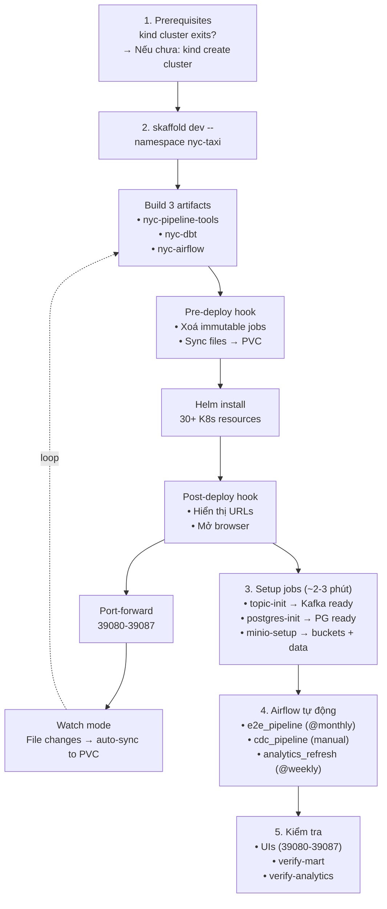

# 2. Hướng Dẫn Triển Khai

> 🚀 **Skaffold + Kubernetes (kind) là chế độ triển khai chính.**
> Docker Compose (Makefile) chỉ dùng cho debug/test local nhanh.

---

## 2.1 Yêu cầu hệ thống

### Kubernetes (kind) Mode ⭐ (Primary)

| Requirement | Version / Chi tiết |
|-------------|-------------------|
| **Docker** | Engine ≥ 24.0 |
| **kind** | ≥ 0.20 (Kubernetes in Docker) |
| **kubectl** | ≥ 1.28 |
| **Skaffold** | ≥ 2.10 (Skaffold v2) |
| **Helm** | ≥ 3.0 |
| **Make** | GNU Make ≥ 4.0 |
| **Disk** | ~10GB (images + data + cluster) |
| **RAM** | ~12GB (3 node cluster) |
| **Python** | 3.11+ (optional, cho scripts verify local) |

### Docker Compose Mode (Secondary)
| Requirement | Chi tiết |
|-------------|----------|
| Docker Engine ≥ 24.0 + Docker Compose | ~5GB disk, ~8GB RAM |

### Port Requirements

| Port | Service | Ghi chú |
|------|---------|---------|
| **39080-39087** | Tất cả services | **Kubernetes** (Skaffold port-forward) |
| 38080-38088, 39000 | kind NodePort | Cluster internal (không cần dùng trực tiếp) |
| 8088, 9000-9001, 8083, 8085, 8080-8084 | Docker Compose | Published ports |

---

## 2.2 Triển khai với Skaffold (Kubernetes/kind) ⭐

### 2.2.1 Luồng triển khai tổng quan



### 2.2.2 Prerequisites — Tạo kind cluster

```bash
# Tạo cluster nếu chưa có (3 nodes: 1 control-plane + 2 workers)
kind create cluster --config kind.yaml

# Kiểm tra
kubectl cluster-info
kubectl get nodes

# Output:
# NAME                 STATUS   ROLES           AGE
# kind-control-plane   Ready    control-plane   2m
# kind-worker          Ready    <none>          1m
# kind-worker2         Ready    <none>          1m
```

**Cluster config (`kind.yaml`):**

| Node | Role | extraPortMappings | extraMounts |
|------|------|-------------------|-------------|
| control-plane | kube-apiserver, etcd, scheduler | 38080→30080, 38081→30081, 38082→30082, 38088→30088, 39000→39000 | - |
| kind-worker | Worker (nodeSelector target) | - | `/mnt/nyc-project`, `/mnt/nyc-data` |
| kind-worker2 | Worker (spare) | - | `/mnt/nyc-project`, `/mnt/nyc-data` |

### 2.2.3 Deploy toàn bộ pipeline

```bash
# ⭐ LỆNH CHÍNH — một lệnh duy nhất cho mọi thứ
skaffold dev --namespace nyc-taxi

# Nếu không cần watch mode (deploy một lần)
skaffold run --namespace nyc-taxi

# Build images only (không deploy)
skaffold build --namespace nyc-taxi

# Xoá tài nguyên đã deploy
skaffold delete --namespace nyc-taxi
```

### 2.2.4 Đợi jobs hoàn thành

Sau khi `skaffold dev` chạy, đợi các setup jobs:

```bash
# Kiểm tra tất cả pods
kubectl get pods -n nyc-taxi -w

# Đợi topic-init (tạo Kafka topics)
kubectl wait --for=condition=complete job -n nyc-taxi topic-init --timeout=120s

# Đợi postgres-init (tạo trips table)
kubectl wait --for=condition=complete job -n nyc-taxi postgres-init --timeout=120s

# Đợi minio-setup (upload raw data)
kubectl wait --for=condition=complete job -n nyc-taxi minio-setup --timeout=180s

# Kiểm tra tất cả
kubectl get pods -n nyc-taxi
# Kỳ vọng: tất cả Running hoặc Completed
```

### 2.2.5 UIs & Port-Forwards

Skaffold tự động port-forward từ services → localhost:39080-39087.

| Service | URL | Port | Credentials |
|---------|-----|------|-------------|
| **Apache Superset** | http://localhost:39080 | 39080 | `admin` / `admin` |
| MinIO S3 API | http://localhost:39081 | 39081 | `minio` / `minio123` |
| **Kafka UI** | http://localhost:39082 | 39082 | — |
| Spark Master | http://localhost:39083 | 39083 | — |
| Trino | http://localhost:39084 | 39084 | — |
| **Airflow** | http://localhost:39085 | 39085 | `admin` / `admin` |
| MinIO Console | http://localhost:39086 | 39086 | `minio` / `minio123` |
| Postgres CDC | `localhost:39087` | 39087 | `postgres` / `postgres` |

Nếu không dùng skaffold, chạy port-forward thủ công:
```bash
make k8s-ui
# hoặc
./scripts/k8s_ui.sh start
```

### 2.2.6 Kích hoạt Airflow DAGs

Pipeline tự động chạy theo lịch. Để trigger thủ công:

```bash
# 1. Qua Airflow Web UI
#    http://localhost:39085 → admin/admin → unpause DAG → Trigger

# 2. Qua CLI
# nyc_e2e_pipeline (Spark → Trino → dbt → Superset → analytics)
kubectl exec -n nyc-taxi deploy/airflow-scheduler -- \
  airflow dags trigger nyc_e2e_pipeline

# nyc_cdc_pipeline (Seed Postgres → Debezium → Bridge)
kubectl exec -n nyc-taxi deploy/airflow-scheduler -- \
  airflow dags trigger nyc_cdc_pipeline

# nyc_analytics_refresh (dbt → Superset → analytics check)
kubectl exec -n nyc-taxi deploy/airflow-scheduler -- \
  airflow dags trigger nyc_analytics_refresh
```

### 2.2.7 Verify pipeline

```bash
# Row counts qua Trino (dim_zone, fact_trips, mart_hourly, mart_revenue)
make k8s-verify

# 10 analytics SQL queries (kỳ vọng PASS 10/10)
make k8s-verify-analytics

# CDC pipeline check
make k8s-verify-cdc

# Pod status
make k8s-status

# Logs của job cụ thể
make k8s-logs JOB=spark-batch

# Xem trực tiếp logs pod
kubectl logs -n nyc-taxi job/spark-batch --follow
```

### 2.2.8 Xem logs & debug

```bash
# Tất cả pods
kubectl get pods -n nyc-taxi

# Logs của pod
kubectl logs -n nyc-taxi -l app=trino --tail=50
kubectl logs -n nyc-taxi -l app=superset --tail=50
kubectl logs -n nyc-taxi -l app=airflow-webserver --tail=50

# Logs của job (sau khi hoàn thành)
kubectl logs -n nyc-taxi job/minio-setup
kubectl logs -n nyc-taxi job/postgres-init
kubectl logs -n nyc-taxi job/topic-init

# Describe pod để xem lỗi
kubectl describe pod -n nyc-taxi -l app=kafka
```

### 2.2.9 Cleanup & Destroy

```bash
# Skaffold dev: nhấn Ctrl+C để dừng (giữ cluster + data)

# Scale down services (giữ dữ liệu)
make k8s-stop

# Clean MinIO data (xóa silver/quarantine)
make k8s-clean

# Destroy cluster (🔥 mất HẾT dữ liệu)
kind delete cluster --name kind
# hoặc
make k8s-destroy
```

---

## 2.3 Cấu hình chi tiết Skaffold

### 2.3.1 Build artifacts

```yaml
# skaffold.yaml
build:
  local:
    push: false  # Không push lên registry — dùng local kind cluster
  artifacts:
    - image: nyc-pipeline-tools    # tools.Dockerfile
      sync:
        manual:
          - src: "airflow/dags/**/*.py" → dest: /opt/project/airflow/dags/
          - src: "jobs/**/*"            → dest: /opt/project/jobs/
          - src: "scripts/**/*"         → dest: /opt/project/scripts/
          - src: "dbt/**/*"             → dest: /opt/project/dbt/
          - src: "charts/**/*"          → dest: /opt/project/charts/
    - image: nyc-dbt                   # dbt.Dockerfile
    - image: nyc-airflow               # airflow.Dockerfile
```

### 2.3.2 Deploy hooks

**Pre-deploy hook** (chạy trước Helm install):
```bash
# 1. Xoá immutable jobs (Jobs không thể update)
kubectl delete job -n nyc-taxi --all --ignore-not-found

# 2. Sync project files → kind-worker PVC
tar cf - airflow/dags/ jobs/ scripts/ dbt/ charts/ \
  | docker exec -i kind-worker tar xf - -C /mnt/nyc-project
```

**Post-deploy hook** (chạy sau Helm install):
```bash
# Hiển thị URLs
echo "Superset  http://localhost:39080  admin/admin"
echo "Airflow   http://localhost:39085  admin/admin"
# Mở browser tabs
xdg-open http://localhost:39085 2>/dev/null || true
```

### 2.3.3 Sync rules (hot-reload)

Khi file thay đổi trong quá trình `skaffold dev`:
```
Local file change
    → Skaffold detects change
    → Push file to file-sync pod (trong K8s)
    → file-sync pod ghi vào PVC tại /opt/project/
    → Tất cả pods mount PVC thấy file mới ngay lập tức
```

### 2.3.4 Port-forward config

```yaml
portForward:
  - resourceType: service
    resourceName: svc-superset
    port: 8088
    localPort: 39080
  - resourceType: service
    resourceName: svc-minio
    port: 9000
    localPort: 39081
  # ... 8 services total: 39080-39087
```

---

## 2.4 CDC Pipeline (qua Skaffold)

### 2.4.1 Kiến trúc CDC

```
Postgres 16 (WAL logical replication)
    → Debezium 2.5 connector (Kafka Connect)
    → Raw topic: nyc_cdc.public.trips
    → cdc_bridge.py (unwrap + transform) ← Airflow DAG Task
    → Standard topic: taxi.trip.events
    → Spark Streaming (cùng logic batch) ← Airflow DAG Task
```

### 2.4.2 Kích hoạt CDC

CDC pipeline chạy qua Airflow DAG `nyc_cdc_pipeline` (3 tasks):

```bash
# Trigger DAG
kubectl exec -n nyc-taxi deploy/airflow-scheduler -- \
  airflow dags trigger nyc_cdc_pipeline
```

**3 tasks trong DAG:**
1. `cdc_seed` — Đọc 5000 rows từ Parquet, insert vào Postgres
2. `cdc_register` — Đăng ký Debezium connector
3. `cdc_bridge` — Bridge CDC events → taxi.trip.events (async, ~445 ev/s)

### 2.4.3 Verify CDC

```bash
make k8s-verify-cdc
# hoặc từng bước:
kubectl exec -n nyc-taxi statefulset/postgres-cdc -- \
  psql -U postgres -d nyc_taxi -c "SELECT count(*) FROM trips;"
```

---

## 2.5 Khắc phục sự cố thường gặp (Skaffold/K8s)

| Vấn đề | Nguyên nhân | Giải pháp |
|--------|-------------|-----------|
| **Namespace stuck "Terminating"** | Finalizers không được gỡ | `kubectl replace --raw /api/v1/namespaces/nyc-taxi/finalize -f ...` |
| **Spark S3A fails** | Thiếu `--packages` trên CLI | Dùng `--packages` trên spark-submit, không dùng `spark.jars.packages` |
| **Spark Ivy cache lỗi** | Permissions | `chmod -R 777 /opt/project/.ivy2/` |
| **MinIO commit lỗi** | S3 không support atomic rename | Set `--conf spark.hadoop.mapreduce.fileoutputcommitter.algorithm.version=2` |
| **dbt build fails** | Dùng `materialized='table'` | Tất cả models phải là `materialized='view'` |
| **Kafka connection fails** | Sai service name | Dùng `svc-kafka:9092` (⚠️ không phải `kafka:9092`) |
| **Trino không thấy partitions** | Metadata chưa sync | `CALL hive.system.sync_partition_metadata(...)` |
| **File-sync không hoạt động** | Skaffold không chạy | Run `skaffold dev` hoặc sync thủ công |
| **Airflow pod lỗi** | Thiếu service account | Kiểm tra `airflow-sa` + Role + RoleBinding |

### PVC Sync thủ công (khi không dùng skaffold)

```bash
cd /home/dwcks/vsf_gsm/nyc_new
tar cf - \
  --exclude='dbt/logs' --exclude='dbt/target' --exclude='.git' \
  --exclude='__pycache__' --exclude='*.pyc' --exclude='*.pyo' \
  airflow/dags/ jobs/ scripts/ dbt/ charts/ \
  | docker exec -i kind-worker tar xf - -C /mnt/nyc-project
```

---

## 2.6 Docker Compose Mode (Legacy — Debug/Test nhanh)

> ⚠️ Chỉ dùng Docker Compose khi cần debug nhanh trên máy local.
> Mọi triển khai chính thức đều dùng Skaffold.

### 2.6.1 Quick Start

```bash
# 1. Khởi động core services
make infra-up

# 2. Chuẩn bị dữ liệu
make kafka-topics
make minio-setup

# 3. Chạy Spark batch
make spark-batch

# 4. Trino + dbt
make trino-bootstrap
make dbt-build

# 5. Superset
make superset-bootstrap

# 6. Kiểm tra
make verify-mart
make verify-analytics
```

### 2.6.2 Makefile Targets

| Target | Mô tả |
|--------|-------|
| `infra-up` | Start core (ZK, Kafka, MinIO, Spark) |
| `infra-up-all` | Start tất cả (Trino, dbt, Superset, Airflow) |
| `spark-batch` | Batch backfill (MONTH=03) |
| `trino-bootstrap` | Register Hive tables |
| `dbt-build` | dbt models + tests |
| `superset-bootstrap` | Register datasets, charts, dashboard |
| `verify-all` | Full pipeline verification |

---

## 2.7 So sánh Deployment: Skaffold vs Docker Compose

| Khía cạnh | 🚀 Skaffold (K8s) ⭐ | 🐳 Docker Compose |
|-----------|----------------------|-------------------|
| **Lệnh deploy** | `skaffold dev` | `make infra-up-all` |
| **Build** | Tự động (Skaffold artifacts) | Thủ công (docker compose build) |
| **File sync** | Auto sync → PVC (hot-reload) | Bind mount trực tiếp |
| **Orchestration** | Airflow 3 DAGs (tự động) | Make targets (thủ công) |
| **Port-forward** | Tự động 39080-39087 | Published ports (8088, 9000...) |
| **Production-like** | ✅ K8s native | ❌ Docker host đơn |
| **Tính năng** | ✅ Airflow, CDC, gold export | ✅ Cơ bản |
| **RAM** | ~12GB (3 nodes) | ~8GB (single host) |
| **Disk** | ~10GB | ~5GB |
| **Thời gian setup** | ~15 phút (lần đầu build) | ~5 phút |
| **Debug** | kubectl logs | docker compose logs |
