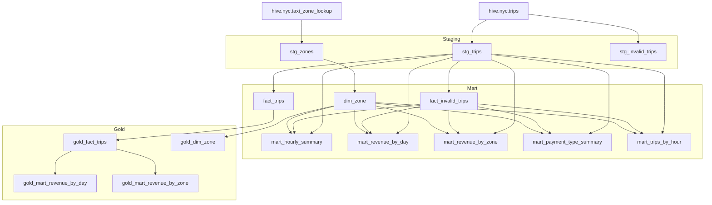

# 4. dbt Models và Data Transformation

## 4.1 Tổng quan

dbt-trino là tầng biến đổi dữ liệu, chuyển đổi dữ liệu silver (Parquet trên MinIO) 
thành các view phân tích có cấu trúc. Pipeline có **15 models**, **9 tests**, 
kỳ vọng **24/24 PASS**.

### Cấu trúc layers

```mermaid
flowchart RL
    subgraph GOLD["🥇 Gold Layer (4 models)"]
        G1["gold_fact_trips"]
        G2["gold_dim_zone"]
        G3["gold_mart_revenue_by_day"]
        G4["gold_mart_revenue_by_zone"]
    end
    subgraph MART["📊 Mart Layer (8 models)"]
        M1["fact_trips"]
        M2["fact_invalid_trips"]
        M3["dim_zone"]
        M4["mart_hourly_summary"]
        M5["mart_revenue_by_day"]
        M6["mart_revenue_by_zone"]
        M7["mart_payment_type_summary"]
        M8["mart_trips_by_hour"]
    end
    subgraph STAGING["📋 Staging Layer (3 models)"]
        S1["stg_trips"]
        S2["stg_zones"]
        S3["stg_invalid_trips"]
    end
    subgraph TRINO_HIVE["🗄️ Trino Hive External Tables"]
        H1["hive.nyc.trips"]
        H2["hive.nyc.invalid_trips"]
        H3["hive.nyc.taxi_zone_lookup"]
    end
    subgraph MINIO_S3["💾 MinIO S3 Silver Data"]
        MIO1["s3://nyc-silver/trips/"]
        MIO2["s3://nyc-quarantine/"]
        MIO3["s3://nyc-lookup/taxi_zone_lookup.csv"]
    end

    MINIO_S3 --> TRINO_HIVE --> STAGING --> MART --> GOLD
```



### Configuration

**File**: `dbt/dbt_project.yml`
```yaml
name: nyc_taxi
version: "1.0.0"
profile: nyc_taxi
config-version: 2
model-paths: ["models"]
test-paths: ["tests"]

models:
  nyc_taxi:
    staging:
      +materialized: view
    marts:
      +materialized: view
    gold:
      +materialized: view
```

> ⚠️ **Tất cả models là `view`** — Hive file-based HMS (Hive Metastore) 
> không hỗ trợ `RENAME TABLE` mà dbt cần cho table swaps.

**File**: `dbt/profiles.yml`
```yaml
nyc_taxi:
  target: dev
  outputs:
    dev:
      type: trino
      host: "{{ env_var('TRINO_HOST', 'svc-trino') }}"
      port: "{{ env_var('TRINO_PORT', '8080') | int }}"
      user: dbt
      database: hive
      schema: mart
      threads: 4
```

---

## 4.2 Staging Layer (3 models)

Làm sạch và cast kiểu dữ liệu từ Hive external tables.

### stg_trips

**File**: `dbt/models/staging/stg_trips.sql`

```sql
{{ config(materialized='view') }}

with src as (
  select
    cast(trip_id as bigint)            as trip_id,
    cast(source_file as varchar)       as source_file,
    cast(vendor_id as integer)         as vendor_id,
    cast(pickup_ts as timestamp)       as pickup_ts,
    cast(dropoff_ts as timestamp)      as dropoff_ts,
    cast(passenger_count as integer)   as passenger_count,
    cast(trip_distance as double)      as trip_distance,
    -- ... các trường khác
    cast(pickup_year as integer)       as pickup_year,
    cast(pickup_month as integer)      as pickup_month
  from hive.nyc.trips  -- External table từ Trino Hive catalog
)
select * from src
```

**Vai trò**: Cast tất cả columns từ Parquet types → SQL types qua Hive.
**Nguồn**: `hive.nyc.trips` (external table pointing to `s3://nyc-silver/trips/`)

### stg_zones

**File**: `dbt/models/staging/stg_zones.sql`

```sql
select
  cast(location_id as integer) as location_id,
  borough,
  zone,
  service_zone
from hive.nyc.taxi_zone_lookup
```

**Nguồn**: `hive.nyc.taxi_zone_lookup` (CSV external table)

### stg_invalid_trips

**File**: `dbt/models/staging/stg_invalid_trips.sql`

```sql
with src as (
  select
    cast(vendor_id as integer)      as vendor_id,
    cast(pickup_ts as timestamp)    as pickup_ts,
    cast(dropoff_ts as timestamp)   as dropoff_ts,
    cast(fare_amount as double)     as fare_amount,
    cast(total_amount as double)    as total_amount,
    validation_errors,                        -- ARRAY<VARCHAR>
    cast(quarantine_ts as timestamp) as quarantine_ts,
    cast(pickup_year as integer)    as pickup_year,
    cast(pickup_month as integer)   as pickup_month
  from hive.nyc.invalid_trips
)
select * from src
```

---

## 4.3 Mart Layer (8 models)

Các models phân tích với derived fields và aggregations.

### fact_trips

**File**: `dbt/models/marts/fact_trips.sql`

Model chính — fact table với mọi chuyến đi hợp lệ.

```sql
select
  pickup_ts,
  dropoff_ts,
  date_trunc('hour', pickup_ts)         as pickup_hour_ts,
  date(pickup_ts)                       as pickup_date,
  hour(pickup_ts)                       as pickup_hour,
  day_of_week(pickup_ts)                as pickup_dow,
  vendor_id,
  passenger_count,
  trip_distance,
  rate_code_id,
  payment_type,
  fare_amount, extra, mta_tax, tip_amount,
  tolls_amount, improvement_surcharge, total_amount,
  -- Derived fields
  case when total_amount > 0 
    then tip_amount / total_amount end  as tip_rate,
  date_diff('second', pickup_ts, dropoff_ts) as trip_duration_sec,
  -- Zone info
  pickup_location_id, dropoff_location_id,
  pickup_zone, dropoff_zone,
  pickup_borough, dropoff_borough,
  pickup_service_zone, dropoff_service_zone,
  pickup_year, pickup_month
from {{ ref('stg_trips') }}
```

**Derived fields:**
- `tip_rate`: tip_amount / total_amount
- `trip_duration_sec`: date_diff second giữa dropoff và pickup
- `pickup_hour_ts`: Trunc ngày xuống hour
- `pickup_dow`: Day of week (1=Sunday...7=Saturday)

### dim_zone

**File**: `dbt/models/marts/dim_zone.sql`

Dimension zone — union tất cả zones từ pickup và dropoff.

```sql
with zones as (
  select pickup_zone as zone, pickup_borough as borough, 
         pickup_service_zone as service_zone 
  from {{ ref('stg_trips') }}
  union
  select dropoff_zone, dropoff_borough, dropoff_service_zone
  from {{ ref('stg_trips') }}
)
select
  row_number() over (order by zone) as zone_sk,
  zone,
  any_value(borough)       as borough,
  any_value(service_zone)  as service_zone
from zones
where zone is not null
group by zone
```

### fact_invalid_trips

**File**: `dbt/models/marts/fact_invalid_trips.sql`

Invalid trips fact — explode ARRAY validation_errors thành từng error reason.

```sql
select
  quarantine_ts,
  cast(pickup_year as integer)   as pickup_year,
  cast(pickup_month as integer)  as pickup_month,
  err as validation_error,
  count(*) as error_count
from {{ ref('stg_invalid_trips') }}
cross join unnest(validation_errors) as t(err)
group by 1, 2, 3, 4
```

### mart_hourly_summary

**File**: `dbt/models/marts/mart_hourly_summary.sql`

```sql
select
  pickup_date,
  pickup_hour,
  pickup_borough,
  count(*)          as trip_count,
  avg(fare_amount)  as avg_fare,
  avg(total_amount) as avg_total,
  avg(trip_distance) as avg_distance,
  sum(total_amount) as gross_revenue
from {{ ref('fact_trips') }}
group by 1, 2, 3
```

### mart_revenue_by_day

**File**: `dbt/models/marts/mart_revenue_by_day.sql`

```sql
select
  pickup_date,
  count(*)           as trip_count,
  sum(fare_amount)   as total_fare,
  sum(extra)         as total_extra,
  sum(mta_tax)       as total_mta_tax,
  sum(tip_amount)    as total_tip,
  sum(tolls_amount)  as total_tolls,
  sum(improvement_surcharge) as total_improvement_surcharge,
  sum(total_amount)  as gross_revenue,
  avg(fare_amount)   as avg_fare,
  avg(total_amount)  as avg_total,
  avg(tip_amount)    as avg_tip,
  avg(trip_distance) as avg_distance
from {{ ref('fact_trips') }}
group by 1
order by 1
```

### mart_revenue_by_zone

**File**: `dbt/models/marts/mart_revenue_by_zone.sql`

```sql
select
  pickup_borough, pickup_zone,
  dropoff_borough, dropoff_zone,
  count(*)          as trip_count,
  sum(total_amount) as gross_revenue,
  avg(total_amount) as avg_revenue_per_trip,
  sum(fare_amount)  as total_fare,
  sum(tip_amount)   as total_tip,
  avg(trip_distance) as avg_distance
from {{ ref('fact_trips') }}
group by 1, 2, 3, 4
order by gross_revenue desc
```

### mart_payment_type_summary

**File**: `dbt/models/marts/mart_payment_type_summary.sql`

```sql
select
  payment_type,
  case payment_type
    when 1 then 'Credit card'
    when 2 then 'Cash'
    when 3 then 'No charge'
    when 4 then 'Dispute'
    when 5 then 'Unknown'
    when 6 then 'Voided'
    else 'Other'
  end as payment_type_name,
  count(*)           as trip_count,
  sum(total_amount)  as gross_revenue,
  avg(total_amount)  as avg_revenue_per_trip,
  sum(tip_amount)    as total_tip,
  avg(tip_amount)    as avg_tip,
  sum(fare_amount)   as total_fare,
  avg(trip_distance) as avg_distance
from {{ ref('fact_trips') }}
group by 1
order by gross_revenue desc
```

### mart_trips_by_hour

**File**: `dbt/models/marts/mart_trips_by_hour.sql`

```sql
select
  pickup_hour,
  pickup_dow,
  count(*)              as trip_count,
  sum(total_amount)     as gross_revenue,
  avg(total_amount)     as avg_revenue_per_trip,
  avg(trip_distance)    as avg_distance,
  avg(trip_duration_sec) as avg_duration_sec
from {{ ref('fact_trips') }}
group by 1, 2
order by 1, 2
```

---

## 4.4 Gold Layer (4 models)

Gold layer là các view tương tự Mart layer nhưng clean hơn, 
dùng cho export và analytics cuối cùng. Các models:

| Model | Description |
|-------|-------------|
| `gold_fact_trips` | fact_trips + trip_id và source_file |
| `gold_dim_zone` | dim_zone với location_id |
| `gold_mart_revenue_by_day` | Giống mart_revenue_by_day nhưng ref gold_fact_trips |
| `gold_mart_revenue_by_zone` | Giống mart_revenue_by_zone nhưng ref gold_fact_trips |

Ví dụ **gold_fact_trips.sql**:
```sql
select
  trip_id,
  source_file,
  vendor_id,
  pickup_ts, dropoff_ts,
  -- ... tất cả columns như fact_trips + trip_id và source_file
  pickup_year, pickup_month
from {{ ref('stg_trips') }}
```

---

## 4.5 Tests (9 tests)

### YAML Generic Tests

**File**: `dbt/tests/stg_trips_tests.yml`
```yaml
version: 2
models:
  - name: stg_trips
    columns:
      - name: pickup_ts
        tests: [not_null]
      - name: dropoff_ts
        tests: [not_null]
      - name: trip_distance
        tests: [not_null]
      - name: total_amount
        tests: [not_null]
      - name: payment_type
        tests: [not_null]
```

**File**: `dbt/tests/fact_trips_tests.yml`
```yaml
version: 2
models:
  - name: fact_trips
    columns:
      - name: pickup_ts
        tests: [not_null]
      - name: total_amount
        tests: [not_null]
```

**File**: `dbt/tests/fact_invalid_trips_tests.yml` và `stg_trips_tests.yml`:
- not_null trên các key columns
- accepted_values cho payment_type (1-6)

### Singular SQL Test

**File**: `dbt/tests/payment_type_range.sql`
```sql
-- Đảm bảo payment_type trong khoảng 1-6
select payment_type, count(*) as cnt
from {{ ref('stg_trips') }}
where payment_type < 1 or payment_type > 6
group by payment_type
```

**Tổng hợp tests:**
- 5 `not_null` tests (stg_trips)
- 2 `not_null` tests (fact_trips)
- 1 `accepted_values` test (payment_type range)
- 1 singular test (payment_type_range.sql)

Kỳ vọng: **24/24 PASS** (15 models + 9 tests).

---

## 4.6 Dòng chảy dữ liệu qua dbt



---

## 4.7 Commands

### Kubernetes (Airflow DAG) ⭐

Airflow tự động chạy dbt build trong `nyc_e2e_pipeline` và `nyc_analytics_refresh`:

```python
KubernetesPodOperator(
    image="nyc-dbt:k8s",
    cmds=["entrypoint-dbt"],
    env_vars=[
        ("DBT_PROFILES_DIR", "/opt/project/dbt"),
        ("TRINO_HOST", "svc-trino"),
    ],
    volumes=[project_volume],
    volume_mounts=[project_volume_mount],
)
```

**entrypoint-dbt.sh sẽ:**
1. Wait Trino ready (TCP check svc-trino:8080)
2. Sync Hive partitions (trino_sync_partitions.py)
3. `cd /opt/project/dbt && dbt build`

### Docker Compose (Legacy)

```bash
make dbt-build    # Full: dbt build
make dbt-run      # Models only
make dbt-test     # Tests only
```

### Row counts kỳ vọng

| Table | Rows |
|-------|------|
| dim_zone | ~261 |
| fact_trips | ~8-10M |
| mart_hourly_summary | ~11K+ |
| mart_revenue_by_day | ~90-96 |
| mart_revenue_by_zone | ~25K |
| mart_payment_type_summary | 6 |
| mart_trips_by_hour | ~168 (24h × 7 days) |
