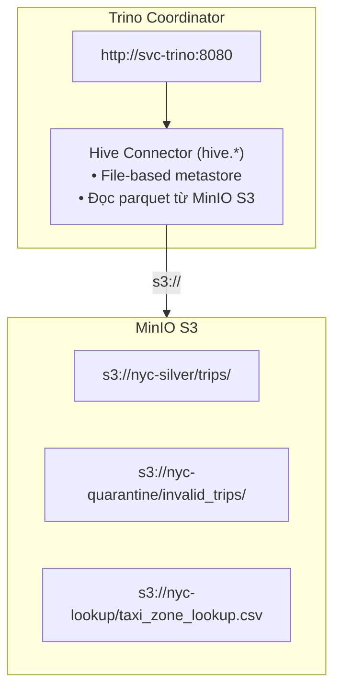

# 5. Trino Catalog và Hive Metadata

## 5.1 Tổng quan

**Trino 435** đóng vai trò SQL query engine, kết nối MinIO S3 qua Hive connector. 
Nó cung cấp khả năng truy vấn SQL trực tiếp trên dữ liệu Parquet mà không cần Spark.

### Kiến trúc



---

## 5.2 Cấu hình Trino

### Hive Catalog Properties

**File**: `docker/trino/etc/catalog/hive.properties`
```properties
connector.name=hive
hive.metastore=file
hive.metastore.catalog.dir=/data/trino-metastore
hive.allow-drop-table=true
hive.recursive-directories=true
hive.orc.use-column-names=true
hive.parquet.use-column-names=true
hive.s3.endpoint=http://minio:9000
hive.s3.aws-access-key=minio
hive.s3.aws-secret-key=minio123
hive.s3.path-style-access=true
hive.s3.ssl.enabled=false
hive.non-managed-table-creates-enabled=true
hive.non-managed-table-writes-enabled=true
```

**Cấu hình chính:**
| Property | Value | Ý nghĩa |
|----------|-------|---------|
| `hive.metastore` | `file` | File-based metastore (không cần Hive Metastore service riêng) |
| `hive.metastore.catalog.dir` | `/data/trino-metastore` | Thư mục lưu metadata |
| `hive.recursive-directories` | `true` | Đọc sub-directories |
| `hive.s3.*` | MinIO config | Kết nối S3-compatible storage |
| `hive.non-managed-table-creates-enabled` | `true` | Cho phép tạo external tables |
| `hive.non-managed-table-writes-enabled` | `true` | Cho phép ghi external tables (dùng cho gold export) |

### Config Properties

**File**: `docker/trino/etc/config.properties`
```properties
coordinator=true
node-scheduler.include-coordinator=true
http-server.http.port=8080
discovery.uri=http://localhost:8080
```

### JVM Config

**File**: `docker/trino/etc/jvm.config`
```
-server
-Xmx2G
```

---

## 5.3 Đăng ký Tables (Trino Bootstrap)

**Script**: `scripts/trino_register.py`

Quy trình đăng ký idempotent:
1. Chờ Trino coordinator ready (TCP connect, timeout 120s)
2. Tạo schema `hive.nyc` (CREATE SCHEMA IF NOT EXISTS)
3. Tạo hoặc thay thế (DROP + CREATE) các external tables

### Trips Table (Partitioned)
```sql
CREATE TABLE hive.nyc.trips (
  trip_id BIGINT,
  source_file VARCHAR,
  vendor_id INTEGER,
  pickup_ts TIMESTAMP,
  -- ... tất cả columns
  pickup_year INTEGER,
  pickup_month INTEGER
)
WITH (
  external_location = 's3://nyc-silver/trips',
  format = 'PARQUET',
  partitioned_by = ARRAY['pickup_year','pickup_month']
)
```

### Invalid Trips Table (Non-partitioned)
```sql
CREATE TABLE hive.nyc.invalid_trips (
  validation_errors ARRAY(VARCHAR),
  quarantine_ts TIMESTAMP,
  -- ... các trường giống trips
)
WITH (
  external_location = 's3://nyc-quarantine/invalid_trips',
  format = 'PARQUET'
)
```

### Taxi Zone Lookup (CSV External)
```sql
CREATE TABLE hive.nyc.taxi_zone_lookup (
  location_id VARCHAR,
  borough VARCHAR,
  zone VARCHAR,
  service_zone VARCHAR
)
WITH (
  external_location = 's3://nyc-lookup/',
  format = 'CSV',
  csv_separator = ',',
  csv_escape = '\\',
  csv_quote = '"',
  skip_header_line_count = 1
)
```

### Sync Partitions

Sau khi tạo tables, script sync partitions:
```sql
CALL hive.system.sync_partition_metadata(
  schema_name => 'nyc',
  table_name => 'trips',
  mode => 'FULL'
)
```

### Smoke Test

Cuối cùng, đếm số dòng:
```sql
SELECT COUNT(*) FROM hive.nyc.trips;
SELECT COUNT(*) FROM hive.nyc.invalid_trips;
SELECT COUNT(*) FROM hive.nyc.taxi_zone_lookup;
```

---

## 5.4 Gold Export Script

**Script**: `scripts/export_gold_to_minio.py`

Script này export datasets từ Trino sang MinIO S3 dưới dạng Parquet 
thông qua CTAS (CREATE TABLE AS SELECT).

### 5.4.1 Luồng xử lý

1. Kết nối Trino, tạo schema `hive.nyc_gold`
2. Với mỗi dataset:
   - Đếm số dòng (SELECT COUNT(*))
   - DROP TABLE IF EXISTS
   - Clean S3 path (xoá objects cũ)
   - CTAS: `CREATE TABLE hive.nyc_gold.{name} WITH (external_location = 's3://nyc-gold/{name}/', format = 'PARQUET') AS {sql}`

### 5.4.2 Các datasets được export

**Nhóm Fact Tables:**
| Dataset | Partitioned | Description |
|---------|-------------|-------------|
| `fact_trips` | Yes | Chuyến đi với derived fields (tip_rate, trip_duration_sec) |
| `fact_trips_enriched` | Yes | fact_trips + inferred_purpose, is_airport_trip, trip_time_category |
| `fact_trips_daily` | No | Tổng hợp theo ngày |
| `fact_trips_hourly` | No | Tổng hợp theo giờ |
| `fact_trips_hourly_zone` | No | Tổng hợp theo giờ + zone |
| `fact_trips_borough` | No | Tổng hợp theo borough |

**Nhóm Dimension Tables:**
| Dataset | Description |
|---------|-------------|
| `dim_zone` | Zone lookup với location_id |
| `dim_zone_grouped` | Zone + trip_count, volume tier (High/Medium/Low) |
| `dim_date` | Date dimension (date, year, month, day, is_weekend...) |
| `dim_vendor` | 2 vendors mapping |
| `dim_payment_type` | 6 payment types |
| `dim_rate_code` | 6 rate codes |

**Nhóm KPI & Business Metrics:**
| Dataset | Description |
|---------|-------------|
| `kpi_daily_overview` | Daily KPI: trips, revenue, avg_fare, tip%, utilization |
| `kpi_weekly_trends` | Weekly: trips, revenue, growth% (WoW) |
| `kpi_monthly_summary` | Monthly: trips, revenue, avg_trip_per_day, MoM growth |
| `kpi_borough_comparison` | Borough: revenue, market_share%, avg metrics |
| `kpi_zone_performance` | Zone-level: pickups, dropoffs, net_flow, airport trips |
| `kpi_zone_net_flow` | Zone net flow: imbalance_score, primary source/dest |
| `kpi_payment_trends` | Payment type: trip_count, revenue, avg_tip% |
| `kpi_vendor_performance` | Vendor: trips, revenue, market_share% |

**Nhóm Route & Operational Analysis:**
| Dataset | Description |
|---------|-------------|
| `route_top_pickup_zones` | Top 20 pickup zones |
| `route_top_dropoff_zones` | Top 20 dropoff zones |
| `route_popular_routes` | Top 50 routes (pickup→dropoff) |
| `route_airport_analysis` | Airport trips (EWR, JFK, LaGuardia) |
| `route_airport_zone_matrix` | Airport → residential zone matrix |
| `route_cross_borough` | Cross-borough trips matrix |
| `od_borough_matrix` | Origin-Destination borough matrix |
| `ops_peak_hours_heatmap` | Hour × DayOfWeek heatmap |
| `ops_trip_distance_distribution` | Distance buckets (0-1, 1-3, 3-5...) |
| `ops_passenger_count_pattern` | Passenger count patterns |
| `ops_utilization_rate` | Tip rate + multi-passenger rate |

**Nhóm Data Quality & Audit:**
| Dataset | Description |
|---------|-------------|
| `dq_validation_summary` | Daily quality: zero_distance, negative_fare... |
| `dq_invalid_by_reason` | Invalid count by reason per day |
| `dq_row_count_trend` | 7-day rolling anomaly detection |
| `dq_batch_metadata` | Export metadata (timestamp, row counts) |

### 5.4.3 Usage

### Kubernetes (Airflow DAG) ⭐

Airflow tự động chạy gold export sau dbt build trong cả 2 DAGs:

```python
KubernetesPodOperator(
    image="nyc-pipeline-tools:k8s",
    cmds=["python3"],
    arguments=["/opt/project/scripts/export_gold_to_minio.py"],
    env_vars=[
        ("TRINO_HOST", "svc-trino"),
        ("TRINO_PORT", "8080"),
    ],
)
```

### Docker Compose (Legacy)
```bash
make gold-export
```

---

## 5.5 Trino Shell

### Kubernetes ⭐
```bash
kubectl exec -n nyc-taxi -it deploy/trino -- trino --user analytics
```

### Docker Compose (Legacy)
```bash
make trino-shell
# hoặc: docker exec -it nyc_trino trino --user analytics
```

**Useful queries:**
```sql
-- List schemas
SHOW SCHEMAS FROM hive;

-- List tables
SHOW TABLES FROM hive.nyc;

-- Describe table
SHOW COLUMNS FROM hive.nyc.trips;

-- Count rows
SELECT COUNT(*) FROM hive.nyc.trips;

-- Show partitions
SELECT * FROM hive.nyc."trips$partitions";

-- List information schema
SELECT table_name, table_type 
FROM hive.information_schema.tables 
WHERE table_schema = 'mart'
ORDER BY table_name;

-- Query dbt view
SELECT * FROM hive.mart.fact_trips LIMIT 10;
```

---

## 5.6 Lưu ý

1. **File-based metastore**: Metadata lưu trong thư mục `/data/trino-metastore`.
   Khi xoá volume này, mất tất cả registered tables.

2. **Hive không hỗ trợ RENAME TABLE**: Dẫn đến hạn chế:
   - dbt models PHẢI là `materialized='view'`
   - Không thể dùng `materialized='table'` (table swap fails)

3. **Partition sync**: Sau khi Spark ghi thêm partitions, cần sync:
   ```sql
   CALL hive.system.sync_partition_metadata(
     schema_name => 'nyc', table_name => 'trips', mode => 'FULL'
   );
   ```

4. **S3 vs S3A**: 
   - Spark dùng `s3a://` (Hadoop S3A connector)
   - Trino dùng `s3://` (Hive S3 connector native)

5. **Query timeout**: Với queries lớn, set session parameter:
   ```sql
   SET SESSION query_max_run_time='120s';
   ```
