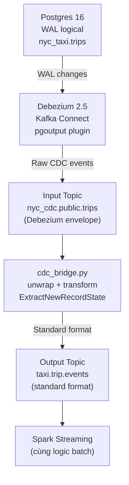

# 7. CDC Pipeline — Change Data Capture

## 7.1 Tổng quan

CDC (Change Data Capture) pipeline cung cấp một nguồn sự kiện thay thế, 
cho phép ingest dữ liệu từ **PostgreSQL 16** qua **Debezium 2.5 Kafka Connect**.

### Kiến trúc



---

## 7.2 Postgres Configuration

### Docker Compose
```yaml
nyc_postgres:
  image: postgres:16-alpine
  environment:
    POSTGRES_USER: postgres
    POSTGRES_PASSWORD: postgres
    POSTGRES_DB: nyc_taxi
  command:
    - "postgres"
    - "-c"
    - "wal_level=logical"
    - "-c"
    - "max_replication_slots=4"
    - "-c"
    - "max_wal_senders=4"
```

### Table Schema
```sql
CREATE TABLE IF NOT EXISTS trips (
    trip_id            SERIAL PRIMARY KEY,
    vendor_id          INTEGER,
    pickup_datetime    TIMESTAMP,
    dropoff_datetime   TIMESTAMP,
    passenger_count    INTEGER,
    trip_distance      DOUBLE PRECISION,
    rate_code_id       INTEGER,
    pickup_location_id INTEGER,
    dropoff_location_id INTEGER,
    payment_type       INTEGER,
    fare_amount        DOUBLE PRECISION,
    extra              DOUBLE PRECISION,
    mta_tax            DOUBLE PRECISION,
    tip_amount         DOUBLE PRECISION,
    tolls_amount       DOUBLE PRECISION,
    improvement_surcharge DOUBLE PRECISION,
    total_amount       DOUBLE PRECISION,
    created_at         TIMESTAMP DEFAULT NOW(),
    updated_at         TIMESTAMP DEFAULT NOW()
);

-- BẮT BUỘC cho Debezium capture
ALTER TABLE trips REPLICA IDENTITY FULL;
```

### Postgres Init (Idempotent)

**File**: `docker/entrypoint-init-postgres.sh`

Dùng Python `psycopg2` (không cần `psql`/postgresql-client) để:
1. Chờ Postgres ready (TCP connect retry loop)
2. Tạo bảng `trips` với đầy đủ columns
3. Set `REPLICA IDENTITY FULL`

---

## 7.3 Debezium Configuration

### Docker Compose
```yaml
debezium:
  image: debezium/connect:2.5
  environment:
    BOOTSTRAP_SERVERS: kafka:9092
    GROUP_ID: 1
    CONFIG_STORAGE_TOPIC: debezium_configs
    OFFSET_STORAGE_TOPIC: debezium_offsets
    STATUS_STORAGE_TOPIC: debezium_statuses
```

### Connector Config

**Script**: `scripts/cdc_register_connector.py`

```python
CONNECTOR_CONFIG = {
    "name": "nyc-postgres-connector",
    "config": {
        "connector.class": "io.debezium.connector.postgresql.PostgresConnector",
        "database.hostname": "svc-postgres-cdc",
        "database.port": "5432",
        "database.user": "postgres",
        "database.password": "postgres",
        "database.dbname": "nyc_taxi",
        "topic.prefix": "nyc_cdc",
        "schema.include.list": "public",
        "table.include.list": "public.trips",
        "plugin.name": "pgoutput",
        "publication.autocreate.mode": "filtered",
        "key.converter": "org.apache.kafka.connect.json.JsonConverter",
        "value.converter": "org.apache.kafka.connect.json.JsonConverter",
        "key.converter.schemas.enable": "false",
        "value.converter.schemas.enable": "false",
        "transforms": "unwrap",
        "transforms.unwrap.type": "io.debezium.transforms.ExtractNewRecordState",
        "transforms.unwrap.drop.tombstones": "false",
        "tombstones.on.delete": "false",
        # Performance tuning
        "poll.interval.ms": "500",
        "max.queue.size": "16384",
        "snapshot.mode": "never",
    },
}
```

**Các config quan trọng:**
| Config | Value | Ý nghĩa |
|--------|-------|---------|
| `plugin.name` | `pgoutput` | Dùng pgoutput plugin (mặc định từ PG10+) |
| `publication.autocreate.mode` | `filtered` | Tự tạo publication cho bảng được include |
| `transforms` | `unwrap` | ExtractNewRecordState — bỏ Debezium envelope |
| `snapshot.mode` | `never` | Không snapshot (dùng cho streaming-only) |
| `poll.interval.ms` | `500` | Tần số poll changes |
| `max.queue.size` | `16384` | Queue size cho high throughput |

---

## 7.4 Seed Postgres từ Parquet

**Script**: `scripts/cdc_seed.py`

Đọc file Parquet NYC TLC và insert vào Postgres:

```bash
cdc-seed --input /opt/project/data/raw/yellow_taxi/year=2024/month=01/yellow_tripdata_2024-01.parquet --max-rows 5000
```

**Luồng xử lý:**
1. Đọc Parquet bằng Pandas
2. Map columns (VendorID → vendor_id, tpep_pickup_datetime → pickup_datetime...)
3. Insert vào Postgres qua SQLAlchemy (chunk-based insert)
4. Mặc định 5000 rows (có thể config qua `--max-rows`)

---

## 7.5 CDC Bridge

**Script**: `scripts/cdc_bridge.py`

Chuyển đổi Debezium unwrapped events → standard NYC Taxi event format.

### Transform Function

```python
def transform(event: dict) -> dict | None:
    """Debezium CDC → standard NYC Taxi event format."""
    ts = datetime.now(timezone.utc).strftime("%Y-%m-%d %H:%M:%S")
    return {
        "event_id": f"cdc-{event.get('trip_id', '0')}",
        "event_timestamp": ts,
        "source_file": "cdc:nyc_postgres:nyc_taxi:public.trips",
        "vendor_id": event.get("vendor_id"),
        "pickup_datetime": fmt_micro(event.get("pickup_datetime")),
        "dropoff_datetime": fmt_micro(event.get("dropoff_datetime")),
        # ... các trường khác
    }
```

### Performance

| Mode | Throughput | Cơ chế |
|------|-----------|--------|
| **Async** (default) | ~300-500 ev/s | `producer.send()` + periodic flush every 500 events |
| **Sync** (`--sync`) | ~9 ev/s | `producer.send().get()` per event (~50x slower) |

**Config tối ưu:**
```bash
cdc-bridge \
  --bootstrap-server svc-kafka:9092 \
  --input-topic nyc_cdc.public.trips \
  --output-topic taxi.trip.events \
  --flush-interval 500 \
  --linger-ms 100 \
  --idle-timeout 30
```

### Idle Timeout
Bridge tự động thoát sau N giây không có messages mới:
```python
if args.idle_timeout > 0 and idle >= args.idle_timeout:
    break
```
Mặc định không có timeout (cho streaming liên tục). 
Trong DAG, set `--idle-timeout 30` để job tự kết thúc.

---

## 7.6 CDC Pipeline Flow (đầy đủ)

### Kubernetes (Airflow DAG) ⭐

CDC pipeline chạy qua DAG `nyc_cdc_pipeline` — trigger thủ công:

```bash
kubectl exec -n nyc-taxi deploy/airflow-scheduler -- \
  airflow dags trigger nyc_cdc_pipeline
```

**3 tasks trong DAG:**
1. `cdc_seed` (KubernetesPodOperator, image: nyc-pipeline-tools:k8s) — seed 5000 rows
2. `cdc_register` (KubernetesPodOperator) — register Debezium connector
3. `cdc_bridge` (KubernetesPodOperator) — bridge events với idle-timeout=30s

### Docker Compose (Legacy)

```bash
# Từng bước thủ công
make cdc-seed
make cdc-register
make cdc-bridge
make cdc-verify
```

### Benchmark output (K8s mode)
```
[cdc-bridge] === BENCHMARK ===
[cdc-bridge]   events:       5000
[cdc-bridge]   total time:   11.24s
[cdc-bridge]   throughput:   445 ev/s
[cdc-bridge]   flush calls:  10
[cdc-bridge]   avg latency:  2.2 ms/ev
```

---

## 7.7 Verify CDC

### Kubernetes ⭐
```bash
make k8s-verify-cdc
# hoặc:
kubectl exec -n nyc-taxi statefulset/postgres-cdc -- \
  psql -U postgres -d nyc_taxi -c "SELECT count(*) FROM trips;"

# Kiểm tra Debezium connector
kubectl exec -n nyc-taxi deploy/debezium -- \
  curl -sf http://localhost:8083/connectors/nyc-postgres-connector/status
```

### Docker Compose (Legacy)
```bash
make cdc-verify
```

---

## 7.8 Lưu ý

1. **postgres-init và cdc-seed dùng Python** psycopg2 — không cần cài postgresql-client
2. **Service names K8s**: `svc-postgres-cdc`, `svc-debezium` (prefix `svc-`)
3. **Snapshot mode = never**: Trong pipeline này, Postgres đã có data sẵn từ cdc-seed
4. **Unique consumer group**: Bridge dùng UUID-based group để không miss events:
   ```python
   group_id=f"cdc-bridge-{uuid4().hex[:8]}"
   ```
5. **Async optimization**: `producer.send()` + `flush()` mỗi 500 events giúp throughput gấp ~50x so với sync
