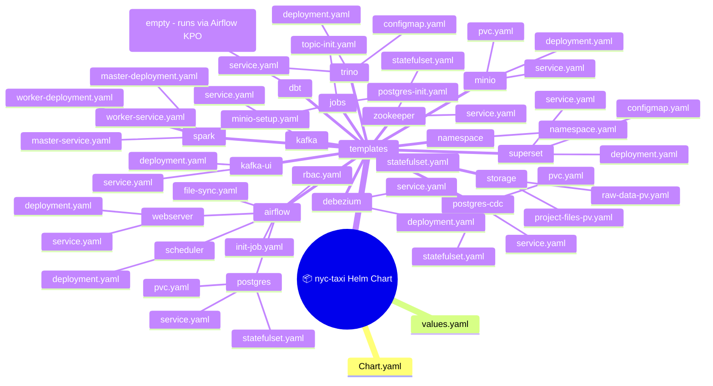

# 10. Helm Chart và Skaffold Deployment

## 10.1 Tổng quan

Trên Kubernetes, pipeline được triển khai qua **Helm chart** (`charts/nyc-taxi/`) 
và **Skaffold** (`skaffold.yaml`). Skaffold là công cụ triển khai chính, 
tự động build images, sync files, và port-forward.

### Skaffold vs Makefile (K8s)

| Khía cạnh | Skaffold (Primary) | Makefile (Legacy) |
|-----------|-------------------|-------------------|
| Deploy | `skaffold dev` / `skaffold run` | `make k8s-deploy` |
| File sync | Auto (sync rules) | Manual (tar + docker exec) |
| Port-forward | Auto (portForward config) | `make k8s-ui` (setsid -f) |
| Build | Skaffold build artifacts | `make k8s-images` (docker build + kind load) |
| Watch | Auto-rebuild on Dockerfile changes | None |
| Hot-reload | Sync rules + file-sync pod | None |

---

## 10.2 Skaffold Configuration

**File**: `skaffold.yaml`

```yaml
apiVersion: skaffold/v4beta3
kind: Config
```

### Build Section
```yaml
build:
  local:
    push: false  # Không push lên registry (local kind cluster)
  artifacts:
    - image: nyc-pipeline-tools
      context: .
      docker: { dockerfile: docker/tools.Dockerfile }
      sync:
        manual:
          - src: "airflow/dags/**/*.py"
            dest: /opt/project/airflow/dags/
          - src: "jobs/**/*"
            dest: /opt/project/jobs/
          - src: "scripts/**/*"
            dest: /opt/project/scripts/
          - src: "dbt/**/*"
            dest: /opt/project/dbt/
          - src: "charts/**/*"
            dest: /opt/project/charts/
    - image: nyc-dbt
      context: .
      docker: { dockerfile: docker/dbt.Dockerfile }
    - image: nyc-airflow
      context: .
      docker: { dockerfile: docker/airflow.Dockerfile }
```

**3 artifacts** được build:
1. `nyc-pipeline-tools` — Có sync rules cho hot-reload
2. `nyc-dbt` — Không sync (ít thay đổi)
3. `nyc-airflow` — Không sync

### Deploy Section
```yaml
deploy:
  helm:
    releases:
      - name: nyc-taxi
        chartPath: charts/nyc-taxi
        namespace: nyc-taxi
        valuesFiles: [charts/nyc-taxi/values.yaml]
        createNamespace: true
```

### Hooks

**Before hook** (chạy trước khi Helm deploy):
```yaml
before:
  - host:
      command:
        - bash -c
        - |
          # 1. Xoá immutable jobs cũ
          kubectl delete job -n nyc-taxi --all --ignore-not-found
          # 2. Sync project files → kind-worker PVC
          docker exec kind-worker mkdir -p /mnt/nyc-project
          tar cf - \
            --exclude='dbt/logs' --exclude='dbt/target' \
            --exclude='.git' --exclude='__pycache__' \
            airflow/dags/ jobs/ scripts/ dbt/ charts/ \
            | docker exec -i kind-worker tar xf - -C /mnt/nyc-project
```

**After hook** (chạy sau Helm deploy):
```yaml
after:
  - host:
      command:
        - bash -c
        - |
          sleep 5
          echo "=== UIs ==="
          echo "  Superset     http://localhost:39080"
          echo "  MinIO API    http://localhost:39081"
          # ... hiển thị tất cả URLs
          # Mở browser tabs
          xdg-open http://localhost:39085 2>/dev/null || true
```

### Port-forward Section
```yaml
portForward:
  - resourceType: service
    resourceName: svc-superset
    port: 8088
    localPort: 39080
  - resourceType: service
    resourceName: svc-minio
    port: 9000
    localPort: 39081
  - resourceType: service
    resourceName: svc-minio
    port: 9001
    localPort: 39086
  - resourceType: service
    resourceName: svc-kafka-ui
    port: 8080
    localPort: 39082
  - resourceType: service
    resourceName: svc-spark-master
    port: 8081
    localPort: 39083
  - resourceType: service
    resourceName: svc-trino
    port: 8080
    localPort: 39084
  - resourceType: service
    resourceName: svc-airflow-webserver
    port: 8080
    localPort: 39085
  - resourceType: service
    resourceName: svc-postgres-cdc
    port: 5432
    localPort: 39087
```

---

## 10.3 Helm Chart Structure



### Chart.yaml
```yaml
apiVersion: v2
name: nyc-taxi
description: A Helm chart for NYC Taxi pipeline
type: application
version: 0.1.0
appVersion: "1.0.0"
```

### Service Naming Convention

Tất cả service names đều có prefix `svc-`:
```
svc-kafka, svc-minio, svc-trino, svc-superset,
svc-zookeeper, svc-spark-master, svc-spark-worker,
svc-kafka-ui, svc-postgres-cdc, svc-debezium,
svc-airflow-webserver, svc-airflow-scheduler
```

> ⚠️ **Quan trọng**: Trong K8s namespace `nyc-taxi`, dùng `svc-kafka:9092` 
> chứ **không phải** `kafka:9092`.

---

## 10.4 Key Templates

### Storage (PVC + PV)

**File**: `charts/nyc-taxi/templates/storage/project-files-pv.yaml`

```yaml
apiVersion: v1
kind: PersistentVolume
metadata:
  name: project-files-pv
spec:
  capacity:
    storage: 5Gi
  accessModes:
  - ReadWriteOnce
  hostPath:
    path: /mnt/nyc-project
    type: Directory
  nodeAffinity:
    required:
      nodeSelectorTerms:
      - matchExpressions:
        - key: kubernetes.io/hostname
          operator: In
          values:
          - kind-worker
---
apiVersion: v1
kind: PersistentVolumeClaim
metadata:
  name: project-files-pvc
spec:
  accessModes:
  - ReadWriteOnce
  resources:
    requests:
      storage: 5Gi
  storageClassName: ""
```

**Đặc điểm:**
- 2 PVs: `project-files-pv` (5Gi) + `raw-data-pv` (tùy data size)
- hostPath → `/mnt/nyc-*` trên kind-worker node
- Node affinity: chỉ mount trên `kind-worker` (RWO)

### File-Sync Pod

**File**: `charts/nyc-taxi/templates/airflow/file-sync.yaml`

```yaml
apiVersion: apps/v1
kind: Deployment
metadata:
  name: file-sync
spec:
  replicas: 1
  selector:
    matchLabels:
      app: file-sync
  template:
    spec:
      nodeSelector:
        kubernetes.io/hostname: kind-worker
      containers:
      - name: sync
        image: nyc-pipeline-tools:k8s
        command: ["sleep", "infinity"]
        volumeMounts:
        - name: project-files
          mountPath: /opt/project
      volumes:
      - name: project-files
        persistentVolumeClaim:
          claimName: project-files-pvc
```

**Vai trò**: Là target cho `skaffold sync`. Khi file thay đổi, 
Skaffold push file vào pod này → PVC → tất cả pods khác thấy thay đổi.

### MinIO Setup Job

**File**: `charts/nyc-taxi/templates/jobs/minio-setup.yaml`

Job one-shot dùng `minio/mc` để:
1. Chờ MinIO ready
2. Tạo buckets: nyc-raw, nyc-silver, nyc-quarantine, nyc-lookup, nyc-gold
3. Upload raw Parquet + zone lookup CSV

### Topic Init Job

**File**: `charts/nyc-taxi/templates/jobs/topic-init.yaml`

Dùng `nyc-pipeline-tools:k8s` image với `entrypoint-topic-init`:
- Chờ Kafka ready (qua wait-kafka)
- Tạo topics: taxi.trip.events, taxi.trip.invalid, taxi.trip.dlq

### Postgres Init Job

**File**: `charts/nyc-taxi/templates/jobs/postgres-init.yaml`

Dùng `nyc-pipeline-tools:k8s` image với `entrypoint-init-postgres`:
- Chờ Postgres ready
- Tạo trips table
- Set REPLICA IDENTITY FULL

---

## 10.5 Skaffold Dev Workflow

```bash
# Full dev loop (build + deploy + sync + port-forward + watch)
skaffold dev --namespace nyc-taxi

# Output:
# [1/3] Building nyc-pipeline-tools...
# [2/3] Building nyc-dbt...
# [3/3] Building nyc-airflow...
# [helm] Deploying nyc-taxi chart...
# [port-forward] Forwarding svc-superset:8088 → 39080
# ...
# Watching for changes...
```

Khi chạy `skaffold dev`:
1. Build 3 artifacts (nếu Dockerfile thay đổi)
2. Run pre-deploy hooks (xóa jobs, sync files)
3. Helm install/upgrade chart
4. Start port-forwards (39080-39087)
5. Watch file changes:
   - `airflow/dags/`, `jobs/`, `scripts/`, `dbt/`, `charts/` → sync vào file-sync pod
   - Dockerfile thay đổi → rebuild image + re-deploy
6. Run post-deploy hooks (hiển thị URLs)

### Skaffold Commands

```bash
# Dev mode (auto-watch + auto-sync)
skaffold dev --namespace nyc-taxi

# One-shot (no watch)
skaffold run --namespace nyc-taxi

# Build only
skaffold build --namespace nyc-taxi

# Deploy only (skip build)
skaffold run --namespace nyc-taxi --tail

# Delete deployed resources
skaffold delete --namespace nyc-taxi
```

---

## 10.6 PVC Sync (Manual)

Khi không dùng skaffold, sync files thủ công:

```bash
cd /home/dwcks/vsf_gsm/nyc_new
tar cf - \
  --exclude='dbt/logs' --exclude='dbt/target' \
  --exclude='.git' --exclude='__pycache__' \
  --exclude='*.pyc' --exclude='*.pyo' \
  airflow/dags/ jobs/ scripts/ dbt/ charts/ \
  | docker exec -i kind-worker tar xf - -C /mnt/nyc-project
```

---

## 10.7 Legacy Makefile K8s Targets

| Target | Description |
|--------|-------------|
| `k8s-cluster` | Create kind cluster (3 nodes) |
| `k8s-images` | Build + load images into kind |
| `k8s-deploy` | Deploy all K8s manifests (ordered) |
| `k8s-start` | Cluster → images → services → UIs |
| `k8s-up` | Full: cluster check + build + deploy + wait + UI |
| `k8s-down` / `k8s-stop` | Scale down / stop services |
| `k8s-destroy` | Delete cluster (all data gone) |
| `k8s-ui` | Start port-forwards (setsid -f) |
| `k8s-ui-stop` | Stop port-forwards |
| `k8s-verify` | Row counts via Trino |
| `k8s-verify-analytics` | 10 analytics queries |
| `k8s-verify-cdc` | CDC pipeline verification |
| `k8s-clean` | Clean MinIO data + delete jobs |
| `k8s-status` | kubectl get pods |
| `k8s-logs JOB=name` | Tail job logs |

---

## 10.8 Troubleshooting Namespace

Khi namespace `nyc-taxi` bị stuck ở trạng thái `Terminating`:

```bash
kubectl replace --raw /api/v1/namespaces/nyc-taxi/finalize -f \
  <(kubectl get namespace nyc-taxi -o json | python3 -c \
    "import json,sys; ns=json.load(sys.stdin); ns['spec']['finalizers']=[]; print(json.dumps(ns))")
```
