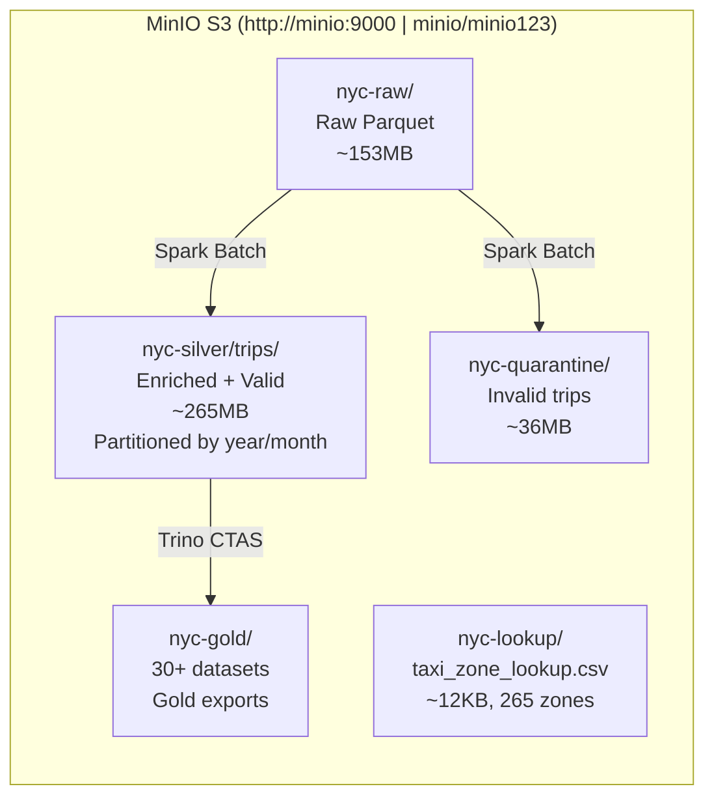
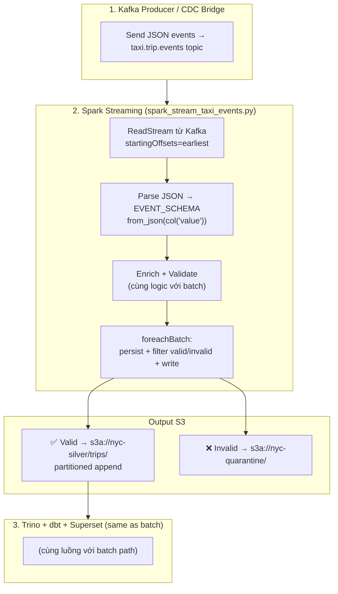
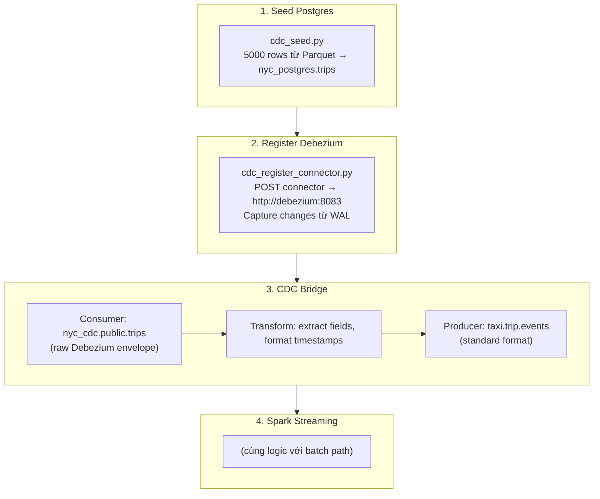
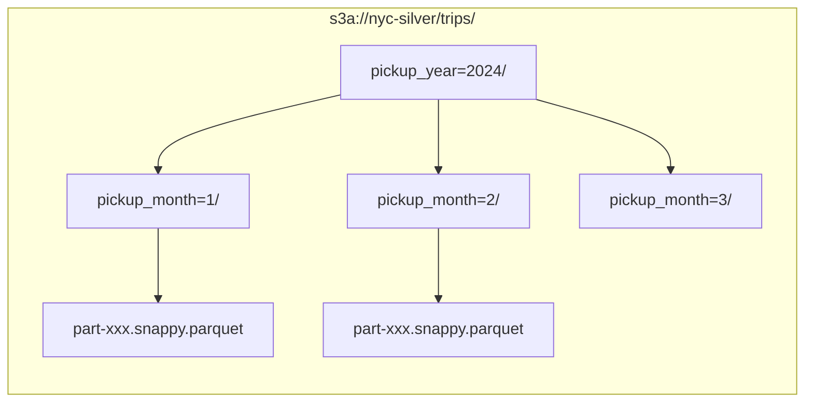
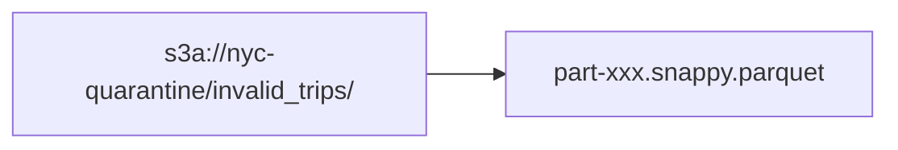

# 12. Luồng Dữ Liệu và Storage

## 12.1 Data Lake Structure (MinIO S3)



### Bucket Sizes

| Bucket | Size | Records | Description |
|--------|------|---------|-------------|
| `nyc-raw` | ~153 MB | 3 files (3 tháng) | Raw Parquet |
| `nyc-silver` | ~265 MB | ~10.2M valid trips | Enriched + validated |
| `nyc-quarantine` | ~36 MB | ~1.07M invalid | Dữ liệu lỗi |
| `nyc-lookup` | ~12 KB | 265 zones | Zone lookup CSV |
| `nyc-gold` | varies | 30+ datasets | Gold exports |

---

## 12.2 Data Flow Diagram (Chi tiết)

### Batch Path
```
┌─────────────────────────────────────────────────────────────────────┐
│ BATCH PATH (@monthly backfill)                                      │
├─────────────────────────────────────────────────────────────────────┤
│                                                                     │
│  1. MINIO-SETUP (job one-shot)                                      │
│     ├── Tạo buckets: nyc-raw, nyc-silver, nyc-quarantine, ...       │
│     ├── Upload raw Parquet từ PVC → nyc-raw/                        │
│     └── Upload taxi_zone_lookup.csv → nyc-lookup/                    │
│                                                                     │
│  2. SPARK BATCH (spark_local_batch.py)                              │
│     ├── Đọc: s3a://nyc-raw/yellow_taxi/.../*.parquet                │
│     ├── Đọc: s3a://nyc-lookup/taxi_zone_lookup.csv                  │
│     ├── Enrich: cast types, join zones, add metadata                │
│     ├── Validate: 10 rules                                          │
│     └── Ghi:                                                        │
│         ├── Valid   → s3a://nyc-silver/trips/ (partitioned)         │
│         └── Invalid → s3a://nyc-quarantine/invalid_trips/           │
│                                                                     │
│  3. TRINO BOOTSTRAP (trino_register.py)                             │
│     └── Register external tables → hive.nyc.{trips,invalid_trips,   │
│                                         taxi_zone_lookup}           │
│                                                                     │
│  4. DBT BUILD (dbt build)                                           │
│     ├── stg_trips, stg_zones, stg_invalid_trips                    │
│     ├── fact_trips, dim_zone, fact_invalid_trips                   │
│     ├── mart_hourly_summary, mart_revenue_by_day, ...              │
│     ├── gold_fact_trips, gold_dim_zone, ...                        │
│     └── 9 tests (expect 24/24 PASS)                                │
│                                                                     │
│  5. GOLD EXPORT (export_gold_to_minio.py)                           │
│     └── CTAS: hive.nyc_gold.* → s3://nyc-gold/{name}/              │
│                                                                     │
│  6. SUPERSET BOOTSTRAP (superset_bootstrap.py)                      │
│     └── Register DB + 7 datasets + 4 charts + dashboard            │
│                                                                     │
│  7. ANALYTICS CHECK (run_analytics_questions.py)                    │
│     └── 10 SQL queries, expect PASS 10/10                          │
│                                                                     │
└─────────────────────────────────────────────────────────────────────┘
```

### Streaming Path



### CDC Path



---

## 12.3 Local Filesystem Structure

### Kubernetes PVC Structure (Primary) ⭐
```
kind-worker:/mnt/
├── nyc-project/      # project-files-pv (5Gi) — code + config
│   ├── airflow/dags/ # Airflow DAGs (hot-reload qua skaffold sync)
│   ├── jobs/         # Spark jobs
│   ├── scripts/      # Utility scripts
│   ├── dbt/          # dbt models + profiles
│   └── charts/       # Helm chart
│
└── nyc-data/         # raw-data-pv — dữ liệu đầu vào
    ├── raw/yellow_taxi/...
    └── lookup/taxi_zone_lookup.csv
```

### Local (Docker Compose — Legacy)
```
data/
├── raw/yellow_taxi/...
├── silver/trips/...
├── quarantine/invalid_trips/
├── lookup/taxi_zone_lookup.csv
├── checkpoints/spark_stream_taxi_events/
└── trino-metastore/  # Hive metastore (file-based)
```

---

## 12.4 Partition Strategy

### Silver Trips (Hive-style partitioning)



**Partition columns**: `pickup_year` (INT), `pickup_month` (INT)
**Lợi ích**: 
- Query pruning (Trino chỉ đọc partitions cần thiết)
- dbt staging giữ nguyên partition columns
- Gold export giữ nguyên partitioning

### Quarantine Invalid Trips (Non-partitioned)



**Không partition** vì số lượng invalid trips nhỏ hơn nhiều.

---

## 12.5 Data Volume by Stage

| Stage | Volume | Tỉ lệ |
|-------|--------|-------|
| Raw (3 tháng, 8 files) | ~153 MB | 100% |
| Silver (valid) | ~265 MB | ~89% |
| Quarantine (invalid) | ~36 MB | ~11% |
| Gold (30+ datasets) | ~500 MB+ | ~170%+ |

**Invalid rate**: ~11.24% (1.07M invalid / 9.55M total)

### Invalid Breakdown
| Lỗi | Số lượng (ước tính) |
|-----|-------------------|
| Invalid passenger count | ~30% |
| Non-positive trip distance | ~25% |
| Invalid datetime / duration | ~20% |
| Payment type out of range | ~15% |
| Other | ~10% |

---

## 12.6 Key Storage Notes (K8s/Skaffold)

1. **Spark dùng `s3a://`** — Hadoop S3A connector với `--packages`
2. **Trino dùng `s3://`** — Hive S3 connector native
3. **MinIO path-style access** — Bắt buộc cho MinIO (virtual-host không support)
4. **PVC project-files-pv** — 5Gi hostPath, nodeAffinity: kind-worker
5. **File-based Hive metastore** — Trong container Trino, không cần Hive service riêng
6. **Streaming checkpoint** — Trên S3 cho K8s (`s3a://nyc-silver/checkpoints/...`)
7. **mode("append")** — Luôn dùng append, không overwrite
8. **File-sync hot-reload** — Skaffold watch + file-sync pod → PVC → tất cả pods
