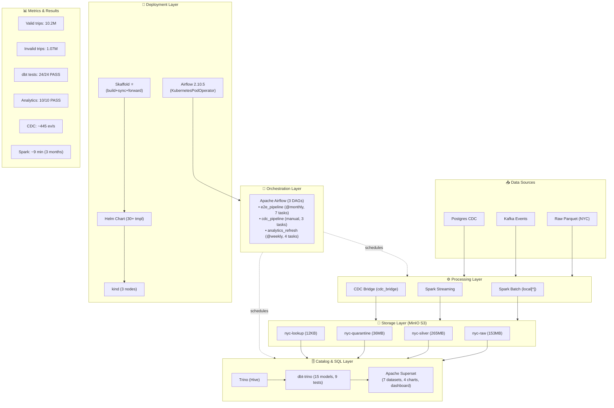
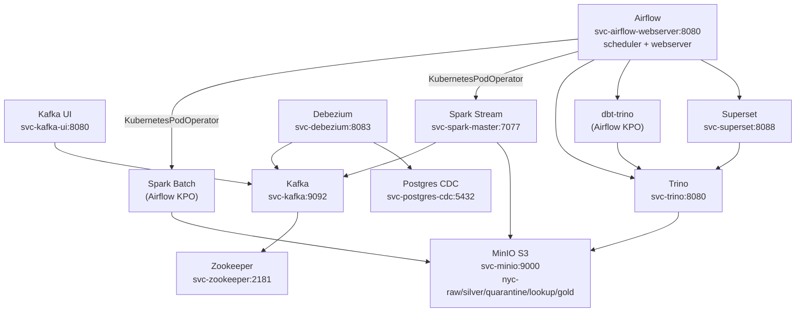

# 13. Tổng Kết Kiến Trúc

## 13.1 Pipeline Components Summary



---

## 13.2 Service Dependency Graph (Kubernetes)



---

## 13.3 Key Design Decisions

### Tại sao dùng file-based Hive metastore?
- **Không cần Hive service riêng** — Giảm độ phức tạp
- **Hạn chế**: Không support `RENAME TABLE` → dbt models phải là `view`
- **Phù hợp**: Dev/testing pipeline, không phải production lớn

### Tại sao dùng MinIO thay vì HDFS?
- **S3-compatible** — Có thể chuyển lên AWS S3 mà không đổi code
- **Nhẹ** — Chạy trong container, không cần cluster riêng
- **Hạn chế**: Không support atomic rename → cần S3 commit fix

### Tại sao dùng Skaffold vs Makefile?
| Tiêu chí | Skaffold | Makefile |
|----------|----------|----------|
| Auto-rebuild | ✅ | ❌ |
| File sync | ✅ | Manual |
| Port-forward | ✅ | Manual |
| Watch mode | ✅ | ❌ |
| Đơn giản | Trung bình | Cao |

Skaffold là lựa chọn **chính thức và duy nhất** cho triển khai. Makefile/Docker Compose chỉ dùng cho debug.

### Tại sao dùng Airflow (K8s) làm orchestrator?
- **KubernetesPodOperator** — mỗi task là một pod riêng biệt, tự động cleanup
- **Tự động theo lịch**: @monthly, @weekly — không cần can thiệp thủ công
- **Backfill**: `catchup=True` cho phép xử lý dữ liệu quá khứ
- **Logging**: Logs pod trực tiếp trên Airflow UI (get_logs=True)

---

## 13.4 Lưu ý quan trọng (Best Practices)

### K8s Service Names
```
Luôn dùng prefix svc-: svc-kafka, svc-minio, svc-trino...
Không dùng: kafka, minio, trino...
```

### Spark S3A Packages
```
--packages org.apache.hadoop:hadoop-aws:3.3.4,...
--conf spark.jars.ivy=/opt/project/.ivy2
--conf spark.hadoop.mapreduce.fileoutputcommitter.algorithm.version=2
```

### dbt Models
```
Tất cả models: materialized='view'
Không dùng materialized='table' (Hive không support RENAME TABLE)
```

### Output Mode
```
Spark: luôn dùng mode("append")
Không dùng mode("overwrite") với MinIO
```

### CDC Bridge
```
Async mode (default): ~500 ev/s
Sync mode (--sync): ~9 ev/s (~50x slower)
```

### Skaffold Dev
```
skaffold dev --namespace nyc-taxi
→ Auto build + deploy + sync + port-forward + watch
```

---

## 13.5 Troubleshooting Checklist (Skaffold/K8s)

| Vấn đề | Nguyên nhân | Giải pháp |
|--------|-------------|-----------|
| **Skaffold build fails** | Dockerfile lỗi | Kiểm tra syntax, `skaffold build --namespace nyc-taxi` để debug |
| **Helm deploy fails** | Namespace stuck | Gỡ finalizers (xem mục 2.5) |
| **Spark S3A fails** | Missing --packages | Dùng `--packages` trên CLI, không phải `spark.jars.packages` |
| **dbt build fails** | Hive RENAME TABLE | Set `materialized='view'` |
| **Trino không thấy partitions** | Metadata chưa sync | `CALL sync_partition_metadata(...)` |
| **Kafka connection fails** | Wrong service name | Dùng `svc-kafka:9092` (K8s) |
| **Namespace stuck** | Finalizers | `kubectl replace --raw /api/v1/namespaces/nyc-taxi/finalize -f ...` |
| **Ivy cache fails** | Permissions | `chmod -R 777 /opt/project/.ivy2/` |
| **Port-forward dies** | Skaffold không chạy | Dùng `skaffold dev` hoặc `./scripts/k8s_ui.sh start` |
| **File-sync không hoạt động** | Skaffold watch tắt | Chạy `skaffold dev` hoặc sync thủ công (xem mục 2.5) |

---

## 13.6 Tài liệu tham khảo

| File | Nội dung |
|------|----------|
| `docs/01-tong-quan-kien-truc.md` | Tổng quan kiến trúc |
| `docs/02-huong-dan-trien-khai.md` | Hướng dẫn triển khai |
| `docs/03-spark-processing.md` | Xử lý Spark batch + streaming |
| `docs/04-dbt-models.md` | dbt models và transformations |
| `docs/05-trino-catalog.md` | Trino catalog và Hive metadata |
| `docs/06-airflow-dags.md` | Airflow DAGs orchestration |
| `docs/07-cdc-pipeline.md` | CDC pipeline (Debezium) |
| `docs/08-superset-visualization.md` | Superset dashboard |
| `docs/09-docker-images.md` | Docker images và entrypoints |
| `docs/10-helm-skaffold.md` | Helm chart và Skaffold |
| `docs/11-scripts-utilities.md` | Scripts và tiện ích |
| `docs/12-data-flow-storage.md` | Luồng dữ liệu và storage |
| `docs/13-architecture-summary.md` | Tổng kết kiến trúc |
