# 14. Biểu Đồ Kiến Trúc Skaffold, Helm và Kubernetes

## 14.1 Skaffold Dev Workflow

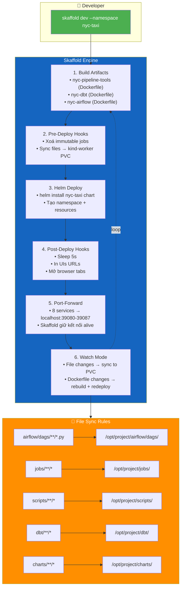

---

## 14.2 kind Cluster Topology

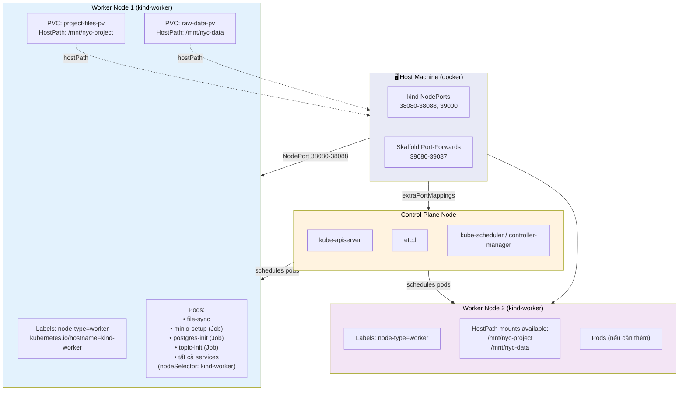

### NodePort Mappings

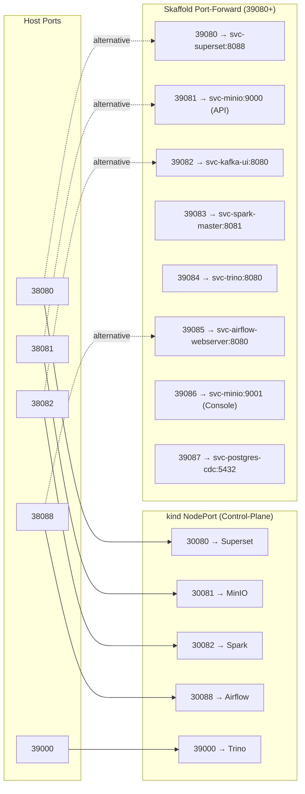

---

## 14.3 Helm Chart Resource Tree

```mermaid
graph TB
    subgraph CHART["📦 Helm Chart nyc-taxi (0.1.0)"]
        direction TB
        CHART_META["Chart.yaml<br/>apiVersion: v2<br/>type: application<br/>appVersion: 1.0.0"]
        
        subgraph NS["Namespace"]
            N1["namespace.yaml<br/>→ nyc-taxi namespace<br/>Helm managed labels"]
        end

        subgraph STORAGE["Storage Layer"]
            S1["project-files-pv.yaml<br/>PV: 5Gi hostPath<br/>PVC: project-files-pvc<br/>NodeAffinity: kind-worker"]
            S2["raw-data-pv.yaml<br/>PV: hostPath<br/>PVC: raw-data-pvc"]
        end

        subgraph MESSAGING["Messaging Layer"]
            M1["zookeeper/statefulset.yaml"]
            M2["zookeeper/service.yaml<br/>→ svc-zookeeper:2181"]
            M3["kafka/statefulset.yaml<br/>initContainer: wait-zookeeper"]
            M4["kafka/service.yaml<br/>→ svc-kafka:9092"]
            M5["kafka-ui/deployment.yaml"]
            M6["kafka-ui/service.yaml<br/>→ svc-kafka-ui:8080"]
        end

        subgraph STORAGE_SVC["Storage Services"]
            ST1["minio/deployment.yaml<br/>args: server /data --console-address :9001"]
            ST2["minio/service.yaml<br/>→ svc-minio:9000 (API)<br/>→ svc-minio:9001 (Console)"]
            ST3["minio/pvc.yaml<br/>→ minio-data"]
        end

        subgraph PROCESSING["Processing Layer"]
            P1["spark/master-deployment.yaml"]
            P2["spark/master-service.yaml<br/>→ svc-spark-master:7077,8081"]
            P3["spark/worker-deployment.yaml"]
            P4["spark/worker-service.yaml<br/>→ svc-spark-worker:8082"]
        end

        subgraph CDC["CDC Layer"]
            C1["postgres-cdc/statefulset.yaml<br/>wal_level=logical"]
            C2["postgres-cdc/service.yaml<br/>→ svc-postgres-cdc:5432"]
            C3["postgres-cdc/pvc.yaml"]
            C4["debezium/deployment.yaml<br/>Kafka Connect 2.5"]
            C5["debezium/service.yaml<br/>→ svc-debezium:8083"]
        end

        subgraph SQL["SQL & Analytics Layer"]
            Q1["trino/configmap.yaml<br/>hive.properties + config.properties"]
            Q2["trino/deployment.yaml<br/>Trino 435"]
            Q3["trino/service.yaml<br/>→ svc-trino:8080"]
            Q4["superset/configmap.yaml<br/>superset_config.py"]
            Q5["superset/deployment.yaml<br/>Superset 4.0.0"]
            Q6["superset/service.yaml<br/>→ svc-superset:8088"]
        end

        subgraph AIRFLOW["Orchestration Layer"]
            A1["airflow/postgres/statefulset.yaml<br/>Airflow metadata DB"]
            A2["airflow/postgres/service.yaml"]
            A3["airflow/postgres/pvc.yaml"]
            A4["airflow/rbac.yaml<br/>ServiceAccount: airflow-sa<br/>Role + RoleBinding"]
            A5["airflow/init-job.yaml<br/>db migrate + create admin"]
            A6["airflow/file-sync.yaml<br/>sleep infinity pod for skaffold sync"]
            A7["airflow/scheduler/deployment.yaml"]
            A8["airflow/webserver/deployment.yaml<br/>→ svc-airflow-webserver:8080"]
            A9["airflow/webserver/service.yaml"]
        end

        subgraph JOBS["One-Shot Jobs"]
            J1["jobs/minio-setup.yaml<br/>→ mc alias + buckets + upload"]
            J2["jobs/postgres-init.yaml<br/>→ psycopg2 create trips table"]
            J3["jobs/topic-init.yaml<br/>→ wait-kafka + create topics"]
        end

        subgraph DBT["(dbt runs via Airflow KPO)"]
            D1["dbt/ (empty templates)"]
        end
    end

    style CHART fill:#1A237E,color:#fff
    style NS fill:#E8EAF6,color:#000
    style STORAGE fill:#E3F2FD,color:#000
    style MESSAGING fill:#F3E5F5,color:#000
    style STORAGE_SVC fill:#E0F2F1,color:#000
    style PROCESSING fill:#FFF3E0,color:#000
    style CDC fill:#FCE4EC,color:#000
    style SQL fill:#E8F5E9,color:#000
    style AIRFLOW fill:#FFF8E1,color:#000
    style JOBS fill:#F3E5F5,color:#000
    style DBT fill:#ECEFF1,color:#000
```

---

## 14.4 PVC File-Sync Data Flow

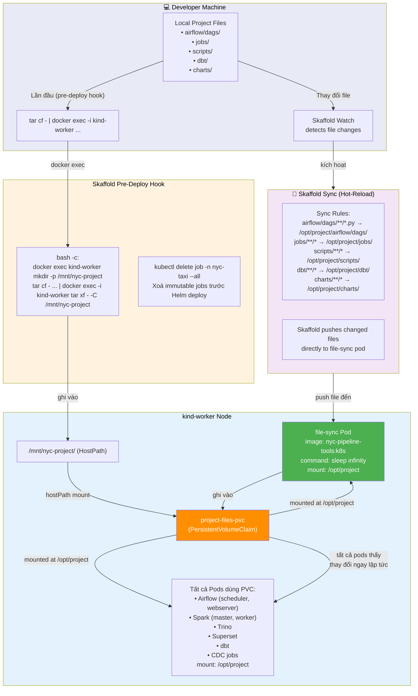

---

## 14.5 Skaffold Deploy Hook Flow (Chi tiết)

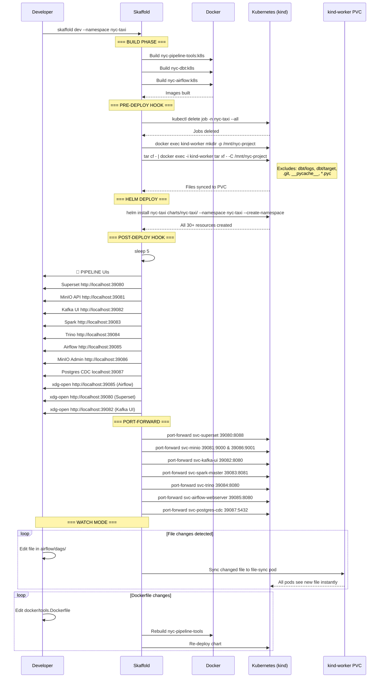

---

## 14.6 Service Topology & Dependencies

```mermaid
graph TB
    subgraph EXTERNAL["🌐 External Access (Port-Forward 39080-39087)"]
        SUP_UI["Superset UI<br/>:39080"]
        MINIO_UI["MinIO Console<br/>:39086"]
        KAFKA_UI["Kafka UI<br/>:39082"]
        SPARK_UI["Spark Master<br/>:39083"]
        TRINO_UI["Trino<br/>:39084"]
        AIR_UI["Airflow UI<br/>:39085"]
    end

    subgraph K8S_SERVICES["Kubernetes Services (ClusterIP)"]
        direction TB
        SVC_ZK["svc-zookeeper:2181"]
        SVC_KAFKA["svc-kafka:9092"]
        SVC_KAFKA_UI["svc-kafka-ui:8080"]
        SVC_MINIO["svc-minio:9000 / 9001"]
        SVC_SPARK_M["svc-spark-master:7077 / 8081"]
        SVC_SPARK_W["svc-spark-worker:8082"]
        SVC_TRINO["svc-trino:8080"]
        SVC_SUP["svc-superset:8088"]
        SVC_AIR_WEB["svc-airflow-webserver:8080"]
        SVC_PG_CDC["svc-postgres-cdc:5432"]
        SVC_DEBEZIUM["svc-debezium:8083"]
    end

    subgraph PODS["Pods (Containers)"]
        ZK["Zookeeper<br/>confluentinc/cp-zookeeper:7.6.1"]
        KAFKA["Kafka Broker<br/>confluentinc/cp-kafka:7.6.1<br/>initContainer: wait-zookeeper"]
        KAFKA_UI_POD["Kafka UI<br/>provectuslabs/kafka-ui:latest"]
        MINIO["MinIO S3<br/>minio/minio:latest<br/>server /data --console-address :9001"]
        SPARK_M["Spark Master<br/>apache/spark:3.5.1<br/>spark-class Master"]
        SPARK_W["Spark Worker<br/>apache/spark:3.5.1<br/>spark-class Worker"]
        TRINO["Trino Coordinator<br/>trinodb/trino:435"]
        SUP["Superset<br/>apache/superset:4.0.0"]
        AIR_PG["Airflow Postgres<br/>postgres:16-alpine"]
        AIR_SCH["Airflow Scheduler<br/>nyc-airflow:k8s"]
        AIR_WEB["Airflow Webserver<br/>nyc-airflow:k8s"]
        PG_CDC["Postgres CDC<br/>postgres:16-alpine<br/>wal_level=logical"]
        DEBEZIUM["Debezium Connect<br/>debezium/connect:2.5"]
        FILE_SYNC["file-sync<br/>nyc-pipeline-tools:k8s<br/>sleep infinity"]
    end

    subgraph JOBS_PODS["Jobs (One-Shot)"]
        MINIO_SETUP["minio-setup<br/>minio/mc:latest<br/>Create buckets + upload"]
        PG_INIT["postgres-init<br/>nyc-pipeline-tools:k8s<br/>psycopg2 create table"]
        TOPIC_INIT["topic-init<br/>nyc-pipeline-tools:k8s<br/>wait-kafka + create topics"]
    end

    %% Dependencies
    KAFKA -->|"depends on"| SVC_ZK
    KAFKA_UI_POD -->|"connects to"| SVC_KAFKA
    SPARK_W -->|"registers with"| SVC_SPARK_M
    
    TRINO -->|"reads from"| SVC_MINIO
    SUP -->|"queries"| SVC_TRINO
    AIR_SCH -->|"schedules pods on"| SVC_KAFKA
    AIR_SCH --> SVC_TRINO
    AIR_SCH --> SVC_MINIO
    
    DEBEZIUM -->|"connects to"| SVC_KAFKA
    DEBEZIUM -->|"captures from"| SVC_PG_CDC
    
    MINIO_SETUP --> SVC_MINIO
    PG_INIT --> SVC_PG_CDC
    TOPIC_INIT --> SVC_KAFKA

    %% UI connections
    SUP_UI --> SVC_SUP
    MINIO_UI --> SVC_MINIO
    KAFKA_UI --> SVC_KAFKA_UI
    SPARK_UI --> SVC_SPARK_M
    TRINO_UI --> SVC_TRINO
    AIR_UI --> SVC_AIR_WEB

    style EXTERNAL fill:#E8EAF6,color:#000
    style K8S_SERVICES fill:#FFF3E0,color:#000
    style PODS fill:#E3F2FD,color:#000
    style JOBS_PODS fill:#F3E5F5,color:#000
```

---

## 14.7 PVC Mounts và Node Affinity

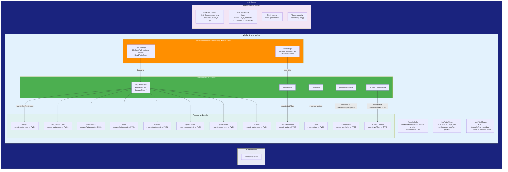

---

## 14.8 Port-Forward Mapping

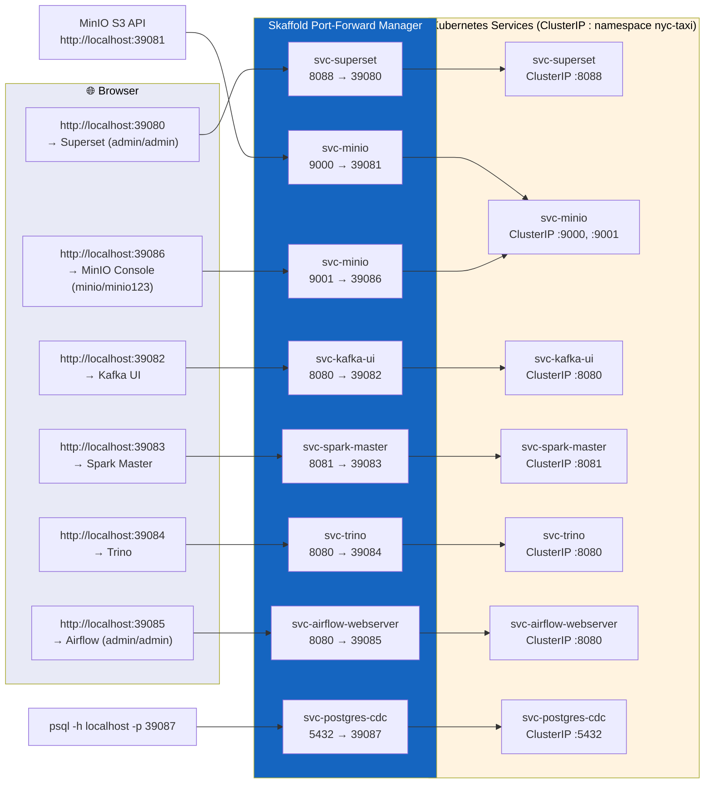

---

## 14.9 Docker Compose vs Skaffold Deployment Comparison

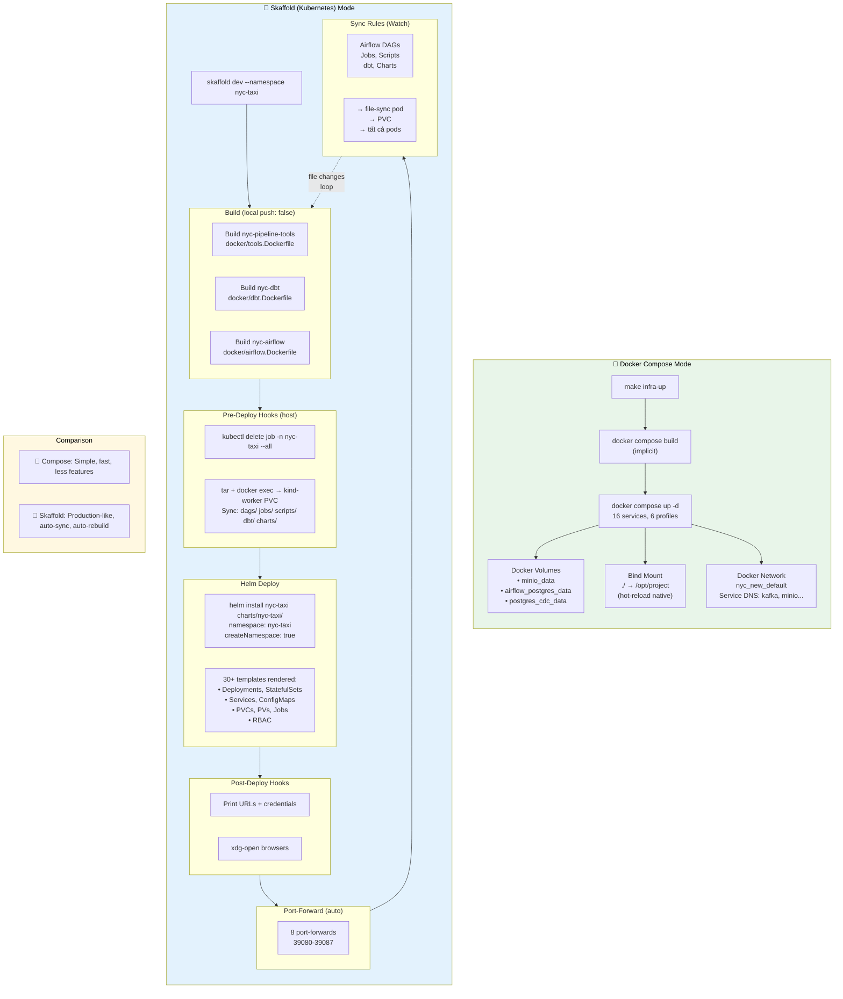

---

## 14.10 kind Cluster Creation Flow

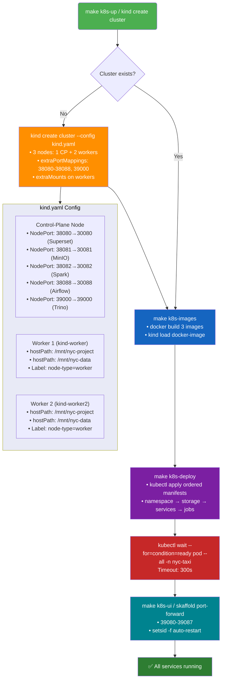
