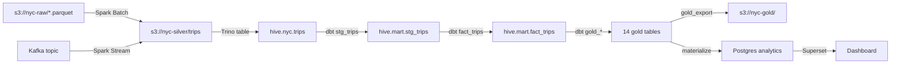

# 15. DataOps Roadmap — Từ Demo Pipeline đến Production-Ready

## 15.1 Hiện trạng: Tốt ở đâu, yếu ở đâu

### ✅ Đã tốt
| Thành phần | Đánh giá |
|---|---|
| **Orchestration** | Airflow KPO — mỗi task pod riêng, retry 3 lần, 3 DAG rõ ràng |
| **Infrastructure-as-Code** | Helm chart 30+ template, Skaffold auto-sync |
| **Transformations** | dbt 30 model, 24 test, staging→marts→gold đúng chuẩn |
| **Storage** | MinIO S3 — lakehouse architecture, dễ migrate lên cloud |
| **Validation** | 10 rule Spark + dbt tests + anomaly check |

### ❌ Còn thiếu cho DataOps
| GAP | Impact |
|---|---|
| **Không có staging environment** | Test thay đổi bằng cách phá dev cluster |
| **Không CI/CD cho dữ liệu** | Merge code xong mới biết pipeline fail |
| **Không monitoring/alerting** | Pipeline chết 4 tiếng không ai biết |
| **Pod logs bị xóa sau khi chạy xong** | Debug phải vào containerd node worker |
| **Không data contract** | Spark thay đổi schema → dbt âm thầm fail |
| **Không incident runbook** | Ai cũng biết "restart lại là được" |
| **gold_export/materialize không atomic** | Fail giữa chừng → bảng trắng, Superset lỗi |

---

## 15.2 DataOps Maturity Levels

```
Level 0 (Hiện tại):      Pipeline chạy được, thủ công hết
Level 1 (Target 2 tuần): Staging env + CI/CD dbt + Alerting cơ bản
Level 2 (Target 4 tuần): Data Contract + Lineage + Runbook
Level 3 (Target 8 tuần): Self-healing + Auto-scaling + Cost tracking
```

---

## 15.3 Level 1: Staging Environment + CI/CD (2 tuần)

### 15.3.1 Staging Environment

**Mục tiêu**: Tách biệt dev (code đang viết) khỏi staging (test trước khi merge).

```
┌──────────────┐    ┌───────────────┐
│  dev cluster │    │ staging cluster│
│  (hiện tại)  │    │  (namespace)   │
│              │    │                │
│  DAG manual  │    │  CI trigger    │
│  Data: 2024   │    │  Data: sample  │
│  Skaffold dev │    │  ArgoCD/GH Act │
└──────────────┘    └───────────────┘
```

**Thiết kế**:
- Dùng chung kind cluster, 2 namespaces: `nyc-taxi` (dev) và `nyc-taxi-staging`
- Staging: MinIO riêng (hoặc bucket prefix khác), Postgres riêng, data sample nhỏ
- Airflow DAG staging: chạy 1 tháng data thay vì toàn bộ
- Trigger bằng webhook GitHub khi push PR → chạy pipeline staging → báo Slack

**Việc cần làm (không code)**:
1. Quyết định: tách namespace hay tách cluster vật lý riêng
2. Chuẩn bị data sample cho staging (1 tháng NYC taxi thay vì 6 tháng)
3. Cấu hình Airflow connection riêng cho staging (MinIO, Postgres, Trino khác port/namespace)

### 15.3.2 CI/CD cho dbt

**Mục tiêu**: Mỗi PR thay đổi model dbt → tự động build + test trong staging → pass mới merge được.

```
PR mở ──→ GitHub Actions ──→ dbt build --target staging ──→ tests pass?
                                                              │
                                              ┌───────────────┤
                                              ▼ YES           ▼ NO
                                          merge được      comment lỗi vào PR
                                          + báo Slack      + không merge được
```

**Việc cần làm (không code)**:
1. Chọn CI platform: GitHub Actions (miễn phí, sẵn trong repo) hay GitLab CI
2. Định nghĩa workflow: `dbt build`, `dbt test`, chạy trên staging Trino
3. Quy tắc merge: require CI pass + 1 review

### 15.3.3 Alerting cơ bản

**Mục tiêu**: Pipeline fail → Slack/Telegram notification trong 5 phút.

| Sự kiện | Kênh | Delay |
|---|---|---|
| DAG task fail | Slack #nyc-alerts | < 2 phút |
| dbt test fail | Slack #nyc-alerts | < 2 phút |
| Data quality anomaly | Slack #nyc-alerts + email | < 5 phút |
| Trino/MinIO down | PagerDuty (nếu có) | < 5 phút |

**Việc cần làm (không code)**:
1. Tạo Slack webhook hoặc Telegram bot
2. Cấu hình Airflow callback `on_failure_callback` → webhook
3. Dùng sẵn Airflow Connection cho Slack/HTTP

---

## 15.4 Level 2: Data Contract + Lineage + Runbook (4 tuần)

### 15.4.1 Data Contract giữa Spark → dbt

**Vấn đề hiện tại**: Spark batch/streaming thay đổi schema (thêm cột, đổi kiểu) → dbt model `stg_trips` âm thầm fail vì column missing.

**Data Contract** (không code, chỉ định nghĩa):

```yaml
# contract.yaml — contract giữa Spark output và dbt input
table: silver_trips
columns:
  - name: pickup_ts
    type: timestamp
    nullable: false
  - name: dropoff_ts
    type: timestamp
    nullable: false
  - name: trip_distance
    type: double
    nullable: false
    constraints: ["value > 0"]
  - name: fare_amount
    type: double
    nullable: false
    constraints: ["value >= 0"]
  - name: passenger_count
    type: integer
    constraints: ["value >= 1 AND value <= 6"]
  - name: pickup_location_id
    type: integer
    nullable: false
  # ... 20+ columns
output_path: s3://nyc-silver/trips
partitioned_by: [pickup_year, pickup_month]
format: parquet
```

**Enforcement point**: `dbt build` → trước khi chạy model, check schema của Trino table với contract → mismatch → block pipeline + báo alert.

**Việc cần làm (không code)**:
1. Export schema hiện tại từ Trino (`DESCRIBE hive.nyc.trips`)
2. Viết contract file (YAML/JSON)
3. Chọn tool: `dbt contracts` (dbt 1.5+), `great_expectations`, hoặc script check đơn giản

### 15.4.2 Data Lineage

**Mục tiêu**: Biết được "bảng này đến từ đâu", "thay đổi Spark ảnh hưởng bảng nào".



**Việc cần làm (không code)**:
1. Đánh giá dbt lineage có sẵn: `dbt docs generate` → `dbt docs serve` — đã có DAG model trong project này chưa?
2. Nếu chưa, enable `dbt docs` và host static HTML trên S3/MinIO
3. Bổ sung upstream lineage (Spark → Trino, CDC → Kafka → Spark) bằng tài liệu, vì không tool nào auto-detect được

### 15.4.3 Incident Runbook

**Mục tiêu**: Khi pipeline fail, có checklist rõ ràng thay vì "restart thử xem".

```markdown
# Runbook: Pipeline Failure

## Phân loại lỗi

### 🔴 Critical (DAG không chạy được)
- Airflow scheduler down → kubectl describe pod airflow-scheduler
- Trino OOMKilled → tăng memory limit, split gold_export batches

### 🟡 Warning (DAG chạy, task fail)
- gold_export/materialize fail → kiểm tra Trino query memory, retry thủ công
- Spark batch fail → kiểm tra MinIO health, S3A JARs

### 🟢 Info (Success nhưng data quality thấp)
- dbt test fail → kiểm tra model nào fail, xem nguyên nhân
- anomaly detected → kiểm tra dashboard, confirm false positive

## Quy trình xử lý
1. Kiểm tra Airflow UI: task nào fail? Log nói gì?
2. Nếu pod bị xóa: kubectl get events -n nyc-taxi | grep task_id
3. Fix xong → clear task + rerun
4. Ghi vào incident log (GitHub issue)
```

**Việc cần làm (không code)**:
1. Viết runbook cho 5 lỗi phổ biến nhất
2. Lưu dưới dạng `docs/runbook.md` hoặc GitHub issue template

---

## 15.5 Level 3: Self-Healing + Auto-Scaling (8 tuần)

### 15.5.1 Self-Healing Pipeline

| Lỗi | Auto-fix |
|---|---|
| Trino OOM | Auto-split query thành batch, rerun |
| MinIO timeout | Retry with exponential backoff (đã có wait_for_minio) |
| Spark out of memory | Auto-tăng executor memory, rerun |
| dbt partial fail | Rerun failed models only (`dbt build --select result:error+`) |

### 15.5.2 Resource Monitoring

**Việc cần làm**:
1. Deploy Prometheus + Grafana để theo dõi Trino heap, MinIO disk, Spark CPU
2. Setup dashboard: pipeline latency, data volume trend, error rate
3. Alert rule: Trino heap > 80% → Slack, MinIO disk > 85% → email

### 15.5.3 Cost Tracking

**Việc cần làm**:
1. Tag pod với cost center: `nyc-pipeline`
2. Dùng kubecost hoặc script đơn giản: tổng CPU/RAM request của tất cả pod → chi phí ước tính
3. Báo cáo monthly cost report

---

## 15.6 Fixes cần làm NGAY (không cần DataOps level)

Đây là 3 bug đang gây đau thực tế, sửa trước khi làm staging/CI/CD:

| # | Bug | File | Effort |
|---|---|---|---|
| 1 | **gold_export CTAS fail** — Trino xóa table nhưng MinIO path còn, CTAS báo "path already exists" | `scripts/export_gold_to_minio.py` — thêm `clean_s3_path()` trước CTAS | Đã có code, hình như skip bước clean? |
| 2 | **materialize không atomic** — DROP xong INSERT fail → bảng trắng | `scripts/materialize_to_postgres.py` — swap table pattern | 30 phút |
| 3 | **Pod logs bị xóa** — `is_delete_operator_pod=true` (default) → không xem được log sau khi task chạy | `airflow/dags/nyc_e2e_pipeline.py` — set `is_delete_operator_pod=False` cho gold_export, materialize | 5 phút |

---

## 15.7 Lộ trình ưu tiên

```
Tuần 1 ─ Fix 3 bug ────────┐
Tuần 2 ─ Staging env ──────┤
Tuần 3 ─ CI dbt + Slack ───┤── Level 1
Tuần 4 ─ Data Contract ────┤
Tuần 5 ─ dbt docs/lineage ─┤── Level 2
Tuần 6 ─ Runbook ──────────┘
Tuần 7 ─ Prometheus/Grafana
Tuần 8 ─ Self-healing ─────── Level 3
```

---

## 15.8 Checklist: Đã sẵn sàng cho production chưa?

| Câu hỏi | Hiện tại | Target |
|---|---|---|
| Pipeline fail → ai biết? | ❌ Không ai biết | ✅ Slack alert < 2 phút |
| Thay đổi schema → ai check? | ❌ Không check | ✅ Data contract tự động block |
| Test trước merge ở đâu? | ❌ Merge rồi test trên dev | ✅ CI chạy trên staging |
| Incident xảy ra → làm gì? | ❌ Restart thử | ✅ Runbook từng bước |
| Dữ liệu có đúng không? | ✅ 24 dbt tests | ✅ Great Expectations thêm |
| Ai đã thay đổi model này? | ✅ Git history | ✅ dbt docs lineage |
| Pipeline chậm dần theo thời gian? | ❌ Không biết | ✅ Prometheus metric |
| Staging data có giống production không? | ❌ Không có staging | ✅ Sample data representative |
