# NYC Taxi Pipeline — Updated Architecture with Data Quality Monitoring

> Thiết kế hệ thống monitoring & quality gate. Không sửa code cũ.

---

## Hai luồng song song

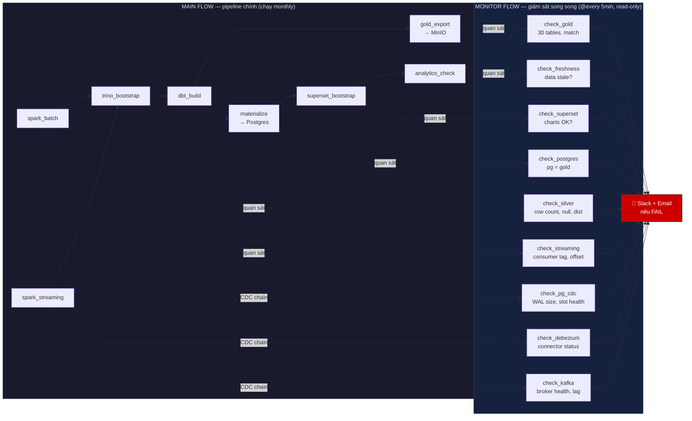

> **MAIN FLOW**: Chạy pipeline như cũ, không thay đổi gì.
> **MONITOR FLOW**: DAG riêng, chạy mỗi 5 phút, chỉ SELECT không ghi. Quan sát output từng node + CDC chain (Postgres CDC WAL, Debezium status, Kafka broker). Nếu phát hiện lỗi → Slack + Email.
> **Không can thiệp**: Monitor fail không ảnh hưởng MAIN. MAIN fail không ảnh hưởng Monitor.
> **Đường đứt nét** (`-.->`) = observation only, không phải dependency.
>
> **3 check CDC chain mới**: `check_pg_cdc` (WAL size + replication slot), `check_debezium` (connector RUNNING?), `check_kafka` (broker health + consumer lag). CDC chain chết → phát hiện trong < 5 phút thay vì 35 ngày (freshness check).

### Xử lý khi Spark batch timeout (data nhiều năm)

| Tình huống | Cách xử lý | Ai lo |
|---|---|---|
| **Lần đầu full load** (5 năm, ~180M dòng) → `local[*]` timeout | **Check resource pod trước**: nếu RAM > 8GB → chạy full. Nếu không → auto-split từng tháng sequential. Tăng `execution_timeout` lên 120 phút | Spark tự check `psutil.virtual_memory()` trước khi chạy |
| **Từ lần 2 trở đi** (thêm 1 tháng, ~3M dòng) | `--incremental` có sẵn trong Spark code, chỉ đọc partition mới → 3-4 phút | Không cần sửa gì |
| **Data tăng đột biến** (tháng cao điểm 6M dòng) | `local[*]` vẫn xử lý được 6M dòng ~5-6 phút | Không cần sửa |
| **Spark OOM** | Tăng `spark.driver.memory`, thêm `spark.sql.shuffle.partitions=200` | Spark submit args |
| **Spark OOM kill giữa chừng** → silver có file dở dang → incremental skip luôn tháng đó → mất data vĩnh viễn | **Ghi vào thư mục tạm** (`silver/_tmp/month=06`) → ghi xong mới move vào `silver/trips/month=06`. Nếu crash → thư mục `_tmp` bị bỏ lại, không ảnh hưởng data cũ. Retry → xóa `_tmp` → ghi lại từ đầu | Spark code + verify_gate check row count tháng mới |
| **Trino OOM sau khi Spark xong** | Partition gold export theo `pickup_year`, giới hạn concurrent query = 5 | DAG + Trino config |

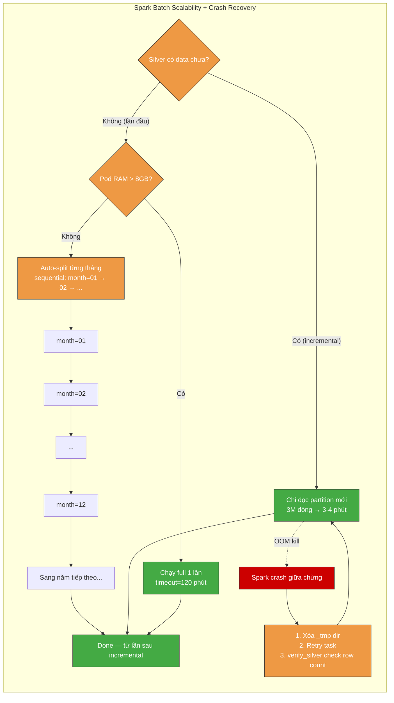

---

## 1. Pipeline Nodes — 13 Node, Output Contract

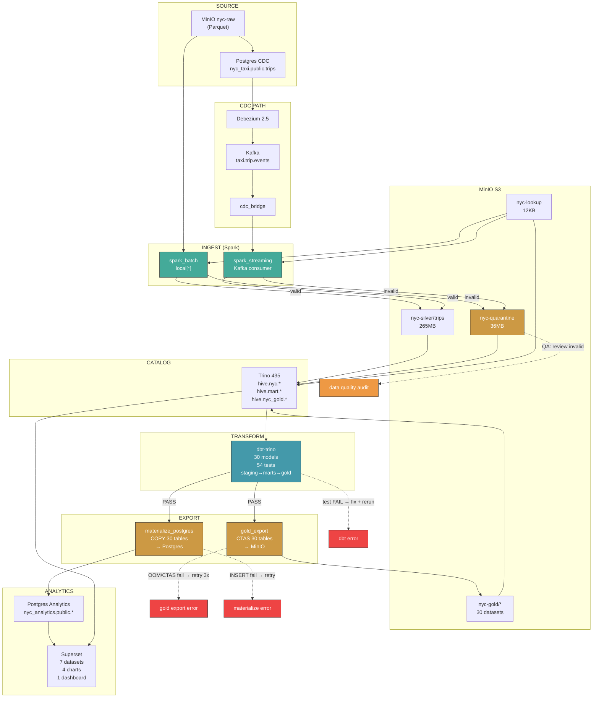

---

## 2. Quality Gate Layer — 5 Gates Block Pipeline

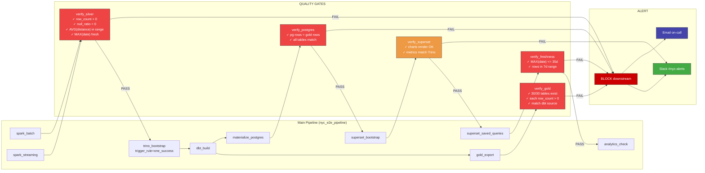

---

## 3. Full Data Lineage — End to End

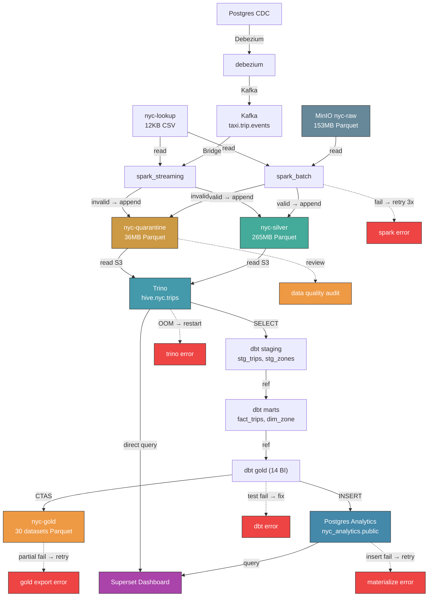

---

## 4. Cross-Node Reconciliation

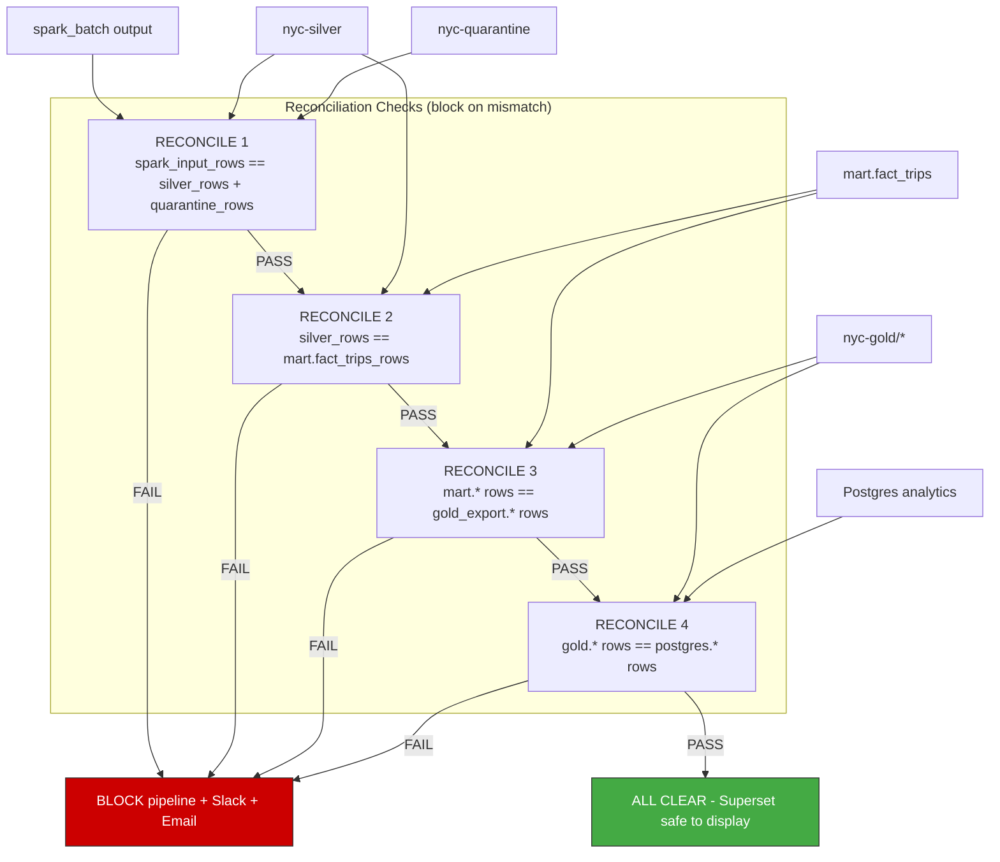

---

## 5. Failure Mode → Detection → Response

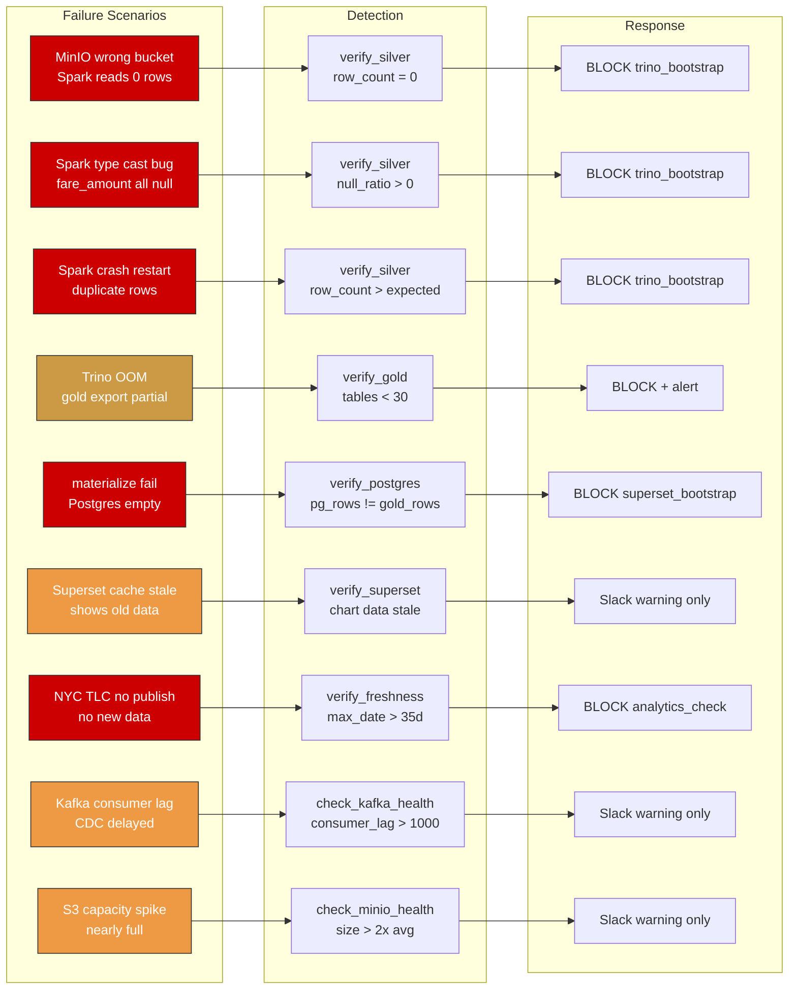

---

## 6. Per-Node Output Contract (Example)

```yaml
# contracts/silver.yaml — what spark_batch must produce
node: spark_batch + spark_streaming
output: hive.nyc.trips
owner: data-engineering
checks:
  - name: min_row_count
    query: SELECT COUNT(*) FROM hive.nyc.trips
    assert: "> 1000000"
    severity: CRITICAL
  - name: no_null_fare
    query: SELECT COUNT(*) FROM hive.nyc.trips WHERE fare_amount IS NULL
    assert: "== 0"
    severity: CRITICAL
  - name: distance_sane
    query: SELECT AVG(trip_distance) FROM hive.nyc.trips
    assert: "> 1 AND < 20"
    severity: WARNING
  - name: passenger_count_range
    query: >
      SELECT COUNT(*) FROM hive.nyc.trips
      WHERE passenger_count < 1 OR passenger_count > 6
    assert: "== 0"
    severity: CRITICAL
  - name: location_exists
    query: >
      SELECT COUNT(*) FROM hive.nyc.trips t
      LEFT JOIN hive.nyc.taxi_zone_lookup z
        ON t.pickup_location_id = z.location_id
      WHERE z.location_id IS NULL
    assert: "== 0"
    severity: WARNING
  - name: freshness
    query: SELECT MAX(pickup_date) FROM hive.nyc.trips
    assert: ">= CURRENT_DATE - INTERVAL '60' DAY"
    severity: CRITICAL
  - name: quarantine_ratio
    query: |
      SELECT CAST(q.cnt AS DOUBLE) / NULLIF(s.cnt, 0) * 100.0
      FROM (SELECT COUNT(*) AS cnt FROM hive.nyc.trips) s
      CROSS JOIN (SELECT COUNT(*) AS cnt FROM hive.nyc.invalid_trips) q
    assert: "<= 15"
    severity: WARNING
```

---

## 8. Postgres CDC — Production Hardening

### Hiện trạng

```yaml
# charts/nyc-taxi/templates/postgres-cdc/statefulset.yaml
image: postgres:16-alpine
replicas: 1
args: [wal_level=logical, max_replication_slots=4, max_wal_senders=4]
resources: {cpu: 200m-500m, memory: 512Mi-1Gi}
```

### Vấn đề

| # | Vấn đề | Hậu quả |
|---|---|---|
| 1 | **Không giới hạn WAL size** — không set `max_wal_size` | Debezium chết vài giờ → WAL tích lũy vô hạn → disk full → Postgres crash |
| 2 | **Không `wal_keep_size`** — WAL có thể bị xóa trước khi Debezium kịp đọc | Debezium lag > WAL retention → "requested WAL segment has already been removed" → phải re-snapshot |
| 3 | **Single replica** — không HA | Pod chết → CDC pipeline ngừng → WAL tích lũy |
| 4 | **PVC không backup, không snapshot** | Node die → mất toàn bộ data CDC |
| 5 | **Không connection pooling** | Debezium + cdc_seed + app query → exhaustion |
| 6 | **Không monitor replication slot** | Slot đầy không ai biết → Debezium không start được |
| 7 | **Password plaintext** | `POSTGRES_PASSWORD=postgres` |

### Thiết kế production

```yaml
# Production Postgres CDC config
postgresql:
  # ── WAL management (cân bằng giữa an toàn và ổ cứng) ──
  max_wal_size: 4GB          # WAL tối đa — chặn disk full
  min_wal_size: 1GB          # WAL tối thiểu — giữ cho Debezium lag
  wal_keep_size: 2GB         # Giữ WAL ít nhất 2GB để Debezium catch-up
  max_replication_slots: 5   # Dự phòng: 1 active + 1 spare
  max_wal_senders: 5
  wal_sender_timeout: 60s    # Kill sender nếu Debezium không phản hồi

  # ── Resource (cho 100K rows CDC) ──
  resources:
    requests: {cpu: 500m, memory: 1Gi}
    limits: {cpu: 2, memory: 4Gi}
  shared_buffers: 512MB
  effective_cache_size: 2GB

  # ── Connection pool ──
  max_connections: 100
  # Dùng PgBouncer sidecar nếu nhiều service connect

  # ── Backup (RDS hoặc cron job) ──
  # Option A: pg_dump cron mỗi ngày → S3
  # Option B: WAL archiving → S3 (pitr recovery)
  archive_mode: on
  archive_command: 'aws s3 cp %p s3://nyc-backup/wal/%f'

  # ── Replication slot monitor ──
  # Query: SELECT slot_name, active, restart_lsn, pg_wal_lsn_diff(pg_current_wal_lsn(), restart_lsn) AS lag_bytes
  # FROM pg_replication_slots;
  # Alert nếu active=false hoặc lag > 1GB

  # ── High Availability ──
  # Option A: RDS Multi-AZ (managed, auto failover)
  # Option B: Patroni + etcd (self-managed, 3 replicas)
  # Option C: CloudNativePG operator (K8s native)
```

### Strategy: WAL không được đầy, không được mất

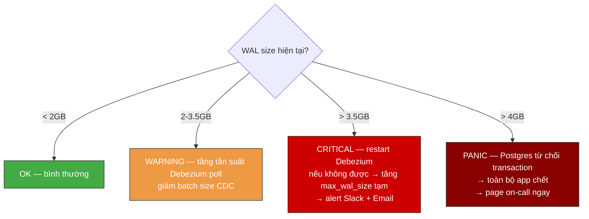

### Monitor queries (Monitor DAG @every 5min)

```sql
-- 1. WAL size
SELECT pg_size_pretty(pg_current_wal_lsn() - '0/0') AS wal_size;

-- 2. Replication slot health
SELECT slot_name, active, 
       pg_size_pretty(pg_wal_lsn_diff(pg_current_wal_lsn(), restart_lsn)) AS lag
FROM pg_replication_slots;

-- 3. Replication slot count warning
SELECT COUNT(*) FROM pg_replication_slots;
-- Alert nếu = max_replication_slots → sắp đầy

-- 4. Dead tuples (cần VACUUM)
SELECT relname, n_dead_tup FROM pg_stat_user_tables WHERE n_dead_tup > 10000;
```

### Decision: Tự host hay RDS?

| Yếu tố | Self-host (StatefulSet) | AWS RDS |
|---|---|---|
| **WAL management** | Tự config | Auto — `max_allocated_storage` |
| **Backup** | Tự pg_dump + S3 | Auto snapshot + pitr 35 ngày |
| **HA** | Patroni phức tạp | Multi-AZ checkbox |
| **Replication slot** | Tự monitor | CloudWatch metric |
| **Cost** | EC2 + disk | RDS instance cost |
| **Phù hợp cho** | Dev/staging | Production |

**Khuyến nghị:** Dev giữ StatefulSet. Production dùng RDS + `rds.logical_replication=1`.

**Pod count:** Dev = 1 pod (StatefulSet). Production = 0 pod (RDS managed).

---

## 9. Debezium — Production Hardening

### Hiện trạng

```yaml
# DAG: cdc_register → gọi entrypoint-cdc-register → Debezium REST API
# POST /connectors — tạo connector với config:
{
  "connector.class": "io.debezium.connector.postgresql.PostgresConnector",
  "database.hostname": "svc-postgres-cdc",
  "slot.name": "nyc_cdc",
  "publication.name": "nyc_cdc_pub"
}
```

### Vấn đề

| # | Vấn đề | Hậu quả |
|---|---|---|
| 1 | **Snapshot initial lần đầu quét toàn bộ table** — chưa set `snapshot.mode` | Debezium lock table + produce vài GB events Kafka → Kafka disk full + spark_streaming overload |
| 2 | **Single-thread per connector** — không scale được theo table | 1 connector = 1 thread WAL + 1 thread produce → nếu nhiều table thay đổi → backlog |
| 3 | **Transform quá nặng** — mặc định serialize cả `before`/`after`/schema → mỗi event vài KB | 1M events/giờ = vài GB Kafka → tốn disk + network |
| 4 | **Kafka producer chưa tune** — không batch, không compress | 1 request/event → network overhead cao → produce chậm |
| 5 | **Offset lưu trong Kafka** — nếu Kafka topic offset bị expire | Debezium mất offset → nghĩ chưa đọc gì → re-snapshot → duplicate toàn bộ |
| 6 | **Không monitor lag** — `MilliSecondsBehindSource` | Lag tăng dần → WAL đầy → không ai biết đến khi DB crash |
| 7 | **Delete event không xử lý** — `after=null` bị bỏ qua | Row xóa trong Postgres → vẫn còn trong silver → data stale |

### Thiết kế production

```json
{
  "connector.class": "io.debezium.connector.postgresql.PostgresConnector",
  
  "snapshot.mode": "schema_only",
  
  "transforms": "unwrap,route",
  "transforms.unwrap.type": "io.debezium.transforms.ExtractNewRecordState",
  "transforms.unwrap.drop.tombstones": "false",
  "transforms.unwrap.delete.handling.mode": "rewrite",
  
  "producer.override.batch.size": "65536",
  "producer.override.linger.ms": "50",
  "producer.override.compression.type": "lz4",
  "producer.override.max.request.size": "1048576",
  
  "max.batch.size": "4096",
  "max.queue.size": "65536",
  "poll.interval.ms": "100",
  
  "offset.storage.topic": "nyc_cdc_offset",
  "offset.storage.partitions": 3,
  "offset.storage.replication.factor": 1,
  "offset.flush.interval.ms": "10000",
  
  "errors.log.enable": "true",
  "errors.log.include.messages": "true",
  "errors.deadletterqueue.topic.name": "nyc_cdc_dlq",
  "errors.deadletterqueue.context.headers.enable": "true"
}
```

### Giải thích từng config

| Config | Giá trị | Tại sao |
|---|---|---|
| `snapshot.mode=schema_only` | Chỉ lấy schema, không snapshot data | Data đã có từ batch, không cần duplicate. Tránh lock table + full scan |
| `transforms=ExtractNewRecordState` | Chỉ lấy `after`, bỏ `before` + schema metadata | Giảm event size 70% → Kafka disk tiết kiệm |
| `delete.handling.mode=rewrite` | Delete event → produce event với `__deleted=true` | Không mất delete, consumer tự lọc |
| `batch.size=65536 + linger.ms=50` | Gộp event thành batch 64KB, đợi 50ms | Giảm network request 10-50x |
| `max.batch.size=4096` | Đọc tối đa 4096 event/lần từ WAL | Tránh 1 lần đọc quá nhiều → OOM |
| `offset.storage.topic=nyc_cdc_offset` | Lưu offset trong Kafka topic riêng | Nếu topic chính expire, offset vẫn còn |
| `errors.deadletterqueue.topic` | Event lỗi → DLQ topic | Không drop event, replay được |

### Monitor Debezium (Monitor DAG)

```
GET /connectors/nyc-cdc-connector/status

Check:
  connector.state == "RUNNING"           → PASS
  tasks[0].state == "RUNNING"            → PASS
  MilliSecondsBehindSource < 300000       → PASS (< 5 phút)
  MilliSecondsBehindSource > 300000       → WARNING → Slack
  connector.state == "FAILED"            → CRITICAL → Slack + Email
```

### Decision: Giữ Debezium hay bỏ?

| Yếu tố | Giữ Debezium | Bỏ Debezium, dùng polling |
|---|---|---|
| **Real-time** | ✅ Dưới 1 giây | ❌ Delay 5-60 phút |
| **Độ phức tạp** | ❌ Kafka + Connect cluster | ✅ Chỉ cần Python script + cron |
| **Bắt delete** | ✅ Auto | ❌ Phải soft-delete + flag |
| **DB load** | ✅ Đọc WAL, nhẹ | ❌ SELECT query liên tục |
| **Phù hợp** | Production multi-table CDC | Demo/single-table/không cần real-time |

**Khuyến nghị:** Giữ Debezium nếu có >1 table cần CDC + cần real-time. Pipeline này monthly batch → polling đủ dùng, bỏ Debezium cho đỡ phức tạp.

**Pod count:** Dev = 1 pod. Production = 1 pod (K8s auto-restart là đủ).

---

## 10. Kafka — Production Hardening

### Hiện trạng

```yaml
# charts/nyc-taxi/templates/kafka/statefulset.yaml
image: confluentinc/cp-kafka:7.4.0
replicas: 1
resources: {cpu: 500m-1, memory: 1Gi-2Gi}
topics: [taxi.trip.events, nyc_cdc.public.trips]
```

### Vấn đề

| # | Vấn đề | Hậu quả |
|---|---|---|
| 1 | **Single broker + 1 partition/topic** — không scale | 1 consumer max → spark_streaming single-thread |
| 2 | **Retention = 7 ngày mặc định** | Spark streaming nghỉ >7 ngày → offset cũ bị xóa → re-read từ earliest → duplicate hoặc failOnDataLoss crash |
| 3 | **Producer không idempotent** — cdc_bridge retry → duplicate message | Network fail → retry → 1 row CDC thành 2 message trong Kafka → spark_streaming duplicate silver |
| 4 | **No compaction** — delete tombstone tích lũy nhưng không merge | Topic chỉ thêm mới, không bao giờ giảm → disk tăng vô hạn |
| 5 | **No DLQ topic** — message hỏng drop âm thầm | spark_streaming crash với poison pill → recover bằng cách skip offset → mất message |
| 6 | **No consumer group monitoring** | Không biết spark_streaming đang lag bao nhiêu offset |

### Thiết kế production

```properties
# ── Topic config ──
taxi.trip.events:
  partitions: 3
  retention.ms: 1209600000       # 14 ngày
  cleanup.policy: compact,delete # compact tombstone + delete hết hạn
  min.cleanable.dirty.ratio: 0.5

taxi.trip.events.dlq:
  partitions: 1
  retention.ms: 2592000000       # 30 ngày — giữ lâu để debug

nyc_cdc_offset:
  partitions: 3
  retention.ms: -1               # Không expire — offset không được mất
  cleanup.policy: compact

# ── Broker config ──
num.partitions: 3
log.retention.hours: 336         # 14 ngày
log.segment.bytes: 268435456     # 256MB segment
auto.create.topics.enable: false # Cấm auto-create topic

# ── Producer config (cdc_bridge) ──
enable.idempotence: true         # Chống duplicate
acks: all                        # Chờ tất cả ISR confirm
compression.type: lz4
linger.ms: 50
batch.size: 65536

# ── Consumer config (spark_streaming) ──
group.id: spark-stream-nyc-v1    # Cố định group → track offset
auto.offset.reset: latest        # Nếu mất offset → đọc từ latest (không re-process 14 ngày)
enable.auto.commit: false        # Spark tự quản lý offset qua checkpoint
isolation.level: read_committed  # Chỉ đọc transaction đã commit
```

### Giải thích từng config

| Config | Giá trị | Tại sao |
|---|---|---|
| `partitions: 3` | 3 partition/topic | Spark streaming có thể parallel 3 consumer → nhanh 3x. Đủ cho vài triệu event/ngày |
| `retention: 14 ngày` | Đủ dài để spark recover | Nếu spark chết 1 tuần → vẫn đọc được backlog |
| `cleanup.policy=compact,delete` | Compaction merge key trùng + xóa hết hạn | Tombstone delete được merge → disk không tăng vô hạn |
| `enable.idempotence=true` | Producer không duplicate | cdc_bridge retry → Kafka biết message đã tồn tại → dedup |
| `auto.create.topics.enable=false` | Cấm auto-create | Tránh tạo topic rác khi gõ sai tên |
| `group.id cố định` | group cố định, không random | Spark track offset qua lần restart → không duplicate |
| `auto.offset.reset=latest` | Mất offset → đọc từ latest | Thà bỏ qua backlog còn hơn duplicate toàn bộ 14 ngày data |

### Monitor Kafka (Monitor DAG)

```
kafka-consumer-groups --bootstrap-server svc-kafka:9092 \
  --group spark-stream-nyc-v1 --describe

Check:
  LAG per partition < 1000      → PASS
  LAG per partition > 1000      → WARNING → Slack
  LAG per partition > 10000     → CRITICAL → Slack + Email
  DLQ topic message count > 0   → WARNING → Slack (có poison pill cần xem)
  Broker disk usage < 85%       → PASS
  Broker disk usage > 85%       → CRITICAL → Slack + Email
```

**Pod count:** Dev = 1 pod (1 broker, đủ cho demo). Production = 3 pod (3 broker cluster — chịu được 1 broker chết không mất data).

### CDC Chain Pod Summary

| Component | Dev | Production | Ghi chú |
|---|---|---|---|
| Postgres CDC | 1 pod (StatefulSet) | 0 pod (RDS) | RDS lo HA + backup |
| Debezium | 1 pod | 1 pod | K8s auto-restart |
| Kafka | 1 pod (1 broker) | 3 pod (3 broker) | Production cần cluster |
| **Tổng** | **3 pod** | **4 pod + RDS** | |

---

## 11. Spark Streaming — Production Hardening

### Vấn đề hiện tại

| # | Vấn đề | Hậu quả |
|---|---|---|
| 1 | **Ghi chung path với batch** — `s3a://nyc-silver/trips` | Conflict, không biết row nào từ nguồn nào, không monitor riêng được |
| 2 | **cdc_bridge group_id random** — mỗi lần chạy group mới | Đọc từ offset 0 → duplicate toàn bộ CDC event → duplicate silver |
| 3 | **cdc_bridge không có idempotent producer** — retry → duplicate message | Network fail → Kafka có 2 message giống nhau → spark_streaming duplicate |
| 4 | **`failOnDataLoss=false`** — nuốt lỗi âm thầm | Kafka message hết retention → spark bỏ qua → mất data không ai biết |
| 5 | **`trigger=availableNow`** — chạy 1 lần rồi dừng | Không phải real-time, không catch-up được backlog dài |
| 6 | **Không có DLQ** — poison pill giết cả stream | 1 message hỏng → cả batch foreachBatch fail → stream dừng |
| 7 | **Checkpoint S3 — mất là chết** | Checkpoint corrupt/xóa → spark đọc lại từ `earliest` → duplicate toàn bộ |
| 8 | **Delete event bị bỏ qua** — `after=null` trong Debezium | Row xóa trong Postgres → vẫn còn trong silver → data stale vĩnh viễn |

### Thiết kế production

#### 1. Tách path — batch riêng, stream riêng

```
nyc-silver/
├── batch/trips/              ← spark_batch ghi
│   pickup_year=2024/
│       pickup_month=01/
├── stream/trips/             ← spark_streaming ghi
│   pickup_year=2024/
│       pickup_month=01/
└── checkpoints/
    spark_stream_taxi_events/
```

#### 2. Merge ở dbt staging

```sql
-- dbt/models/staging/stg_trips.sql (concept)
WITH batch AS (
    SELECT *, 'batch' AS source_type FROM hive.nyc.batch_trips
),
stream AS (
    SELECT *, 'stream' AS source_type FROM hive.nyc.stream_trips
)
SELECT * FROM batch
UNION ALL
SELECT * FROM stream
```

#### 3. Soft delete — không xóa, chỉ đánh dấu

```sql
-- Thêm cột is_deleted (BOOLEAN DEFAULT false)
-- dbt model lọc:
SELECT * FROM stg_trips WHERE is_deleted = false
```

#### 4. cdc_bridge sửa 3 thứ

| Config | Cũ | Mới | Tại sao |
|---|---|---|---|
| `group_id` | `cdc-bridge-{random}` | `cdc-bridge-v1` | Giữ offset qua lần restart |
| `enable_auto_commit` | `false` | `true` | Commit offset sau khi produce |
| Producer config | Mặc định | `enable.idempotence=true, acks=all` | Chống duplicate message |
| Delete event | Bỏ qua (`after=null`) | Produce tombstone `{"op": "d", ...}` | Không mất delete |

#### 5. Spark streaming config mới

| Config | Cũ | Mới | Tại sao |
|---|---|---|---|
| `failOnDataLoss` | `false` | `true` | Không nuốt lỗi — crash để alert |
| `startingOffsets` | `earliest` | Checkpoint (auto) | Không re-process |
| Trigger | `availableNow` | `processingTime="5min"` | Chạy liên tục, catch-up backlog |
| Silver path | `nyc-silver/trips` | `nyc-silver/stream/trips` | Tách với batch |
| Poisson pill | Crash stream | Try-catch trong `foreachBatch` → gửi vào `taxi.trip.events.dlq` → stream tiếp tục |

### Kiến trúc CDC chain sau khi sửa

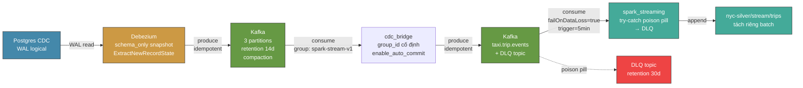

### Merge flowchart: batch + stream → 1 view

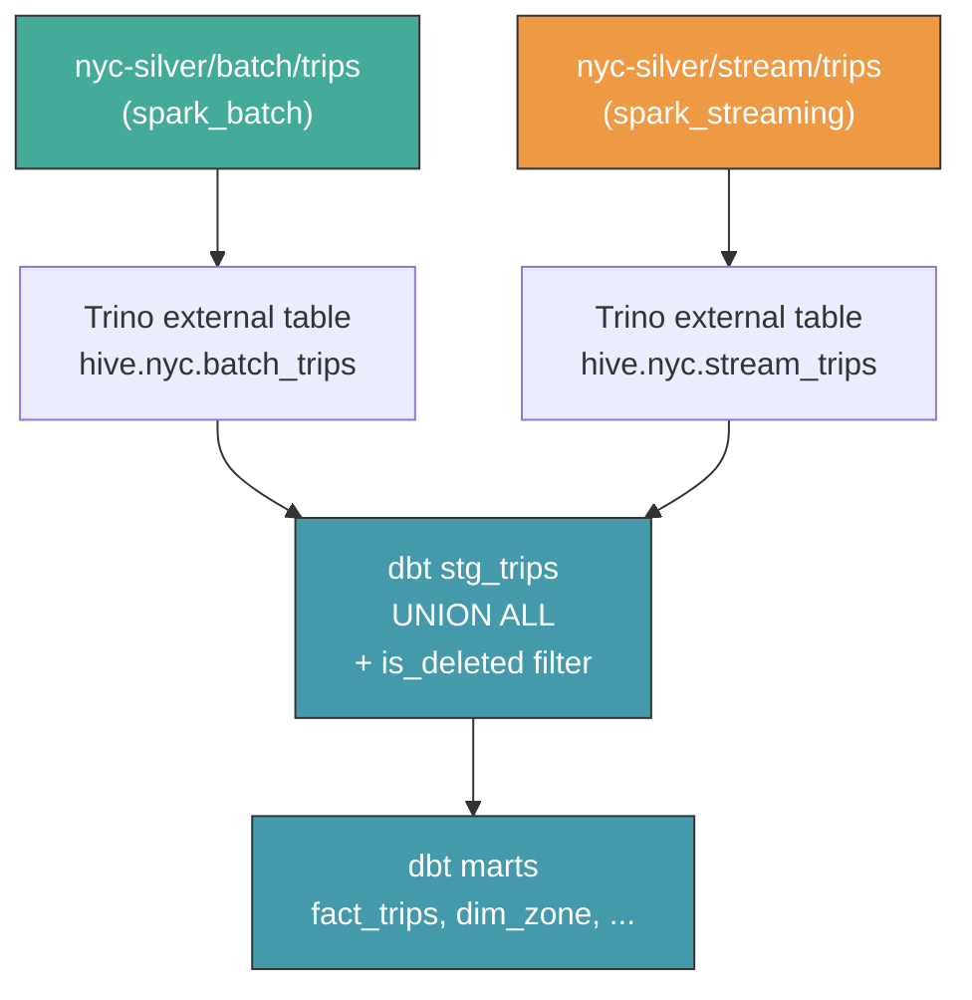

### Monitor CDC chain — ai check gì

```
Monitor DAG (@every 5min):

check_pg_cdc:
  → SELECT 1 FROM postgres-cdc
  → WAL size: pg_current_wal_lsn()
  → Replication slot: active?
  → Fail → Slack + Email

check_debezium:
  → GET /connectors/nyc-cdc-connector/status
  → status == RUNNING?
  → MilliSecondsBehindSource < 300000?
  → Fail → Slack + Email

check_kafka:
  → Consumer group spark-stream-v1 lag
  → LAG < 1000?
  → DLQ topic message count == 0?
  → Fail → Slack + Email

check_streaming:
  → spark_streaming checkpoint OK?
  → silver/stream/trips row count > 0?
  → Fail → Slack + Email
```

---

## 12. MinIO — Intake Validation

### Hiện trạng

Spark đọc trực tiếp từ `s3a://nyc-raw/yellow_taxi/year=*/month=*/*.parquet`. Không có validation trước khi đọc. File sai → Spark crash → cả batch chết.

### Vấn đề

| # | Vấn đề | Hậu quả |
|---|---|---|
| 1 | **File sai schema** (thiếu cột, sai kiểu dữ liệu, không phải Parquet) → Spark crash | 1 file hỏng → cả batch chết. Retry 3 lần vẫn chết vì không fix được file |
| 2 | **File sai tên/bị đặt sai chỗ** → glob không quét được | File bị bỏ qua âm thầm → data thiếu, không ai biết |
| 3 | **Upload lại file đã xử lý** → không phân biệt cũ/mới | Duplicate trong silver, incremental không phát hiện vì MAX(pickup_month) không đổi |

### Thiết kế — Pre-ingest validation

1 script `validate_raw_files.py` chạy **trước spark_batch**, kiểm tra từng file mới trong raw bucket. Chỉ 1 rule: file PHẢI theo chuẩn.

```python
# scripts/validate_raw_files.py (concept)
# Chạy trước spark_batch — nếu fail → block spark

for each new file in s3://nyc-raw/yellow_taxi/:
    
    # ── LEVEL 1: PATH & FORMAT ──
    if not path.match("year=*/month=*/"):
        → move to _quarantine/ + Slack: "File sai partition path"
    if not file.endswith(".parquet"):
        → move to _quarantine/ + Slack: "File không phải Parquet"
    if file.size == 0:
        → move to _quarantine/ + Slack: "File rỗng 0 bytes"
    
    # ── LEVEL 2: SCHEMA ──
    # Kiểm tra parquet magic bytes (PAR1) → file corrupt
    # Đọc schema → check đủ 19 cột bắt buộc
    required_cols = {
        "VendorID", "tpep_pickup_datetime", "tpep_dropoff_datetime",
        "passenger_count", "trip_distance", "RatecodeID", "PULocationID",
        "DOLocationID", "payment_type", "fare_amount", "extra", "mta_tax",
        "tip_amount", "tolls_amount", "improvement_surcharge", "total_amount"
    }
    if not required_cols.issubset(parquet_schema.columns):
        → move to _quarantine/ + Slack: f"Thiếu cột: {missing}"
    
    # ── LEVEL 3: DUPLICATE CHECK ──
    if file.etag in state_file["processed"]:
        → skip + log: "File đã xử lý"
    
    # PASS → keep in raw + add to state_file
```

### Flow

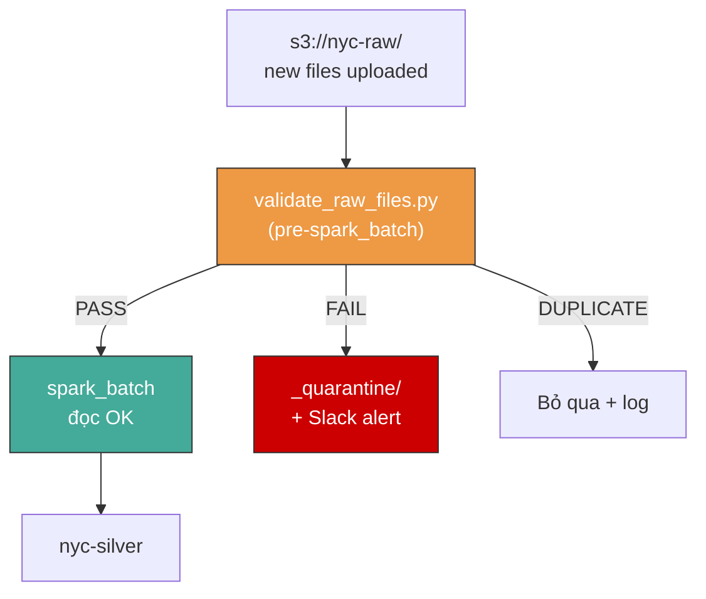

### DAG integration

```
validate_raw_files → spark_batch → verify_silver → ...
```

Nếu validate fail (có file trong quarantine) → vẫn cho spark_batch chạy (file hỏng đã được move ra khỏi raw). Slack alert để người xem file hỏng.

### Định dạng bắt buộc

```
ĐÚNG:   s3://nyc-raw/yellow_taxi/year=2024/month=01/yellow_tripdata_2024-01.parquet
SAI:    s3://nyc-raw/yellow_taxi/2024/01/file.parquet         (thiếu year=/month=)
SAI:    s3://nyc-raw/yellow_taxi/year=2024/month=01/file.csv  (sai đuôi)
SAI:    s3://nyc-raw/yellow_taxi/year=2024/file.parquet       (thiếu month=)
SAI:    s3://nyc-raw/yellow_taxi/data.parquet                 (không partition)
```

File không đúng → `_quarantine/` + Slack. Không hỗ trợ daily/weekly/yearly/flat.

---

## 13. Trino — Production Hardening

### Hiện trạng

```yaml
# Container: trino:435
# JVM: -Xmx6G, G1GC
# max_concurrent_queries: 1
# Metastore: file-based (/opt/project/data/trino-metastore)
```

### Vấn đề

| # | Vấn đề | Hậu quả |
|---|---|---|
| 1 | **OOM khi gold_export chạy 30 CTAS liên tiếp** — query memory không kịp giải phóng | 28/30 xong, bảng 29 OOMKilled → pod restart → retry từ đầu → fail loop |
| 2 | **max 1 concurrent query** — 1 query nặng chiếm hết | dbt, gold_export, Superset, materialize tất cả phải xếp hàng → DAG timeout |
| 3 | **File-based metastore** — corrupt là mất hết | PVC die → mất toàn bộ catalog → phải tạo lại từ `trino_register.py` |
| 4 | **Partition không tự sync** — phải chạy `sync_partition_metadata` thủ công | Spark ghi partition mới → Trino không thấy → query thiếu data |
| 5 | **Single node — không HA** | Pod chết → không ai query được → Superset trắng, dbt không build |
| 6 | **Không query monitoring** — không biết query nào nặng | OOM xảy ra không biết query nào gây ra, không audit được |

### Thiết kế production

#### 1. Chống OOM + tăng concurrency

```properties
# config.properties
query.max-memory=8GB               # Tăng từ 4GB
query.max-memory-per-node=4GB      # 4GB/query
query.max-total-memory=12GB        # Tổng cluster (nếu multi-node)
query.max-concurrent-queries=5     # Tăng từ 1 → 5

# Resource group — giới hạn riêng cho gold_export
resource-groups.configuration-manager=file
resource-groups.config-file=etc/resource-groups.json
```

```json
// resource-groups.json
{
  "rootGroups": [
    {
      "name": "gold_export",
      "softMemoryLimit": "3GB",
      "maxQueued": 3,
      "hardConcurrencyLimit": 2,    // Tối đa 2 CTAS cùng lúc
      "schedulingPolicy": "weighted_fair"
    },
    {
      "name": "adhoc",
      "softMemoryLimit": "2GB",
      "maxQueued": 10,
      "hardConcurrencyLimit": 3     // dbt + superset + materialize
    }
  ]
}
```

**Kết quả:** gold_export chỉ chạy 2 CTAS cùng lúc, mỗi cái 3GB max → không OOM. dbt + Superset vẫn query được song song.

#### 2. Tối ưu gold_export — batch CTAS

```python
# export_gold_to_minio.py — thay vì chạy 30 CTAS liên tiếp
# Chia thành 3 batch × 10 bảng, mỗi batch nghỉ 30s cho Trino dọn memory

batches = [GOLD_DATASETS[0:10], GOLD_DATASETS[10:20], GOLD_DATASETS[20:30]]
for batch in batches:
    for ds in batch:
        run_ctas(ds)
    time.sleep(30)  # Cho Trino GC + giải phóng memory
```

#### 3. Metastore — file-based backup hoặc migrate Glue

| Môi trường | Giải pháp | Tại sao |
|---|---|---|
| **Dev** | File-based + PVC backup cron (`tar` metastore dir → S3 mỗi ngày) | Đơn giản |
| **Production** | **AWS Glue Catalog** | Managed, không corrupt, có versioning, tích hợp Trino native |

```properties
# Trino catalog config (production)
hive.metastore=glue
hive.metastore.glue.region=us-east-1
hive.metastore.glue.catalogid=123456789012
```

#### 4. Auto partition sync

```python
# Sau khi spark_batch xong → gọi sync partitions
# Thêm vào DAG: spark_batch >> sync_partitions >> dbt_build

# Hoặc: Trino config tự động sync khi query
hive.allow-drop-table=true
hive.allow-rename-table=true
hive.allow-add-column=true
hive.auto-purge=true
```

Hoặc dùng Trino event listener hook — mỗi lần query, nếu partition không tồn tại → tự `CALL system.sync_partition_metadata()`.

#### 5. Multi-node HA (production only)

```yaml
# Dev: 1 pod OK
# Production: 1 coordinator + 2 workers
coordinator:
  replicas: 1
  resources: {cpu: 1, memory: 8Gi}
worker:
  replicas: 2
  resources: {cpu: 2, memory: 8Gi}
```

#### 6. Query monitoring

```sql
-- Trino có sẵn system.runtime.queries — Monitor DAG query bảng này
SELECT query_id, user, query, state,
       resource_group_id,
       created, ended,
       query_type
FROM system.runtime.queries
WHERE state IN ('RUNNING', 'QUEUED', 'BLOCKED')
  AND created > now() - INTERVAL '1' HOUR

-- Alert nếu:
--   state = 'FAILED' trong 5 phút gần đây → Slack
--   state = 'BLOCKED' > 2 phút → WARNING
--   memory_pool.free_bytes < 10% → CRITICAL
```

### Kiến trúc Trino sau harden

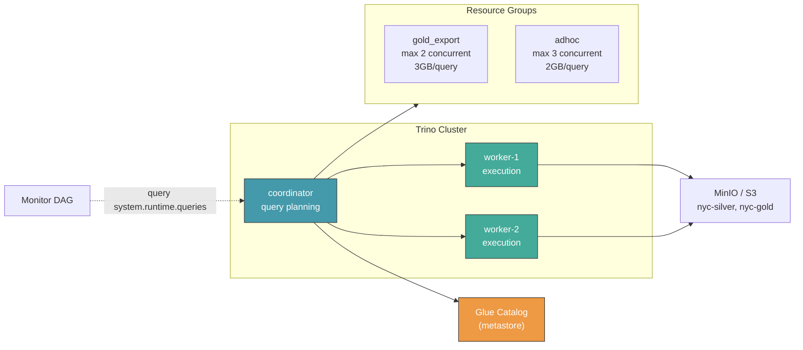

### Pod count

| Component | Dev | Production |
|---|---|---|
| Trino coordinator | 1 pod | 1 pod |
| Trino worker | 0 (coordinator tự làm) | 2 pod |
| **Tổng** | **1 pod** | **3 pod** |

---

## 14. dbt — Production Hardening

### Vấn đề

| # | Vấn đề | Hậu quả |
|---|---|---|
| 1 | **Không CI/CD** — đổi model, push thẳng | Model lỗi → dbt build fail → pipeline chết. Không test trước merge |
| 2 | **Chỉ test not_null** — không bắt được business logic sai | `AVG(tip/total)` thay vì `SUM(tip)/SUM(total)` → metric sai, test vẫn pass |
| 3 | **Không incremental model** — mỗi lần chạy scan toàn bộ | Data 5 năm → `fact_trips` scan 180M rows mỗi lần dbt build → chậm → Trino timeout |
| 4 | **Không dbt docs** — không có data lineage | Ai cũng hỏi "bảng này đến từ đâu?" → phải đọc SQL thủ công |
| 5 | **Toàn bộ model là view** — query chậm khi data lớn | Mỗi query Superset phải scan lại toàn bộ → 3-5 giây thay vì < 1 giây |

### Thiết kế

#### 1. CI/CD — test trước merge

```yaml
# .github/workflows/dbt-ci.yml (concept)
name: dbt CI
on: [pull_request]
jobs:
  dbt-test:
    steps:
      - run: dbt deps
      - run: dbt build --target staging  # Chạy toàn bộ model + test trên staging Trino
      - run: dbt test                     # Nếu fail → block merge
```

#### 2. Incremental model cho fact_trips

```sql
-- models/marts/fact_trips.sql — incremental thay vì view
{{
  config(
    materialized='incremental',
    unique_key='trip_id',
    on_schema_change='append_new_columns'
  )
}}

SELECT * FROM {{ ref('stg_trips') }}

  WHERE pickup_date >= (SELECT MAX(pickup_date) FROM {{ this }})

```

#### 3. Business assertion tests

```yaml
# tests/business_assertions.yml
models:
  - name: gold_executive_daily
    tests:
      - total_revenue_matches_fact:  # Custom singular test
          query: |
            WITH gold AS (
              SELECT SUM(revenue) AS g FROM {{ ref('gold_executive_daily') }}
            ),
            fact AS (
              SELECT SUM(total_amount) AS f FROM {{ ref('fact_trips') }}
            )
            SELECT * FROM gold, fact WHERE ABS(g - f) / NULLIF(f, 0) > 0.01
```

#### 4. dbt docs — auto generate + host

```bash
# Sau dbt build trong DAG:
dbt docs generate
# Host lên S3 static site hoặc dbt Cloud
```

---

## 15. Superset — Production Hardening

### Vấn đề

| # | Vấn đề | Hậu quả |
|---|---|---|
| 1 | **Bootstrap không idempotent** — chạy lại là tạo duplicate | Dataset, chart, dashboard bị nhân đôi → UI loạn |
| 2 | **Cache stale** — sau pipeline, dashboard vẫn hiện data cũ | User thấy số cũ, tưởng pipeline chưa chạy |
| 3 | **Chart SQL không review** — ai cũng sửa trong SQL Lab | Metric sai → CEO nhìn số sai → mất niềm tin vào data |
| 4 | **`position_json` cứng** — chart layout fix | Màn hình khác → chart chồng lên nhau |
| 5 | **Security** — admin/admin, public endpoint | Ai cũng login được, xem hết dữ liệu |
| 6 | **Không version control dashboard** | Sửa chart xong không có git history → không rollback được |

### Thiết kế

#### 1. Bootstrap idempotent

```python
# superset_bootstrap.py — check tồn tại trước khi tạo
if not superset_api.get_database("Trino"):
    superset_api.create_database(...)
if not superset_api.get_dataset("fact_trips"):
    superset_api.create_dataset(...)
# ...
```

#### 2. Cache bust sau pipeline

```python
# Sau materialize_postgres → gọi Superset API refresh
POST /api/v1/datasource/{id}/refresh
POST /api/v1/chart/{id}/data  # Force re-query
POST /api/v1/dashboard/{id}/embedded  # invalidate cache
```

#### 3. Chart SQL version control

```
# Lưu tất cả chart SQL trong repo:
superset/charts/
├── revenue_by_borough.sql
├── daily_trips.sql
├── dashboard_export.json    # Export full dashboard

# superset_bootstrap.py đọc từ đây thay vì hardcode
# PR required to change chart SQL
```

#### 4. Security tối thiểu

```python
# Environment variables thay vì hardcode
SUPERSET_ADMIN_USER=${SUPERSET_ADMIN_USER}
SUPERSET_ADMIN_PASSWORD=${SUPERSET_ADMIN_PASSWORD}
SUPERSET_SECRET_KEY=${SUPERSET_SECRET_KEY}

# Public user chỉ đọc dashboard (không SQL Lab)
# Admin user mới được edit
```

#### 5. Dashboard backup

```bash
# Export dashboard → git (chạy sau mỗi lần sửa)
POST /api/v1/dashboard/export/
# Import lại nếu cần rollback
POST /api/v1/dashboard/import/
```

---

## 16. Anomaly Check — Production Hardening

### Vấn đề

| # | Vấn đề | Hậu quả |
|---|---|---|
| 1 | **Informational only** — exit code luôn 0 | Phát hiện anomaly → vẫn cho pipeline chạy tiếp → data lỗi vào Superset |
| 2 | **Chỉ check row count** — `dq_row_count_trend` | Không check: fare_amount anomaly, trip_distance anomaly, passenger_count spike |
| 3 | **Không alert** — log ra stdout là hết | Anomaly chỉ hiện trong Airflow log → không ai đọc |
| 4 | **Không có baseline** — không biết thế nào là "bình thường" | Alert dựa trên hardcoded threshold, không học từ lịch sử |

### Thiết kế

#### 1. Anomaly có quyền block (optional)

```python
# check_anomaly.py — thêm flag --block
if anomaly_count > CRITICAL_THRESHOLD and args.block:
    sys.exit(1)  # Block pipeline
else:
    sys.exit(0)  # Report only
```

#### 2. Mở rộng anomaly check

```sql
-- Không chỉ row count, mà check cả distribution
SELECT pickup_date,
       COUNT(*) AS trip_count,
       AVG(fare_amount) AS avg_fare,
       AVG(trip_distance) AS avg_distance,
       SUM(total_amount) AS total_revenue
FROM hive.mart.gold_fact_trips
GROUP BY pickup_date

-- So sánh với 7-day / 30-day rolling avg
-- Flag nếu bất kỳ metric nào deviates > 3 stddev
```

#### 3. Alert integration

```python
# Gửi Slack alert khi phát hiện anomaly
if anomaly_rows:
    slack_webhook.post({
        "text": f"🚨 Anomaly detected: {len(anomaly_rows)} days abnormal",
        "attachments": [format_anomaly_table(anomaly_rows)]
    })
```

#### 4. Baseline tự học

```python
# Dùng 30-day rolling window làm baseline
# Không cần hardcode threshold
baseline_avg = rolling_avg(metric, window=30)
baseline_std = rolling_std(metric, window=30)
if abs(current - baseline_avg) > 3 * baseline_std:
    flag_anomaly()
```

---

## 17. Implementation Priority

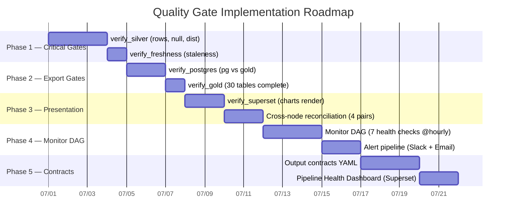

---

## Summary

| Component | Purpose | Runs | Blocks Pipeline? |
|---|---|---|---|
| **MAIN DAG** | Pipeline chính | Monthly | — |
| **Quality Gates** | Verify output từng node | Inline trong MAIN | ✅ Yes |
| **Monitor DAG** | Giám sát liên tục ngoài pipeline | @hourly, song song | ❌ No (alert only) |
| **Output Contracts** | Định nghĩa "data tốt" mỗi node | Manual review | N/A |
| **Health Dashboard** | Superset dashboard 🟢🟠🔴 | Refresh 5 phút | N/A |
| **Reconciliation** | Row count cross-check giữa các tầng | Inline trong MAIN | ✅ Yes |
| **Pre-ingest Validation** | Validate raw files trước Spark | Trước spark_batch | ✅ Yes (file hỏng → quarantine) |
| **CDC Chain** | Postgres + Debezium + Kafka + Spark Streaming | Continuous / @5min | ❌ No (alert only) |
