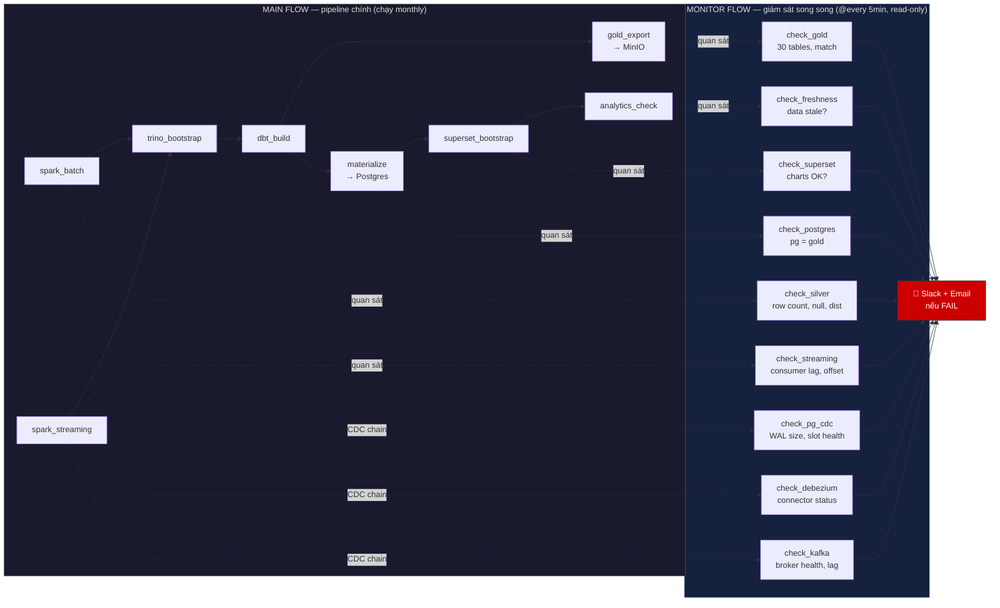
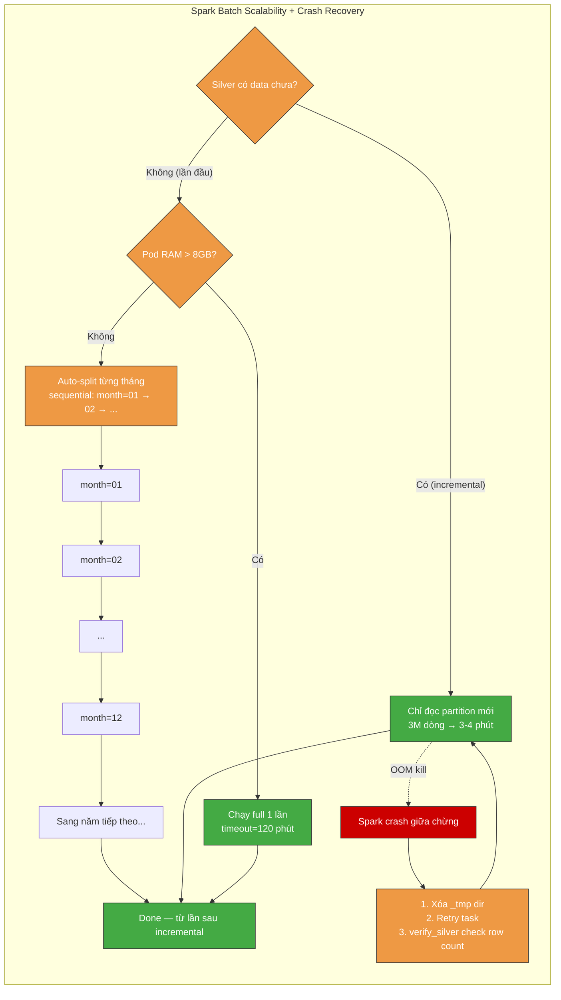
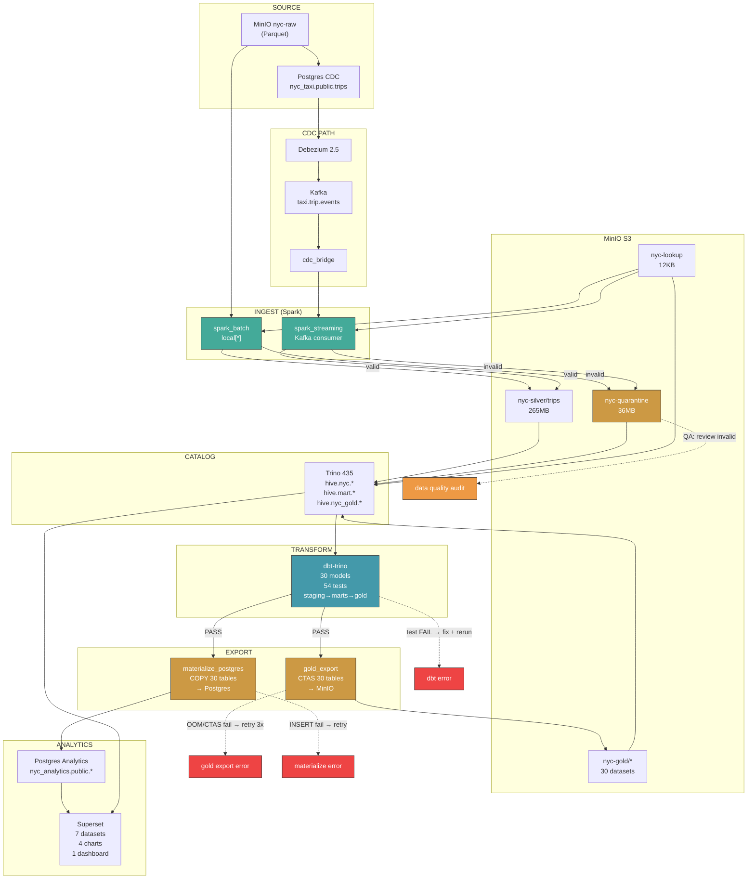
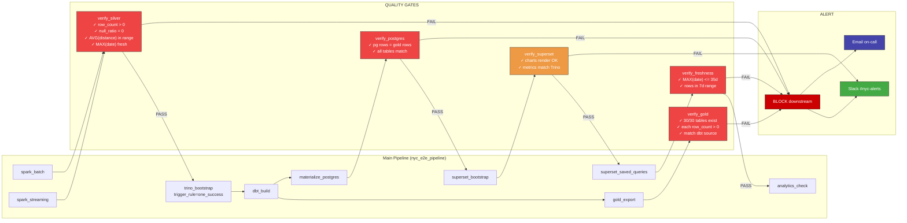
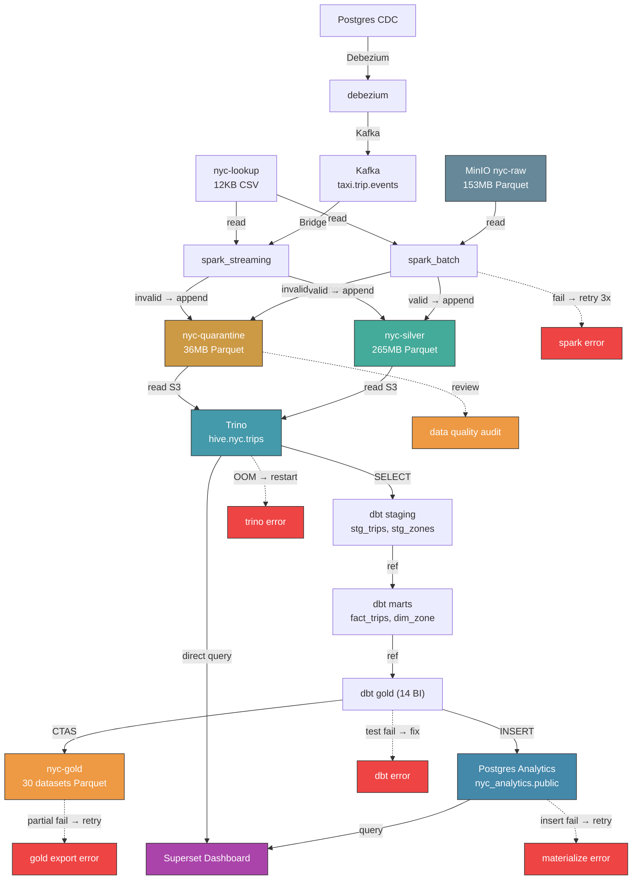
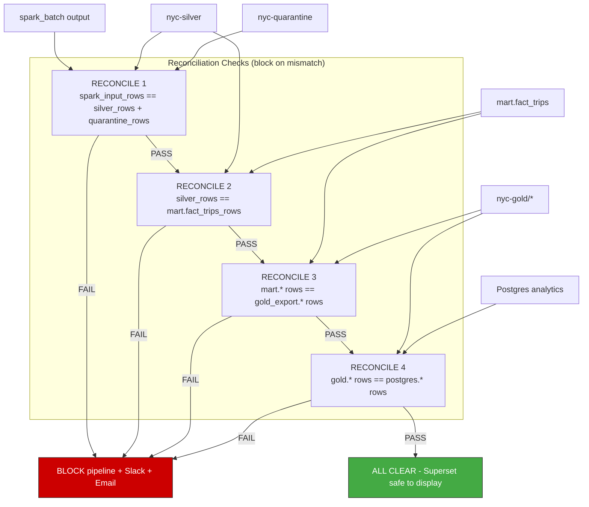
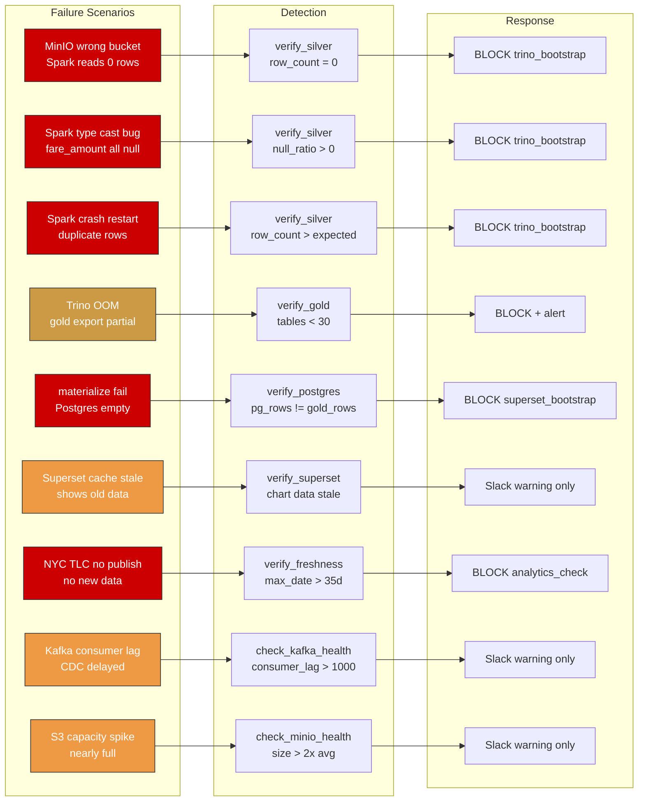
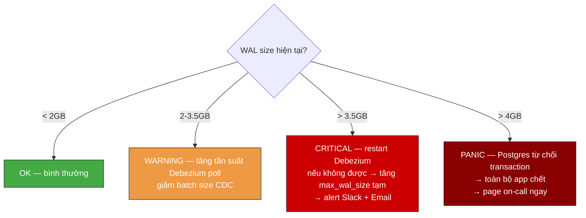
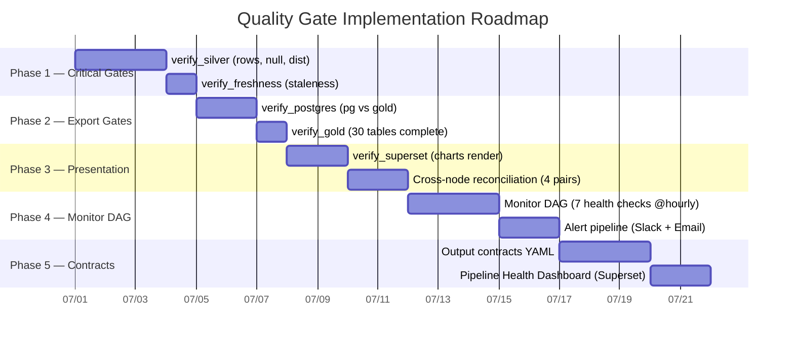

# NYC Taxi Pipeline — Updated Architecture with Data Quality Monitoring

> Thiết kế hệ thống monitoring & quality gate. Không sửa code cũ.

---

## Hai luồng song song



> **MAIN FLOW**: Chạy pipeline như cũ, không thay đổi gì.
> **MONITOR FLOW**: DAG riêng, chạy mỗi 5 phút, chỉ SELECT không ghi. Quan sát output từng node + CDC chain (Postgres CDC WAL, Debezium status, Kafka broker). Nếu phát hiện lỗi → Slack + Email.
> **Không can thiệp**: Monitor fail không ảnh hưởng MAIN. MAIN fail không ảnh hưởng Monitor.
> **Đường đứt nét** (`-.->`) = observation only, không phải dependency.
>
> **3 check CDC chain mới**: `check_pg_cdc` (WAL size + replication slot), `check_debezium` (connector RUNNING?), `check_kafka` (broker health + consumer lag). CDC chain chết → phát hiện trong < 5 phút thay vì 35 ngày (freshness check).

### Xử lý khi Spark batch timeout (data nhiều năm)

| Tình huống | Cách xử lý | Ai lo |
|---|---|---|
| **Lần đầu full load** (5 năm, ~180M dòng) → `local[*]` timeout | **Check resource pod trước**: nếu RAM > 8GB → chạy full. Nếu không → auto-split từng tháng sequential. Tăng `execution_timeout` lên 120 phút | Spark tự check `psutil.virtual_memory()` trước khi chạy |
| **Từ lần 2 trở đi** (thêm 1 tháng, ~3M dòng) | `--incremental` có sẵn trong Spark code, chỉ đọc partition mới → 3-4 phút | Không cần sửa gì |
| **Data tăng đột biến** (tháng cao điểm 6M dòng) | `local[*]` vẫn xử lý được 6M dòng ~5-6 phút | Không cần sửa |
| **Spark OOM** | Tăng `spark.driver.memory`, thêm `spark.sql.shuffle.partitions=200` | Spark submit args |
| **Spark OOM kill giữa chừng** → silver có file dở dang → incremental skip luôn tháng đó → mất data vĩnh viễn | **Ghi vào thư mục tạm** (`silver/_tmp/month=06`) → ghi xong mới move vào `silver/trips/month=06`. Nếu crash → thư mục `_tmp` bị bỏ lại, không ảnh hưởng data cũ. Retry → xóa `_tmp` → ghi lại từ đầu | Spark code + verify_gate check row count tháng mới |
| **Trino OOM sau khi Spark xong** | Partition gold export theo `pickup_year`, giới hạn concurrent query = 5 | DAG + Trino config |



---

## 1. Pipeline Nodes — 13 Node, Output Contract



---

## 2. Quality Gate Layer — 5 Gates Block Pipeline



---

## 3. Full Data Lineage — End to End



---

## 4. Cross-Node Reconciliation



---

## 5. Failure Mode → Detection → Response



---

## 6. Per-Node Output Contract (Example)

```yaml
# contracts/silver.yaml — what spark_batch must produce
node: spark_batch + spark_streaming
output: hive.nyc.trips
owner: data-engineering
checks:
  - name: min_row_count
    query: SELECT COUNT(*) FROM hive.nyc.trips
    assert: "> 1000000"
    severity: CRITICAL
  - name: no_null_fare
    query: SELECT COUNT(*) FROM hive.nyc.trips WHERE fare_amount IS NULL
    assert: "== 0"
    severity: CRITICAL
  - name: distance_sane
    query: SELECT AVG(trip_distance) FROM hive.nyc.trips
    assert: "> 1 AND < 20"
    severity: WARNING
  - name: passenger_count_range
    query: >
      SELECT COUNT(*) FROM hive.nyc.trips
      WHERE passenger_count < 1 OR passenger_count > 6
    assert: "== 0"
    severity: CRITICAL
  - name: location_exists
    query: >
      SELECT COUNT(*) FROM hive.nyc.trips t
      LEFT JOIN hive.nyc.taxi_zone_lookup z
        ON t.pickup_location_id = z.location_id
      WHERE z.location_id IS NULL
    assert: "== 0"
    severity: WARNING
  - name: freshness
    query: SELECT MAX(pickup_date) FROM hive.nyc.trips
    assert: ">= CURRENT_DATE - INTERVAL '60' DAY"
    severity: CRITICAL
  - name: quarantine_ratio
    query: |
      SELECT CAST(q.cnt AS DOUBLE) / NULLIF(s.cnt, 0) * 100.0
      FROM (SELECT COUNT(*) AS cnt FROM hive.nyc.trips) s
      CROSS JOIN (SELECT COUNT(*) AS cnt FROM hive.nyc.invalid_trips) q
    assert: "<= 15"
    severity: WARNING
```

---

## 8. Postgres CDC — Production Hardening

### Hiện trạng

```yaml
# charts/nyc-taxi/templates/postgres-cdc/statefulset.yaml
image: postgres:16-alpine
replicas: 1
args: [wal_level=logical, max_replication_slots=4, max_wal_senders=4]
resources: {cpu: 200m-500m, memory: 512Mi-1Gi}
```

### Vấn đề

| # | Vấn đề | Hậu quả |
|---|---|---|
| 1 | **Không giới hạn WAL size** — không set `max_wal_size` | Debezium chết vài giờ → WAL tích lũy vô hạn → disk full → Postgres crash |
| 2 | **Không `wal_keep_size`** — WAL có thể bị xóa trước khi Debezium kịp đọc | Debezium lag > WAL retention → "requested WAL segment has already been removed" → phải re-snapshot |
| 3 | **Single replica** — không HA | Pod chết → CDC pipeline ngừng → WAL tích lũy |
| 4 | **PVC không backup, không snapshot** | Node die → mất toàn bộ data CDC |
| 5 | **Không connection pooling** | Debezium + cdc_seed + app query → exhaustion |
| 6 | **Không monitor replication slot** | Slot đầy không ai biết → Debezium không start được |
| 7 | **Password plaintext** | `POSTGRES_PASSWORD=postgres` |

### Thiết kế production

```yaml
# Production Postgres CDC config
postgresql:
  # ── WAL management (cân bằng giữa an toàn và ổ cứng) ──
  max_wal_size: 4GB          # WAL tối đa — chặn disk full
  min_wal_size: 1GB          # WAL tối thiểu — giữ cho Debezium lag
  wal_keep_size: 2GB         # Giữ WAL ít nhất 2GB để Debezium catch-up
  max_replication_slots: 5   # Dự phòng: 1 active + 1 spare
  max_wal_senders: 5
  wal_sender_timeout: 60s    # Kill sender nếu Debezium không phản hồi

  # ── Resource (cho 100K rows CDC) ──
  resources:
    requests: {cpu: 500m, memory: 1Gi}
    limits: {cpu: 2, memory: 4Gi}
  shared_buffers: 512MB
  effective_cache_size: 2GB

  # ── Connection pool ──
  max_connections: 100
  # Dùng PgBouncer sidecar nếu nhiều service connect

  # ── Backup (RDS hoặc cron job) ──
  # Option A: pg_dump cron mỗi ngày → S3
  # Option B: WAL archiving → S3 (pitr recovery)
  archive_mode: on
  archive_command: 'aws s3 cp %p s3://nyc-backup/wal/%f'

  # ── Replication slot monitor ──
  # Query: SELECT slot_name, active, restart_lsn, pg_wal_lsn_diff(pg_current_wal_lsn(), restart_lsn) AS lag_bytes
  # FROM pg_replication_slots;
  # Alert nếu active=false hoặc lag > 1GB

  # ── High Availability ──
  # Option A: RDS Multi-AZ (managed, auto failover)
  # Option B: Patroni + etcd (self-managed, 3 replicas)
  # Option C: CloudNativePG operator (K8s native)
```

### Strategy: WAL không được đầy, không được mất



### Monitor queries (Monitor DAG @every 5min)

```sql
-- 1. WAL size
SELECT pg_size_pretty(pg_current_wal_lsn() - '0/0') AS wal_size;

-- 2. Replication slot health
SELECT slot_name, active, 
       pg_size_pretty(pg_wal_lsn_diff(pg_current_wal_lsn(), restart_lsn)) AS lag
FROM pg_replication_slots;

-- 3. Replication slot count warning
SELECT COUNT(*) FROM pg_replication_slots;
-- Alert nếu = max_replication_slots → sắp đầy

-- 4. Dead tuples (cần VACUUM)
SELECT relname, n_dead_tup FROM pg_stat_user_tables WHERE n_dead_tup > 10000;
```

### Decision: Tự host hay RDS?

| Yếu tố | Self-host (StatefulSet) | AWS RDS |
|---|---|---|
| **WAL management** | Tự config | Auto — `max_allocated_storage` |
| **Backup** | Tự pg_dump + S3 | Auto snapshot + pitr 35 ngày |
| **HA** | Patroni phức tạp | Multi-AZ checkbox |
| **Replication slot** | Tự monitor | CloudWatch metric |
| **Cost** | EC2 + disk | RDS instance cost |
| **Phù hợp cho** | Dev/staging | Production |

**Khuyến nghị:** Dev giữ StatefulSet. Production dùng RDS + `rds.logical_replication=1`.

**Pod count:** Dev = 1 pod (StatefulSet). Production = 0 pod (RDS managed).

---

## 9. Debezium — Production Hardening

### Hiện trạng

```yaml
# DAG: cdc_register → gọi entrypoint-cdc-register → Debezium REST API
# POST /connectors — tạo connector với config:
{
  "connector.class": "io.debezium.connector.postgresql.PostgresConnector",
  "database.hostname": "svc-postgres-cdc",
  "slot.name": "nyc_cdc",
  "publication.name": "nyc_cdc_pub"
}
```

### Vấn đề

| # | Vấn đề | Hậu quả |
|---|---|---|
| 1 | **Snapshot initial lần đầu quét toàn bộ table** — chưa set `snapshot.mode` | Debezium lock table + produce vài GB events Kafka → Kafka disk full + spark_streaming overload |
| 2 | **Single-thread per connector** — không scale được theo table | 1 connector = 1 thread WAL + 1 thread produce → nếu nhiều table thay đổi → backlog |
| 3 | **Transform quá nặng** — mặc định serialize cả `before`/`after`/schema → mỗi event vài KB | 1M events/giờ = vài GB Kafka → tốn disk + network |
| 4 | **Kafka producer chưa tune** — không batch, không compress | 1 request/event → network overhead cao → produce chậm |
| 5 | **Offset lưu trong Kafka** — nếu Kafka topic offset bị expire | Debezium mất offset → nghĩ chưa đọc gì → re-snapshot → duplicate toàn bộ |
| 6 | **Không monitor lag** — `MilliSecondsBehindSource` | Lag tăng dần → WAL đầy → không ai biết đến khi DB crash |
| 7 | **Delete event không xử lý** — `after=null` bị bỏ qua | Row xóa trong Postgres → vẫn còn trong silver → data stale |

### Thiết kế production

```json
{
  "connector.class": "io.debezium.connector.postgresql.PostgresConnector",
  
  "snapshot.mode": "schema_only",
  
  "transforms": "unwrap,route",
  "transforms.unwrap.type": "io.debezium.transforms.ExtractNewRecordState",
  "transforms.unwrap.drop.tombstones": "false",
  "transforms.unwrap.delete.handling.mode": "rewrite",
  
  "producer.override.batch.size": "65536",
  "producer.override.linger.ms": "50",
  "producer.override.compression.type": "lz4",
  "producer.override.max.request.size": "1048576",
  
  "max.batch.size": "4096",
  "max.queue.size": "65536",
  "poll.interval.ms": "100",
  
  "offset.storage.topic": "nyc_cdc_offset",
  "offset.storage.partitions": 3,
  "offset.storage.replication.factor": 1,
  "offset.flush.interval.ms": "10000",
  
  "errors.log.enable": "true",
  "errors.log.include.messages": "true",
  "errors.deadletterqueue.topic.name": "nyc_cdc_dlq",
  "errors.deadletterqueue.context.headers.enable": "true"
}
```

### Giải thích từng config

| Config | Giá trị | Tại sao |
|---|---|---|
| `snapshot.mode=schema_only` | Chỉ lấy schema, không snapshot data | Data đã có từ batch, không cần duplicate. Tránh lock table + full scan |
| `transforms=ExtractNewRecordState` | Chỉ lấy `after`, bỏ `before` + schema metadata | Giảm event size 70% → Kafka disk tiết kiệm |
| `delete.handling.mode=rewrite` | Delete event → produce event với `__deleted=true` | Không mất delete, consumer tự lọc |
| `batch.size=65536 + linger.ms=50` | Gộp event thành batch 64KB, đợi 50ms | Giảm network request 10-50x |
| `max.batch.size=4096` | Đọc tối đa 4096 event/lần từ WAL | Tránh 1 lần đọc quá nhiều → OOM |
| `offset.storage.topic=nyc_cdc_offset` | Lưu offset trong Kafka topic riêng | Nếu topic chính expire, offset vẫn còn |
| `errors.deadletterqueue.topic` | Event lỗi → DLQ topic | Không drop event, replay được |

### Monitor Debezium (Monitor DAG)

```
GET /connectors/nyc-cdc-connector/status

Check:
  connector.state == "RUNNING"           → PASS
  tasks[0].state == "RUNNING"            → PASS
  MilliSecondsBehindSource < 300000       → PASS (< 5 phút)
  MilliSecondsBehindSource > 300000       → WARNING → Slack
  connector.state == "FAILED"            → CRITICAL → Slack + Email
```

### Decision: Giữ Debezium hay bỏ?

| Yếu tố | Giữ Debezium | Bỏ Debezium, dùng polling |
|---|---|---|
| **Real-time** | ✅ Dưới 1 giây | ❌ Delay 5-60 phút |
| **Độ phức tạp** | ❌ Kafka + Connect cluster | ✅ Chỉ cần Python script + cron |
| **Bắt delete** | ✅ Auto | ❌ Phải soft-delete + flag |
| **DB load** | ✅ Đọc WAL, nhẹ | ❌ SELECT query liên tục |
| **Phù hợp** | Production multi-table CDC | Demo/single-table/không cần real-time |

**Khuyến nghị:** Giữ Debezium nếu có >1 table cần CDC + cần real-time. Pipeline này monthly batch → polling đủ dùng, bỏ Debezium cho đỡ phức tạp.

**Pod count:** Dev = 1 pod. Production = 1 pod (K8s auto-restart là đủ).

---

## 10. Kafka — Production Hardening

### Hiện trạng

```yaml
# charts/nyc-taxi/templates/kafka/statefulset.yaml
image: confluentinc/cp-kafka:7.4.0
replicas: 1
resources: {cpu: 500m-1, memory: 1Gi-2Gi}
topics: [taxi.trip.events, nyc_cdc.public.trips]
```

### Vấn đề

| # | Vấn đề | Hậu quả |
|---|---|---|
| 1 | **Single broker + 1 partition/topic** — không scale | 1 consumer max → spark_streaming single-thread |
| 2 | **Retention = 7 ngày mặc định** | Spark streaming nghỉ >7 ngày → offset cũ bị xóa → re-read từ earliest → duplicate hoặc failOnDataLoss crash |
| 3 | **Producer không idempotent** — cdc_bridge retry → duplicate message | Network fail → retry → 1 row CDC thành 2 message trong Kafka → spark_streaming duplicate silver |
| 4 | **No compaction** — delete tombstone tích lũy nhưng không merge | Topic chỉ thêm mới, không bao giờ giảm → disk tăng vô hạn |
| 5 | **No DLQ topic** — message hỏng drop âm thầm | spark_streaming crash với poison pill → recover bằng cách skip offset → mất message |
| 6 | **No consumer group monitoring** | Không biết spark_streaming đang lag bao nhiêu offset |

### Thiết kế production

```properties
# ── Topic config ──
taxi.trip.events:
  partitions: 3
  retention.ms: 1209600000       # 14 ngày
  cleanup.policy: compact,delete # compact tombstone + delete hết hạn
  min.cleanable.dirty.ratio: 0.5

taxi.trip.events.dlq:
  partitions: 1
  retention.ms: 2592000000       # 30 ngày — giữ lâu để debug

nyc_cdc_offset:
  partitions: 3
  retention.ms: -1               # Không expire — offset không được mất
  cleanup.policy: compact

# ── Broker config ──
num.partitions: 3
log.retention.hours: 336         # 14 ngày
log.segment.bytes: 268435456     # 256MB segment
auto.create.topics.enable: false # Cấm auto-create topic

# ── Producer config (cdc_bridge) ──
enable.idempotence: true         # Chống duplicate
acks: all                        # Chờ tất cả ISR confirm
compression.type: lz4
linger.ms: 50
batch.size: 65536

# ── Consumer config (spark_streaming) ──
group.id: spark-stream-nyc-v1    # Cố định group → track offset
auto.offset.reset: latest        # Nếu mất offset → đọc từ latest (không re-process 14 ngày)
enable.auto.commit: false        # Spark tự quản lý offset qua checkpoint
isolation.level: read_committed  # Chỉ đọc transaction đã commit
```

### Giải thích từng config

| Config | Giá trị | Tại sao |
|---|---|---|
| `partitions: 3` | 3 partition/topic | Spark streaming có thể parallel 3 consumer → nhanh 3x. Đủ cho vài triệu event/ngày |
| `retention: 14 ngày` | Đủ dài để spark recover | Nếu spark chết 1 tuần → vẫn đọc được backlog |
| `cleanup.policy=compact,delete` | Compaction merge key trùng + xóa hết hạn | Tombstone delete được merge → disk không tăng vô hạn |
| `enable.idempotence=true` | Producer không duplicate | cdc_bridge retry → Kafka biết message đã tồn tại → dedup |
| `auto.create.topics.enable=false` | Cấm auto-create | Tránh tạo topic rác khi gõ sai tên |
| `group.id cố định` | group cố định, không random | Spark track offset qua lần restart → không duplicate |
| `auto.offset.reset=latest` | Mất offset → đọc từ latest | Thà bỏ qua backlog còn hơn duplicate toàn bộ 14 ngày data |

### Monitor Kafka (Monitor DAG)

```
kafka-consumer-groups --bootstrap-server svc-kafka:9092 \
  --group spark-stream-nyc-v1 --describe

Check:
  LAG per partition < 1000      → PASS
  LAG per partition > 1000      → WARNING → Slack
  LAG per partition > 10000     → CRITICAL → Slack + Email
  DLQ topic message count > 0   → WARNING → Slack (có poison pill cần xem)
  Broker disk usage < 85%       → PASS
  Broker disk usage > 85%       → CRITICAL → Slack + Email
```

**Pod count:** Dev = 1 pod (1 broker, đủ cho demo). Production = 3 pod (3 broker cluster — chịu được 1 broker chết không mất data).

### CDC Chain Pod Summary

| Component | Dev | Production | Ghi chú |
|---|---|---|---|
| Postgres CDC | 1 pod (StatefulSet) | 0 pod (RDS) | RDS lo HA + backup |
| Debezium | 1 pod | 1 pod | K8s auto-restart |
| Kafka | 1 pod (1 broker) | 3 pod (3 broker) | Production cần cluster |
| **Tổng** | **3 pod** | **4 pod + RDS** | |

---

## 11. Implementation Priority



---

## Summary

| Component | Purpose | Runs | Blocks Pipeline? |
|---|---|---|---|
| **MAIN DAG** | Pipeline chính | Monthly | — |
| **Quality Gates** | Verify output từng node | Inline trong MAIN | ✅ Yes |
| **Monitor DAG** | Giám sát liên tục ngoài pipeline | @hourly, song song | ❌ No (alert only) |
| **Output Contracts** | Định nghĩa "data tốt" mỗi node | Manual review | N/A |
| **Health Dashboard** | Superset dashboard 🟢🟠🔴 | Refresh 5 phút | N/A |
| **Reconciliation** | Row count cross-check giữa các tầng | Inline trong MAIN | ✅ Yes |
