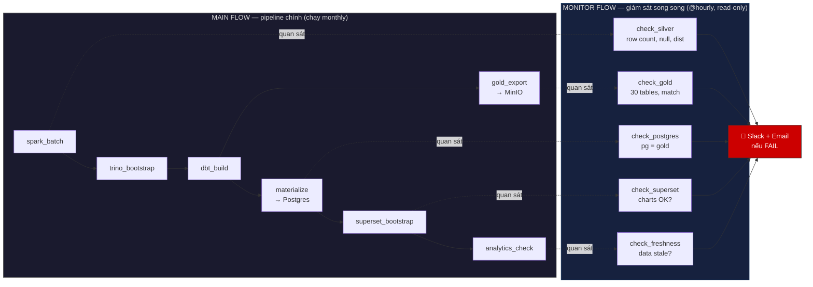
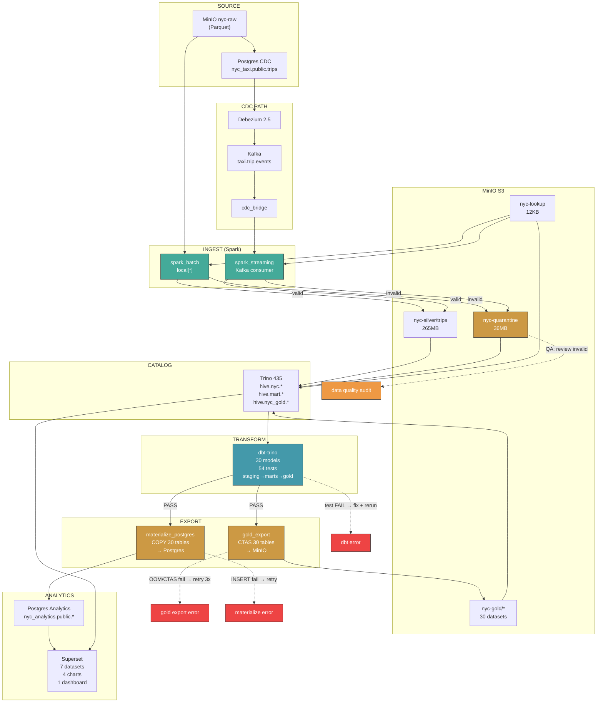
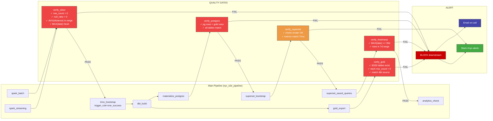
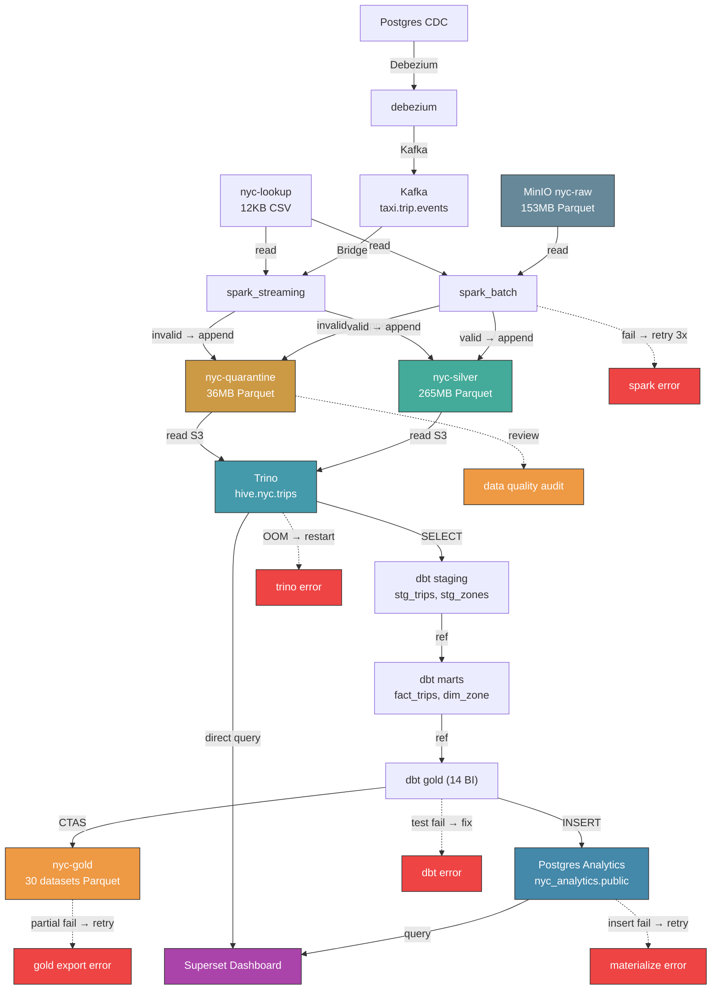
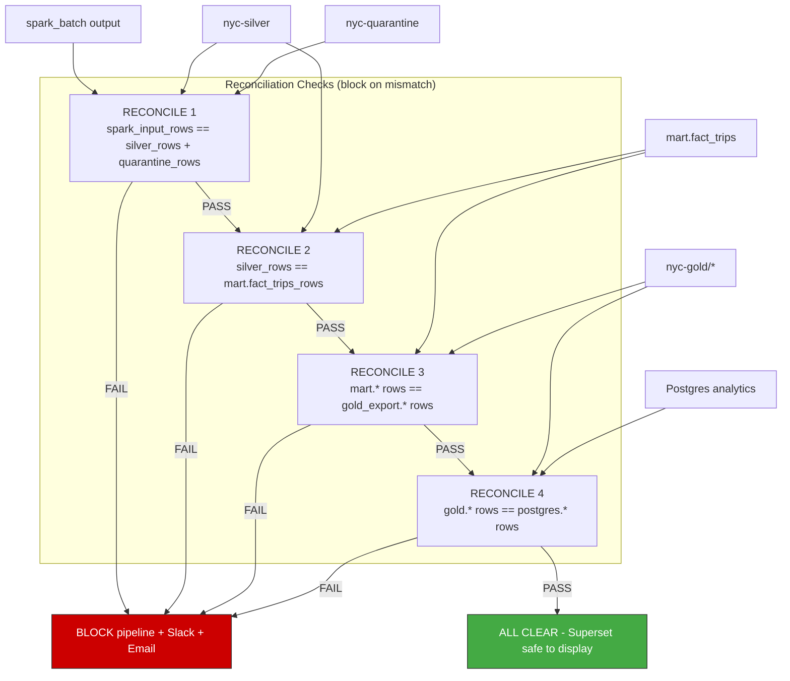
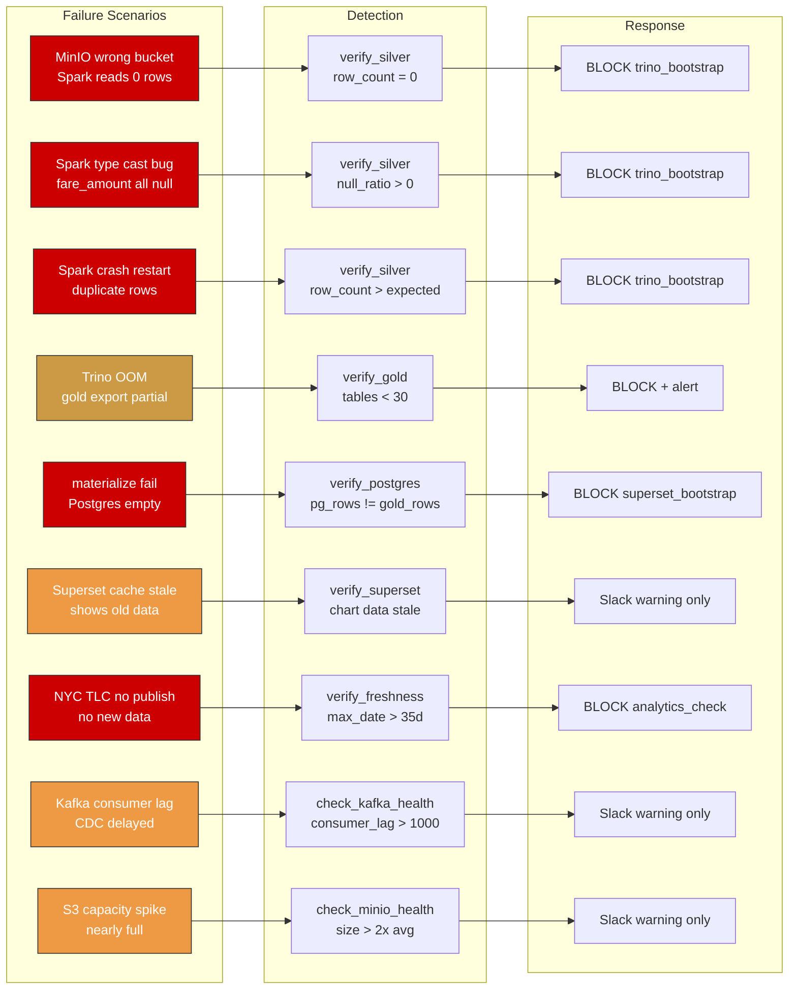
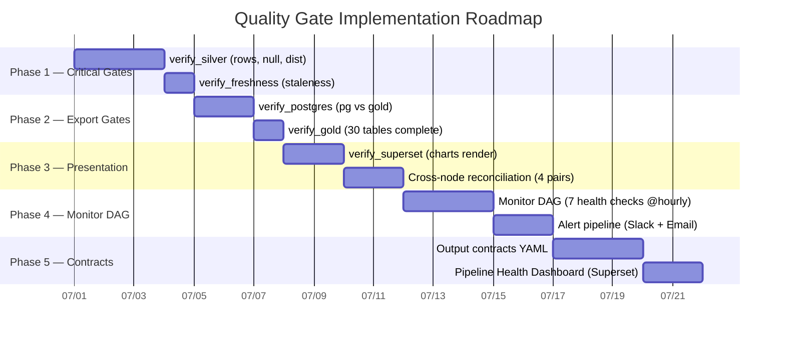

# NYC Taxi Pipeline — Updated Architecture with Data Quality Monitoring

> Thiết kế hệ thống monitoring & quality gate. Không sửa code cũ.

---

## Hai luồng song song



> **MAIN FLOW**: Chạy pipeline như cũ, không thay đổi gì.
> **MONITOR FLOW**: DAG riêng, chạy mỗi giờ, chỉ SELECT không ghi. Quan sát output từng node. Nếu phát hiện lỗi → Slack + Email.
> **Không can thiệp**: Monitor fail không ảnh hưởng MAIN. MAIN fail không ảnh hưởng Monitor.
> **Đường đứt nét** (`-.->`) = observation only, không phải dependency.

---

## 1. Pipeline Nodes — 13 Node, Output Contract



---

## 2. Quality Gate Layer — 5 Gates Block Pipeline



---

## 3. Full Data Lineage — End to End



---

## 4. Cross-Node Reconciliation



---

## 5. Failure Mode → Detection → Response



---

## 6. Per-Node Output Contract (Example)

```yaml
# contracts/silver.yaml — what spark_batch must produce
node: spark_batch + spark_streaming
output: hive.nyc.trips
owner: data-engineering
checks:
  - name: min_row_count
    query: SELECT COUNT(*) FROM hive.nyc.trips
    assert: "> 1000000"
    severity: CRITICAL
  - name: no_null_fare
    query: SELECT COUNT(*) FROM hive.nyc.trips WHERE fare_amount IS NULL
    assert: "== 0"
    severity: CRITICAL
  - name: distance_sane
    query: SELECT AVG(trip_distance) FROM hive.nyc.trips
    assert: "> 1 AND < 20"
    severity: WARNING
  - name: passenger_count_range
    query: >
      SELECT COUNT(*) FROM hive.nyc.trips
      WHERE passenger_count < 1 OR passenger_count > 6
    assert: "== 0"
    severity: CRITICAL
  - name: location_exists
    query: >
      SELECT COUNT(*) FROM hive.nyc.trips t
      LEFT JOIN hive.nyc.taxi_zone_lookup z
        ON t.pickup_location_id = z.location_id
      WHERE z.location_id IS NULL
    assert: "== 0"
    severity: WARNING
  - name: freshness
    query: SELECT MAX(pickup_date) FROM hive.nyc.trips
    assert: ">= CURRENT_DATE - INTERVAL '60' DAY"
    severity: CRITICAL
  - name: quarantine_ratio
    query: |
      SELECT CAST(q.cnt AS DOUBLE) / NULLIF(s.cnt, 0) * 100.0
      FROM (SELECT COUNT(*) AS cnt FROM hive.nyc.trips) s
      CROSS JOIN (SELECT COUNT(*) AS cnt FROM hive.nyc.invalid_trips) q
    assert: "<= 15"
    severity: WARNING
```

---

## 7. Implementation Priority



---

## Summary

| Component | Purpose | Runs | Blocks Pipeline? |
|---|---|---|---|
| **MAIN DAG** | Pipeline chính | Monthly | — |
| **Quality Gates** | Verify output từng node | Inline trong MAIN | ✅ Yes |
| **Monitor DAG** | Giám sát liên tục ngoài pipeline | @hourly, song song | ❌ No (alert only) |
| **Output Contracts** | Định nghĩa "data tốt" mỗi node | Manual review | N/A |
| **Health Dashboard** | Superset dashboard 🟢🟠🔴 | Refresh 5 phút | N/A |
| **Reconciliation** | Row count cross-check giữa các tầng | Inline trong MAIN | ✅ Yes |
