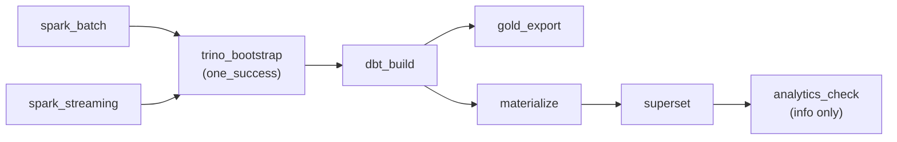
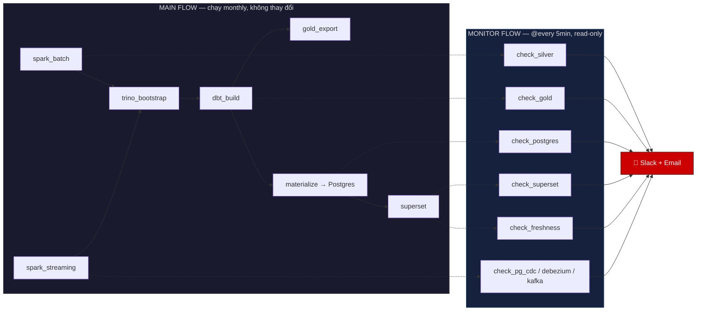
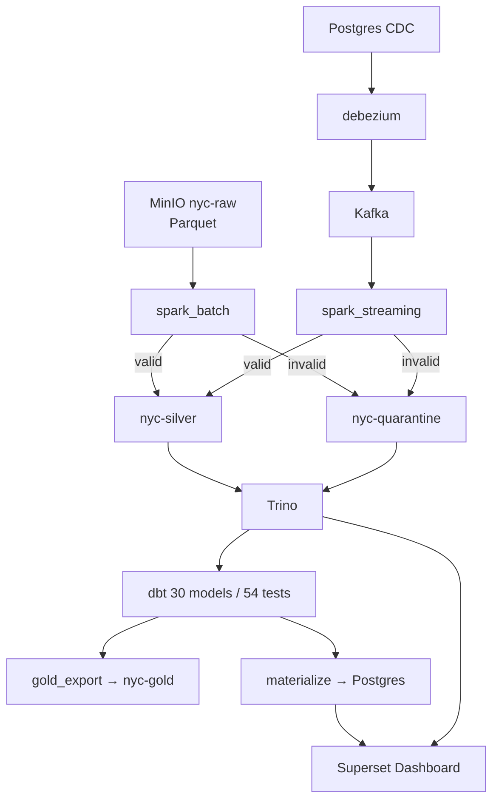
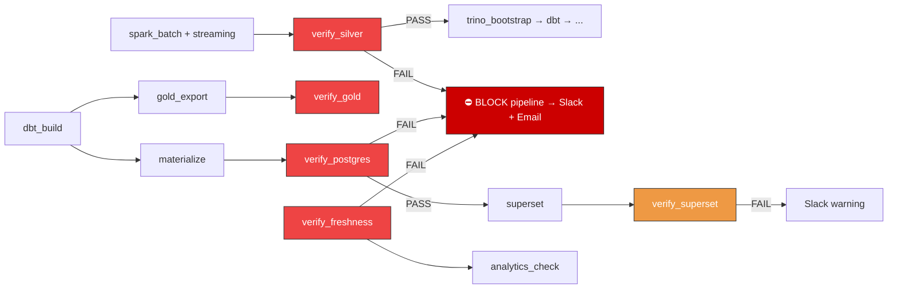
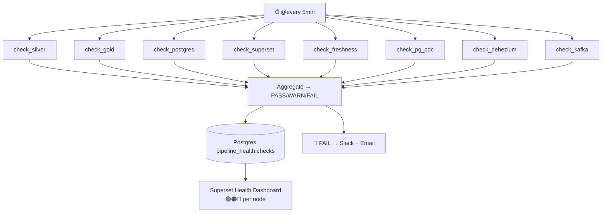
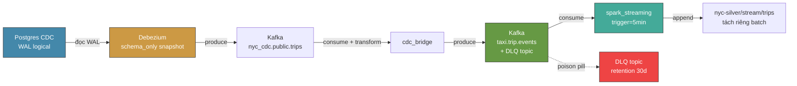
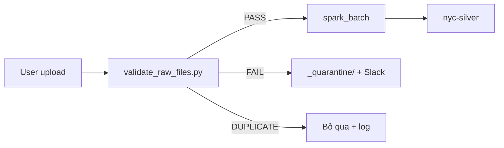
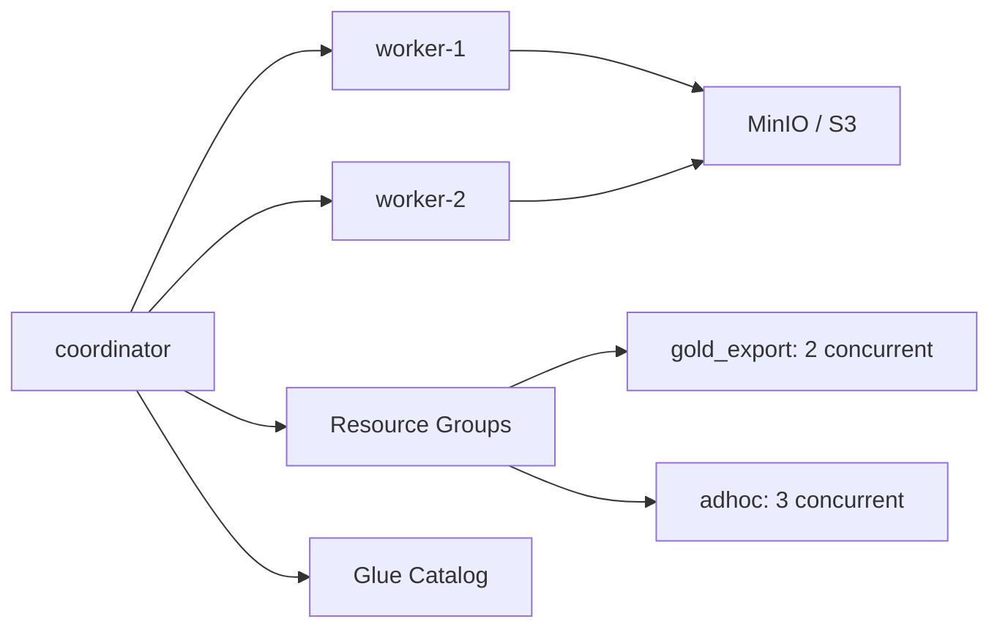
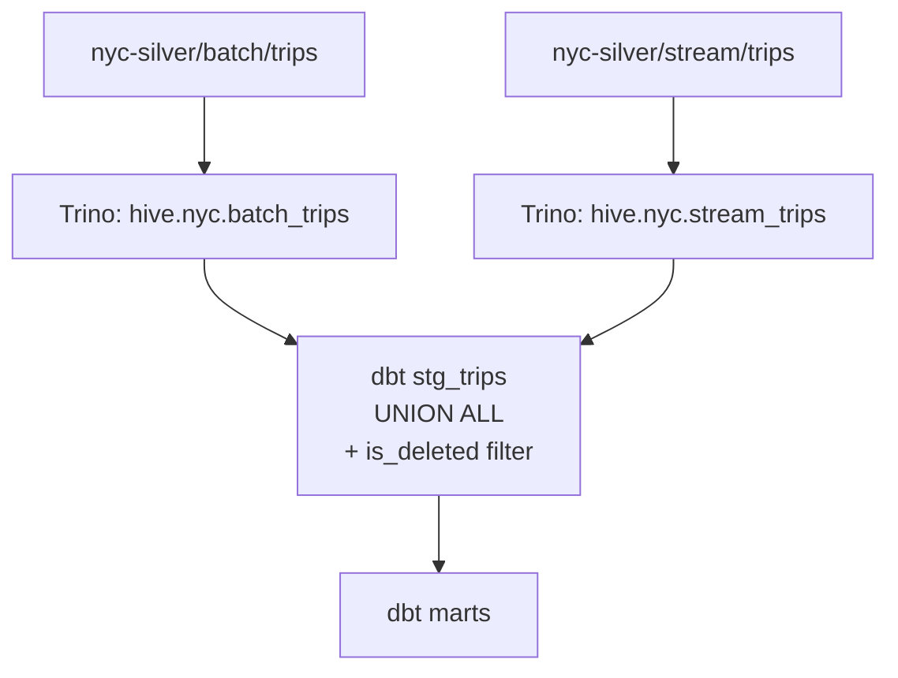
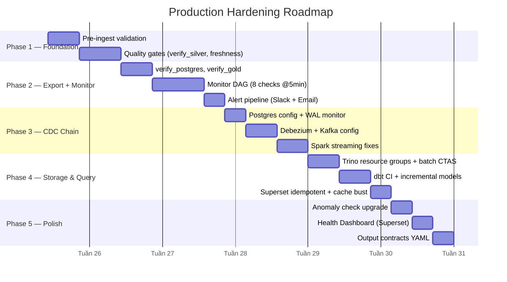

# NYC Taxi Pipeline — Production Design

> Từ PoC lên production-ready. Mỗi chương: Vấn đề → Giải pháp → Config tham khảo.

---

## Chương 1: Tổng quan — Pipeline hiện tại vs Tương lai

### Hiện tại: 1 luồng, không monitor, không gate



**Vấn đề:** 11/13 node không ai check output. Data sai ở bất kỳ node nào → lan ra tới Superset mới phát hiện.

### Tương lai: MAIN pipeline + MONITOR song song



**Khác biệt:**
- MAIN chạy như cũ. MONITOR chạy song song, độc lập.
- Mỗi node có 1 check tương ứng. Fail → Slack + Email, không cần đợi pipeline chạy.
- Monitor fail **không** ảnh hưởng MAIN.

### Pipeline Nodes — toàn cảnh



---

## Chương 2: Monitor & Quality Gates

### Vấn đề: 11/13 node không ai kiểm tra output

Pipeline chạy success, data sai logic → không ai phát hiện cho đến khi người nhìn Superset thấy số vô lý. Lúc đó không biết lỗi từ node nào.

### Giải pháp: 2 lớp bảo vệ

**Lớp 1 — Quality Gates (inline, block pipeline):**



| Gate | Check gì | Query từ đâu | Block ai nếu fail |
|---|---|---|---|
| `verify_silver` | Row count > 0, null ratio = 0, AVG(distance) ∈ [1,20], MAX(date) fresh | Trino `hive.nyc.trips` | `trino_bootstrap` + toàn bộ downstream |
| `verify_gold` | 30/30 tables exist, row count > 0, match dbt source | Trino `hive.nyc_gold.*` | Alert only |
| `verify_postgres` | pg rows = gold rows (từng bảng) | Postgres vs Trino | `superset_bootstrap` |
| `verify_superset` | Charts render OK, metrics match Trino | Superset API + Trino | Slack warning |
| `verify_freshness` | MAX(pickup_date) ≤ 35d, rows trong 7d range | Trino | `analytics_check` |

**Lớp 2 — Monitor DAG (out-of-band, @every 5min):**



### Reconciliation — cross-node row count

```
spark_input == silver + quarantine
silver       == mart.fact_trips
mart.*       == gold_export.*
gold.*       == postgres.*
```

Mỗi cặp sai → block pipeline. Bắt được data biến mất ở bất kỳ tầng nào.

### Anomaly Check — nâng cấp

| Hiện tại | Mới |
|---|---|
| Chỉ check row count | Check fare_amount, trip_distance, total_revenue |
| Exit code luôn 0 (không block) | Block nếu anomaly > 10% số ngày |
| Log ra stdout | Slack alert + ghi vào Postgres |
| Threshold cứng | 30-day rolling baseline ± 3σ |

---

## Chương 3: CDC Chain — Từ Postgres đến Spark Streaming

### Luồng dữ liệu



### Fix cho từng thành phần

#### Postgres CDC

| Vấn đề | Fix |
|---|---|
| WAL đầy ổ → DB crash | Set `max_wal_size=4GB`, `wal_keep_size=2GB` |
| Replication slot mất | Monitor slot active + lag. Backup slot info |
| Single point of failure | Dev: StatefulSet + PVC backup. Production: RDS Multi-AZ |

#### Debezium

| Vấn đề | Fix |
|---|---|
| Snapshot ban đầu quét toàn bộ DB | `snapshot.mode=schema_only` — không cần duplicate data batch |
| Transform quá nặng | `ExtractNewRecordState` — giảm 70% event size |
| Delete event bị bỏ qua | `delete.handling.mode=rewrite` → produce tombstone |
| Không monitor lag | Monitor DAG check `MilliSecondsBehindSource < 5 phút` |

#### Kafka

| Vấn đề | Fix |
|---|---|
| 1 broker → single point | Production: 3 broker cluster |
| 1 partition → single consumer | 3 partitions → spark streaming parallel 3x |
| Producer duplicate | `enable.idempotence=true`, `acks=all` |
| Offset mất → re-process | Offset topic retention = -1 (vô hạn), consumer group cố định |

#### Spark Streaming

| Vấn đề | Fix |
|---|---|
| Ghi chung path với batch → conflict | Tách `nyc-silver/stream/trips` riêng. Merge ở dbt staging `UNION ALL` |
| cdc_bridge duplicate | `group_id` cố định + `enable_auto_commit` |
| Poison pill crash cả stream | Try-catch → DLQ topic → stream tiếp tục |
| `trigger=availableNow` → không real-time | `processingTime="5min"` |
| Delete event bị bỏ qua | Soft delete: `is_deleted=true`, dbt filter `WHERE is_deleted=false` |

### CDC chain bị sập — ai phát hiện?

| Thành phần | Monitor check | Thời gian phát hiện |
|---|---|---|
| Postgres | SELECT 1 + WAL size + slot active | < 5 phút |
| Debezium | GET /connectors/status | < 5 phút |
| Kafka | Consumer lag + broker health | < 5 phút |
| Spark Streaming | Consumer lag + silver stream row count | < 5 phút |

### Pod count

| Component | Dev | Production |
|---|---|---|
| Postgres | 1 pod (StatefulSet) | RDS |
| Debezium | 1 pod | 1 pod |
| Kafka | 1 pod (1 broker) | 3 pod (3 broker) |
| Spark Streaming | 0 (chạy trong Airflow task) | 0 |

---

## Chương 4: Storage & Query — Từ MinIO đến Superset

### MinIO Intake — chặn file hỏng trước khi vào Spark

**Vấn đề:** 1 file Parquet sai schema → Spark crash cả batch. File sai tên → glob miss → data thiếu không ai biết.

**Giải pháp:** `validate_raw_files.py` chạy trước spark_batch.



**Rule:** Tất cả file PHẢI theo format `year=YYYY/month=MM/yellow_tripdata_YYYY-MM.parquet`. Không hỗ trợ daily/weekly/yearly/flat. Sai → quarantine.

### Trino — chống OOM, tăng concurrency

**Vấn đề:** gold_export 30 CTAS liên tiếp → Trino OOMKilled. Max 1 query → mọi thứ xếp hàng.

**Giải pháp:**

| Config | Cũ | Mới |
|---|---|---|
| `query.max-memory` | 4GB | 8GB |
| `query.max-concurrent-queries` | 1 | 5 |
| Resource group | Không có | `gold_export`: max 2 query, 3GB/query. `adhoc`: max 3 query, 2GB/query |
| gold_export batch | Chạy 30 CTAS liên tiếp | 3 batch × 10, mỗi batch nghỉ 30s |
| Metastore | File-based (PVC) | Dev: backup PVC. Production: Glue Catalog |
| HA | 1 pod | Dev: 1 pod. Production: 1 coordinator + 2 workers |



### dbt — CI/CD, incremental, business test

| Vấn đề | Fix |
|---|---|
| Đổi model không test trước merge | GitHub Actions: `dbt build --target staging` trên PR |
| `fact_trips` scan 180M rows mỗi lần | `materialized='incremental'`, unique_key=`trip_id` |
| Chỉ test not_null | Business assertion: SUM(revenue) các payment type = tổng |
| Không có data lineage | `dbt docs generate` → host S3 |

### Superset — idempotent, cache bust, security

| Vấn đề | Fix |
|---|---|
| Bootstrap tạo duplicate khi chạy lại | Check tồn tại trước khi tạo |
| Cache stale sau pipeline | Gọi API refresh dataset/chart sau materialize |
| Chart SQL không version control | Lưu trong `superset/charts/`, PR review |
| `admin/admin` public | Env var + public user read-only |

### Merge batch + stream



---

## Chương 5: Implementation Roadmap



---

## Appendix: Pod Count Summary

| Component | Dev | Production |
|---|---|---|
| Airflow (scheduler + webserver) | 2 pod | 2 pod |
| Airflow Postgres | 1 pod | RDS |
| Postgres Analytics | 1 pod | RDS |
| Postgres CDC | 1 pod | RDS |
| Debezium | 1 pod | 1 pod |
| Kafka | 1 pod (1 broker) | 3 pod (3 broker) |
| MinIO | 1 pod | S3 (managed) |
| Spark Master + Worker | 2 pod | EMR / Glue |
| Trino | 1 pod | 3 pod (1 coord + 2 workers) |
| Superset | 1 pod | 1 pod |
| **Tổng** | **12 pod** | **10 pod + RDS + S3 + EMR** |
