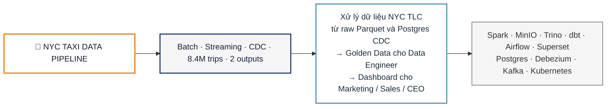
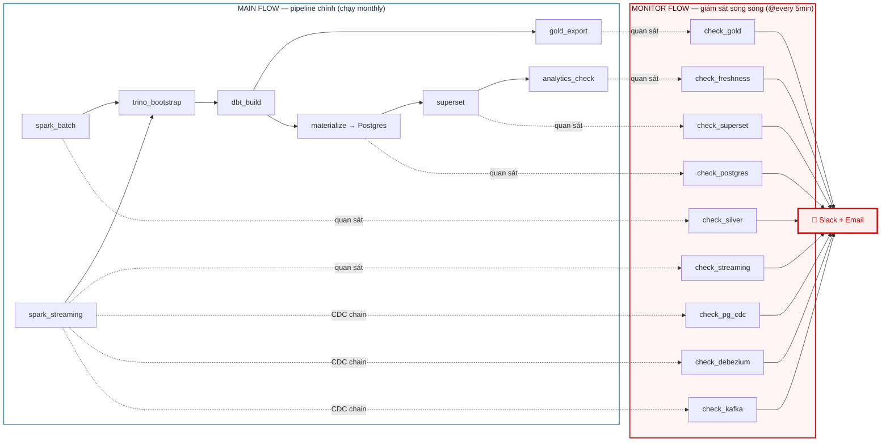
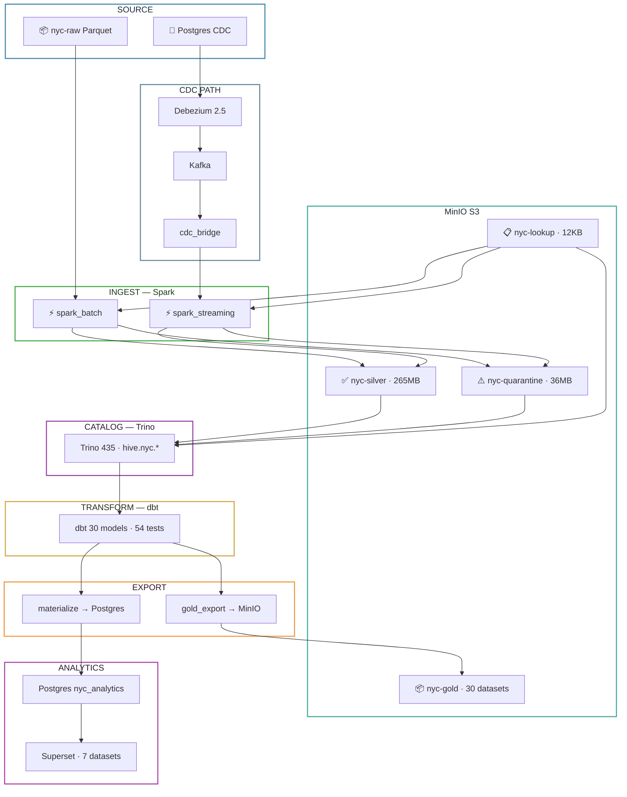
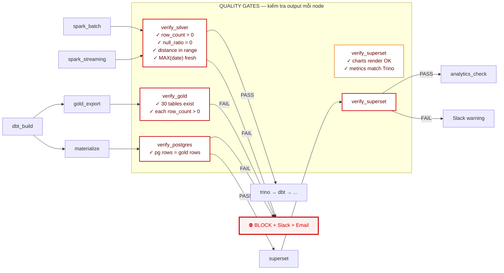
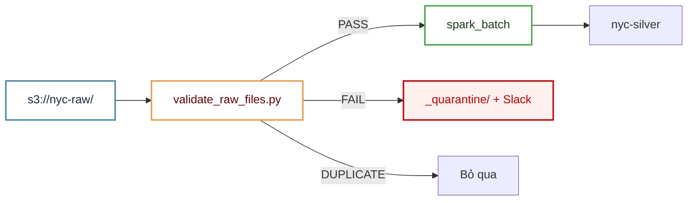
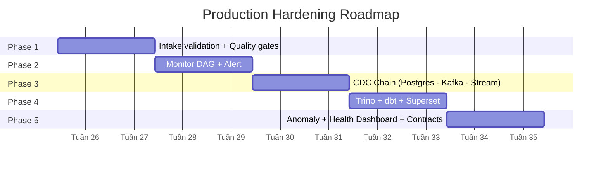

# NYC Taxi Data Pipeline

> Slide deck — trình bày cho management

---

## Slide 1: Title

**NYC Taxi Data Pipeline**  
*Batch & Streaming Data Engineering Platform*



---

## Slide 2: Bài toán

### Input

| Nguồn | Format | Volume |
|---|---|---|
| 📦 NYC TLC Yellow Taxi (S3 Parquet) | Hive-partitioned | 8.4M trips / 3 tháng |
| 📨 Postgres CDC (Debezium → Kafka) | Logical replication | Real-time |

### Output — 2 sản phẩm, 2 đối tượng

| Sản phẩm | Format | Cho ai | Họ làm gì |
|---|---|---|---|
| **📦 Golden Data** | 30 Parquet datasets | Data Engineers | Pipeline mới, train model, audit |
| **📊 Superset Dashboard** | PostgreSQL → 4 charts | Marketing, Sales, CEO | Quyết định kinh doanh |

---

## Slide 3: Hai luồng song song



| | MAIN FLOW | MONITOR FLOW |
|---|---|---|
| **Vai trò** | Chạy pipeline, không thay đổi gì | DAG riêng, chỉ SELECT, không ghi |
| **Tần suất** | Monthly (batch) | @every 5 phút |
| **Nếu fail** | Pipeline dừng, phải retry | Slack + Email ngay |
| **Phụ thuộc** | Không phụ thuộc Monitor | Không ảnh hưởng MAIN |

---

## Slide 4: Pipeline — 13 nodes



---

## Slide 5: Quality Gates — 5 gates, block pipeline



### Cross-Node Reconciliation — đối chiếu xuyên tầng

```
spark_input rows  ==  silver rows + quarantine rows
silver rows       ==  mart.fact_trips rows
mart.* rows       ==  gold_export.* rows
gold.* rows       ==  postgres.* rows
```

Mỗi cặp sai → block pipeline ngay.

---

## Slide 6: Failure Mode → Detection → Ứng phó

| # | Tình huống | Phát hiện bởi | Ứng phó |
|---|---|---|---|
| 1 | MinIO sai bucket → Spark đọc 0 rows | verify_silver: row_count = 0 | **Block** trino_bootstrap |
| 2 | Spark type cast → fare_amount null | verify_silver: null_ratio > 0 | **Block** trino_bootstrap |
| 3 | Spark crash → duplicate rows | verify_silver: row_count > expected | **Block** trino_bootstrap |
| 4 | Trino OOM → gold export thiếu bảng | verify_gold: tables < 30 | **Block** + alert |
| 5 | materialize fail → Postgres empty | verify_postgres: pg ≠ gold | **Block** superset |
| 6 | Superset cache → data cũ | verify_superset: chart stale | Slack warning |
| 7 | NYC không publish data mới | verify_freshness: max_date > 35d | **Block** analytics_check |
| 8 | Kafka consumer lag | check_kafka: lag > 1000 | Slack + Email |
| 9 | MinIO disk gần đầy | check_minio: size > 2x avg | Slack warning |

---

## Slide 7: CDC Chain — Postgres → Debezium → Kafka → Streaming

### Postgres CDC

| Vấn đề | Fix | Tại sao |
|---|---|---|
| WAL không giới hạn → disk full | `max_wal_size=4GB`, `wal_keep_size=2GB` | Chặn DB crash |
| Replication slot mất → mất offset | Monitor slot active + lag | Phát hiện < 5 phút |
| Single point of failure | Dev: StatefulSet + backup. Production: RDS Multi-AZ | HA |

### Debezium

| Vấn đề | Fix | Tại sao |
|---|---|---|
| Snapshot full table → lock DB | `snapshot.mode=schema_only` | Data đã có từ batch |
| Event lớn (before + after + schema) | `ExtractNewRecordState` | Giảm 70% event size |
| Delete event mất | `delete.handling.mode=rewrite` | Có tombstone |
| Không monitor lag | Check `MilliSecondsBehindSource` < 5 phút | Alert kịp thời |

### Kafka

| Vấn đề | Fix | Tại sao |
|---|---|---|
| 1 partition → 1 consumer | 3 partitions | Spark parallel 3x |
| 7d retention → mất offset | 14 ngày + offset topic retention = -1 | Recover được sau 1 tuần |
| Producer duplicate | `enable.idempotence=true`, `acks=all` | Retry không duplicate |

### Spark Streaming

| Vấn đề | Fix | Tại sao |
|---|---|---|
| Ghi chung path với batch | Tách `nyc-silver/stream/trips` | Batch + stream độc lập |
| group_id random → duplicate | `group.id` cố định | Track offset qua restart |
| Poison pill → crash | DLQ topic + try-catch | Stream không chết |
| `trigger=availableNow` → không real-time | `processingTime=5min` | Continuous |
| Delete event mất | Soft delete `is_deleted=true` | dbt filter `WHERE is_deleted=false` |

---

## Slide 8: MinIO — Intake Validation

**Vấn đề:** 1 file Parquet sai schema → Spark crash cả batch. File sai tên → glob miss → thiếu data.

**Giải pháp:** `validate_raw_files.py` chạy trước spark_batch.



**3 levels:**
1. Path & format — `year=*/month=*/*.parquet`
2. Schema — đủ 19 cột Parquet bắt buộc
3. Duplicate — check etag, không xử lý lại file cũ

---

## Slide 9: Trino — Chống OOM, tăng concurrency

| Vấn đề | Fix |
|---|---|
| OOM khi gold_export 30 CTAS | Resource group: gold_export max 2 concurrent, 3GB/query |
| max 1 concurrent query | Tăng lên 5 concurrent |
| File-based metastore corrupt | Dev: backup PVC → S3. Production: Glue Catalog |
| Partition không tự sync | Auto sync sau spark_batch |
| Single node – không HA | Production: 1 coordinator + 2 workers |
| Không query monitoring | Monitor DAG check `system.runtime.queries` |

---

## Slide 10: dbt + Superset + Anomaly Check

### dbt

| Vấn đề | Fix |
|---|---|
| Không CI/CD — push thẳng | GitHub Actions: `dbt build --target staging` trên PR |
| Chỉ test not_null | Business assertion: SUM(revenue) cross-check |
| Scan toàn bộ 180M rows mỗi lần | Incremental model cho fact_trips |
| Không data lineage | `dbt docs generate` → host S3 |

### Superset

| Vấn đề | Fix |
|---|---|
| Bootstrap tạo duplicate | Check tồn tại trước khi tạo |
| Cache stale sau pipeline | API refresh dataset + chart sau materialize |
| Chart SQL không version | Lưu trong `superset/charts/`, PR review |
| admin/admin public | Env var + public user read-only |

### Anomaly Check

| Vấn đề | Fix |
|---|---|
| exit code luôn 0 (info only) | Thêm flag `--block` để block pipeline |
| Chỉ check row count | Thêm fare, distance, revenue |
| Không alert | Slack webhook khi phát hiện |
| Threshold cứng | 30-day rolling baseline ± 3σ |

---

## Slide 11: Lộ trình — 5 phase



### Tổng kết

| Mục | Chi tiết |
|---|---|
| **Hiện tại** | Pipeline chạy ổn định, 8.4M trips, 3 DAGs, 12 pods |
| **Hardening** | 5 phase, 10 tuần, 1-2 người |
| **Mục tiêu** | Tự phát hiện + ứng phó sự cố trong < 5 phút |
| **Chi phí infra** | +3-5 pod (Kafka cluster, Trino workers) |
