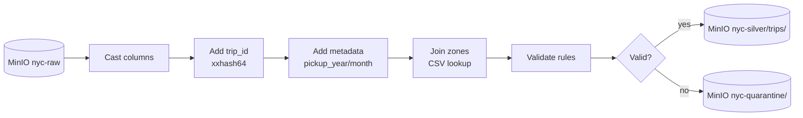
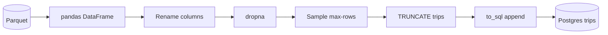
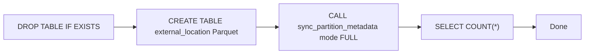
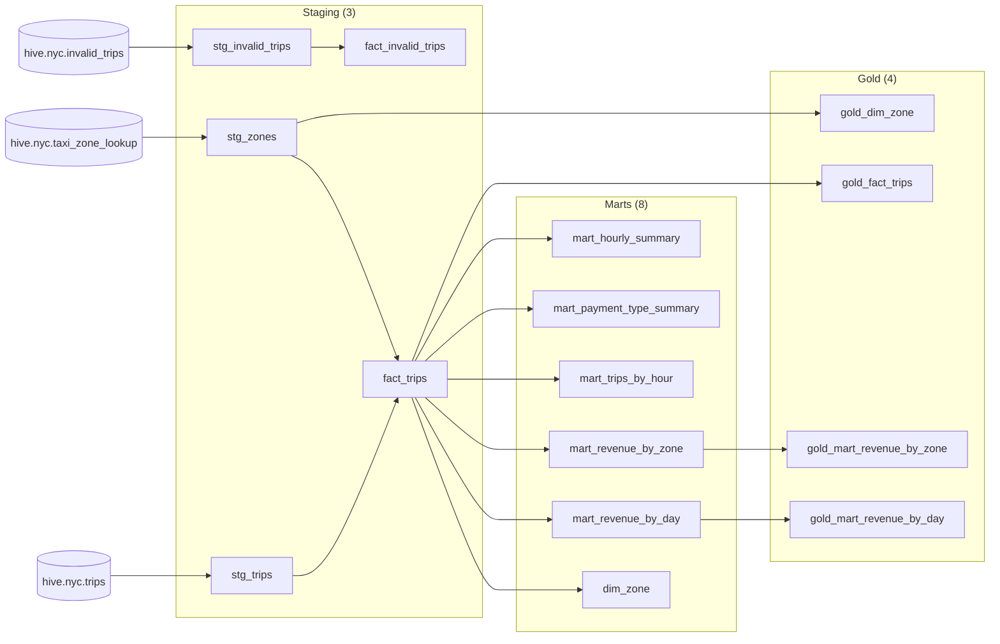
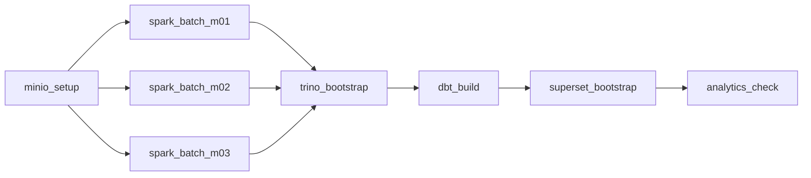
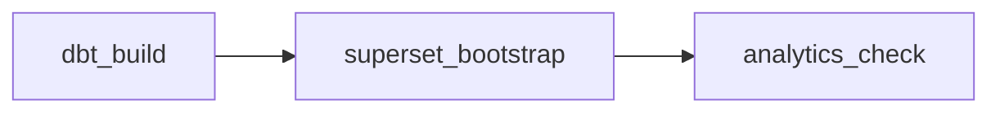
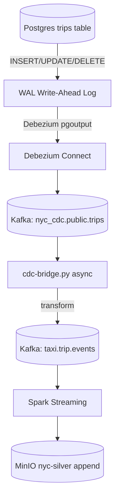

# NYC Taxi Pipeline — Workflow & Services

## Tổng quan kiến trúc

Pipeline xử lý dữ liệu taxi NYC từ raw Parquet / Kafka streaming → Silver (Spark) → Catalog (Trino/Hive) → Marts (dbt) → Dashboard (Superset). Data layer mặc định là **MinIO S3** (Spark dùng `s3a://`, Trino dùng `s3://`).

```mermaid
flowchart LR
    subgraph BATCH["Batch Path"]
        RAW[("MinIO nyc-raw")] --> SB["Spark Batch<br/>local[*]"]
    end
    subgraph STREAM["Streaming Path"]
        KAF1[("Kafka<br/>taxi.trip.events")] --> SS[Spark Streaming]
    end
    subgraph CDC["CDC Path"]
        PG[("Postgres WAL")] --> DZ[Debezium] --> KAF2[("Kafka<br/>nyc_cdc.public.trips")]
        KAF2 --> BRIDGE[cdc-bridge] --> KAF1
    end
    SB --> SILVER[("MinIO S3<br/>nyc-silver/trips/")]
    SS --> SILVER
    SB --> QUARANTINE[("MinIO S3<br/>nyc-quarantine/")]
    SS --> QUARANTINE
    SILVER --> TRINO[Trino Hive Catalog]
    TRINO --> DBT[dbt-trino views (15)]
    DBT --> SUPERSET[Superset Dashboard]
    AIRFLOW[Airflow] -..-> SB & SS & TRINO & DBT & SUPERSET
```

---

## I. Core Infrastructure

### Docker Compose

| Service | Image | Port | Profile |
|---------|-------|------|---------|
| Zookeeper | `confluentinc/cp-zookeeper:7.6.1` | 2181 | default |
| Kafka | `confluentinc/cp-kafka:7.6.1` | 9092 | default |
| Kafka UI | `provectuslabs/kafka-ui` | 8080 | default |
| MinIO | `minio/minio:latest` | 9000, 9001 | default |
| Spark Master | `apache/spark:3.5.1` | 7077, 8081 | default |
| Spark Worker | `apache/spark:3.5.1` | 8082 | default |
| Postgres CDC | `postgres:16-alpine` | 5433 | tools |
| Debezium | `debezium/connect:2.5` | 8084 | tools |
| Trino | `trinodb/trino:435` | 8083 | trino |
| Superset | `apache/superset:4.0.0` | 8088 | superset |
| Airflow | `apache/airflow:2.10.5` | 8085 | airflow |

### Kubernetes (kind)

| Service | Kind | Node | Access |
|---------|------|------|--------|
| Zookeeper | StatefulSet | kind-worker2 | svc-zookeeper:2181 |
| Kafka | StatefulSet | kind-worker2 | svc-kafka:9092 |
| Kafka UI | Deployment | kind-worker | port-forward 39082:8080 |
| MinIO | Deployment | kind-worker2 | port-forward 39081:9000 (API), 39086:9001 (Console) |
| Spark | Deployment | kind-worker/2 | port-forward 39083:8081 |
| Postgres CDC | StatefulSet | kind-worker2 | svc-postgres-cdc:5432 |
| Debezium | Deployment | kind-worker | svc-debezium:8083 |
| Trino | Deployment | kind-worker | port-forward 39084:8080 |
| Superset | Deployment | kind-worker2 | port-forward 39080:8088 |
| Airflow | Deployment | kind-worker | port-forward 39085:8080 |

**Lưu ý**: Kind cluster map sẵn ports `38080-38088` vào NodePort → dùng range `39080+` cho port-forward với `--address 0.0.0.0`.

### MinIO S3 Storage

MinIO là default storage cho pipeline data:

| Bucket | Nội dung | Spark path | Trino path |
|--------|----------|------------|------------|
| `nyc-raw` | Raw parquet files | `s3a://nyc-raw/...` | — |
| `nyc-silver` | Enriched, validated trips | `s3a://nyc-silver/trips` | `s3://nyc-silver/trips` |
| `nyc-quarantine` | Invalid trips | `s3a://nyc-quarantine/invalid_trips` | `s3://nyc-quarantine/invalid_trips` |
| `nyc-lookup` | Taxi zone lookup CSV | `s3a://nyc-lookup/` | `s3://nyc-lookup/` |

Credentials: `minio` / `minio123` (hardcoded trong Spark config, Trino catalog, mc).

---

## II. Data Processing Layer

### 1. Upload raw data to MinIO

```bash
make minio-setup
```

Tạo 4 buckets trên MinIO, upload raw parquet + zone lookup CSV từ local `data/` lên `s3a://nyc-raw/` và `s3a://nyc-lookup/`.

### 2. Spark Batch (`spark_local_batch.py`)

**File**: `jobs/spark_local_batch.py`

**Mục đích**: Xử lý backfill từ raw Parquet trên MinIO S3, không cần Kafka.



**Validation rules**:
| Rule | Điều kiện lỗi |
|------|--------------|
| `pickup_ts` | NULL |
| `dropoff_ts` | NULL |
| Trip duration | `dropoff_ts <= pickup_ts` |
| Trip distance | `<= 0` |
| Fare amount | `< 0` |
| Total vs fare | `total_amount < fare_amount` |
| Passenger count | NULL hoặc `NOT BETWEEN 1 AND 6` |
| Payment type | `NOT BETWEEN 1 AND 6` |
| Pickup/dropoff zone | Không tìm thấy trong lookup |

**Output**:
- `s3a://nyc-silver/trips/` — Parquet, partition `pickup_year=N/pickup_month=N`
- `s3a://nyc-quarantine/invalid_trips/` — Parquet, không partition

**S3 Mode**: Mặc định — luôn dùng S3A connector (`--packages hadoop-aws:3.3.4,aws-java-sdk-bundle:1.12.262`). MinIO endpoint và credentials được config qua SparkSession builder (`spark.hadoop.fs.s3a.*`) + env vars (`MINIO_ENDPOINT`, `MINIO_ACCESS_KEY`, `MINIO_SECRET_KEY`).

**CLI** (Docker Compose):
```bash
make spark-batch MONTH=01    # Via Makefile

# Hoặc trực tiếp với docker:
docker run --rm --network nyc_new_default \
  -e MINIO_ENDPOINT=http://minio:9000 \
  -e MINIO_ACCESS_KEY=minio \
  -e MINIO_SECRET_KEY=minio123 \
  --entrypoint /opt/spark/bin/spark-submit \
  apache/spark:3.5.1 \
  --master local[*] \
  --packages "org.apache.hadoop:hadoop-aws:3.3.4,com.amazonaws:aws-java-sdk-bundle:1.12.262" \
  jobs/spark_local_batch.py \
  --input "s3a://nyc-raw/yellow_taxi/year=2024/month=01/yellow_tripdata_2024-01.parquet" \
  --lookup "s3a://nyc-lookup/taxi_zone_lookup.csv"
```

### 3. Spark Streaming (`spark_stream_taxi_events.py`)

**File**: `jobs/spark_stream_taxi_events.py`

**Mục đích**: Consumer Kafka streaming events (`taxi.trip.events`), xử lý realtime — always S3 mode.

**Khác biệt với batch**:
- Đọc từ Kafka (JSON) thay vì Parquet
- Schema `EVENT_SCHEMA` (StructType) định nghĩa 19 trường
- Dùng `foreachBatch` với `trigger(availableNow=True)` cho batch-mode consumption
- Validation tương tự batch job
- Output: append vào `s3a://nyc-silver/trips` / `s3a://nyc-quarantine/invalid_trips`

**Stream format** (event JSON):
```json
{
  "event_id": "uuid",
  "event_timestamp": "2024-01-01 00:00:00",
  "vendor_id": 1,
  "pickup_datetime": "...",
  "dropoff_datetime": "...",
  "passenger_count": 1,
  "trip_distance": 3.5,
  "payment_type": 1,
  "total_amount": 25.0,
  ...
}
```

---

## III. CDC Pipeline (Debezium)

### 4. Postgres CDC (`postgres:16-alpine`)
- **Port**: 5433 (host) / 5432 (container)
- **Cấu hình**: `wal_level=logical`, `max_replication_slots=4`
- **Table**: `trips` với `REPLICA IDENTITY FULL`
- **Init script**: `docker/entrypoint-init-postgres.sh`

### 5. Debezium (`debezium/connect:2.5`)
- **Port**: 8084 (REST API)
- **Vai trò**: CDC connector, đọc WAL từ Postgres → emit events vào Kafka topic `nyc_cdc.public.trips`
- **Register connector**: `scripts/cdc_register_connector.py`

### 6. CDC Seed (`scripts/cdc_seed.py`)
Đổ dữ liệu Parquet (5000 rows mặc định) vào Postgres `trips` table.



### 7. CDC Bridge (`scripts/cdc_bridge.py`)
Consumer từ Debezium topic (`nyc_cdc.public.trips`), transform sang format `taxi.trip.events`.

**Async optimization**: Mặc định dùng `producer.send()` async + periodic flush (`--flush-interval`) thay vì `producer.send().get()` sync. Benchmark: **2,543 ev/s** (async) vs **9 ev/s** (sync) — ~280x improvement.

```bash
make cdc-bridge                # Async mode
make cdc-bridge SYNC=1         # Sync mode (chậm, để so sánh)
make cdc-bridge-bench          # Benchmark 50K events
```

---

## IV. Catalog & Query Layer

### 8. Trino Coordinator (`trinodb/trino:435`)
- **Port**: 8083
- **Catalog**: `hive` — Hive connector + S3 connector
- **Schema**: `nyc` (silver), `mart` (dbt views)
- **S3 config**: `hive.s3.endpoint`, `hive.s3.aws-access-key`, `hive.s3.path-style-access=true`
- **Tables**:
  - `hive.nyc.trips` — external, partitioned by pickup_year/month, location `s3://nyc-silver/trips/`
  - `hive.nyc.invalid_trips` — external, location `s3://nyc-quarantine/invalid_trips/`
  - `hive.nyc.taxi_zone_lookup` — external CSV, location `s3://nyc-lookup/`

### 9. Trino Bootstrap (`scripts/trino_register.py`)


---

## V. Transformation Layer (dbt)

### Model Hierarchy



**Tổng**: 15 models (3 staging + 8 marts + 4 gold), 9 data tests → **24/24 PASS**.
**Lưu ý**: Tất cả models `materialized='view'` (Hive HMS không support `RENAME TABLE`).

### Tests (9 tests)
- `not_null`: total_amount, pickup_ts, dropoff_ts, payment_type, trip_distance
- `accepted_values`: payment_type (1-6)
- `payment_type_range.sql`: singular test kiểm tra payment_type hợp lệ

---

## VI. Visualization (Superset)

### 10. Superset (`apache/superset:4.0.0`)
- **Port**: 8088 (admin/admin)
- **Bootstrap script**: `scripts/superset_bootstrap.py` (idempotent)
  - Register Trino database connection
  - Create **7 datasets**: fact_trips, dim_zone, mart_hourly_summary, mart_payment_type_summary, mart_revenue_by_day, mart_revenue_by_zone, gold_fact_trips
  - Create 4 charts: `trips_per_hour` (bar), `top_pickup_zones` (table), `borough_revenue` (bar), `daily_trips` (line)
  - Create dashboard "NYC Taxi Overview"

---

## VII. Orchestration (Airflow)

### 11. Airflow (`apache/airflow:2.10.5`)
- **Port**: 8085 (admin/admin)
- **Entrypoint**: `docker/entrypoint-airflow.sh` — role-based (webserver/scheduler/init)
- **2 DAGs**: schedule manual (không catchup)

### DAG: `nyc_e2e_pipeline`



1. `spark_batch_m01/m02/m03` — spark-submit 3 tháng (song song)
2. `trino_bootstrap` — register tables + sync partitions
3. `dbt_build` — dbt deps + run + test
4. `superset_bootstrap` — register DB/datasets/charts/dashboard
5. `analytics_check` — run 10 SQL questions

### DAG: `nyc_analytics_refresh`



Trên K8s, Airflow DAG tương tự nhưng dùng `kubectl apply` thay vì `docker run`.

---

## VIII. Complete Flow (Step by Step)

### Batch Pipeline (Docker Compose)

```bash
make infra-up              # Start core: ZK, Kafka, MinIO, Spark
make kafka-topics          # Create topics
make minio-setup           # Upload raw data lên MinIO (chạy 1 lần)
make spark-batch           # Spark batch S3 (MONTH=01/02/03)
make trino-bootstrap       # Register tables (S3 paths)
make dbt-build             # dbt models + tests (24/24 PASS)
make superset-bootstrap    # 7 datasets + charts + dashboard
make verify-all            # Full verification
```

| Step | `make` target | What happens |
|------|---------------|-------------|
| 1 | `infra-up` | Start ZK, Kafka, Kafka-UI, MinIO, Spark |
| 2 | `infra-up-all` | + Trino, dbt, Superset, Airflow |
| 3 | `kafka-topics` | 3 topics (events, invalid, dlq) |
| 4 | `minio-setup` | **Upload** raw parquet + lookup lên MinIO |
| 5 | `spark-batch` MONTH=01/02/03 | Spark đọc `s3a://nyc-raw`, ghi `s3a://nyc-silver` |
| 6 | `trino-bootstrap` | Register tables hive.nyc (S3 paths) |
| 7 | `dbt-build` | 15 views + 9 tests → 24/24 PASS |
| 8 | `verify-mart` | dim_zone=261, fact_trips=~8.48M, mart_hourly=~11K+ |
| 9 | `superset-bootstrap` | 7 datasets → 4 charts → dashboard |
| 10 | `verify-analytics` | 10 SQL → 10/10 PASS |
| 11 | `verify-all` | Full pipeline + Superset check |

### CDC Pipeline

```bash
make cdc-up            # Start Postgres + Debezium
make cdc-seed          # Seed 5000 rows into Postgres
make cdc-register      # Register Debezium connector
make cdc-bridge        # Bridge CDC events → taxi.trip.events
make cdc-verify        # Full CDC E2E
```



### Kubernetes (kind) Flow

```bash
make k8s-cluster       # Create kind cluster (3 nodes)
make k8s-images        # Build & load custom images into kind
make k8s-deploy        # Deploy all services + PVCs
make k8s-pipeline      # Run all jobs in order
make k8s-verify        # Check data in Trino
```

**Port-forward UIs**:
```bash
kubectl port-forward --address 0.0.0.0 -n nyc-taxi svc/svc-superset 39080:8088 &
kubectl port-forward --address 0.0.0.0 -n nyc-taxi svc/svc-minio 39081:9000 &
kubectl port-forward --address 0.0.0.0 -n nyc-taxi svc/svc-minio 39086:9001 &
kubectl port-forward --address 0.0.0.0 -n nyc-taxi svc/svc-kafka-ui 39082:8080 &
kubectl port-forward --address 0.0.0.0 -n nyc-taxi svc/svc-spark-master 39083:8081 &
kubectl port-forward --address 0.0.0.0 -n nyc-taxi svc/svc-airflow-webserver 39085:8080 &
```

---

## IX. Data Directory Structure

**Lưu ý**: Raw parquet gốc nằm ở `data/raw/`, nhưng pipeline đọc từ **MinIO S3**. Local `data/` chỉ chứa raw source, checkpoints và Hive metastore.

```
data/
├── raw/yellow_taxi/year=2024/
│   ├── month=01/yellow_tripdata_2024-01.parquet   (~48MB)
│   ├── month=02/yellow_tripdata_2024-02.parquet   (~48MB)
│   └── month=03/yellow_tripdata_2024-03.parquet   (~57MB)
├── lookup/
│   └── taxi_zone_lookup.csv       (262 zones)
├── checkpoints/                    (streaming offset — local)
└── trino-metastore/                (Hive HMS DB — local)

MinIO S3 buckets:
  s3a://nyc-raw/yellow_taxi/...      ~153MB, 3 parquet files
  s3a://nyc-silver/trips/            ~265MB, ~8.48M valid rows
  s3a://nyc-quarantine/invalid_trips/ ~36MB, ~1.07M invalid rows
  s3a://nyc-lookup/taxi_zone_lookup.csv  lookup CSV
```

---

## X. CLI Reference

### Docker Compose
```bash
make infra-up            # Start core: ZK, Kafka, MinIO, Spark
make infra-up-all        # Start everything
make minio-setup         # Upload raw data lên MinIO (chạy 1 lần)
make spark-batch         # Batch backfill qua MinIO S3
make spark-streaming     # Submit streaming job (always S3)
make trino-bootstrap     # Register tables (S3 paths)
make dbt-build           # dbt models + tests (24/24 PASS)
make superset-bootstrap  # 7 datasets + charts + dashboard
make verify-all          # Full pipeline verification
make cdc-bridge-bench    # Benchmark CDC bridge
```

### Kubernetes (kind)
```bash
make k8s-cluster         # kind create cluster
make k8s-images          # Build & load images
make k8s-deploy          # Deploy all manifests
make k8s-pipeline        # Run pipeline jobs
make k8s-verify          # Verify via Trino
make k8s-status          # kubectl get pods
make k8s-down            # kind delete cluster
```

### Trino Queries
```sql
-- Check data
SELECT count(*) FROM hive.nyc.trips;
SELECT pickup_year, pickup_month, count(*) FROM hive.nyc.trips GROUP BY 1,2;

-- Marts
SELECT * FROM hive.mart.fact_trips LIMIT 10;
SELECT pickup_borough, sum(total_amount) FROM hive.mart.mart_revenue_by_zone GROUP BY 1;

-- Invalid
SELECT count(*) FROM hive.nyc.invalid_trips;
```
