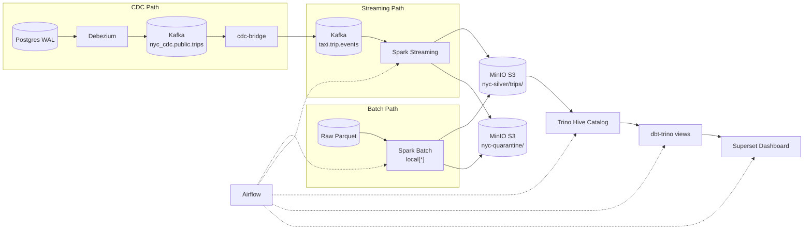
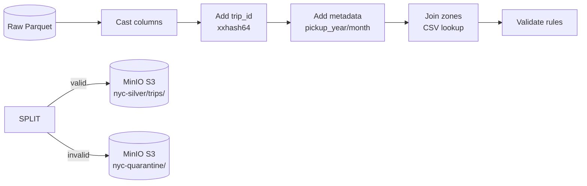
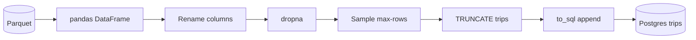
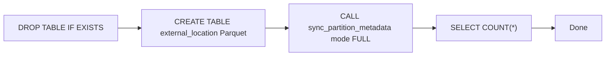
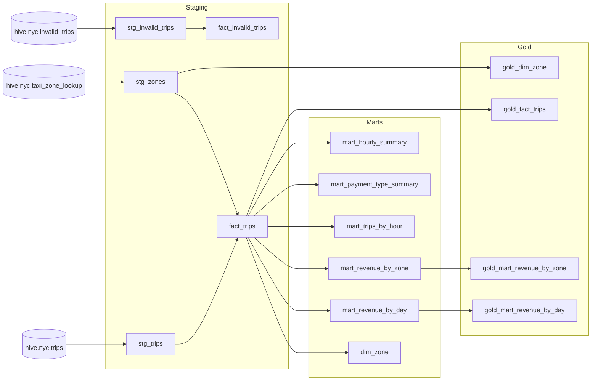
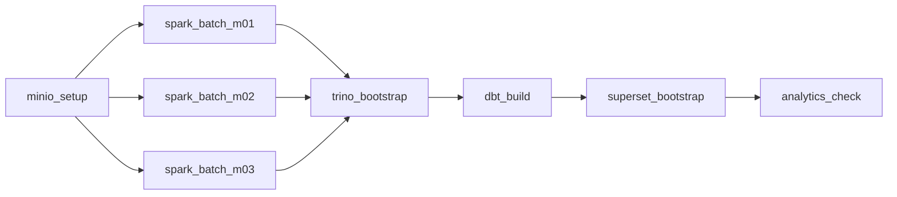
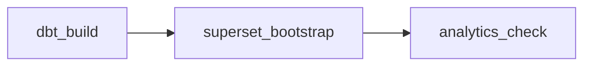
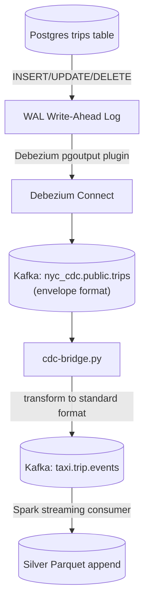

# NYC Taxi Pipeline — Workflow & Services

## Tổng quan kiến trúc

Pipeline xử lý dữ liệu taxi NYC từ raw Parquet / Kafka streaming → Silver (Spark) → Catalog (Trino/Hive) → Marts (dbt) → Dashboard (Superset).



---

## I. Core Infrastructure (Docker Compose)

### 1. Zookeeper (`confluentinc/cp-zookeeper:7.6.1`)
- **Port**: 2181
- **Vai trò**: Quản lý cluster metadata cho Kafka broker.

### 2. Kafka (`confluentinc/cp-kafka:7.6.1`)
- **Port**: 9092 (container) / 29092 (host)
- **Vai trò**: Message broker cho streaming events và CDC.
- **Topics**:
  - `taxi.trip.events` — events chính
  - `taxi.trip.events.invalid` — events lỗi
  - `taxi.trip.events.dlq` — dead-letter queue
  - `nyc_cdc.public.trips` — CDC từ Debezium
- **Kafka UI** (`provectuslabs/kafka-ui`): port 8080

### 3. MinIO (`minio/minio:latest`)
- **Port**: 9000 (S3 API) / 9001 (Console)
- **Buckets**: `nyc-raw`, `nyc-silver`, `nyc-quarantine`, `nyc-lookup`
- **Credentials**: `minio` / `minio123`
- **Vai trò**: Default S3-compatible storage cho pipeline data (raw, silver, quarantine, lookup). Spark jobs dùng S3A connector, Trino dùng `hive.s3.*` config.

### 4. Spark Master & Worker (`apache/spark:3.5.1`)
- **Master**: port 7077 (cluster), 8081 (web UI)
- **Worker**: 2 cores, 4GB RAM
- **Vai trò**: Cluster mode cho streaming job. Batch job chạy `local[*]` không cần worker.

---

## II. Data Processing Layer

### 5. Spark Batch (`spark_local_batch.py`)
**File**: `jobs/spark_local_batch.py`

**Mục đích**: Xử lý backfill từ raw Parquet files, không cần Kafka.



**Validation rules**:
| Rule | Điều kiện lỗi |
|------|--------------|
| `pickup_ts` | NULL |
| `dropoff_ts` | NULL |
| Trip duration | `dropoff_ts <= pickup_ts` |
| Trip distance | `<= 0` |
| Fare amount | `< 0` |
| Total vs fare | `total_amount < fare_amount` |
| Passenger count | NULL hoặc `NOT BETWEEN 1 AND 6` |
| Pickup zone | Không tìm thấy trong lookup |
**Output**:
- `s3a://nyc-silver/trips/` — Parquet, partition: `pickup_year=N/pickup_month=N`
- `s3a://nyc-quarantine/invalid_trips/` — Parquet, không partition

**S3 Mode**: Spark batch dùng S3A Hadoop connector (`--packages hadoop-aws:3.3.4,aws-java-sdk-bundle:1.12.262`). Không cần `--s3` flag — S3 là default.

**CLI**:
```bash
make spark-batch MONTH=01    # Via Makefile (MinIO S3 default)

# Hoặc trực tiếp:
docker run --rm --network nyc_new_default --entrypoint /opt/spark/bin/spark-submit \
  apache/spark:3.5.1 \
  --master local[*] \
  --packages "org.apache.hadoop:hadoop-aws:3.3.4,com.amazonaws:aws-java-sdk-bundle:1.12.262" \
  --conf spark.jars.ivy=/tmp/.ivy2 \
  jobs/spark_local_batch.py \
  --input "s3a://nyc-raw/yellow_taxi/year=2024/month=01/yellow_tripdata_2024-01.parquet" \
  --lookup "s3a://nyc-lookup/taxi_zone_lookup.csv"
```
### 6. Spark Streaming (`spark_stream_taxi_events.py`)
**File**: `jobs/spark_stream_taxi_events.py`

**Mục đích**: Consumer Kafka streaming events (`taxi.trip.events`), xử lý realtime — always S3 mode.

**Khác biệt với batch**:
- Đọc từ Kafka (JSON) thay vì Parquet
- Schema `EVENT_SCHEMA` (StructType) định nghĩa 19 trường
- Dùng `foreachBatch` với `trigger(availableNow=True)` cho batch-mode consumption
- Validation tương tự batch job
- Output: append vào `s3a://nyc-silver/trips` / `s3a://nyc-quarantine/invalid_trips`


**Stream format** (event JSON):
```json
{
  "event_id": "uuid",
  "event_timestamp": "2024-01-01 00:00:00",
  "vendor_id": 1,
  "pickup_datetime": "...",
  "dropoff_datetime": "...",
  "passenger_count": 1,
  "trip_distance": 3.5,
  ...
}
```

---

## III. CDC Pipeline (Debezium)

### 7. Postgres CDC (`postgres:16-alpine`)
- **Port**: 5433 (host) / 5432 (container)
- **Cấu hình đặc biệt**: `wal_level=logical`, `max_replication_slots=4` (cần cho Debezium)
- **Table**: `trips` với `REPLICA IDENTITY FULL`
- **Init script**: `docker/entrypoint-init-postgres.sh`
  - Tạo `trips` table với `SERIAL PRIMARY KEY`
  - Bật `REPLICA IDENTITY FULL` (Debezium cần có full old value)

### 8. Debezium (`debezium/connect:2.5`)
- **Port**: 8084 (REST API)
- **Vai trò**: CDC connector, đọc WAL từ Postgres → emit events vào Kafka topic `nyc_cdc.public.trips`
- **Register connector**: `scripts/cdc_register_connector.py`
  ```python
  POST /connectors/ {
    "name": "nyc-postgres-connector",
    "config": {
      "connector.class": "io.debezium.connector.postgresql.PostgresConnector",
      "database.hostname": "nyc_postgres",
      "database.dbname": "nyc_taxi",
      "table.include.list": "public.trips",
      "plugin.name": "pgoutput",
      "slot.name": "nyc_taxi_slot"
    }
  }
  ```

### 9. CDC Seed (`scripts/cdc_seed.py`)
**Mục đích**: Đổ dữ liệu Parquet (5000 rows mặc định) vào Postgres `trips` table.



### 10. CDC Bridge (`scripts/cdc_bridge.py`)
**Mục đích**: Consumer từ Debezium topic (`nyc_cdc.public.trips`), transform sang format `taxi.trip.events`, produce lại.

**Transform logic**:
```python
Debezium event (unwrap) → {
  "event_id": "<uuid>",
  "event_timestamp": "<ts>",
  "vendor_id": ...,
  "pickup_datetime": ...,
  # ... các field giống EVENT_SCHEMA
}
```

**Why Bridge?** Debezium emits CDC events có format riêng (envelope: `before`/`after`/`source`/`op`/`ts_ms`). Bridge converts về đúng format mà Spark streaming job hiểu, cho phép reuse cùng một streaming job.

---

## IV. Catalog & Query Layer

### 11. Trino Coordinator (`trinodb/trino:435`)
- **Port**: 8083
- **Catalog**: `hive` — Hive connector + S3 connector (`hive.s3.*` config), đọc parquet từ MinIO S3
- **Schema**: `nyc` (silver), `mart` (dbt views)
- **S3 paths**: S3 paths mặc định (không cần `S3_MODE=1`)
- **Tables**:
  - `hive.nyc.trips` — external, partitioned by pickup_year/month, location `s3://nyc-silver/trips`
  - `hive.nyc.invalid_trips` — external, location `s3://nyc-quarantine/invalid_trips`
  - `hive.nyc.taxi_zone_lookup` — external CSV, location `s3://nyc-lookup/`

### 12. Trino Bootstrap (`scripts/trino_register.py`)
**Mục đích**: Register tables trong Hive catalog.



**Zone lookup**: Được register riêng từ CSV với tất cả columns VARCHAR.

---

## V. Transformation Layer (dbt)

### Model Hierarchy



**Lưu ý**: Tất cả models đều `materialized='view'` (do Hive HMS không support `RENAME TABLE`).

### Tests (9 tests)
- `not_null`: total_amount, pickup_ts, dropoff_ts, payment_type, trip_distance
- `accepted_values`: payment_type (1-6)
- `payment_type_range.sql`: singular test kiểm tra payment_type hợp lệ

---

## VI. Visualization (Superset)

### 13. Superset (`apache/superset:4.0.0`)
- **Port**: 8088 (admin/admin)
- **Bootstrap script**: `scripts/superset_bootstrap.py`
  - Register Trino database connection
  - Create dataset `fact_trips` từ schema `mart`
  - Create 4 charts:
    1. `trips_per_hour` (bar chart)
    2. `top_pickup_zones` (table)
    3. `borough_revenue` (bar chart)
    4. `daily_trips` (line chart)
  - Create dashboard "NYC Taxi Overview"

## VII. Orchestration (Airflow)

### 14. Airflow (`apache/airflow:2.10.5`)
- **Port**: 8085 (admin/admin)
- **Entrypoint**: `docker/entrypoint-airflow.sh` — role-based:
  - `webserver` → start Airflow webserver
  - `scheduler` → start scheduler
  - `init` → migrate DB + create admin user
### DAG: `nyc_e2e_pipeline`
**Schedule**: manual trigger




**Flow**:
1. `spark_batch_m01` → chạy spark-submit cho tháng 01
2. `spark_batch_m02` → chạy spark-submit cho tháng 02
3. `spark_batch_m03` → chạy spark-submit cho tháng 03
4. `trino_bootstrap` → register tables + sync partitions
5. `dbt_build` → dbt deps + seed + run + test
6. `superset_bootstrap` → register DB/dataset/charts/dashboard
7. `analytics_check` → run 10 SQL questions, assert all return rows


### DAG: `nyc_analytics_refresh`
**Schedule**: manual (hoặc `@hourly` trong production)



Trên Kubernetes (kind), Airflow DAG tương tự nhưng dùng `kubectl apply` thay vì `docker run`.

---

## VIII. Complete Flow (Step by Step)

### **Batch Pipeline (Backfill)**

```bash
make infra-up              # Start core: ZK, Kafka, MinIO, Spark
make kafka-topics          # Create topics
make minio-setup           # Upload raw data lên MinIO (chạy 1 lần đầu)
make spark-batch           # Run batch cho months 01, 02, 03 (MONTH=01/02/03)
make trino-bootstrap       # Register tables trong Hive catalog (S3 paths)
make dbt-build             # dbt models + tests (24/24 PASS)
make superset-bootstrap    # Register DB, dataset, charts, dashboard
make verify-all            # Full verification
```
### **Docker Compose Flow (Make targets)**

| Step | `make` target | What happens |
|------|---------------|-------------|
| 1 | `infra-up` | Start ZK, Kafka, Kafka-UI, MinIO, Spark Master/Worker |
| 2 | `infra-up-all` | + Trino, dbt container, Superset, Airflow |
| 3 | `kafka-topics` | Create 3 topics (events, invalid, dlq) |
| 4 | `minio-setup` | Upload raw parquet + lookup lên MinIO (chạy 1 lần) |
| 5 | `spark-batch` MONTH=01/02/03 | Spark batch S3, đọc từ `s3a://nyc-raw`, ghi `s3a://nyc-silver` |
| 6 | `trino-bootstrap` | DROP + CREATE tables trong hive.nyc (S3 paths) |
| 7 | `dbt-build` | dbt deps → seed → run (15 views) → test (9 tests) → PASS 24/24 |
| 8 | `verify-mart` | Row counts: dim_zone=261, fact_trips=~8.48M, mart_hourly=11,748 |
| 9 | `superset-bootstrap` | Register DB → dataset → 4 charts → dashboard |
| 10 | `verify-analytics` | 10 SQL queries → PASS 10/10 |
| 11 | `verify-all` | Full pipeline + Superset check |
### **CDC Pipeline (Debezium)**

```bash
make cdc-up            # Start Postgres + Debezium
make cdc-seed          # Seed 5000 rows into Postgres
make cdc-register      # Register Debezium connector
make cdc-bridge        # Bridge CDC events → taxi.trip.events
make cdc-verify        # Full CDC E2E verification
```

**CDC Flow**:



### **Kubernetes (kind) Flow**

```bash
make k8s-cluster       # Create kind cluster (3 nodes)
make k8s-images        # Build & load custom images
make k8s-deploy        # Deploy all services + PVCs
make k8s-pipeline      # Run all jobs in order
make k8s-verify        # Check data in Trino
make k8s-down          # Delete cluster
```

---

## IX. Data Directory Structure

**Lưu ý**: Silver, quarantine và lookup data được lưu trong **MinIO S3** (buckets `nyc-silver`, `nyc-quarantine`, `nyc-lookup`). Local `data/` chỉ chứa raw source, checkpoints và Hive metastore.

```
data/
├── raw/yellow_taxi/year=2024/
│   ├── month=01/yellow_tripdata_2024-01.parquet   (~48MB)
│   ├── month=02/yellow_tripdata_2024-02.parquet   (~48MB)
│   └── month=03/yellow_tripdata_2024-03.parquet   (~57MB)
├── lookup/
│   └── taxi_zone_lookup.csv       (265 zones)
├── checkpoints/                    (streaming offset — local)
└── trino-metastore/                (Hive HMS DB — local)

MinIO S3 buckets:
  s3a://nyc-silver/trips/pickup_year=2024/pickup_month={1,2,3}/  ~268MB total, ~8.48M rows
  s3a://nyc-quarantine/invalid_trips/                             ~8MB, ~1.07M invalid rows
  s3a://nyc-lookup/taxi_zone_lookup.csv                           lookup data
```

---

## X. Key Services Summary Table

| Service | Image | Port(s) | Container Name | Profiles | Restart |
|---------|-------|---------|----------------|----------|---------|
| Zookeeper | `cp-zookeeper:7.6.1` | 2181 | `nyc_zookeeper` | default | unless-stopped |
| Kafka | `cp-kafka:7.6.1` | 9092, 29092 | `nyc_kafka` | default | unless-stopped |
| Kafka UI | `kafka-ui:latest` | 8080 | `nyc_kafka_ui` | default | unless-stopped |
| MinIO | `minio:latest` | 9000, 9001 | `nyc_minio` | default | unless-stopped |
| Spark Master | `spark:3.5.1` | 7077, 8081 | `nyc_spark_master` | default | unless-stopped |
| Spark Worker | `spark:3.5.1` | 8082 | `nyc_spark_worker` | default | unless-stopped |
| Postgres CDC | `postgres:16-alpine` | 5433 | `nyc_postgres` | tools | unless-stopped |
| Debezium | `debezium/connect:2.5` | 8084 | `nyc_debezium` | tools | unless-stopped |
| Trino | `trino:435` | 8083 | `nyc_trino` | tools, trino | unless-stopped |
| Superset | `superset:4.0.0` | 8088 | `nyc_superset` | tools, superset | unless-stopped |
| Airflow PG | `postgres:16-alpine` | - | `nyc_airflow_postgres` | airflow | unless-stopped |

**One-shot jobs** (`restart: "no"`): topic-init, generator, quality-report, cdc-seed, cdc-register, cdc-bridge, trino-bootstrap, dbt.

---

## XI. CLI Reference
### Docker Compose
```bash
make infra-up            # Start core: ZK, Kafka, MinIO, Spark
make infra-up-all        # Start everything (gồm Trino, dbt, Superset, Airflow)
make minio-setup         # Upload raw data lên MinIO (cần chạy 1 lần đầu)
make spark-batch         # Batch backfill qua MinIO S3 (MONTH=01/02/03)
make spark-streaming     # Submit streaming job (always S3 mode)
make dbt-build           # dbt models + tests (PASS 24/24)
make verify-all          # Full pipeline verification
make clean-all           # Delete generated data
```

### Kubernetes (kind)
```bash
make k8s-cluster
make k8s-images
make k8s-deploy
make k8s-pipeline
make k8s-verify
make k8s-down
```

### Trino Queries
```sql
-- Check data
SELECT count(*) FROM hive.nyc.trips;
SELECT pickup_year, pickup_month, count(*) FROM hive.nyc.trips GROUP BY 1,2;

-- Marts
SELECT * FROM hive.mart.fact_trips LIMIT 10;
SELECT * FROM hive.mart.mart_revenue_by_day ORDER BY 1 DESC;

-- CDC
SELECT * FROM hive.nyc.invalid_trips LIMIT 10;
```
